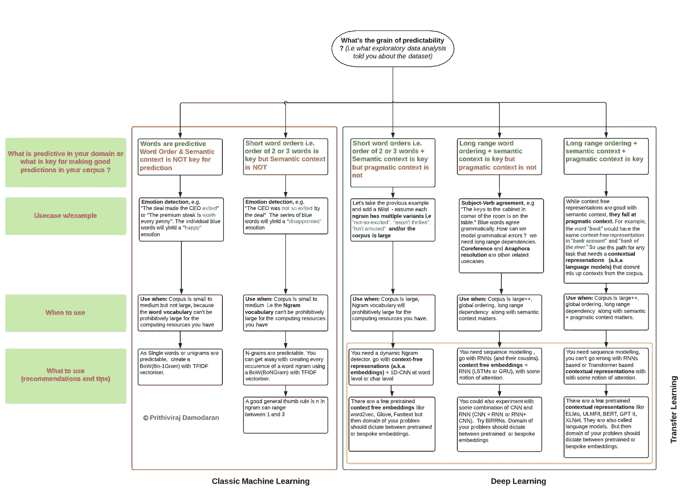
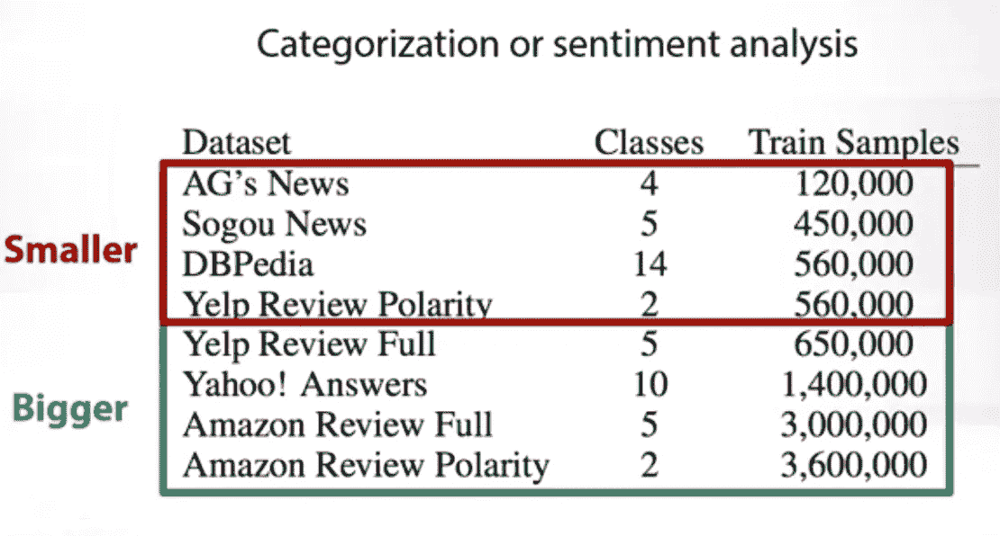
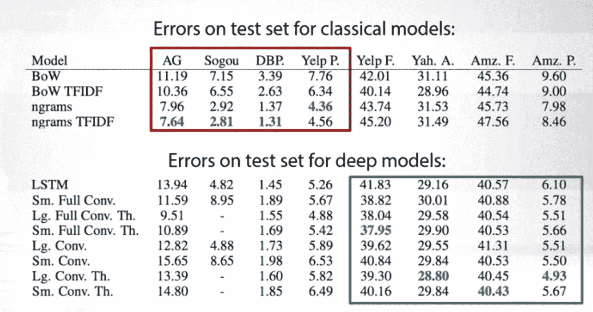

# 面向应用型自然语言处理工程师的心智模型:一张图中语言模型的 Tf-IDF

> 原文：<https://towardsdatascience.com/all-you-need-to-know-about-nlp-based-predictive-modeling-in-one-diagram-7be3b547454a?source=collection_archive---------20----------------------->

## 理清 NLP 预测建模场景

Image credit: [https://www.um.edu.mt](https://www.um.edu.mt/)

## **秘诀:5 分钟后你将成为职业选手，**

1.  At 从自然语言数据集设计特征以构建经典的 ML 模型
2.  在构建嵌入时，从复杂的自然语言数据集中学习酷的表示，以构建 DNN 模型。

NLP 作为一个领域正在以曲速前进。神经模型对 NLP 的干预的好处是，它在许多任务中推动了极限，但坏处是，它使试图进入该领域的新人的学习场景变得复杂。我觉得有义务通过分享我用来推理基于 NLP 的预测任务的**心智模型**来带来一些清晰。正如标题中所承诺的，我已经试图在一个单一的图表中传达我想要传达的一切，请将这个心智模型视为指南针，而不是地图。*话虽如此，请注意这篇文章并不适合绝对的初学者。*

在进入这篇文章的实质之前，请允许我设置一下背景，澄清一些术语的细微差别和覆盖范围。

## **术语**

心智模型中将使用的术语的快速注释。

为了更容易理解，我特意使用了**而不是**文本或者“字符”或者“短语”**作为下面心智模型中的战术单位，因为 a .语言是组合的，单词是最低的战术单位，可以有各种组合(与字符或其他任何东西相比); B:大多数 NLP 文献在讨论 NLP 问题和解决方案时都使用**“单词”**作为默认选择。单词 N-grams 可以表示一个单词(当 N=1 时为 1-gram 或 unigram)、一个单词对(当 N=2 时为 bigram)等等。这同样适用于 char N-grams。**

*****嵌入:*****

**虽然我们知道在机器学习中“嵌入”是一种奇特的说法，即一种获取原始文本数据并将其“嵌入”到向量空间中的技术。因为当在向量空间中呈现训练数据时，机器学习算法是“最快乐的”。原因并不奇怪:我们可以做向量数学或者计算向量之间的距离等等。 ***(承蒙:来自 Quora.com 的斯里达尔·马哈德万教授)*****

**但是从另一个层面来说，学习嵌入只不过是学习底层文本语料库的表示。单词嵌入是一种**上下文无关的嵌入或表示**(这里的上下文是指语用上下文，而不是语义上下文)，像 ELMo、BERT 这样的语言模型学习一种**上下文相关的嵌入或表示**。查看这个 G [oogle BERT 帖子](https://ai.googleblog.com/2018/11/open-sourcing-bert-state-of-art-pre.html)获得更多更深入的见解。**

*****语义语境*****

> **“一个词由它的朋友来描述”——J . r .弗斯**

****语义上下文**是一个记录良好的概念，但这里有一个快速回顾。语言是象征性的:单词**汉堡包**和**奶昔**在语义上**与**“食物”**相关，但我们需要一种技术将这些知识输入机器。分布假说粗略地指出，出现在相似语境中的词往往具有相似的含义。因此，可以认为汉堡包和奶昔通常出现在文本语料库中的食物上下文中。这被称为语义上下文，算法需要找出语义相关性的概念。****

*****语用语境(或用法语境)*****

**语义语境忽略了所有的语用语境。我这么说是什么意思？让我们来考虑这个例子:*他去监狱* ***牢房*** *用他的* ***牢房*** *手机去* ***牢房*** *提取犯人的血样* ***(礼貌用语:***[***Ajit Rajasekharan*考虑语义和语用上下文的嵌入将为单元的三个向量生成不同的向量。例如，第一个牢房(监狱牢房案件)更接近监禁、犯罪等词。而第二个“手机”(手机壳)更接近于 iPhone、android、galaxy 等词..****](https://www.quora.com/profile/Ajit-Rajasekharan)**

## ****覆盖范围****

**这个心智模型涵盖了所有基于 NLP 的预测任务，这些任务可以被构造为 **N:1** 监督学习任务，即输入是任意长度(N)的文本序列，输出是标签或分数。**

**这个心智模型**不包括基于** NLP 的任务，这些任务采取 **N: N 或 N: M** 监督学习任务的形式，其中输入和输出分别是任意长度(N)的文本序列或任意长度 N 和 M 的输入和输出文本序列。例如，N: N 的最佳示例是**序列标记(NER，词性)，自动语音识别**，N: M 的典型示例是**机器翻译和文本摘要**。**

## **故意遗漏**

**如果你仔细观察，我故意省略了数据清理和准备，因为它们是非常领域和任务特定的。因此，当您应用这个心智模型时，请确保您在正确的时间注入了适当的数据清理和准备技术。**

# **心理模型**

****

**Image by the author**

## **一些经验数据**

**您可以看到，对于较小的数据集，经典 ML 工作得很好，但对于较大的数据集，它们就逐渐消失了。**

****

**Image by the author (Screenshot from the research paper)**

****

**Image by the author (Screenshot from the research paper)**

## **一些代码来玩**

1.  **[TFiDF +逻辑回归，中等规模数据集](https://www.kaggle.com/prithiviraj/for-beginners-tfidf-logistic-regression#_=_)**
2.  **定制单词嵌入+ [BiLSTM，小型数据集](https://nbviewer.jupyter.org/github/PrithivirajDamodaran/NLP-Experiments/blob/master/Seq%20Models/Sequence_based_Text_Classification_.ipynb)**
3.  **[定制单词嵌入+ CNN + BiLSTM，大型数据集](https://www.kaggle.com/prithiviraj/cooking-dl-notebook)**

## ****进一步阅读****

1.  **[更多关于语义、语用和句法的语境。](/canning-the-cant-fun-with-homonyms-and-word-vectors-179ab58c76d2)**
2.  **[什么是语言模型？](/gmail-style-smart-compose-using-char-n-gram-language-models-a73c09550447)**