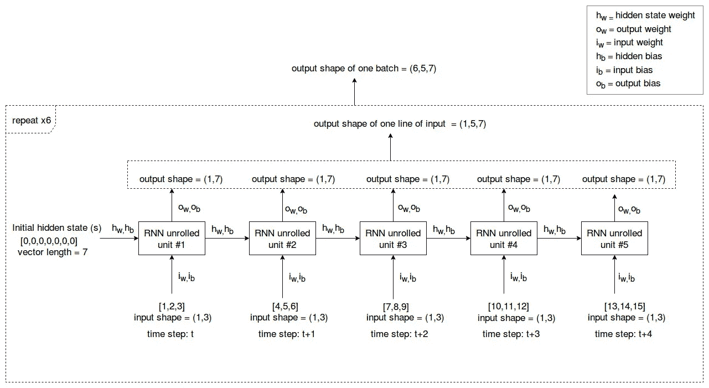
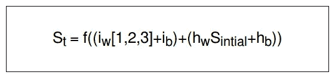

# 关于 RNNs 你需要知道的

> 原文：<https://towardsdatascience.com/all-you-need-to-know-about-rnns-e514f0b00c7c?source=collection_archive---------2----------------------->

## TensorFlow 中 RNN 内部的实现和数据操作初学者指南


Photo by [Laurent Naville](https://unsplash.com/@laurentnaville_1467602_sink?utm_source=medium&utm_medium=referral) on [Unsplash](https://unsplash.com?utm_source=medium&utm_medium=referral)

# 介绍

研究人员提出用神经网络来模拟人脑的行为。但是，如果你仔细想想，正常的神经网络并没有真正实现它的初衷。这种说法的原因是前馈香草神经网络不能记住它学习的东西。每次你训练网络的时候，它都是全新开始的，当你处理当前数据集的时候，它不会记得上一次迭代看到了什么。在识别相关性和数据模式时，这是一个很大的缺点。这就是递归神经网络(RNN)出现的原因。rnn 有一个非常独特的架构，可以帮助它们对存储单元(隐藏状态)进行建模，使它们能够保存数据，从而能够对短期依赖关系进行建模。由于这个原因，rnn 被广泛用于时间序列预测，以确定数据相关性和模式。

尽管 rnn 已经存在了一段时间，但每个人似乎都有自己令人困惑的方式来解释它的架构，没有人真正解释幕后发生了什么。所以让我们缩小差距，好吗？这篇文章旨在通过介绍 RNN 架构的功能，在更精细的层次上解释它。

# 这是给你的吗？

如果你以前曾盲目地使用 TensorFlow 制作简单的 RNN 模型，如果你发现很难理解 RNN 的内部工作原理，那么这篇文章就是为你准备的。

# **最终目标？**

我们将基本上解释当这两行负责声明 RNN 和启动执行的张量流代码运行时，幕后发生了什么。

```
cell = tf.contrib.rnn.BasicRNNCell(rnn_size,activation=tf.nn.tanh)

val1, state = tf.nn.dynamic_rnn(cell, inputs, dtype=tf.float32)
```

# RNN 建筑

如果您曾经搜索过关于 RNNs 的架构信息，如果您作为初学者开始研究它们，您可能会得到相当混乱的架构图。我将用一个例子来解释 RNN 架构。

在我们进入正题之前，需要注意的一件重要事情是，RNN 输入需要有 3 个维度。通常是批量大小、步骤数量和特征数量。步骤数描述了将输入到 RNN 的一批数据的一行输入中的时间步骤/时间段的数量。

张量流中的 RNN 单位被称为“RNN 单元”。这个名字本身就在人们中间造成了很多混乱。Stackoverflow 上有很多问题询问“RNN 细胞”是指一个单细胞还是整个层。嗯，更像是整层。其原因是 rnn 中的连接是循环的，因此遵循“自馈”方法。基本上，RNN 图层由单个卷起的 RNN 像元组成，该像元根据您提供的“步数”值(时间步长/时间段数)展开。

正如我们前面提到的，RNNs 的主要特点是建模短期依赖的能力。这是由于 RNN 的隐藏状态。它通过展开的 RNN 单位保留了从一个时间步到另一个时间步的信息。每个展开的 RNN 单元都有一个隐藏状态。当前时间步长的隐藏状态是使用先前时间步长的隐藏状态和当前输入的信息来计算的。在处理当前时间步长信息时，此过程有助于保留模型在先前时间步长中看到的信息。此外，需要注意的是，RNN 的所有关系都有权重和偏差。在某些架构中，偏置可以是可选的。这个过程将在本文的后面部分进一步解释。

既然你现在有了一个基本的想法，那就让我们用一个例子来分解一下执行过程。假设批量大小为 6，RNN 大小为 7，一条输入线中包含的时间步长/时间段数为 5，一个时间步长中的要素数为 3。如果是这种情况，一个批次的输入张量(矩阵)形状将如下所示:

一批的张量形状= (6，5，3)

批处理中的数据如下所示:


Fig 01 : Data representation inside a batch of data

注意:这里使用的数据分段方法称为滑动窗口方法，主要用于时间序列分析。这里不用担心数据预处理过程。

当第一次把数据输入 RNN 时。它将具有如下所示的滚动架构:


Fig 02: Rolled version of RNN

但是当 RNN 开始处理数据时，它将展开并产生如下所示的输出:



Fig 03: Unrolled version of RNN

## **处理一批:**

当您将一批数据输入 RNN 单元格时，它会从输入的第一行开始处理。同样，RNN 单元将顺序处理被馈送的一批数据中的所有输入行，并在最后给出一个输出，该输出包括所有输入行的所有输出。

## **处理单行输入:**

为了处理一行输入，RNN 单元展开“步数”次。你可以在上图中看到这一点(图 03)。由于我们将“步数”定义为 5，RNN 单元已经展开了 5 次。

执行过程如下:

*   首先，将初始隐藏状态(S)乘以隐藏状态权重(h ),然后将隐藏状态偏差添加到结果中，初始隐藏状态(S)通常是零向量。同时，将时间步长 t ([1，2，3])处的输入和输入权重(I)相乘，并将输入偏差添加到该结果中。我们可以通过激活函数(通常为 tanh (f ))发送上述两个结果的相加来获得时间步长 t 的隐藏状态。



Fig 04: Hidden state calculation of time step t

*   然后，为了获得时间步长 t 处的输出，将时间步长 t 处的隐藏状态(S)乘以时间步长 t 处的输出权重(O ),然后将输出偏差添加到结果中。


Fig 05: Output calculation of time step t

*   当计算时间步长 t+1 处的隐藏状态时，时间步长 t 处的隐藏状态(S)乘以隐藏状态权重(h ),并且隐藏状态偏差被添加到结果中。然后，如前所述，时间步长 t+1 ([4，5，6])的输入将乘以输入权重(I)，输入偏差将被添加到结果中。这两个结果将通过一个激活函数发送，通常是 tanh (f)。


Fig 06: Hidden state calculation of time step t+1

*   然后，为了获得时间步长 t+1 处的输出，将时间步长 t+1 处的隐藏状态(S)乘以时间步长 t+1 处的输出权重(O ),然后将输出偏差添加到结果中。如你所见，当产生时间步长 t+1 的输出时，它不仅使用时间步长 t+1 的输入数据，还通过时间步长 t+1 的隐藏状态使用时间步长 t 的数据信息。


Fig 07: Output calculation of time step t+1

*   这个过程将对所有时间步长重复

在处理完批处理中一行输入中的所有时间步骤后，我们将得到 shape (1，7)的 5 个输出。所以当所有这些输出连接在一起时。形状变成(1，5，7)。当批处理的所有输入行都处理完后，我们得到 6 个大小为(1，5，7)的输出。因此，整批的最终输出将是(6，5，7)。

**注意:**在 RNN 的所有连接中，所有隐藏状态权重、输出权重和输入权重具有相同的值。

回到我们之前提到的两行代码:

```
cell = tf.contrib.rnn.BasicRNNCell(rnn_size,activation=tf.nn.tanh)

val1, state = tf.nn.dynamic_rnn(cell, inputs, dtype=tf.float32)
```

第一行基本上定义了我们想要创建的 RNN 单元的激活函数和 RNN 大小。第二行通过将输入数据送入 RNN 来执行输入数据的处理程序。处理将根据我们之前讨论的内容进行。最后，该批的输出(shape (6，5，7)的值)将被赋给“val1”变量。隐藏状态的最终值将被赋给“state”变量。

我们现在已经到了文章的结尾。在本文中，我们讨论了 TensorFlow 中 RNN 内部的数据操作和表示过程。有了所有提供的信息，我希望现在你已经很好地理解了 rnn 在 TensorFlow 中是如何工作的。

# 有用的材料:

*   关于 RNN 建筑的一般信息，你可以参考这篇[文章](http://colah.github.io/posts/2015-08-Understanding-LSTMs/)。
*   要深入了解 RNN 的建筑，请参考这篇[文章](https://medium.com/@jianqiangma/all-about-recurrent-neural-networks-9e5ae2936f6e)
*   RNN 的 Coursera [课程](https://www.coursera.org/lecture/nlp-sequence-models/recurrent-neural-network-model-ftkzt)