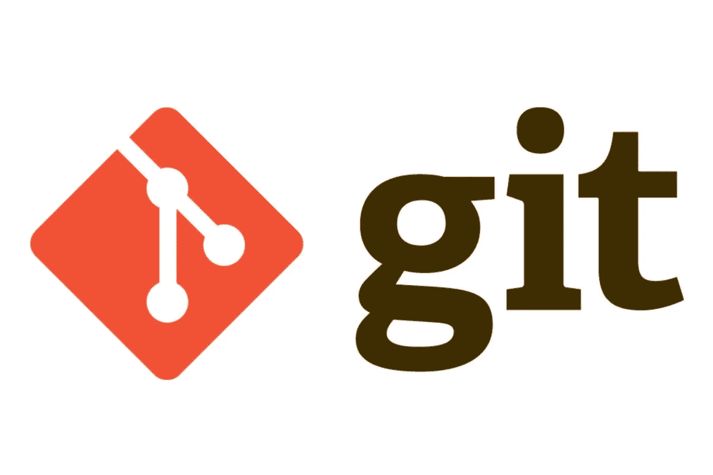
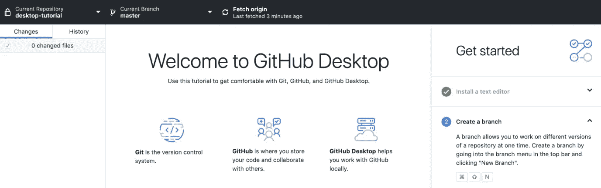

# 开始使用 GitHub 之前您需要知道的所有事情！

> 原文：<https://towardsdatascience.com/all-you-need-to-know-before-starting-with-github-ada7cf62dae2?source=collection_archive---------31----------------------->

GitHub 无处不在。开发人员、数据科学家、数据工程师、统计学家、数据分析师都会在某个时候遇到 GitHub。

在本文中，我将为那些希望快速入门的人提供一个进入 GitHub 的快速入门。

# 什么是 GitHub？

GitHub 是一个平台，开发人员可以用它来同时开发同一个程序。底层程序称为 Git，它跟踪不同的版本，并支持不同人合并冲突的修改。

> Git 是一个允许开发人员跟踪代码变化的程序。

举个例子，假设三个朋友有一个很棒的软件想法。他们都是程序员，他们希望能够同时做出贡献。代码没有“谷歌文档”,所以他们需要别的东西:这是他们需要 Git 允许同时处理相同代码的时候。

Git is the program that actually does the work

## 那么为什么需要 GitHub 呢？

GitHub 是一个通过 Git 共享代码的在线托管平台。Git 是一个命令行工具，GitHub 增加了一个优秀的 web 平台，可以在开发者之间共享，它还可以为你的代码提供外部备份。

> GitHub 为 Git 添加了在线功能，并允许开发人员轻松共享项目。

例如，为了对开源软件做出贡献，开发人员经常使用 GitHub。通过使用 GitHub，你可以很容易地在网上找到开源项目的代码，并提出一个贡献。这里只有 Git 是不够的，因为您需要能够在线找到那些项目。GitHub 也使得提议捐款的方式变得更加顺畅。

GitHub is an online platform based on Git.

# GitHub 入门需要什么？

## 装置

1.  在你的电脑上安装 Git。这取决于你工作的平台，但是你可以很容易地在互联网上找到 Git for Windows，Mac 或 Linux。
2.  你需要一个 GitHub 账户，可以在 GitHub.com 免费创建。
3.  我建议安装 **GitHub 桌面**。这是一个图形用户界面，使得使用 Git 更加容易。如果使用 GitHub Desktop，不需要做任何命令行操作。

GitHub Desktop is a graphical user interface to Git

# 基本操作

我将列出 Git 最基本的命令/操作，并通过通俗的描述让您可以轻松入门:

*   **克隆**:将 GitHub 上现有的代码文件夹(称为资源库)下载到你的本地计算机上，这样你就可以在上面工作了
*   **提交**:当你在你的代码库中做了更改，你必须在上传到 GitHub 之前提交它
*   **推送**:当你提交了你的修改，你就可以推送它们，这样它们就可以在 GitHub 上注册，这样潜在的合作者就可以看到它们了
*   **拉:**当其他人正在处理相同的代码，并且他们已经提交了他们的变更，那么你的代码就不再是最新的版本了。要获得最新版本，您应该进行拉取

# 开始

在开始使用 GitHub 之前，我已经给出了您需要知道的所有信息。

我个人的建议是:首先使用本文中介绍的基本命令习惯使用 Git 和 GitHub。然后，当你觉得准备好了，开始寻找更高级的功能，例如，处理多人同时处理同一代码时发生的冲突变更。

最重要的是将所有这些付诸实践，并真正开始！

我绝对推荐从 [***这个非常基础的 GitHub***](/the-easiest-github-tutorial-ever-4a3aa0396039) 入门教程或者网上有的其他教程开始。