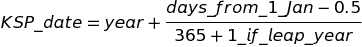

# 关于预处理，您想知道的是:数据准备

> 原文：<https://towardsdatascience.com/all-you-want-to-know-about-preprocessing-data-preparation-b6c2866071d4?source=collection_archive---------8----------------------->


## 这是一个介绍部分，我们将讨论如何检查和准备您的数据进行进一步的预处理。

如今，几乎所有的 ML/数据挖掘项目工作流都在标准的`CRISP-DM`(数据挖掘的跨行业标准流程)或其 IBM enhance `ASUM-DM`(数据挖掘/预测分析的分析解决方案统一方法)上运行。该工作流程中最长也是最重要的步骤是**数据准备/预处理**，大约占时间的 70%。这一步很重要，因为在大多数情况下，客户提供的数据质量很差，或者不能直接提供给某种 ML 模型。关于数据预处理，我最喜欢的格言是:`Garbage in, garbage out (GIGO)`。换句话说，如果你给你的模型提供糟糕的数据，就不要指望它会有好的表现。在本帖中，我们将讨论:

1.  `Data types`
2.  `Data validation`
3.  `Handling dates`
4.  `Handling nominal and ordinal categorical values`

在接下来的文章中，我们将讨论更高级的预处理技术:

1.  数据清洗和标准化:`Normalization and standartization`、`Handling missing data`、`Handling outliers`
2.  特征选择和数据集平衡:`Dataset balancing`、`Feature extraction`、`Feature selection`。

这一系列文章代表了通常的预处理流程顺序，但事实上，所有这些部分都是以独立的方式划分的，不需要了解前面部分的知识。

这是一个介绍部分，我们将讨论如何检查和准备您的数据进行进一步的预处理。

# 数据类型

首先，让我们定义存在哪些数据类型以及它们有哪些度量标准:

## `Numeric`

1.  `Discrete` -整数值。示例:`number of products bought in the shop`
2.  `Continuos` -某个允许范围内的任何值(浮点型、双精度型)。示例:`average length of words in text`

## `Categorical`

从预定数量的类别中选择的变量值

1.  `Ordinal` -类别可以有意义地排序。示例:`grade (A, B, C, D, E, F)`
2.  `Nominal` -类别没有任何顺序。示例:`religion (Christian, Muslim, Hindu, etc.)`
3.  `Dichotomous/Binary` -名词性的特例，只有 2 种可能的类别。示例:`gender (male, female)`

## `Date`

字符串、python 日期时间、时间戳。示例:`12.12.2012`

## `Text`

多维数据，更多关于文本预处理的内容见我之前的[帖子](/text-preprocessing-steps-and-universal-pipeline-94233cb6725a)

## `Images`

多维数据，更多关于图像预处理的内容请见我的下一篇文章

## `Time series`

按时间顺序索引的数据点，关于时间序列预处理的更多信息请见我的下一篇文章。

# 数据有效性

第一步是最简单也是最明显的:你必须调查和验证你的数据。为了能够验证数据，您必须对您的数据有深入的了解。简单规则:`Don't dismiss the description of the dataset`。验证步骤包括:

## `Data type and data representation consistency check`

同样的东西必须以同样的方式和同样的格式来表现。示例:

1.  日期具有相同的格式。在我的实践中，有几次我得到了一部分日期是美国格式，另一部分是欧洲格式的数据。
2.  整数是真正的整数，不是字符串或浮点数
3.  分类数据没有重复，因为有空格、小写/大写字母
4.  其他数据表示不包含错误

## `Data domain check`

数据在允许值范围内。示例:数值变量在允许的(最小，最大)范围内。

## `Data integrity check`

检查允许的关系和约束的履行情况。示例:

1.  核对姓名头衔和性别，出生年龄和年龄
2.  历史资料有正确的年表。购买后交货、首次付款前银行开户等。
3.  这些动作是由被允许的实体做出的。抵押贷款只能批准给 18 岁以上的人，等等。

## 好的，我们发现了一些错误，我们能做什么？

1.  `Correct`如果您确定问题出在哪里，请咨询专家或数据提供商。
2.  `Discard`有误差的样品，在很多情况下这是一个很好的选择，因为你无法满足 1。
3.  `Do nothing`，这当然会对以后的步骤造成不良影响。

# 处理日期

不同的系统以不同的格式存储日期:`11.12.2019`、`2016-02-12`、`Sep 24, 2003`等。但是为了在日期数据上建立模型，我们需要以某种方式将其转换成数字格式。

首先，我将向您展示一个如何将日期字符串转换成 python `datetime type`的示例，这对于后续步骤来说要方便得多。该示例在 pandas 数据框架上演示。让我们假设`date_string`列包含字符串形式的日期:

```
# Converts date string column to python datetime type
# `infer_datetime_format=True` says method to guess date format from stringdf['datetime'] = pd.to_datetime(df['date_string'], infer_datetime_format=True)# Converts date string column to python datetime type
# `format` argument specifies the format of date to parse, fails on errorsdf['datetime'] = pd.to_datetime(df['date_string'], format='%Y.%m.%d')
```

通常，仅仅年份(YYYY)就足够了。但是如果我们想要存储月、日甚至更详细的数据，我们的数字格式必须满足 1 个充分的约束，它必须保存间隔，这意味着，例如，一周中的星期一-星期五必须具有与 1 相同的差值。— 5.任何一个月。所以`YYYYMMDD`格式将不是一个选项，因为一个月的最后一天和下个月的第一天比一个月的第一天和第二天有更大的距离。实际上，将日期转换为数字格式有 4 种最常见的方法:

## `Unix timestamp`

自 1970 年以来的秒数

**优点:**

1.  完美保留音程
2.  如果小时、分钟和秒很重要，那就好

**缺点:**

1.  价值不明显
2.  不要帮助直觉和知识发现
3.  越难验证，越容易出错

在 pandas 中将`datetime`列转换为时间戳:

```
# Coverts column in python datetime type to timestamp
df['timestamp'] = df['datetime'].values.astype(np.int64) // 10 ** 9
```

## `KSP date format`



**优点:**

1.  年份和季度很明显
2.  简单的直觉和知识发现
3.  可以扩展到包括时间

**缺点:**

1.  保留间隔(几乎)

在 pandas 中将`python datetime`列转换为 KSP 格式:

```
import datetime as dt
import calendardef to_ksp_format(datetime):
    year = datetime.year
    day_from_jan_1 = (datetime - dt.datetime(year, 1, 1)).days
    is_leap_year = int(calendar.isleap(year))
    return year + (day_from_jan_1 - 0.5) / (365 + is_leap_year)df['ksp_date'] = df['datetime'].apply(to_ksp_format)
```

## `Divide into several features`

年、月、日等。

**缺点:**

1.  完美保留音程
2.  简单的直觉和知识发现

**优点:**

1.  你增加的维度越多，你的模型就越复杂，但这并不总是坏事。

## `Construct new feature`

基于日期要素构建新要素。例如:

`date of birth`->-`age`

`date order created`和`date order delivered`->-。

**缺点:**

1.  简单的直觉和知识发现

**优点:**

1.  手动构建特征可能会导致重要信息丢失

# 处理分类值

闪回:`Categorical` -从预定义数量的类别中选择的变量值。与任何其他非数字类型一样，分类值也必须转换为数字值。怎么做才是对的？

## `Ordinal`

类别可以有意义地排序。可以转换成数值，保留其自然顺序。等级:`A+` - `4.0`、`A-` - `3.7`、`B+` - `3.3`、`B` - `3.0`等。

熊猫示范:

```
grades = {
    'A+': 4.0,
    'A-': 3.7,
    'B+': 3.3,
    'B' : 3.0
}
df['grade_numeric'] = df['grade'].apply(lambda x: grades[x])
```

## `Dichotomous/Binary`

只有两种可能。在这种情况下，您可以将值转换成指标值`1/0`。比如:`Male` - `1`或者`Female` - `0`，也可以反过来做。

熊猫示范:

```
df['gender_indicator'] = df['gender'].apply(lambda x: int(x.lower() == 'Male'))
```

## `Nominal`

所有可能类别中的一个或多个。在这种情况下，必须使用`One hot encoding`。该方法假设为每个类别创建一个指标值(`1` -样本在类别中，`0` -如果不在)。该方法也适用于`Dichotomous/Binary`分类值。**永远不要对名义值使用序数表示法**，这会导致可怕的副作用，你的模型将无法以正确的方式处理分类特征。

熊猫示范:

```
# Pandas `.get_dummies()` method
df = pd.concat([df, pd.get_dummies(df['category'], prefix='category')],axis=1)# now drop the original 'category' column (you don't need it anymore)
df.drop(['category'],axis=1, inplace=True)
```

sklearn 和熊猫中的演示:

```
from sklearn.preprocessing import LabelEncoder, OneHotEncoderprefix = 'category'ohe = OneHotEncoder(sparse=False)
ohe = ohe.fit(df[['category']])
onehot_encoded = ohe.transform(df[['category']])features_names_prefixed = [ f"{prefix}_{category}" for category in onehot_encoder.categories_[0]]df = pd.concat([df, pd.DataFrame(onehot_encoded, columns=features_names_prefixed)], axis=1)# now drop the original 'category' column (you don't need it anymore)
df.drop(['category'],axis=1, inplace=True)
```

我希望你会喜欢我的帖子。欢迎在评论中提问。

P.S .这些都是非常非常基础简单的东西，但是在实践中非常重要。更多有趣的东西将会在接下来的帖子中出现！