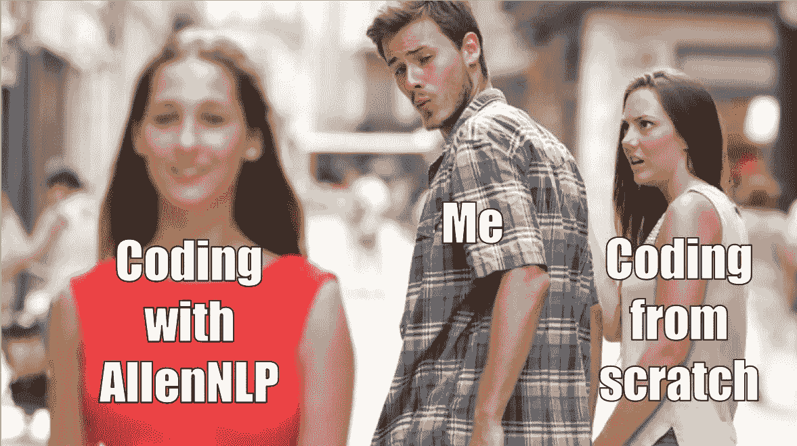
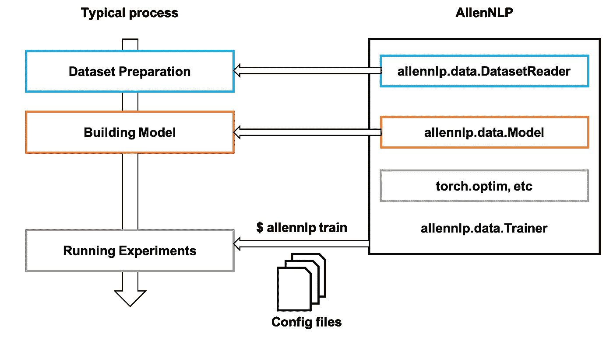
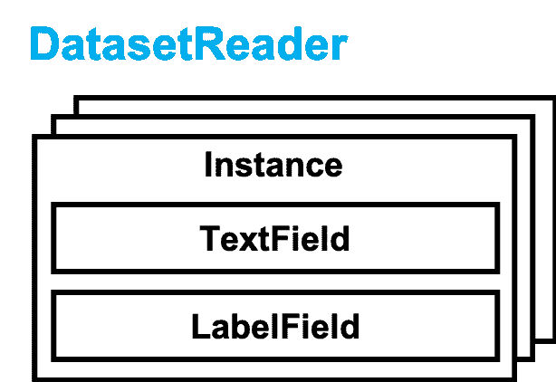
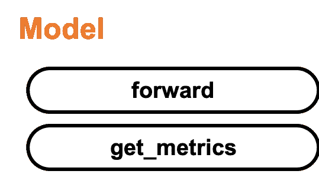
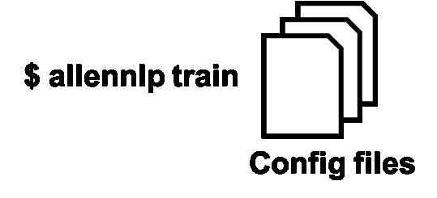

# 用 AllenNLP 开始你的 NLP 项目的温和指南

> 原文：<https://towardsdatascience.com/allennlp-startup-guide-24ffd773cd5b?source=collection_archive---------11----------------------->

## 跟你乱七八糟的代码说再见吧！


Photo by [Jamie Templeton](https://unsplash.com/@jamietempleton?utm_source=unsplash&utm_medium=referral&utm_content=creditCopyText) on [Unsplash](https://unsplash.com/search/photos/sign?utm_source=unsplash&utm_medium=referral&utm_content=creditCopyText)

你知道图书馆吗？如果你从事自然语言处理(NLP)，你可能会听说过这个名字。不过，我估计有几个人真的在用。或者其他人以前尝试过，但不知道从哪里开始，因为有很多功能。对于那些不熟悉 AllenNLP 的人，我将简要介绍一下这个库，并让您了解将它集成到您的项目中的优势。

AllenNLP 是 NLP 的深度学习库。[艾伦人工智能研究所](https://allenai.org/)，人工智能的领先研究组织之一，开发了这个基于 [PyTorch](https://pytorch.org/) 的库。使用 AllenNLP 开发一个模型比 PyTorch 从头开始构建一个模型要容易得多。它不仅提供了更容易的开发，而且支持实验的管理和开发后的评估。 **AllenNLP 的特点是专注于研发**。更具体地说，有可能**快速原型化模型**，并使**更容易管理具有许多不同参数的实验**。此外，它还考虑使用可读的变量名。

我们可能有过从零开始编码而得到混乱的代码或丢失重要实验结果的经历。



When I’ve got to know AllenNLP

在 AllenNLP 中，我们应该遵循下面的开发和实验流程。



Comparison between the typical process and the process with AllenNLP

根据你自己的研究项目，你只需要实现 DatasetReader 和 Model，然后用配置文件运行你的各种实验。基本上，我们需要了解以下三个特性，以便开始我们的 AllenNLP 项目

1.  定义 DatasetReader
2.  定义您的模型
3.  设置您的配置文件

换句话说，一旦你理解了它，你就能够进行可伸缩的开发。在这篇文章中，我将通过处理情感分析任务来解释上述三个关键特征。此外，您可以在 post 中使用如下方式检查代码:

[](https://github.com/yasufumy/allennlp_imdb) [## yasufumy/allennlp_imdb

### 最简单的 AllenNLP 食谱。在 GitHub 上创建一个帐户，为 yasufumy/allennlp_imdb 的开发做出贡献。

github.com](https://github.com/yasufumy/allennlp_imdb) 

我们开始吧！

# 0.快速回顾:情绪分析

在这里，我将为那些不熟悉的人解释情感分析任务的基础。所以如果你已经很了解它，请继续下一部分:1。定义 DatasetReader。

情感分析是一项尝试对给定文档的极性(积极或消极)进行分类的任务。在本帖中，我们使用 [IMDB](https://www.imdb.com/) 中的电影评论作为给定文档。例如，我们将在[复仇者联盟 4：终局之战的用户评论](https://www.imdb.com/title/tt4154796/reviews?ref_=tt_urv)中找到正面和负面评论。这一次，我们将使用下面链接中提供的数据集。

 [## 情感分析

### 这是一个用于二元情感分类的数据集，包含的数据比以前的基准测试多得多…

ai.stanford.edu](https://ai.stanford.edu/~amaas/data/sentiment/) 

我们将构建模型，将文档(评论)作为输入，预测标签(极性)作为输出。我们应该准备文档和标签对作为数据集。

# 1.定义 DatasetReader

下图显示了 AllenNLP 中的 DatasetReader 类。这个类主要处理任务中使用的数据。



DatasetReader 将原始数据集作为输入，并应用预处理，如小写、标记化等。最后，它输出实例对象的列表，该列表将预处理后的每个数据作为属性保存。在本文中，实例对象将文档和标签信息作为属性。

首先，我们应该继承 DatasetReader 类来创建自己的类。然后我们需要实现三个方法:`__init__`、`_read`和`text_to_instance`。所以让我们看看如何实现我们自己的 DatasetReader。我将跳过`read`方法的实现，因为它与 AllenNLP 的用法没有太大关系。但是如果你对它感兴趣，你可以参考这个链接。

实现`__init__`将如下所示。我们可以通过配置文件控制这个方法的参数。

```
@DatasetReader.register('imdb')
ImdbDatasetReader(DatasetReaer):
  def __init__(self, token_indexers, tokenizer):
    self._tokenizer = tokenizer
    self._token_indexers = token_indexers
```

在这篇文章中，我将`token_indexers`和`tokenizer`设置为参数，因为我假设我们在实验中改变了索引或标记化的方式。`token_indexers`执行索引，`tokenizer`执行标记化。我实现的类有[装饰器](https://docs.python.org/3/glossary.html#term-decorator) ( `DatasetReader.register('imdb')`)，这使我们能够通过配置文件来控制它。

实现`text_to_instance`将如下。这个方法是 DatasetReader 的主进程。`text_to_instance`将每个原始数据作为输入，应用一些预处理，并将每个原始数据作为一个`Instance`输出。在 IMDB 中，它将检查字符串和极性标签作为输入。

```
@DatasetReader.register('imdb')
ImdbDatasetReader(DatasetReaer):
    ...
  def text_to_instance(self, string: str, label: int) -> Instance:
    fields = {}
    tokens = self._tokenizer.tokenize(string)
    fields['tokens'] = TextField(tokens, self._token_indexers)
    fields['label'] = LabelField(label, skip_indexing=True)
    return Instance(fields)
```

在 AllenNLP 中，实例的属性对应于字段。我们可以从字段字典中创建实例。实例的属性代表每个数据，就像文档或标签一样。在 IMDB 中，实例散列两个属性:review 和 label。评论和标签分别对应于 TextField 和 LabelField。

上面提到的是定义我们的 DatasetReader 的方法。你可以从[这个链接](https://github.com/yasufumy/allennlp_imdb/blob/master/allennlp_imdb/data/dataset_readers/imdb.py#L22)查阅整个代码。

# 2.定义您的模型

下图显示了 AllenNLP 中的模型类。这个类主要是建立模型来解决任务。



该模型将数据作为输入，并将正向计算的结果和评估指标作为字典输出。

首先，我们应该继承模型类来创建我们自己的模型类。然后我们需要实现三个方法:`__init__`、`forward`和`get_metrics`。这里，我们使用递归神经网络(RNN)实现 IMDB 评论的极性分类模型。

实施`__init__`将如下。我们可以通过与 DatasetReader 相同的配置文件来控制该方法的参数。

```
@Model.register('rnn_classifier')
class RnnClassifier(Model):    
def __init__(self, vocab, text_field_embedder,
             seq2vec_encoder, label_namespace):
  super().__init__(vocab)self._text_field_embedder = text_field_embedder
  self._seq2vec_encoder = seq2vec_encoder
  self._classifier_input_dim = self._seq2vec_encoder.get_output_dim()
  self._num_labels = vocab.get_vocab_size(namespace=label_namespace)self._classification_layer = nn.Linear(self._classifier_input_dim, self._num_labels)
  self._accuracy = CategoricalAccuracy()
  self._loss = nn.CrossEntropyLoss()
```

在这篇文章中，我将`text_field_embedder`和`seq2vec_encoder`设为自变量，因为我假设我们在实验中改变了嵌入或 RNN 类型的方式。`text_field_embedder`将令牌作为向量嵌入，`seq2vec_encoder`用 RNN 对令牌序列进行编码(从技术上讲，除了 RNN，您可以使用其他类型)。我实现的类有装饰器(`Model.register('rnn_classifier')`)，这使我们能够通过配置文件来控制它。

`forward`的实现如下。这种方法是建模的主要过程。`forward`将数据作为输入，通过正向计算进行计算，并将预测标签和评估指标的结果作为字典输出。大多数实现与 PyTorch 的方式相同。但是，请注意，我们应该将结果作为字典返回。

```
def forward(self, tokens, label=None):
  embedded_text = self._text_field_embedder(tokens)
  mask = get_text_field_mask(tokens).float()encoded_text = self._dropout(self._seq2vec_encoder(embedded_text, mask=mask))logits = self._classification_layer(encoded_text)
  probs = F.softmax(logits, dim=1)output_dict = {'logits': logits, 'probs': probs}if label is not None:
    loss = self._loss(logits, label.long().view(-1))
    output_dict['loss'] = loss
    self._accuracy(logits, label)return output_dict
```

上面的实现计算极性、交叉熵损失和准确度的分类概率。我们通过 softmax 从 RNN 的输出计算分类概率。此外，如果标签给定，我们计算模型的分类精度。最后，它输出每个计算结果作为字典(`output_dict`)。

实现`get_metrics`将如下所示。

```
def get_metrics(self, reset=False):
  return {'accuracy': self._accuracy.get_metric(reset)}
```

它将精度值作为字典返回。这是因为这次我们使用模型的准确性作为衡量标准。我们可以在`get_metrics`方法中使用多个值。

上面提到的是我们定义模型的方式。你可以从[这个链接](https://github.com/yasufumy/allennlp_imdb/blob/master/allennlp_imdb/model/rnn_classifier.py)查阅整个代码。

# 3.设置您的配置文件

下图显示了如何在 AllenNLP 中运行我们的实验。我们可以通过将配置文件传递给`allennlp train`命令来运行我们的实验。



我将解释如何制作配置文件来控制我们的实验。我们可以通过下面的命令用 GUI 界面制作配置文件。但是为了更好的理解，我将从头开始解释。

```
allennlp configure --include-package allennlp_imdb
```

配置文件主要由`dataset_reader`字段、`model`字段和`trainer`字段组成。

```
{
  "dataset_reader": {...},
  "model": {...},
  "trainer": {...}
}
```

`dataset_reader`字段和`model`字段分别指定 DatasetReader 的设置和我们到目前为止实现的模型。另外，`trainer`字段指定了优化器、时期数和设备(CPU/GPU)的设置。你可以从[这个链接](https://github.com/yasufumy/allennlp_imdb/blob/master/training_config/base_cpu.jsonnet)查阅整个配置文件。接下来，我将分别解释这三个字段的重要部分。

DatasetReader 的设置如下。

```
"dataset_reader": {
  "type": "imdb",
  "token_indexers": {
    "tokens": {
      "type": "single_id"
    }
  },
  "tokenizer": {
    "type": "word"
  }
}
```

首先，我们指定在`type`中使用哪个 DatasetReader。我们可以使用 ImdbDatasetReader 将`type`设置为`imdb`，因为它已经准备好供`@DatasetReader.register('imdb')`使用。AllenNLP 已经提供了许多流行的数据集。你可以从[文档](https://allenai.github.io/allennlp-docs/api/allennlp.data.dataset_readers.html)中查看这些。

然后，我们为`ImdbDatasetReader.__init__`方法指定参数。我们使用`[SingleIdTokenIndexer](https://github.com/allenai/allennlp/blob/master/allennlp/data/token_indexers/single_id_token_indexer.py#L12)`表示`token_indexers`,因为我们希望令牌对应于单个 id。此外，我们使用`[WordTokenizer](https://github.com/allenai/allennlp/blob/master/allennlp/data/tokenizers/word_tokenizer.py#L12)`来表示`tokenizer`，因为我们希望令牌是一个单词。

模型的设置如下。

```
"model": {
  "type": "rnn_classifier",
  "text_field_embedder": {
    "token_embedders": {
      "type": "embedding",
      ...
    }
  },
  "seq2vec_encoder": {
    "type": "gru",
    ...
  }
}
```

首先，我们指定在`type`中使用哪个模型，与 DatasetReader 相同。我们可以使用 RnnClassifier 将`type`设置为`rnn_classifier`，因为它已经准备好供`@Model.register('rnn_classifier')`使用。

然后，我们为`RnnClassifier.__init__`方法指定参数。我们使用`[Embedding](https://allenai.github.io/allennlp-docs/api/allennlp.modules.token_embedders.html#embedding)`来表示`text_field_embedder`，因为我们希望将单词作为向量嵌入。此外，我们用`[GRU](https://allenai.github.io/allennlp-docs/api/allennlp.modules.seq2vec_encoders.html)`代替`seq2vec_encoder`，因为我们想通过 GRU 对嵌入的单词序列进行编码。

训练器的设置如下。

```
"trainer": {
  "num_epochs": 10,
  "optimizer": {
    "type": "adam"
  }
}
```

`num_epochs`指定要训练的时期数。`optimizer`指定优化器更新参数，在这种情况下，我们选择使用`adam`。

上面提到的是建立你的配置文件的方法。

我们可以通过执行以下命令来运行实验:

```
allennlp train \
    --include-package allennlp_imdb \
    -s /path/to/storage \
    -o '{"trainer": {"cuda_device": 0}} \
    training_config/base_cpu.jsonnet
```

当我们想改变实验设置时，我们需要创建新的配置文件。但是如果变化很小，我们可以通过下面的命令来改变设置。下面的命令将 GRU 更新为 LSTM。

```
allennlp train \
    --include-package allennlp_imdb \
    -s /path/to/storage \
    -o '{"trainer": {"cuda_device": 0}} \
    -o '{"model": {"seq2vec_encoder": {"type": "lstm"}}}' \
    training_config/base_cpu.jsonnet
```

解释到此为止。谢谢你看我的帖子。我希望您了解如何在 AllenNLP 中构建您的数据加载器、建模和管理您的实验。