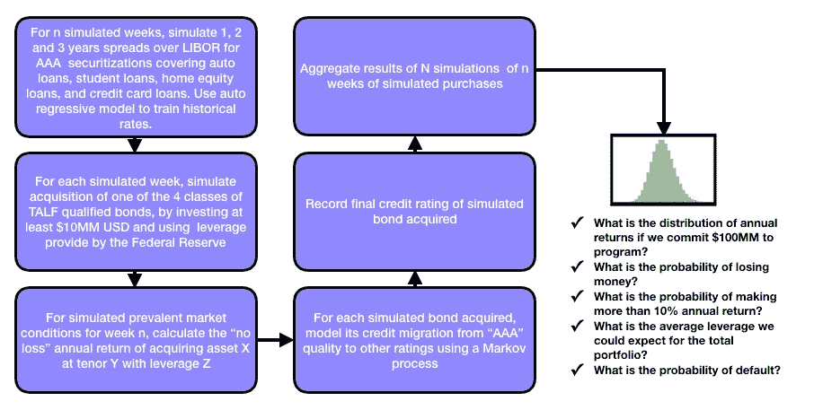
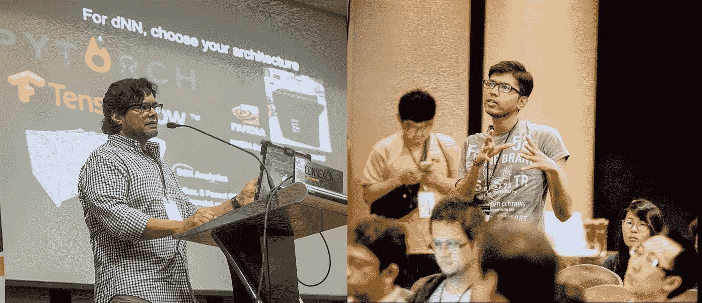
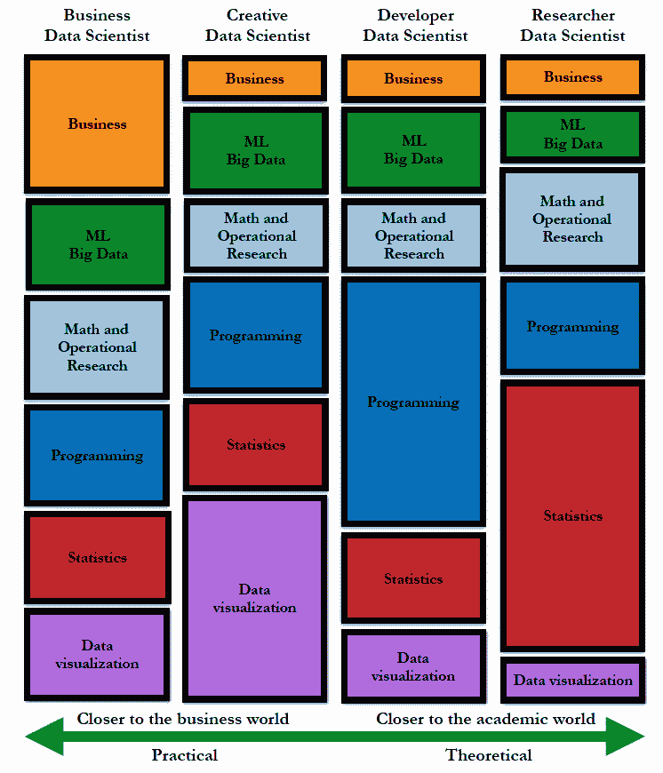
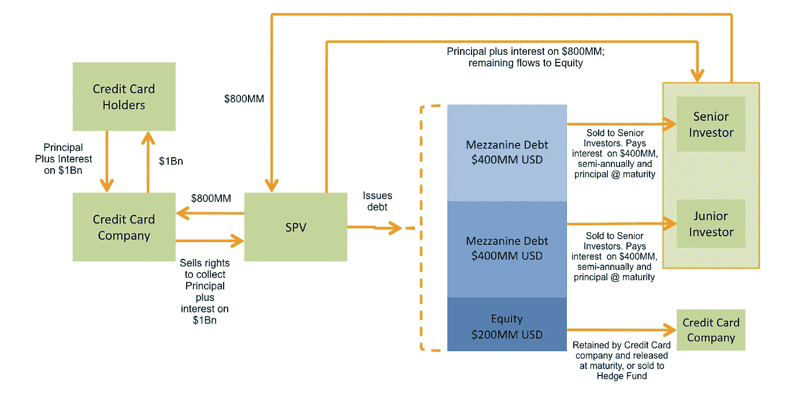
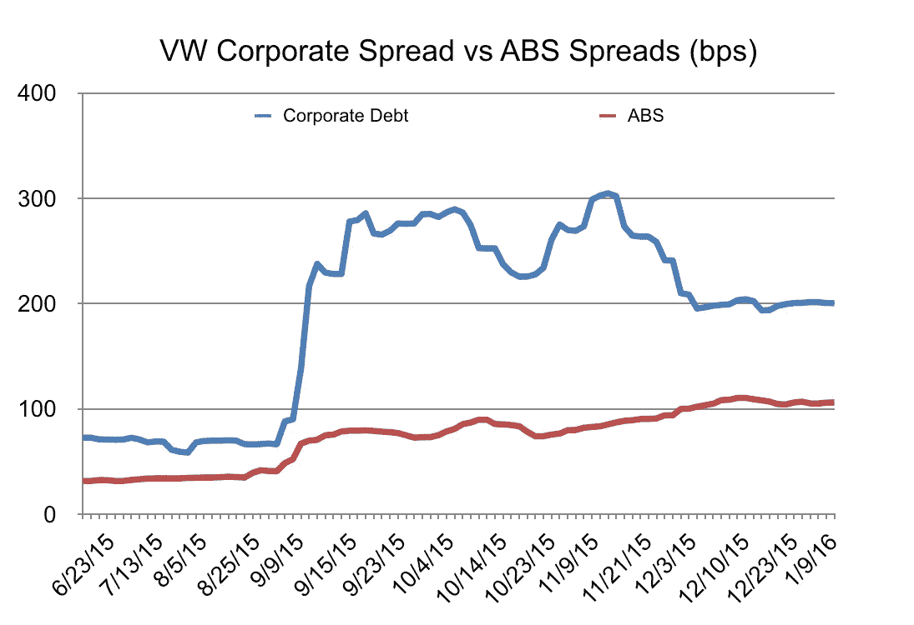

# 使用数据科学和定量分析的 Alpha 生成— ABS / TALF

> 原文：<https://towardsdatascience.com/alpha-generation-using-data-science-quantitative-analysis-abs-talf-part-1-eade08b075c?source=collection_archive---------13----------------------->

我喜欢一次性的“异国情调”交易。他们一般人是看不到的，看到一个，机会就没了。或者有人在教科书或类似的文章中了解到。幸运的是，我发现了一次性交易的存在；但对我来说不幸的是，很多时候我不能将我的资本完全投入到这些机会中。

在这篇文章中，我将解释我如何使用数据科学和金融量化分析来评估一个独特的机会，这个机会在 2008 年金融危机后实现了，我在 2009 年离开巴克莱后试图为此筹集资金。这个机会为拥有技术诀窍并能承诺至少 1000 万美元的投资者带来了惊人的回报。

在第二部分中，我将通过以下方式，以简单的方式展示我是如何评估这笔交易的:

1.  对几种资产支持证券的信用利差建模，考虑它们的历史相关性，并使用[自动回归模型](https://en.wikipedia.org/wiki/Autoregressive_model)。
2.  模拟在一段固定时间内购买固定收益工具，并持有至到期，其回报与伦敦银行同业拆放利率加信用利差挂钩。
3.  计算在“无损失”的情况下，使用美联储的“无追索权”贷款投资此类工具的杠杆回报。
4.  模拟买入或卖出的固定收入工具的信贷质量的改善和/或恶化(信贷迁移)。使用单周期马尔可夫模型。
5.  通过衡量从初始评级“AAA”到“D”评级的转变，并考虑到向“AA”、“A”、“BBB”、“BB”或“B”的变化，模拟投资组合中的损失；将马尔可夫模型扩展到多周期。
6.  计算投资组合的预期年回报率的分布。
7.  计算在任何阈值下产生收益的概率。

After all the background information, in part II of this post, you’ll be able to analyze one of the best financial opportunities that was generated as a consequence of the financial crisis of 2008.

作为一名数据科学家/定量分析师，我有 1)实际的量化金融背景和 2)金融危机的第一手见证人，很多人问我:a)是什么造成了金融危机？贪婪？错误的算法？b)为什么雷曼兄弟和银行家信托会被允许破产？c)在金融和保险领域，数据科学和定量分析在哪里共存？

由于我的实际专业知识仅限于金融和保险的一个子集，在本文和后续文章中，我将尝试说明我实际参与的交易，以及我使用数据科学结合金融定量分析和一些精算模型进行评估的情况。

还有许多类似的相关问题，有人通过电子邮件，甚至是我在 PyCon 做主题演讲时，亲自问过我。但没有人问我危机带来的机遇，对我来说，这是一个和其他人一样好的问题，其答案取决于你的专业知识和对模型结果采取行动的能力。

What are Tensors? What role Gaussian Copulas played in the financial crisis and in the bankruptcy of Lehman? Definitely, not the typical questions you get asked at PyCon. (Picture: [PyCon HK](https://medium.com/u/407a1bcc14ea?source=post_page-----eade08b075c--------------------------------) PyCon Asia & the Pacific 2017).

# 领域专长比机器学习技能更重要吗？两个都怎么样？

我坚信，没有领域专业知识的数据科学、机器学习和人工智能的应用，对于开始使用这些工具(至少在金融、保险或相关领域)的公司和组织来说是一个严重的障碍，并且直接从学术界雇用人才，而不接触现实生活中的问题。领域专家不一定与技术方面相关，但对特定行业、行业发展状况、趋势以及影响行业的因素有深入的了解。

不要误解我，我喜欢现在用 TensorFlow 2.0 和 Keras 建立模型是多么容易(是的，现在 TF 完全是 Keras，阅读 Cassie Kozyrkov 的帖子[这里](https://hackernoon.com/tensorflow-is-dead-long-live-tensorflow-49d3e975cf04)，迫不及待地开始玩 Alpha 版本)，而不是像我在 1993 年第一次为对冲基金工作时那样从头开始开发神经网络。但是如果你知道工具，拥有领域专业知识仍然会给你一个超越普通数据科学家的巨大优势。

Not all data scientists / quants are equal: the different types of data scientists

在我有机会参加的 2012 年加州圣克拉拉的 Strata 会议上，行业专家之间进行了一场“数据科学辩论”，当时的共识是，在数据科学中，领域专业知识比机器学习技能更重要。然而，快速迭代可能会减少拥有领域专业知识的一些优势，但是领域专业知识和快速迭代是无与伦比的，尤其是在需要快速行动的金融环境中。

我见过一些顶尖的硅谷数据科学家在金融和保险问题上失败了，而在这些问题上，一个中等水平的华尔街定量分析师会做得很好。在我目前的咨询实践中，我见过一些目标非常明确的公司将错误类型的数据科学家与该角色的期望相匹配。

Cassie Kozyrkov: “Hope is not a strategy. Just hoping that you hire a researcher and they transcends into the applied stuff..ah..that’s a very risky proposition there”

在金融领域，基本上有四种量化分析师:算法交易量化分析师、前台办公量化分析师、研究员量化分析师和开发者量化分析师。在数据科学中也有 4 种基本类型:商业数据科学家、创造性数据科学家、开发人员数据科学家和研究人员数据科学家。常见的误解是，“研究型数据科学家”(通常像“研究型数据科学家”(researcher quant)一样，拥有令人印象深刻的学术证书但几乎没有实际专业知识的博士)可以在商业环境中完成所有工作，而实际上，与其他类型的数据科学家进行团队合作是必要的。最近看了一个很优秀的视频，卡西·科济尔科夫谈到了这个问题。

事实上，一个博士“研究员量化”(同样相当于对冲基金和金融巨头在招聘时青睐的“研究员数据科学家”)可能在不知不觉中成为了金融危机的最大单一贡献者，通过他开发的算法，因为它促进了业务，所以迅速蔓延到整个行业。

# **什么是阿尔法？**

由于本文的标题陈述了 alpha 生成，为了对金融领域没有专业知识的读者的利益，让我们定义 alpha 和其他术语。

Alpha 是对一项投资的[积极回报](https://en.wikipedia.org/wiki/Active_return)的衡量，即该投资与基准(市场)相比的表现。1%的 alpha 值意味着在一段选定的时间内，投资的投资回报率比同期的市场回报率高 1%;负阿尔法值意味着投资表现低于市场。Alpha 和 beta 是现代投资组合理论中使用的资本资产定价模型的两个关键系数之一，与标准差、R 平方和夏普比率等其他重要指标密切相关。从历史上看，绝大多数传统基金都有负阿尔法值，这导致了资本向指数基金和非传统对冲基金的[外逃。(你为什么要向一个连市场/行业指数都达不到的人付费呢？)](https://en.wikipedia.org/wiki/Capital_flight)

解释完之后，让我们深入了解一些背景信息。

# 交易之一:定期资产贷款机制(TALF)

《韦氏词典》将“一次性”定义为“仅限于单一时间、场合或实例**:**一次性”。TALF 就是这种一次性交易之一，由美国美联储创建，旨在缓解金融危机带来的问题。

TALF 计划创建于 2008 年 11 月，旨在刺激消费者支出，以帮助启动经济。这是通过发行资产支持证券实现的。这些证券的抵押品包括汽车(轿车、卡车)贷款、学生贷款、信用卡贷款、设备贷款、保险费融资贷款、小企业管理局担保的贷款、住房抵押贷款或商业抵押贷款。这些贷款的支持来自纽约美联储银行提供的资金。

根据《TALF 协议》，美联储宣布将在 [**无追索权**](https://en.wikipedia.org/wiki/Nonrecourse_debt) 基础上向由新老证券支持的合格 AAA 级资产支持证券持有者提供高达 1 万亿美元的贷款。美联储发放的贷款金额等于资产支持型证券的市场价值，减去一个 [**削发**](https://en.wikipedia.org/wiki/Haircut_(finance)) ，这些贷款在任何时候都由资产支持型证券本身担保。简而言之，你可以用从美联储借来的高达 95%的钱以极低的利率购买某些证券，如果证券表现不如预期，或者没有产生足够的现金来支付美联储贷款的利息，你就不欠他们任何东西。

TALF 的机会是独一无二的，因为美国的金融和监管限制最初不允许投资银行(如高盛等)积极参与这一机会。

对于不受政府约束的高净值个人和少数机构投资者来说，这种机会等于零，但是，很少有人能够足够快地抓住这种机会，因为大多数金融界人士对这些类型的工具并不十分了解。

在一个人为创造的低风险环境中，TALF 让那些拥有专门知识和资金的人能够获得高于平均水平的回报，投资于某些类型的证券。

要理解 TALF，我们首先需要了解什么是资产支持证券，以及我们在 2007 年至 2009 年期间的定位，当时金融危机之前的宏观事件导致了危机本身(当时，我正积极试图筹集资金以利用上述机会)。)

# 什么是资产支持证券？

资产支持型证券是一种被广泛接受的结构性债务形式，完全由一个独立资产池的现金流来偿还。

虽然证券化市场传统上包括消费者和商业资产，如汽车贷款、信用卡应收账款、抵押贷款和设备租赁，但该市场也容纳了深奥的风险，如项目融资资产、自然灾害、人为灾难(恐怖袭击)、人寿理赔以及版税和知识产权资产。

在基本证券化中，资产由一个实体(“发起人”)出售给一个远离破产的特殊目的载体(“SPV”)，通常在离岸管辖区设立。然后，特殊目的机构向资本市场发行债券，债券的还本付息与资产的表现挂钩。通过债券发行获得的收益通过 SPV 传递给发起人(参见图 1 中一个假设的 10 亿美元证券化的例子)。

由于资产是由发起人出售给特殊目的机构的，资产支持证券并不代表发起人资产负债表上的负债，交易被记录为“真实出售”。

**Figure 1**: A template for a $1bn UDS securitization

一旦债券被收回，剩余的资产将归还给发起人。

# 公司债券和资产支持证券有什么区别？

公司债券是由公司发行的债券。公司在债券市场借钱以扩大业务或资助新的商业风险，它们可以大致分为两类:投资级和投机级(也称为高收益或“垃圾”)债券。投机级债券是由被认为比评级更高的投资级公司信用质量更低、违约风险更高的公司发行的。债券的质量由 [**评级机构**](https://en.wikipedia.org/wiki/Credit_rating_agency) 评级，评级范围一般从“AAA”(优质)，到“D”(违约)。

公司债券的信用评级是发行债券的公司特征的函数，它被转化为公司偿还债务的概率。

> 在证券化中，结构性债务仅由来自孤立资产池的现金流偿还。债务评级以及与债务相关的利率是基于资产质量和结构设计的特征。

**资产支持证券(ABS)** 是一种证券，其收入支付和价值来自特定的基础资产池或由特定的基础资产池支持。资产池通常是一组不能单独出售的小额非流动资产。将资产汇集成金融工具使它们能够出售给一般投资者，这一过程称为证券化，并使投资基础资产的风险分散化，因为每种证券将代表基础资产多样化池总价值的一小部分。

基础资产池可以包括信用卡的普通付款、汽车和商业车队贷款、抵押贷款、来自飞机租赁的神秘现金流、版税付款和电影收入等。与公司和政府债券一样，摊销型资产支持证券通常根据其平均寿命而不是其规定的到期日进行出售和交易。平均寿命是一个资金池中的每一美元本金预期未偿还的平均时间长度。

资产支持型证券的信用评级是支持债券的资金池特征的函数，它被转化为金融机构支付其债务的概率。

有几十年的统计数据反映了债券在其生命周期内被提升至更高评级的概率，以及被降级的概率。这种统计称为信用迁移概率(见图 2)。然而，并非所有类型的证券都具有相同的信用迁移模式。

**Figure 2**: Observed 1 year credit migration for Asset “X”

对于公司债券和 ABS 债券，如果发行人或资金池的信用质量恶化，评级可能会被下调；如果基本面改善，评级可能会被上调。投资级债券(AAA、AA、A、BBB)迁移到非投资级(低于 BBB 的任何级别)被称为“堕落天使”。

Figure 3: In September 2015, the US Environmental Protection Agency issued a notice of violation that Volkswagen (VW) had installed diesel engine software to circumvent the emission standards of the Clean Air Act. ABS showed a high degree of resiliency in this specific case of risk for the VW.

尽管 AAA 级公司债券与 AAA 级资产支持型证券(资产来源于同一家公司)的风险/回报之间存在一定的相关性，但这种关系有时会被打破，因为 AAA 级公司的风险高于 AAA 级资产支持型证券，反之亦然，如图 3 所示。

早在 2000 年代中期，像我这样的销售方前端办公室定量分析师不必开发定制模型来为客户的资产池定价。然而，我们需要遵守“房间里最聪明的人”设定的模型和准则，这些博士定量分析师开发了软件和分析，每个人都在盲目地使用这些软件和分析来为这些工具定价，这基本上是在传播隐藏的风险。

其中一个最聪明的人是中国量化分析师“摇滚明星”大卫 x 李。突然间，他被卷入了高级金融领域，实际上是直接从学术界出来的，几乎没有什么领域的专业知识。David 拥有经济学硕士、精算学硕士、工商管理硕士(MBA)和统计学博士学位，此外他还是一名熟练的程序员。

David X. Li, PhD. Had David been involved in the practical side of finance as opposed to the research side, he would have seen that his paper in the wrong hands had serious implications. His model represented an over simplification of the world, and did not handle tail risk at all.

摩根大通几乎痴迷于从顶尖大学聘请顶尖的定量分析师，它聘请了 David Li 到其风险分析部门工作。在那里，他在《固定收益杂志》上发表了一篇题为“违约相关性:Copula 函数方法”的论文

利用一些相对简单的数学方法，我敢说是天真的，李提出了一种简化的方法来模拟违约相关性，甚至没有查看历史违约数据。他的模型和附带的分析因其实施简单而被广泛使用。危机发生多年后，大卫的博士导师说:“这是一个几乎任何人都可以使用的非常简单的数学答案，当你有一把锤子时，一切突然看起来像钉子”。华尔街抓住了这个机会。

This equation killed many 401Ks

然而，像我这样的一些前端办公室的定量分析师对这种“罐装”模型不满意，这种模型没有处理尾部风险，我们开发了自己的模型，汇编了可追溯到 1926 年的公司债券和可追溯到 1985 年的资产支持证券的统计数据，这至少在我的案例中，提供了定制的马尔可夫链蒙特卡罗模拟，并提供了超出标准模型的答案。这些定制模型考虑了特定资产池中资产之间的真实相关性，以及资产池中每笔贷款的风险状况和行为，描绘了一幅不同的债券风险图。事实证明，与李的模型所暗示的相比，某些 AAA 级 ABS 的风险要高得多。

少数量化分析师明白这一点，能够向对冲基金的决策者解释机会(做空证券)，并让他们做空其中一些证券，从而赚了很多钱。(大多数人都知道，有几部好莱坞电影是关于这个的)。其他人试图筹集资金，但没有成功，因为通常定量分析师没有交易记录，也没有简单的方法做空有可能获得最高回报的证券。

雷曼兄弟(Lehman Brothers)的倒闭，以及数十亿证券引发的降级和违约浪潮，让李的模型变得毫无用处。该模型没有预测到的违约累积起来，抹去了数万亿美元的投资。市值计价会计只会让事情变得更糟。

正如李多年后谈到他自己的模型时说的那样:“最危险的部分是当人们相信从模型中得出的一切。”。

顺便说一句，对我来说，谷歌的 TensorFlow 开始看起来像一把锤子，与此同时，摩根大通、贝莱德和其他公司似乎又在大肆招聘，这次招聘的几乎都是学术界的博士，他们的职能是数据科学家。

如果以史为鉴的话，我认为我们应该谨记李的故事，以资警醒。

为了保持这篇文章的可管理性，在编码会议之前，我将在**“使用数据科学&量化分析预测固定收益的利率、利差和回报”**中继续这篇文章，其中我将涉及:

*   导致危机的证券化市场有多大？
*   谁在发行哪里的领导人？
*   资产支持型证券对美国和全球经济有什么影响？
*   美联储是如何通过 TALF 计划启动经济的？
*   让我们回到 2009 年，在违约潮之后，投资 ABS 证券的预期回报是多少？

不用说，我很乐意听到你关于这一点的任何问题。