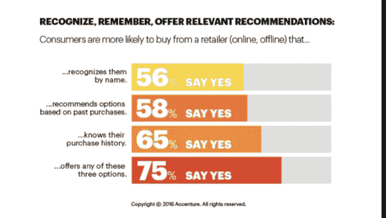
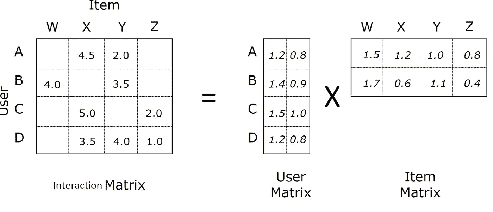
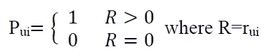
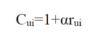
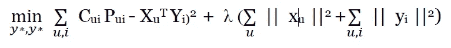
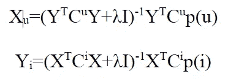
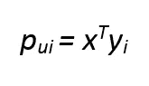

# 带代码的隐式数据集的交替最小二乘

> 原文：<https://towardsdatascience.com/alternating-least-square-for-implicit-dataset-with-code-8e7999277f4b?source=collection_archive---------1----------------------->

## 反馈(交互)数据推荐引擎指南

在大数据和分析时代，数据驱动的业务的力量一直呈指数级增长。人工智能和机器学习的更大整合在系统开发中发挥了至关重要的作用，这既有利于企业，也有利于企业用户。此外，推荐系统为数字业务增添了优势。下图显示了推荐系统的重要性。



**Importance of Recommendation engines**

包含特定项目或事件的显式等级、计数或类别的数据集被视为显式数据项。电影 5 分之 4 的评级是明确的数据点。然而，在隐式数据集中，我们需要理解用户和/或事件的交互，以找出其等级/类别。例如，一个人观看单一流派的电影。这种数据集被认为是隐式的。如果我们不考虑隐式数据集，我们就会错过很多隐藏的见解。

> **隐式数据集仅包含用户和项目交互。**

此外，我们将考虑一个例子，以便有一个更好的了解。 [Retailrocket 推荐系统数据集](https://www.kaggle.com/retailrocket/ecommerce-dataset)是理解交替最小二乘法的一个很好的隐含数据。

# **交替最小二乘法**

交替最小二乘法是一种分解矩阵的算法。我们将讨论[隐式反馈数据集的协同过滤](http://yifanhu.net/PUB/cf.pdf)如何使用 ALS。如下图所示，我们看到一个矩阵被分解成两个更小的矩阵。将第一个矩阵视为用户-项目交互的集合。因此，分解后的矩阵将是用户特征和项目特征



交互矩阵值是具有特定偏好和置信度的事件，其给出每个元素的值。对于一个实例，考虑有 3 个事件的电子商务数据集:查看、添加到购物车和事务处理。如果在用户和项目对之间存在交互，则认为是正面偏好，否则是负面偏好。



Preference

> 信心可以定义为价值或我们给予互动的价值。对于购买(交易事件)物品 X 的用户 A，我们增加交互权重，而用户 A 查看物品 Z 的权重小于“购买的交互”。



Confidence

置信度:r 是用户 u 和项目 I 之间的交互。交互越多，置信度越高——取决于值 **α。买了 5 次的物品会比只买了两次的物品更有信心。如果相互作用的 r 为 0，那么我们加 1，使它不为零。该论文通常推荐 40 作为 **α** 值。**

该论文描述了用于寻找用户交互和项目交互矩阵的以下成本函数:



这里，λ用于正则化模型，其值可以通过交叉验证来确定。

# 交替最小二乘法的本质

成本函数包含 m 个 n 项，其中 m 是用户数量，n 是项目数量。对于典型的数据集，m n 可以很容易地达到几十亿。因此，像随机梯度下降这样的优化方法会把如此庞大的数据搞得一团糟。因此，本文介绍了替代优化技术。

> 请注意，当用户因素或项目因素固定时，成本函数变成二次函数，因此可以很容易地计算出它的全局最小值。这导致了一个交替最小二乘优化过程，其中我们在重新计算用户因素和项目因素之间交替，并且每一步都保证降低成本函数值

我们通过分别用 x 和 y 对上面的成本函数求微分来找到用户(x)向量和物品(y)向量。



User and Item Vectors

因此，现在为了找到用户-项目对的偏好分数，我们使用以下:



我们发现最大的 p 值有项目推荐给用户。

# 我们如何编码？

我们使用[隐式库](https://implicit.readthedocs.io/en/latest/quickstart.html),它包含了 Cython 中的所有实现，使它更快。

> **导入库**

```
 import pandas as pd
import numpy as np
import scipy.sparse as sparse
import random
import implicit 
```

> **数据预处理**

不要担心[这部分不需要对每个用例都一样]

```
def create_data(datapath,start_date,end_date):
    df=pd.read_csv(datapath)
    df=df.assign(date=pd.Series(datetime.fromtimestamp(a/1000).date() for a in df.timestamp))
    df=df.sort_values(by='date').reset_index(drop=True) # for some reasons RetailRocket did NOT sort data by date
    df=df[(df.date>=datetime.strptime(start_date,'%Y-%m-%d').date())&(df.date<=datetime.strptime(end_date,'%Y-%m-%d').date())]
    df=df[['visitorid','itemid','event']]
    return dfdatapath= './input/events.csv'
data=create_data(datapath,'2015-5-3','2015-5-18')
data['user'] = data['user'].astype("category")data['artist'] = data['artist'].astype("category")data['user_id'] = data['user'].cat.codesdata['artist_id'] = data['artist'].cat.codes
```

> **创建交互矩阵**

由于数据是稀疏的，我们为项目用户数据创建稀疏矩阵，这将是模型的输入。用户项目矩阵将用于获取建议

```
 sparse_item_user = sparse.csr_matrix((data['event'].astype(float), (data['itemid'], data['visitorid'])))sparse_user_item = sparse.csr_matrix((data['event'].astype(float), (data['visitor_id'], data['item_id']))) 
```

> **ALS**

```
 #Building the model
model = implicit.als.AlternatingLeastSquares(factors=20, regularization=0.1, iterations=20)alpha_val = 40
data_conf = (sparse_item_user * alpha_val).astype('double')model.fit(data_conf) 
```

> **使用模型**

使用内置库函数获取**建议**

```
#Get Recommendationsuser_id =   14recommended = model.recommend(user_id, sparse_user_item)print(recommended) 
```

我们还可以使用下面的函数得到一个类似项目的列表

```
 #Get similar itemsitem_id = 7n_similar = 3similar = model.similar_items(item_id, n_similar)print(similar) 
```

# 结论

交替最小二乘法相当稳健。ALS 的时间复杂度与数据大小成线性比例。(即 **O(x*n)其中 n 为数据集的长度，x 为整数**)。代码可在此[链接](https://gist.github.com/himanshk96/21594b9f49a8b3060ff1f00d0a0d8ec5)获得