# 使用自然语言处理推荐 Airbnb 房源的替代方法

> 原文：<https://towardsdatascience.com/alternative-ways-to-recommend-airbnb-listings-using-natural-language-processing-40fce2f1b553?source=collection_archive---------28----------------------->

这个项目来源于我对 Airbnb 的热爱。如果你花足够的时间搜索，你可以找到价格合理的独特的地方。这个项目的目标是提高你的 Airbnb 搜索能力。我正计划去奥斯汀旅行，我意识到我没有那里附近的任何信息，我不会在那里有车，我也不想花很多时间使用公共交通。我想住在一个凉爽的社区，在那里我可以在步行距离内找到我喜欢的地方。

对我来说不幸的是，Airbnb 目前不允许根据住宿地点和特定事物的接近程度来搜索住宿。这里是 Airbnb 的界面。你可以按日期、客人、出差等进行过滤。，但是如果我喜欢酒吧和咖啡店附近的时髦地区，我不知道该住在哪里。

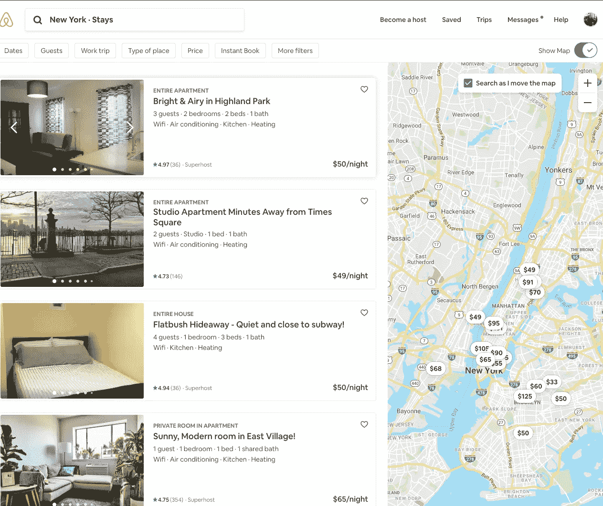

我决定做一个数据科学项目，以满足我对 Airbnb 搜索特异性的渴望。

# **数据**

Airbnb 包含禁止自动代理未经授权抓取数据的使用条款，但你可以在 insidearbnb.com 找到现成的最大城市的数据集。

我决定使用西雅图的房源及其评论的数据集，因为我更熟悉我居住的城市。我还为这个项目使用了两个不同的数据集，以开发两种生成推荐的替代方法，下面的小节将分别介绍这两种方法。

# **第一部分**

**推荐系统#1**

我这部分的目标是为 Airbnb 创建更多个性化的推荐，以满足特定的需求。举个例子，如果我想在酒吧和咖啡店附近的时尚街区找一套单间公寓，该怎么办？

对于第一个推荐系统，我使用了一个数据集，其中详细描述了西雅图的列表。该数据集包括每个房源的邻居、主人、便利设施、评论分数、可用性、价格和位置等信息。

我使用了一个简单的余弦相似度技巧，它允许我根据自己的请求找到列表。我能够在一个功能和几个步骤中完成它:

*   使用计数矢量化对数据框的文本内容进行符号化
*   将符号化的文本列转换成矩阵
*   转换个性化请求，该请求是函数的文本输入。
*   找到请求矩阵和数据帧内容之间的余弦相似性
*   选择具有最高余弦相似性的五行

这是函数:

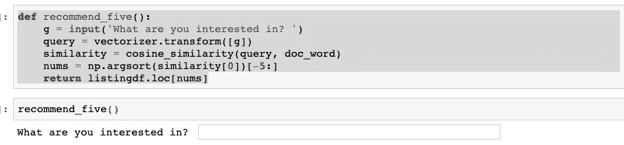

这很棒，但此时，代码存储在我的 Jupyter 笔记本中，没有人可以使用它。幸运的是，我可以将我的代码部署到一个 [Flask app](https://palletsprojects.com/p/flask/) 中，并通过 [Heroku](https://www.heroku.com/) 创建一个网站，这是一个免费的网络托管服务，它将允许其他人使用这一搜索功能。

**将模型部署到 Flask APP → Heroku**

*   这个过程的第一步是将主函数的属性保存到 pickle 中。🥒
*   接下来，我用我的主函数(web API)创建了一个 py 文件

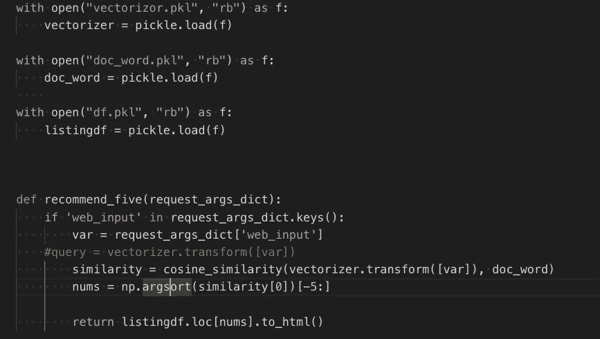

*   另一个。py 文件包含 Flask 应用程序的后端

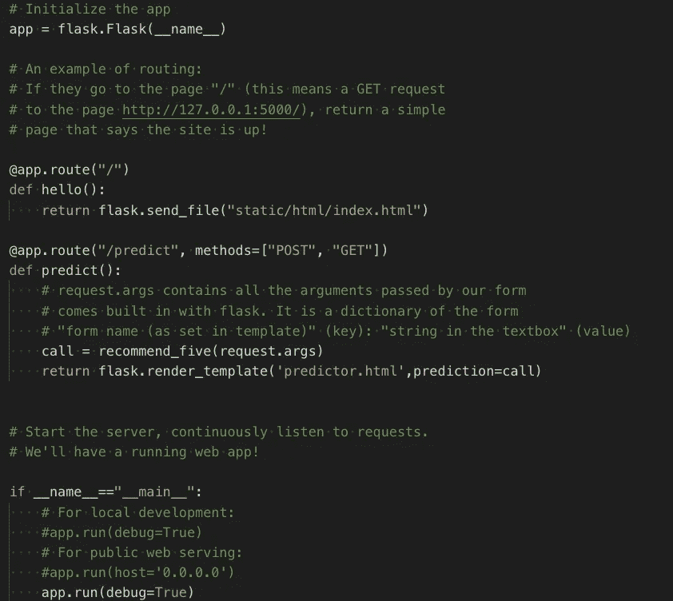

*   最后，这里是一个简单的前端界面的 HTML。

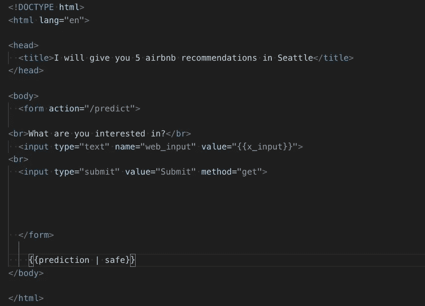

一旦我能够通过我的终端调用工作应用程序，我就开始通过 Heroku 部署它。我用一个简单的[指南](https://dev.to/lucysuddenly/easy-step-by-step-guide-to-deploying-on-heroku-3m9p)在 Heroku 中部署我的应用程序。

看看下面的结果吧！(还有对不起原始的前端接口。)

 [## Heroku 应用程序根据您的搜索提供 5 个推荐

obscure-depths-25051.herokuapp.com](https://obscure-depths-25051.herokuapp.com/) 

# **第二部分**

**推荐系统#2**

该项目的第二部分的目标是创建一个协同过滤推荐引擎，根据 Airbnb 列出的过去喜欢的具有相似品味和偏好的人，向用户提供推荐。这种方法通过使用用户之间的相似性作为参考来预测每个用户的自定义评级。

对于第二个推荐系统，我使用的 Airbnb 数据集包括我在第一部分中使用的数据集中的房源评论、评论者 ID 和房源 ID。

**让我们回顾一下我的流程:**

我的数据集不包括评论的评级或情绪，因此为了了解评论的情绪，我使用了 [NLTK 的软件包 SentimentIntensityAnalyzer，](https://www.programcreek.com/python/example/100005/nltk.sentiment.vader.SentimentIntensityAnalyzer)，它允许我计算第一部分数据集中每个列表的每个评论的情绪得分。在下面，您可以看到在最右侧的*极性*列中生成的每个评论(行)的情绪得分。

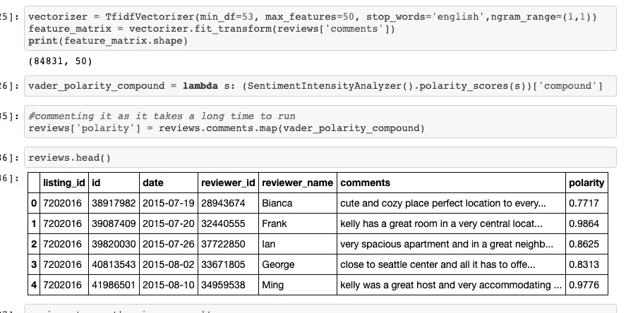

下面是所有 Airbnb 用户评论的情感分数分布图。请注意，大多数评论都有积极的情感价值。

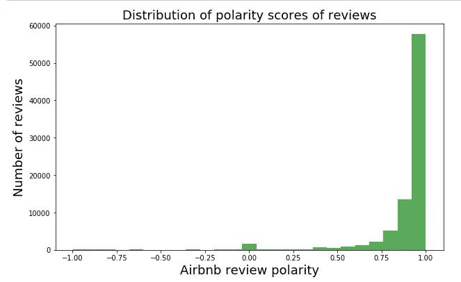

在将情感分数拟合到模型中之前，我必须转换它，因此分数是正态分布的。下图显示了正态分布。

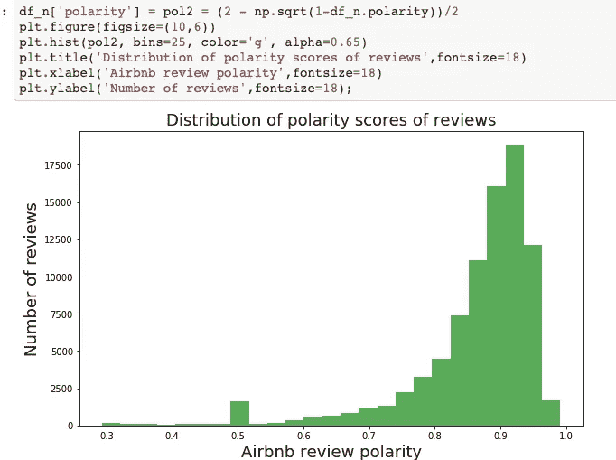

为了创建一个健壮的推荐模型，我使用了[surprise](http://surpriselib.com/)库。该图书馆由 Nicolas Hug 在 PyParis 2017 上赠送。需要明确的是，Surpise 不是一个推荐引擎。这是一个允许我创建使用以下算法的基准的库:

*   网格搜索 CV 以找到最佳参数
*   SVD(奇异值分解),以基于评级的历史来预测用户项目对的评级

我用 RMSE 作为我的准确度指标。

网格搜索 CV 能够使用最佳参数确定 0.0995 的最佳 RMSE 分数，如下所示。

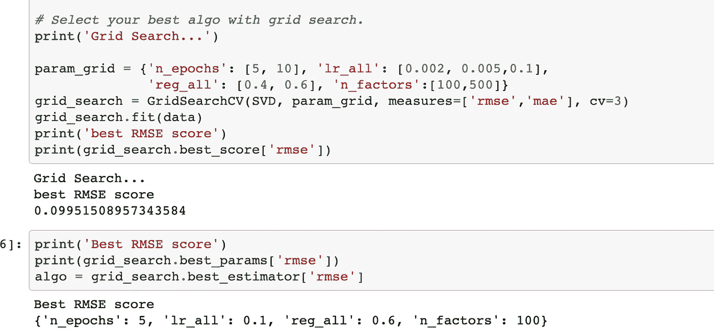

现在我有了最好的分数，下一步是编写一个函数，为每个用户提供三个清单推荐，如下所示。

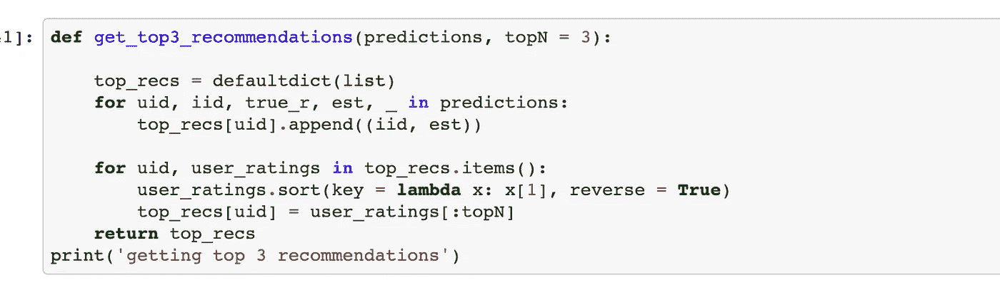

我创建了一个新的数据集，并将上述函数应用于所有用户。以下是包含三项建议的最终数据集:

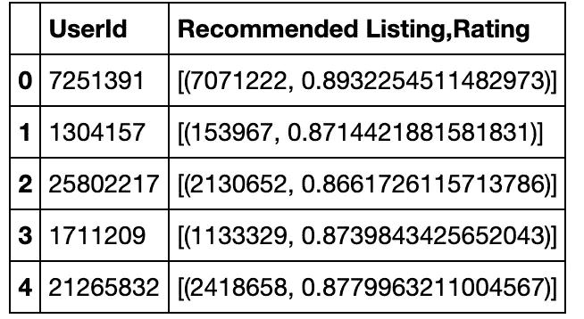

# **总结**

我最终得到了两个有用的推荐系统。我使用第一个推荐系统来计划我的奥斯汀之旅，因为它可以根据我的特定需求给我提供最好的 Airbnb。第二个推荐系统是基于相似用户偏好的更标准的推荐系统，被网飞、Airbnb、亚马逊等公司广泛使用。

# **参考文献:**

为了了解惊喜库的复杂性，我看了下面这个视频:[https://www.youtube.com/watch?v=z0dx-YckFko](https://www.youtube.com/watch?v=z0dx-YckFko)

我还引用了这位了不起的数据科学博主 Susan Li:[https://towards data science . com/building-and-testing-recommender-systems-with-surprise-step-step-d4ba 702 ef 80 b](/building-and-testing-recommender-systems-with-surprise-step-by-step-d4ba702ef80b)

Github 库:[https://github.com/AisOmar/Airbnb_recommendation](https://github.com/AisOmar/Airbnb_recommendation)