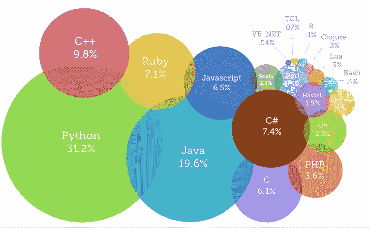
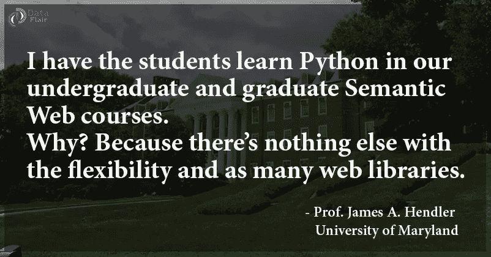
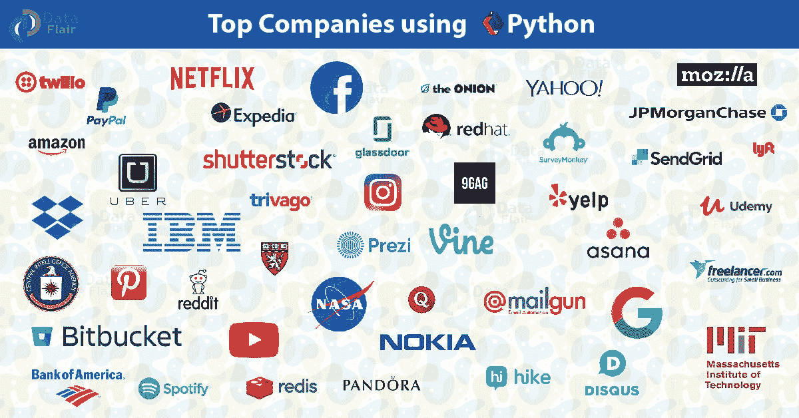
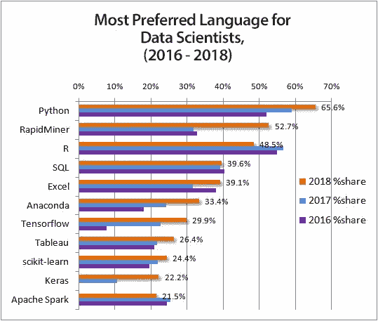

# 我学 Python 晚了吗？

> 原文：<https://towardsdatascience.com/am-i-too-late-to-learn-python-1fdf3a1b4576?source=collection_archive---------5----------------------->

## Python 仍然是 IT 界无可争议的王者

# 介绍

“当我第一次接触 Python 时，我就知道它有些特别。这是可读性和健壮性的某种结合，而且编写 Python 代码是一种乐趣。”

每天都有数百万人使用 Python。二十多年来，专业和业余开发人员一直在使用 python 来完成各种大大小小的任务。Python 在世界上一些最大的组织中扮演着至关重要的角色。它正在增强照片共享 Instagram 现象，帮助网飞向超过 1 亿用户播放视频，并帮助美国宇航局进行太空探索。正是 Python 帮助美国国家航空航天局拼接了大约 5 亿万亿公里外的黑洞的第一批图像。

[***你的 Python 之旅轻松了***](https://data-flair.training/blogs/learn-python-notes/)

它在 web 开发人员、数据科学家和系统管理员中特别受欢迎。对 Python 的狂热已经远远超出了最初的开发人员圈子，并且已经成为这个星球上最流行的编程语言，因为它继续以比任何其他语言更快的速度增加新用户。

## PYTHON 的历史

【T20 世纪 80 年代末，**吉多·范·罗苏姆，**一位荷兰程序员，在 Centrum Wiskunde&Informatica(CWI)研究一个分布式系统时，对现有编程语言的缺点感到沮丧，于是决定创造一种新的语言——‘一种既易于使用又功能强大的语言’

# 2020 年为什么要学 PYTHON？

Python 拥有数百万用户，但这并不意味着太晚或你现在不能学习 python。Python 是这个时代发展最快的编程语言。Python 有一个光明的未来，根据专家研究，在主要国家，如印度、美国和许多其他国家，python 开发者/专家的需求和供给之间仍然有巨大的差距。因此，可用的 python 开发人员的工资是实际工资的两倍，以填补这一短缺。

Most Trending Programming Languages of 2019

对于那些怀疑 python 的职业机会并且缺乏对 python 的良好掌握的人来说，这是重要的一课。是时候学习 python 了。它给你的简历增加了价值，并且最重要的是给你的职业目标增加了价值。

[***关于 Python 的 16 个事实***](https://data-flair.training/blogs/facts-about-python-programming/)

**让我们先来谈谈你绝对应该选择 Python 的所有理由。**

## 多才多艺的

Python 是一种通用编程语言。很容易想到它被使用的多个地方-

*   脚本
*   Web 开发
*   测试
*   计算机视觉
*   数据科学
*   机器学习
*   人工智能
*   图形用户界面和游戏开发
*   图像处理
*   企业应用
*   机器人学
*   网页抓取
*   网络编程

如果我们谈论它的不同风格，有一种 MicroPython 经过优化，可以在微控制器上运行。

## 方便用户的

Python 拥有一切——简单的语法、可读性、生产力。写 Python 就像用英语写一样。这也使得阅读 Python 中的代码并理解它变得容易；Python 代码简洁。Python 的这些特性使开发人员更有效率。可读性让下一个开发人员很容易理解你的代码。打印你好，世界！在 Python 中，您只需:

**print("你好，世界！")**

Python 也很好学。

## 丰富的图书馆

Python 有各种各样的库。这些可以让你借用代码，专注于重要的事情。这里列出了一些重要的图书馆:

**对于数据科学和机器学习-**

*   NumPy
*   Matplotlib
*   SciPy
*   熊猫
*   mlpy
*   Theano
*   网络 x
*   交响乐
*   达斯克
*   Dmelt
*   sci kit-学习
*   PyBrain
*   xgboost
*   张量流
*   克拉斯

**用于可视化:**

*   Matplotlib
*   海生的
*   plotly
*   ggplot
*   散景

还有很多其他的，比如 urllib、requests、Tkinter、pyqt5、JSON 和 sqlalchemy。

[***用这些顶级 Python 项目***](https://data-flair.training/blogs/python-projects-with-source-code/) 让你的 Python 游戏变强

## 适应性

Python 适合初创公司和科技巨头。无论你是一家初创公司、科技巨头，还是一个普通人，Python 都适合你。很多大牌也用。

## 数据科学和机器学习

现在大家都在说数据科学和机器学习，Python 往往是首选。感谢它的库和其他特性。它也非常适合人工智能，并且可以用于大数据，因为它与 Hadoop 兼容。

## 最佳职业选择

你可以在 Python 里干出一番事业。Python 开发者报酬丰厚，需求旺盛。您可以使用 Python 获得以下配置文件之一:

*   软件工程师
*   前端软件/网络开发人员
*   Python 开发人员/程序员
*   DevOps 工程师
*   生产部经理
*   数据分析师/记者
*   教师
*   财务咨询机构
*   研究分析师
*   数据科学家

根据 PayScale 的数据，Python 技能的平均年薪约为 62878 美元，在美国甚至更高。有了经验，你可以赚得更多。它是发展最快的编程语言之一。

它已经变得和 Java、C、C++一样重要，并将在未来几年打败它们。在各种项目中采用 python 的大公司正在推动对 Python 的需求。

# 尾注

Python 的发展在不久的将来非常有前途，这是促进你的 python 事业的好时机。
有很好的未来范围，对很多项目都足够强大。

现在，你还在等什么？

[***在巨蟒抛弃你之前选择它***](https://data-flair.training/blogs/python-tutorials-home/)