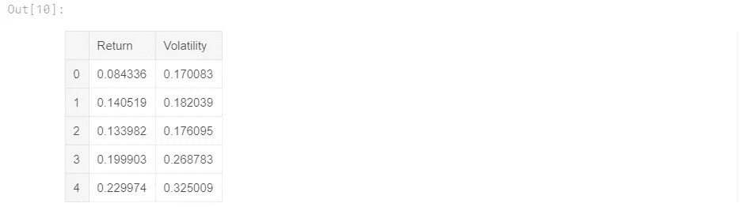

# 亚马逊和黄金

> 原文：<https://towardsdatascience.com/amazon-and-gold-efficient-frontier-analysis-ba9c8ad4c35b?source=collection_archive---------14----------------------->

## 有效前沿分析


[https://unsplash.com/photos/rymh7EZPqRs](https://unsplash.com/photos/rymh7EZPqRs)

# **什么是马科维茨投资组合优化？**

根据该理论，有可能构建一个最优投资组合的“有效边界”,在给定的风险水平下提供最大可能的预期回报。这一理论是由哈里·马科维茨在他的论文《投资组合选择》中首创的，该论文于 1952 年发表在《金融杂志》上。他后来因为开发了 MPT 而获得了诺贝尔奖。

# **为什么有趣？**

在我人生的大部分时间里，我都认为投资“风险越高，回报越高”。当只通过个股的范式来看投资时，这是典型的情况。如果你考虑股票之间的相关系数，通过分散投资，实际上有可能获得更高的回报和同等(或更低)的风险。在这个大纲中，我将尽力引导读者明白这是一个多么令人激动的概念。

# **预测:**

我们将从 2004 年 11 月-2019 年 5 月分析 GLD (SPDR 黄金股票-黄金 ETF)和 AMZN(亚马逊-西雅图电子商务巨头)。

*   哪种资产回报更高？哪个风险更高？
*   如果我们要单独用这两种资产做一个投资组合，如果我们的目标是最小化风险(100% GLD，0% AMZN)，(50% GLD，50% AMZN)等，那么黄金与亚马逊的比例是最保守的？
*   哪个比率是最大化回报，同时最小化每单位回报的风险？

— — — — — — — — — — — — — — — — — — — — — — — — — — — — — — —

# 导入模块:

```
import numpy as np
import pandas as pd
from pandas_datareader import data as wb
import matplotlib.pyplot as plt
%matplotlib inline
```

接下来，让我们引入数据。我直接连接到 Yahoo Finance API，这对于查看大量股票要实用得多。api 的代码:

```
assets = ['AMZN', 'GLD']
pf_data = pd.DataFrame()for a in assets:
    pf_data[a] = wb.DataReader(a, data_source = 'yahoo', start = '2004-11-18')['Adj Close']
```

既然我们已经获取了数据并将其分配给一个变量，那么让我们继续绘制标准化价格趋势。从这个角度来看，亚马逊在过去 15 年里一直是最大的资产。记住，高回报意味着高风险，对吗？

```
(pf_data / pf_data.iloc[0] * 100).plot(figsize=(10, 5))
```


让我们研究一下真实的数字。我们将计算这些股票的年度对数收益、标准差、协方差和相关性。

# 年度日志回报:

```
log_returns = np.log(pf_data / pf_data.shift(1))
log_returns.mean()*250
```


# 风险:

```
log_returns.std()*250**0.5
```


# 共方差:

```
log_returns.cov()
```


# 相关性:

存在非常低的负相关；然而，任何相关性仍然会产生影响。

```
log_returns.corr()
```


我们稍后将使用这段代码。但是简单解释一下，我用两个随机数组成一个数组，加起来是 1。

```
weights = np.random.random(2)
weights = weights/np.sum(weights)
weights
```


现在是我们进行模拟的时候了。我们这样做是为了查看黄金和亚马逊权重的所有可能组合。对于每一组随机权重，我们的模拟将为投资组合计算新的年回报率和标准差。

我们首先创建两个空列表，分别叫做‘pfolio _ returns’和‘pfolio _ volatilities’。这些将捕获其下函数的**的所有模拟计算。**

我们添加了之前的随机权重生成器代码，并将随机权重的 1000 次迭代插入到我们的投资组合回报和投资组合波动率公式中。append 方法是在每次交互时为列表创建一个新条目的方法。

```
pfolio_returns = []
pfolio_volatilities = []for x **in** range (1000):
    weights = np.random.random(2)
    weights /= np.sum(weights)
    pfolio_returns.append(np.sum(weights * log_returns.mean()) * 250)
    pfolio_volatilities.append(np.sqrt(np.dot(weights.T,np.dot(log_returns.cov() * 250, weights))))

pfolio_returns = np.array(pfolio_returns)
pfolio_volatilities = np.array(pfolio_volatilities)pfolio_returns, pfolio_volatilities
```

这将输出 2 个长数组。它们包含有价值的信息，但我们无法绘制出来。为了绘图，我们需要将数组转换成 dataframe 对象。我们可以通过将列键分配给列来使用字典。

```
portfolios = pd.DataFrame({'Return': pfolio_returns, 'Volatility': pfolio_volatilities})
portfolios.head()
```



现在让我们绘制我们创建的 dataframe 对象！

如你所见，它有一个回旋镖形状。这正是大多数投资组合优化图应该呈现的样子。图的底端是 GLD 的风险/回报(6.8%的回报/18.3%的标准差)，右上角是 AMZN 的风险/回报(26.1%的回报/38.6%的标准差)。

> 在中间，是当你在一个投资组合中混合两者时，风险/回报动态的样子。越往上越是 AMZN 分配，越往下越是 GLD

```
portfolios.plot(x='Volatility', y='Return',kind = 'scatter',figsize=(10,6));
plt.xlabel('Expected Volatility')
plt.ylabel('Expected Return')
```


# **保守视角:**

在曲线风险最小的地方(大约 16%的标准差)，看起来大约是 80%的 GLD 和 20%的 AMZN。令人惊讶的是，与我们 100%投资于 GLD 相比，这个点有更高的回报**和更低的风险**。这推翻了高回报意味着高风险的观点。我们正从个股范式转向投资组合范式。

# **夏普视角:**

理想情况下，我们希望回报最大化，同时风险最小化。这意味着大多数人希望尽可能靠近图表的左上角。这就是夏普比率(Sharpe ratio)的由来:每单位波动率超过无风险利率的平均回报率。本质上，夏普找到了一种方法来计算这条曲线上最靠近左上角的点。

如果我们全押在亚马逊上，我们仍然有最高的回报，但我们也有更高的风险。如果我们处于中间位置，理论上我们会通过最小化风险和最大化回报来优化我们的投资组合。

> **那么，GLD 和 AMZN 的最佳投资组合平衡是什么？**

我在 Github 上发现了一个程序，它实际上为我们自动化了这个过程。下图从最小波动率角度和最大夏普比率角度显示了 AMZN 和 GLD 的确切投资组合规格。我稍微调整了一下原始代码，将我们的数据插入到 Ricky Kim 的代码中，得到了这张图片:


但是，即使严格基于我提供的原始代码，您也可以感觉到曲线上的哪个点最小化了风险(最接近左边)，哪个点最大化了夏普(最接近左上角)，以及每个点使用了每只股票的什么权重(通过测量这些点沿着直线有多远)。

GitHub 中的代码:[https://GitHub . com/ahershy/Efficient-Frontier-Program/blob/master/markowitz-portfolio-optimization-gold-and-Amazon . ipynb](https://github.com/ahershy/Efficient-Frontier-Program/blob/master/markowitz-portfolio-optimization-gold-and-amazon.ipynb)

非常感谢里奇·金的灵感和伟大的文章:[https://towards data science . com/efficient-frontier-portfolio-optimization-in-python-e 7844051 e7f](/efficient-frontier-portfolio-optimisation-in-python-e7844051e7f)

## 点击此处了解有关线性回归/多项式回归的更多信息:

[https://towards data science . com/linear-vs-polynomial-regression-walk-through-83c a4 f 2363 a3](/linear-vs-polynomial-regression-walk-through-83ca4f2363a3)

如果您觉得这有帮助，请订阅、鼓掌或评论。

安德鲁