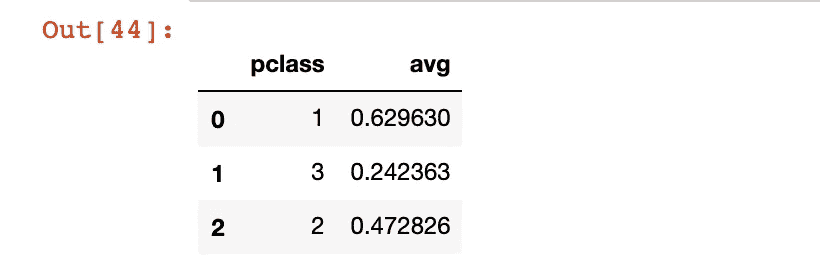

# 亚马逊 RDS —分步指南

> 原文：<https://towardsdatascience.com/amazon-rds-step-by-step-guide-14f9f3087d28?source=collection_archive---------4----------------------->

## [数据科学](https://towardsdatascience.com/data-science/home)

## 使用 Amazon RDS 和 Python 创建、连接和交互远程 PostgreSQL 数据库

Photo by [Arnel Hasanovic](https://unsplash.com/@arnelhasanovic?utm_source=medium&utm_medium=referral) on [Unsplash](https://unsplash.com?utm_source=medium&utm_medium=referral)

T 他的这篇文章将指导你如何使用[亚马逊关系数据库服务](https://aws.amazon.com/rds/postgresql/)创建数据库实例，以及如何仅使用 Python 与远程数据库服务器交互。

# 步骤 1:启动 AWS 数据库实例

首先，我们需要一个 AWS 账户。我们将转到 [AWS 门户](https://portal.aws.amazon.com/billing/signup?nc2=h_ct&src=header_signup&redirect_url=https%3A%2F%2Faws.amazon.com%2Fregistration-confirmation#/start)创建一个新帐户，或者您可以使用现有的 AWS 帐户。

## 什么是亚马逊 RDS？

Amazon 关系数据库服务(RDS)是在云中建立关系数据库的核心部分。我们提供的每个云数据库称为一个数据库实例。因此，首先，点击*服务*并选择*数据库*导航至 RDS 仪表板:

AWS Services Console. Select RDS for launching a new database instance.

接下来，要创建一个新的数据库，点击“*创建数据库* e”。数据库实例是灵活的，您可以配置它们来满足您的需求。您可以使用一系列引擎类型来配置数据库，包括 Amazon Aurora、MySQL、PostgreSQL 等。除了引擎类型之外，您还可以配置数据库实例的类型和大小，分配存储，以及配置不同的设置，如监控、备份和许多其他设置。

现在，我们选择一个运行数据库的 PostgreSQL 引擎。在本帖中，我们使用一个 ***自由层模板*** 。通过一个空闲的 trier，我们得到一个小实例 **db.t2.micro** ，它有 1 个 CPU 和 1gb 内存。

接下来，在 Settings 部分指定您的数据库实例信息:实例名和登录到您的实例的主用户凭证。您还可以指定用于访问数据库的端口。对于 PostgreSQL 安装，默认端口是 5432。

如果您想要为您的数据库实例提供一个公共 IP 地址(这样 VPC 之外的设备将能够连接到您的数据库),在*连接*部分中为**公共可访问**选择**是**。我选择 **Yes** 让我的数据库在我的本地机器上可用。

您应该继续到**附加配置**部分，并指定 Amazon RDS 在创建数据库实例时创建的数据库名称。对于本教程，我将创建一个名为 ***titanic*** 的数据库。

> **记住:数据库名称和数据库实例名称是两个不同的名称。如果不指定数据库名称，Amazon RDS 在创建数据库实例时不会创建数据库。**

最后，点击**创建数据库**。启动数据库可能需要几分钟时间。新的数据库实例出现在 Amazon RDS 控制台上。一旦实例的状态变为**可用，您就可以连接到该实例。**

The DB instance on the Amazon RDS console

# 步骤 2:连接到 PostgreSQL 数据库

一旦创建了数据库，我们就可以与它进行交互。在这里，我们使用 Python 包[**psycopg 2**](http://initd.org/psycopg/)**:**从 Jupyter 笔记本连接到我们的数据库

> 注意，您甚至不需要在我们的本地机器上安装 Postgres。您只需要安装一个 psycopg2 包，在您的终端中输入: **pip install psycopg2**

在第二行中，我们通过使用`connect()`方法打开了到 Postgres 的连接。我们向 psycopg2 传递了五个参数。第一个是`host`,它指定数据库在哪里运行。在我们的例子中，它是一个远程 RDB，主机 url 是来自 Amazon RDS 控制台的*端点值*(参见下面的截图)。接下来，我们传递用户名和密码(第 5、6 行)。您可以从使用之前创建的主用户凭证开始。稍后，我们将添加一个新用户，作为提高安全性和数据划分的一种方式。最后，我们传递了数据库名称(*，它与数据库实例名称不同！！！*)。我让你在**附加配置**中输入的数据库名称，在我这里是**泰坦尼克号。**

Amazon RDS console for a test database instance

最后但同样重要的是，我们需要创建一个**光标**对象(第 9 行)来交互和执行 Postgres 数据库上的命令。

# 步骤 3:通过 Python 与数据库交互

## 3.1.资料组

一旦我们连接到我们的数据库，是时候添加一些数据了。为了这个教程，我从 Kaggle (train.csv)上取了[泰坦尼克号数据集。经过一些预处理后，我将文件拆分为三个 CSV 文件: *passengers.csv* 、 *tripInfo.csv* 和 *survival.csv.* 我的回购与处理后的数据集和笔记本的链接在文章的最后。](https://www.kaggle.com/c/titanic/data)

## 3.2.创建表格

现在，我将把数据从 CSV 文件复制到数据库中，但是首先，我需要创建三个适合我的数据集的表。为此，我们可以使用`CREATE TABLE`命令，但是要注意，列的顺序应该与 CSV 文件中它们各自类型的顺序相同。

记住，每次我们需要在每个事务结束时运行`connection.commit()` 来提交我们的更改(第 22 行)。最后，您可以随时查询表 INFORMATION_SCHEMA。列来显示所有公共表的模式。我们尤其对列名和数据类型感兴趣。在 Python 中，我们还可以使用 pandas 方法`read_sql()`访问远程数据:

A sample output after executing the SQL query.

## 3.3.将数据从 CSV 加载到 Postgres 表中

一旦我们有了表，我们想从 CSV 文件中复制数据。幸运的是，使用 **psycopg2** 使用 *copy_from()* 方法非常简单:

Loading data into a Postgres table from CSV

我们还可以创建一个新用户，并授予管理数据库的权限:

## 3.4.执行查询

现在，我们的远程数据库已经准备好了，我们可以开始使用 Python `pandas.read_sql()`从数据库表中获取一些数据。假设我们感兴趣的是获得每个乘客所在班级的存活率。下面是一个简单的带有内部连接的 SQL 查询:

使用 pandas 执行 SQL 非常方便，因为它将 SQL 查询读入数据帧:

The survival rate for each passenger’s class

## 删除数据库实例

最后的笔记。从 AWS 中删除不再使用的数据库实例是一个很好的做法。否则，你会因此而被收费。因此，您需要返回到 AWS RDS 控制台，选择您的实例并单击 Delete。

Delete the database Instance

我的带有处理过的数据集和笔记本的 repo 是[这里是](https://github.com/ianap/aws_ec2_rds_examples)。