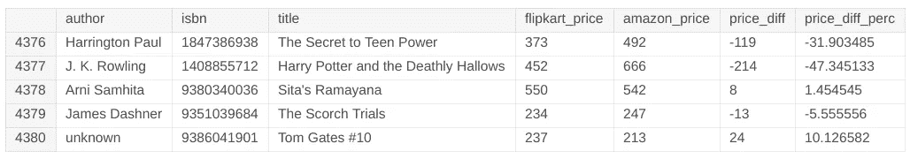
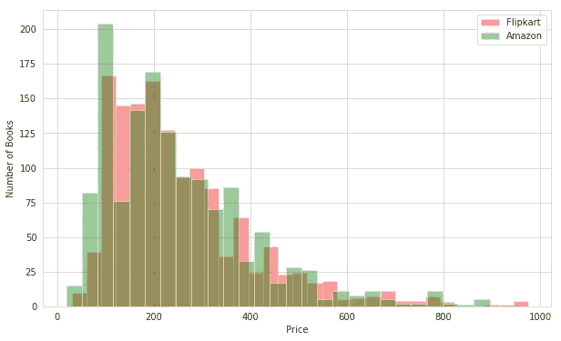
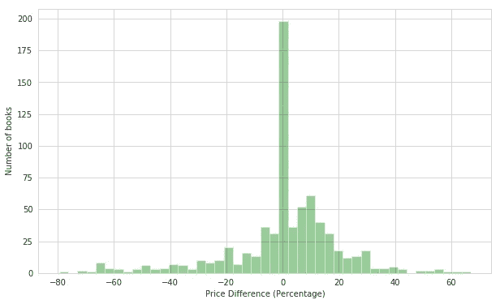
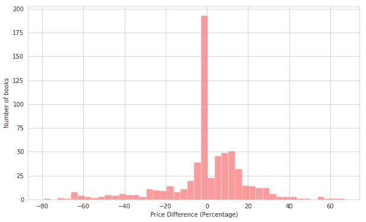
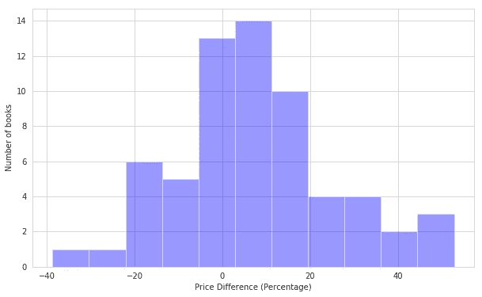

# 亚马逊 Vs. Flipkart:寻找图书的最佳价格！

> 原文：<https://towardsdatascience.com/amazon-vs-flipkart-finding-the-best-prices-for-books-bab29811b801?source=collection_archive---------9----------------------->

亚马逊还是 Flipkart？对我们这些懒得比较价格的懒人来说，这是个老问题。你可能想知道为什么这与你有关。从表面上看，似乎不会有太大的不同，但它要深入得多。事实上，通过深入研究数据，这种差异在我们的日常网上购物生活中变得非常显著。

# 数据收集的混乱。

在几个朋友的帮助下，我创建了两个剪贴簿，绕过所有障碍，将 Flipkart 上亚马逊上的数千本书籍的数据收集到一个 CSV 文件中。我们有足够的评级、价格、作者等信息。我们把普通的书拿出来连接两个表，我们用特定书的 ISBN 号来连接。我们计算了相对于 Flipkart 价格的价格差异，并计算了相对于 Flipkart 价格的价格百分比差异。我们最终得到了一个统计上可接受的 800 本书的样本，看起来像这样:

The cleaned CSV table.

## 一些无聊的先决条件

说到购物，你不会是第一个拥有个人最喜欢的电子商务网站的人。无论是因为你自己的偏好、平台的好处、你同事推荐你使用的东西，还是因为你在 Reddit 上读到的任何阴谋论。

我们在给定的图中看到两个网站上的价格分布。我们可以看到，从价格 Rs 处的峰值开始，有一些非常独特的模式。100.

Price distribution of the books on Amazon and Flipkart.

在做了一些基本的计算后，如果你坚持用 Flipkart 买书，你将花费大约 *Rs。190490* 。另一方面，如果你只使用亚马逊，它会花费你*卢比。187355* 。

坚持使用任何一个网站，你肯定不会很快买得起一辆新的宝马。所以让我们继续做一些冷静的分析。

就像一个未被触及的犯罪现场，我潜入原始的、充满神秘色彩的数据中去揭开一些谜团。

# 分析

让我们先看看最好和最坏的情况。如果我只从亚马逊和 Flipkart 的更便宜的选择中买书，我将花费*177017*卢比。在最坏的情况下，我只买了更贵的选项，这将花费我惊人的 211797 卢比。相差 34，780 卢比，即 16%。不是小数目！用这些钱，你可以买 16 次哈利波特。这可是宝马的一大笔钱。

## 让我们比较价格。

一眼就能看出，大概有 25%的书定价差不多。

通过观察价格的分布，我们可以看到正百分比的比例向右增加。这意味着与 Flipkart 相比，约 20%的图书在亚马逊的价格更低。

让我们快速浏览一下价值低于 500 卢比的书籍的数据，看看这种模式是否成立。它清楚地表明，对于更便宜的书籍，亚马逊仍然占据优势。

随着书籍变得越来越贵，超过 500 卢比，这种模式仍然存在，亚马逊赢了。

# 哟，你还没下定决心吗？

让我们再做一个分析来决定你的想法。

我的朋友多伊博士只在亚马逊上购物，而我更喜欢 Flipkart，不管出于什么原因。让我们看看，如果多伊博士从亚马逊上买下所有 713 本有问题的书，他会怎么样。与 Flipkart 相比，亚马逊有 45%的时间有更好的定价，而与我们最好的购物车相比，多伊博士只多付了 6%。另一方面，我从 Flipkart 买了整辆车后，只有 30%的机会得到更好的价格，最终我会多付 8%。

嗯，你必须同意，很难击败亚马逊的图书定价，因为我们最喜欢的电子商务市场是从卖书开始的。

# 结论

继续(最后)到所有这些的实际点，决定你应该实际使用哪个站点。好吧，看起来多伊博士对书籍有优势。那就是亚马逊。总的来说，最好的办法是检查和比较这两个网站，以获得最好的交易。

但是如果你懒得比较和买书，你可以一直使用亚马逊，与 Flipkart 相比，他们会在 70%的时间里提供更好或同样好的交易。

# **项目详情**

谈到书籍的价格比较，我是在看到 Chase 关于亚马逊和易贝的价格比较的精彩且信息丰富的[帖子](https://unlooted.com/blog/amazon_v_ebay/)后受到启发来做这个分析的。但在这种情况下，你不必做手动比较，他的分机 Unlooted 为你做的，所以一定要检查一下，如果你来自美国。

对我的下级 [Corruption13](https://github.com/Corruption13) 、 [pranavmodx](https://github.com/pranavmodx) 、 [Afnan-Navaz](https://github.com/Afnan-Navaz) 和 [voxetmohita](https://github.com/voxetmohita) 在这个项目上帮助了我。你们太棒了。

你可以找到我在 Kaggle 上做分析的[内核](https://www.kaggle.com/mandan/who-is-ripping-you-off)和[数据集](https://www.kaggle.com/mandan/amazon-vs-flipkart-book-prices)。请随意浏览并试验它。

奋斗的 T21 的故事可能需要一个自己的博客。我们收集了大约 50，000 本书，但由于 ISBN 的一些技术故障，我们无法将它们连接在一起。

如果你对数据分析有什么很酷的想法，请分享，我很想听听你的想法！