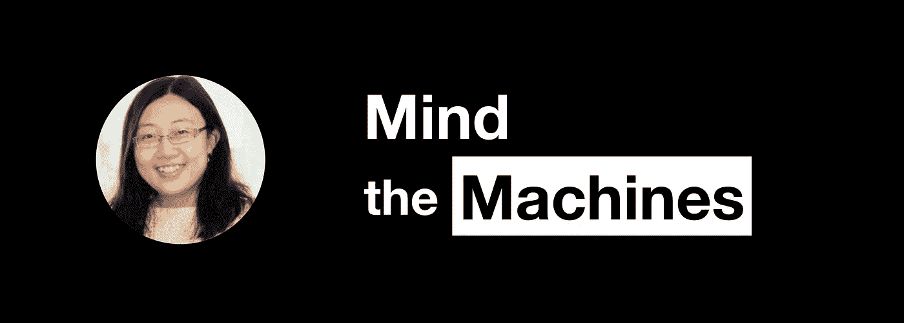

# 亚马逊的王梦琳在破解数据科学采访

> 原文：<https://towardsdatascience.com/amazons-menglin-wang-on-cracking-the-data-science-interview-5a8c5c733458?source=collection_archive---------24----------------------->

王梦琳是亚马逊的机器学习工程师，她在两个不同的团队工作，并在内部向亚马逊员工教授深度学习。

但梦琳真正酷的是她对理解和优化面试流程的专注。我们和她坐在一起，讨论优秀的数据科学家需要具备哪些特质，以及如何顺利通过数据科学面试。

请听下面的对话: