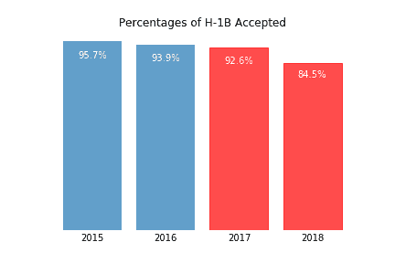
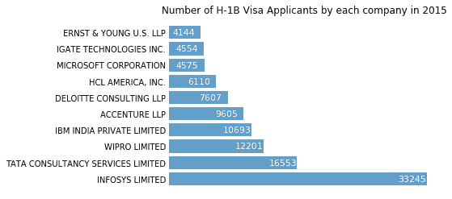
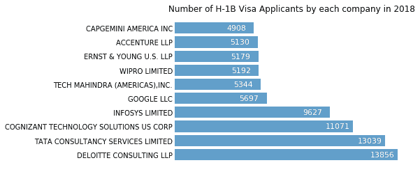

# “美国第一”:川普的总统任期如何影响 H-1B 签证？

> 原文：<https://towardsdatascience.com/american-first-how-has-trumps-presidency-affected-h-1b-visas-7041bedbbd79?source=collection_archive---------26----------------------->

唐纳德·特朗普总统 2016 年总统竞选期间的一个主要关注领域是他的“美国第一”移民改革主题。特朗普和其他美国人认为，雇佣外国人的公司导致美国人拥有的工作岗位和美国制造的产品减少，这是美国繁荣程度下降的标志。

在他 2016 年的就职演说中，他表示，“*从今天开始，将只有美国第一。美国第一。关于贸易、税收、移民和外交事务的每一项决定都将有利于美国工人和美国家庭。我们必须保护我们的边界免受其他国家制造我们的产品、窃取我们的公司和破坏我们的工作的蹂躏。保护将导致巨大的繁荣和强大。*

在他看来，问题的一部分是 H-1B 签证，这是一种根据[移民和国籍法](https://en.wikipedia.org/wiki/Immigration_and_Nationality_Act_of_1965)第 101(a)(15)(H)节在美国的[签证](https://en.wikipedia.org/wiki/United_States_visa)，允许美国雇主临时雇用[从事特殊职业的外国工人](https://en.wikipedia.org/wiki/Foreign_worker)。专业职业要求应用专业知识和学士学位或同等工作经验。(来源[维基百科](https://en.wikipedia.org/wiki/H-1B_visa))

美国公民及移民服务局(USCIS)签发 85，000 份 H-1B 签证。为了选择这些申请人，美国公民及移民服务局运行一个计算机生成的随机选择过程。他们首先挑选出 2 万名拥有硕士学位或更高学位的申请人，然后他们运行同样的随机选择过程，从常规配额中挑选出剩余的 6.5 万名申请人。

对于外国人来说，H-1B 是他们在美国发展事业和建立新生活的黄金通行证。许多国际学生就读美国大学，希望通过 H-1B 签证获得绿卡。对川普和他的支持者来说，H-1B 是公司获得廉价外国劳动力的门票，阻止了美国公民获得这些工作。

川普任总统期间，通过了*购买美国货和雇佣美国人的行政命令*，极大地冲击了 H-1B 计划。该命令指示国土安全部将 H-1B 签证授予技能最高或受益者收入最高的外国公民。H-1B 的申请变得更加复杂，雇主必须进一步提供额外的证据证明申请人的技能是专业知识。

作为一名国际学生，我想进一步调查这项行政命令对 H-1B 签证的影响。因此，我对来自美国劳工部的 H-1B 签证数据集进行了探索性数据分析。我专门看了 2011 年到 2018 年的数据。代码片段可以在 [**Github**](https://github.com/jongmp/H-1B-Visa) 上找到**。**

在探讨行政命令的影响之前，我想先了解 H-1B 签证申请人来自哪里。这张地图突出了申请者的位置。从图 1 中，我们可以看到大多数 H-1B 签证申请人来自加州、纽约州和得克萨斯州。

为了看到*购买美国货和雇佣美国人行政命令*的影响，我可视化了 2011 年到 2018 年的申请数量。蓝条代表奥巴马任总统期间的申请数量，红条代表特朗普任总统期间的申请数量。下面的柱状图表明，在奥巴马担任总统期间，申请人数逐年递增。然而，随着特朗普总统任期的开始，申请数量明显下降。这一过程变得不确定和复杂，因此申请人数减少了约 120，000 人，占申请总人数的 18.12%。

不仅 H-1B 签证申请数量下降，而且 H-1B 签证的批准比例也下降了。从美国公民和移民服务局提供的数据可以看出，申请数量明显下降。从 2017 年到 2018 年，有 8.1%的申请量下降。这可以解释为国土安全部的努力，只授予外国公民谁是最熟练的或有最高收入的受益人。

通过比较 2015 年和 2018 年申请 H-1B 签证的公司，也可以看出国土安全部雇用最有技能的外国公民的努力。2015 年，申请 H-1B 签证最多的三家公司是印孚瑟斯有限公司、塔塔咨询公司和威普罗有限公司。过去，大部分 H-1B 签证都给了这些印度外包公司，这些公司通常雇佣工资较低、专业知识较少的外国工人。

然而，如果我们将这一数字与 2018 年 H-1B 签证申请人数进行比较，申请 H-1B 签证的公司之间存在显著差异。像德勤咨询、Cognizant Technology Solutions 和谷歌这样的公司申请的签证数量最多。此外，印孚瑟斯的申请人数大幅减少。这意味着现在是美国大公司在雇佣这些外国工人签证，取代了印度外包公司。

从批准的 H-1B 签证数量和比例的下降可以看出行政命令的影响。它也改变了雇佣 H-1B 签证申请人的公司，从印度外包公司到财富 500 强公司。它还有其他意想不到的影响，比如减少申请美国大学的国际学生数量。根据[美国国家科学委员会](https://www.nsf.gov/statistics/2018/nsb20181/assets/nsb20181.pdf)的数据，2016 年秋季到 2017 年秋季之间，本科招生人数下降了 2%，研究生招生人数下降了 5%。

2019 年 1 月 11 日，川普在推特上写道，“美国的 H1-B 持有者可以放心，变化很快就会到来，这将为你的逗留带来简单性和确定性，包括潜在的入籍途径。”我期待着研究这一变化对 H-1B 签证的影响。

*对于这些建议的更深入的分析，探索性的数据分析，以及机器学习算法的源代码，请随时查看我的网站* [*。*](http://jongmp.github.io)