# 美国手语手势识别

> 原文：<https://towardsdatascience.com/american-sign-language-hand-gesture-recognition-f1c4468fb177?source=collection_archive---------13----------------------->

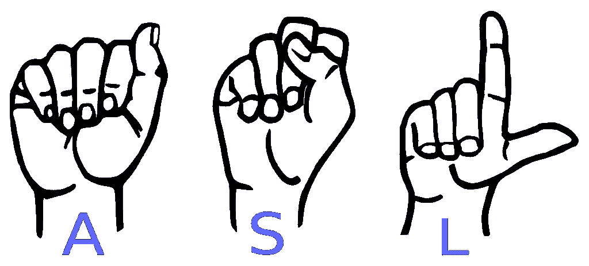

Image Source: [Public Domain](https://commons.wikimedia.org/wiki/File:American_Sign_Language_ASL.svg)

*这个项目和博客是由* [*拉维尼·迪亚斯*](https://medium.com/u/ecdc6cbbecd4?source=post_page-----f1c4468fb177--------------------------------)*[*拉沙·冯特诺*](https://medium.com/u/447260d5dea8?source=post_page-----f1c4468fb177--------------------------------)*[*凯蒂·格兰特*](https://medium.com/u/f65e4f05fb76?source=post_page-----f1c4468fb177--------------------------------)*[*克里斯·亨森*](https://medium.com/u/8ed06ecb9cc9?source=post_page-----f1c4468fb177--------------------------------) *和* [*希万克·索德*](https://medium.com/u/9c9432d9a794?source=post_page-----f1c4468fb177--------------------------------) *共同努力的
请访问我们的*[*Github*](https://github.com/chenson2018/APM-Project)*资源库获取项目实现代码。****

# **概观**

**虽然出现了新的和可获得的技术来帮助听力残疾者，但仍有大量工作要做。例如，机器学习算法的进步可以通过提供使用计算机视觉应用程序更好地交流的方法来进一步帮助聋人和重听人。我们的项目旨在做到这一点。**

**我们试图创建一个能够识别美国手语手势的系统。由于美国手语有静态和动态手势，我们需要建立一个系统，可以识别这两种类型的手势。本文将详细介绍我们项目的各个阶段。**

# ****项目总结****

****目标:**建立一个能够正确识别与手势相对应的美国手语手势的系统**

****方法:**我们项目的静态手语数据是图像形式的。我们训练了一个卷积神经网络(CNN)来识别这些图像中每一个所代表的标志。我们使用的动态手语数据集是由 LeapMotion 控制器(LMC)收集的，并且是每隔几毫秒收集的每只手的每个关节的(x，y，z)坐标的形式。我们对这些数据进行特征设计，以获得有用的相对运动数据，然后在经典分类模型上对这些数据进行训练，以识别与每个 LMC 输入相关的特定符号。**

****应用:**我们提出的系统将帮助聋人和重听人更好地与社区成员交流。例如，曾经发生过聋人在需要时与急救人员沟通有困难的事件。尽管应答者可能会接受手语基础的培训，但期望每个人都能完全流利地使用手语是不现实的。沿着这条线，计算机识别方面的这些进步可以帮助第一反应者理解和帮助那些无法通过语言交流的人。**

**另一个应用是使聋人和重听人能够平等地获得视频咨询，无论是在专业环境中还是在试图通过远程医疗与他们的医疗保健提供者沟通时。这些进步将使听力受损者能够获得有效的视频通信，而不是使用基本的聊天。**

****性能:**所提出的静态图像模型能够以 94.33%的准确率识别静态标志。基于我们对动态标志的分析，我们意识到需要首先识别标志是单手还是双手标志，然后识别标志本身。我们为动态手势提出的最终模型能够以 88.9%的准确度识别单手手势，以 79.0%的准确度识别双手手势。**

# **静态标志**

## **数据收集和预处理**

**使用来自 Kaggle 的手语 MNIST 数据集，我们评估了对字母表中每个字母的手势进行分类的模型。由于字母 J 和 Z 中涉及的运动，这些字母不包括在数据集中。然而，该数据包括字母表的剩余 24 个字母的大约 35，000 个 28×28 像素图像。与 MNIST 手绘的原始图像相似，该数据包含每幅图像中 784 个像素的灰度值数组。其中一张图片如下所示。**

**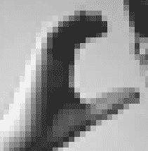**

**Figure 1: Sample image of the letter “C” from the training dataset, [Public Domain](https://www.kaggle.com/datamunge/sign-language-mnist)**

## ****学习/建模****

**我们使用卷积神经网络(CNN)模型对第一个数据集中的静态图像进行分类。构建神经网络时，我们的第一个目标是定义输入层。28x28 图像包含 784 个像素，每个像素由从 0(黑色)到 1(白色)的灰度值表示。通过将每幅图像转换成一系列数字，我们将数据转换成计算机可读的格式。**

**一旦准备好输入层，就可以由神经网络的隐藏层进行处理。我们的神经网络的架构可以在下面看到。**

**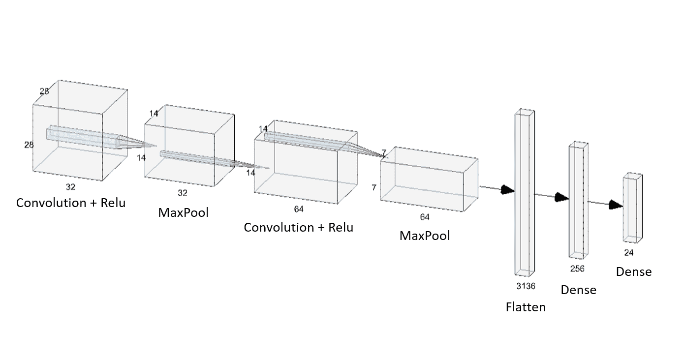**

**Figure 2: The architecture of the Convolutional Neural Network, [Public Domain](https://www.kaggle.com/datamunge/sign-language-mnist)**

**第一个隐藏层由几个节点组成，每个节点取 784 个输入值的加权和。输入的加权和然后被输入到激活函数中。对于我们的网络，我们使用了整流线性单位，或 ReLU。**

**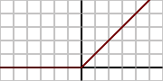**

**Figure 3: ReLU activation function, [Public Domain](https://commons.wikimedia.org/wiki/File:Activation_rectified_linear.svg)**

**上图显示，当输入为负时，ReLU 将输出 0，否则不会改变输入。ReLU 的输出将作为网络中下一个隐藏层的输入。**

**为了更好地理解每个隐藏层如何转换数据，我们可以可视化每个层的输出。我们的第一层有 32 个通道，因此上述过程重复 32 次。这允许网络在每个图像中捕捉几个特征。如果我们输入之前显示的描绘字母“C”的图像，我们将获得以下 32 个输出。**

**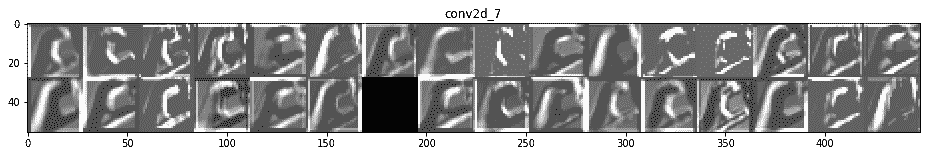**

**Figure 4: Outputs from the first hidden layer, [Public Domain](https://www.kaggle.com/datamunge/sign-language-mnist)**

**在这里，我们看到每个通道如何稍微不同地变换图像。基于这些图像，网络似乎正在提取关于人的手的边缘和大致形状的信息。随着数据继续在隐藏层中移动，神经网络试图提取更多的抽象特征。下面是第四个隐藏层的输出。这些图像不太容易被人眼理解，但对网络非常有用，因为它试图将图像分类到 24 个潜在类别中的一个。**

**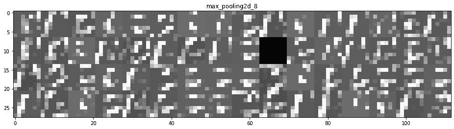**

**Figure 5: Outputs from the fourth hidden layer, [Public Domain](https://www.kaggle.com/datamunge/sign-language-mnist)**

**一旦数据通过了神经网络的卷积层和最大池层，它就进入平坦层和密集层。这些层负责将数据减少到一维，并识别图像的类别。**

**在定义了 CNN 的架构之后，我们试图通过选择一个合适的历元数来优化模型的性能。前面我们提到过，每个节点取其输入的加权和。应用于每个输入的权重通过训练过程学习，并随着每个时期更新。一个历元是所有训练数据的一次传递。在第一个时期，神经网络估计每个权重的值。对于每个随后的时期，神经网络用减少总损失的值来更新这些权重。一般来说，更多的时期导致更准确的分类器；然而，更多的时代也产生更复杂的模型。使用验证集，我们确定 10 个历元为我们提供了准确性和复杂性之间的最佳平衡。**

## ****结果****

**用于构建和优化模型的训练和验证数据集包含 80%的原始数据。剩余的 20%(约 7000 个样本)用于模型测试。将该测试数据输入到模型中，准确率达到 94.33%。为了进一步了解这个模型的优点和缺点，我们创建了一个混淆矩阵。**

**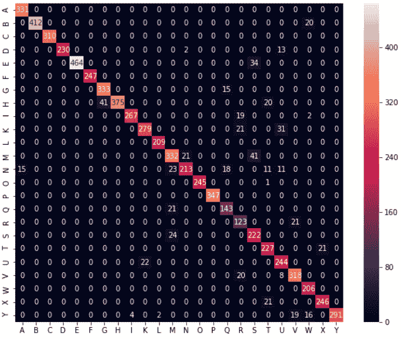**

**Figure 6: Confusion matrix of the CNN’s outputs on the test data, Image by authors**

**从混淆矩阵中，我们看到最常混淆的两个符号是字母“M”和“S”。这些标志的图像如下所示。**

**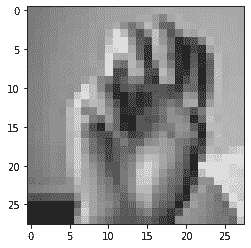****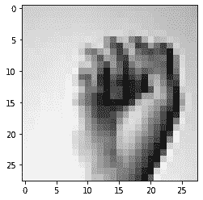

Figure 7: Image of the letter “M” (left) and “S” (right), [Public Domain](https://www.kaggle.com/datamunge/sign-language-mnist)** 

**基于这些图像，很容易理解为什么我们的神经网络在区分这两种迹象方面有困难。在未来的工作中，我们将使用分辨率更高的图像，以便从图像中提取更复杂的细节。希望这将进一步提高我们模型的准确性。这个模型的另一个限制是它不能识别移动的符号，例如字母“J”和“Z”。在下一节中，我们将探索一种能够更好地识别动态标志的数据源。**

# **动态标志**

## **理解数据**

**我们项目的第二阶段将专注于动态标志(即移动标志)。该数据集由 25 个受试者组成，每个受试者使用 LeapMotion 控制器(LMC)用他们的左右手执行相同的 60 个美国手语手势。因此，这个数据集有 60 个不同的美国手语符号(或类别标签)，我们试图准确预测。**

**LMC 装置每 0.04 秒记录一次手指、关节、手掌、手腕和手臂的位置。换句话说，LMC 获取手部骨骼关节的空间坐标以及这些坐标如何随时间变化。我们的第二个数据集由这些坐标点组成。**

**让我们使用图 9 来更详细地理解这些数据的本质。**

**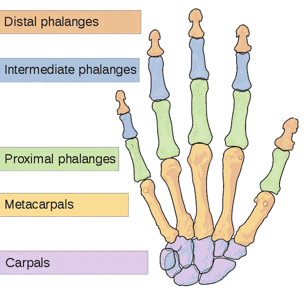**

**Figure 9: Pictorial representation of the hand as seen by the LeapMotion Controller, [Public Domain](https://commons.wikimedia.org/wiki/File:Scheme_human_hand_bones-en.svg)**

**掌骨、近端骨、中间骨和远端骨指的是解剖学手指的四块不同的骨头。Leap Motion 数据集在符号持续时间内每 0.04 秒为我们提供每个手指中每个骨骼的(x，y，z)坐标。它也给了我们手掌、手腕和手臂的坐标。总之，这些坐标点作为时间的函数提供了可用于识别手势(或 ASL 手势)类型的辨别信息。**

## ****特色工程****

**意识到我们需要每个测试对象的数据帧具有可比性，我们首先通过获取每个连续坐标行的差值来转换每个数据帧，给出手的每个部分(x、y 和 z 坐标)在 Leap Motion 设备记录的每个测量值之间移动的距离。对于在动作捕捉期间识别的手的 54 个部分，这以大约 0.04 秒的间隔捕捉运动。每个转换后的数据帧由 398–1203 个时间间隔组成，每个时间间隔有 162 列坐标数据。**

**在这种差异之后，我们接下来试图导出在给定的时间间隔内捕获关于手的运动的信息的特征。我们决定取每一列的平均值和标准差。虽然这可能看起来相对简单，但我们发现这是一种计算成本低廉的获取信息的方式。**

**考虑这些差异列的平均值代表什么。这是手的每个部分在每个时间间隔内移动的平均距离。同样，取这些列中每一列的标准偏差代表该位移的变化。换句话说，这是速度的代理。(令人惊讶的是，增加对每一点速度的实际计算实际上降低了精度！)**

**除了这两组特征之外，我们还尝试识别具有强相关性的手部坐标对，并使用多项式权重作为用于分类的特征。虽然这在减少的数据集(10 个类别与所有 60 个类别相比)中产生了准确性的增量收益，但这并不能很好地扩展到整个标志集。**

**我们的另一个想法是利用手指形成的角度。我们计算了远端和中间骨之间关节的内角，以及中间骨和近端骨之间关节的内角。但是，将这些角度添加到先前导出的每个关节的均值和标准差特征中，表明独立变量中存在多重共线性。仅使用导出的角度特征在 10 个类的缩减数据集上产生了可接受的分类精度，但是它没有很好地扩展到所有 60 个类的数据集。**

## ****学习/建模****

**最初，我们的团队通过查看由数字符号 0 到 10 组成的数据子集来开始模型选择，开发了上述特征。我们意识到的是，这些符号的子集很容易被区分，因为它们中的每一个都只使用一只手来完成符号。意识到这一点意味着静止的左手只会对数据集产生噪声，我们移除了所有源自左手的坐标，并看到分类准确性的显著提高。**

**现在想把它扩展到我们的全部数据集，我们用双手，再次使用上述特征，并注意到准确性的显著下降。在试图确定我们的模型无法区分不同标志的地方，我们发现对手语的更好理解将为我们的模型管道提供信息。**

**我们首先尝试有条件地识别哪些手势只使用一只手，目的是将我们的数据集分成两组。通过手动检查符号和为我们的特征均值开发阈值，我们通过识别其左手属性看起来是静止的数据帧，将数据集分成 22 个“双手”符号和 38 个“单手”符号，如通过左手坐标中的平均绝对偏差之和所测量的。然而，这种区别往往很不清楚。**

**由于我们团队的成员对美国手语远非流利，我们不得不做一些研究来更多地了解我们数据集中的手语。我们开始确定有多少人，哪只手参与了每个单词的签名。对我们来说幸运的是，网站 [Signing Savvy](https://www.signingsavvy.com/) 提供了一本美国手语词典，里面有各种不同的单词手语视频。例如，单词“bug”可以有两种不同的签名方式，这取决于该单词的使用方式。这两种手势在签名时都只用右手。另一方面，“成本”这个词涉及到双手，但只有一只手在运动([视频](https://www.signingsavvy.com/search/cost))。使用这个网站，我们能够了解我们数据集中基于应用的标志差异。在我们的数据集中的 60 个单词中，有 9 个可以用双手或只用右手签名(开车、来、花费、完成、走、快乐、受伤、小、什么时候)。**

**尽管在单手和双手手势之间分割我们的数据集存在困难，但我们发现这种方法显著提高了我们对完整数据集的准确性。**

## ****型号选择****

**在创建了前面提到的特征之后，我们用几个分类器进行了实验。下面是两个箱线图，显示了我们单手和双手标志上各种型号的性能。最终，我们认为线性判别分析(LDA)具有更好的性能。以下是我们进行 100 次测试/训练的准确度结果:**

**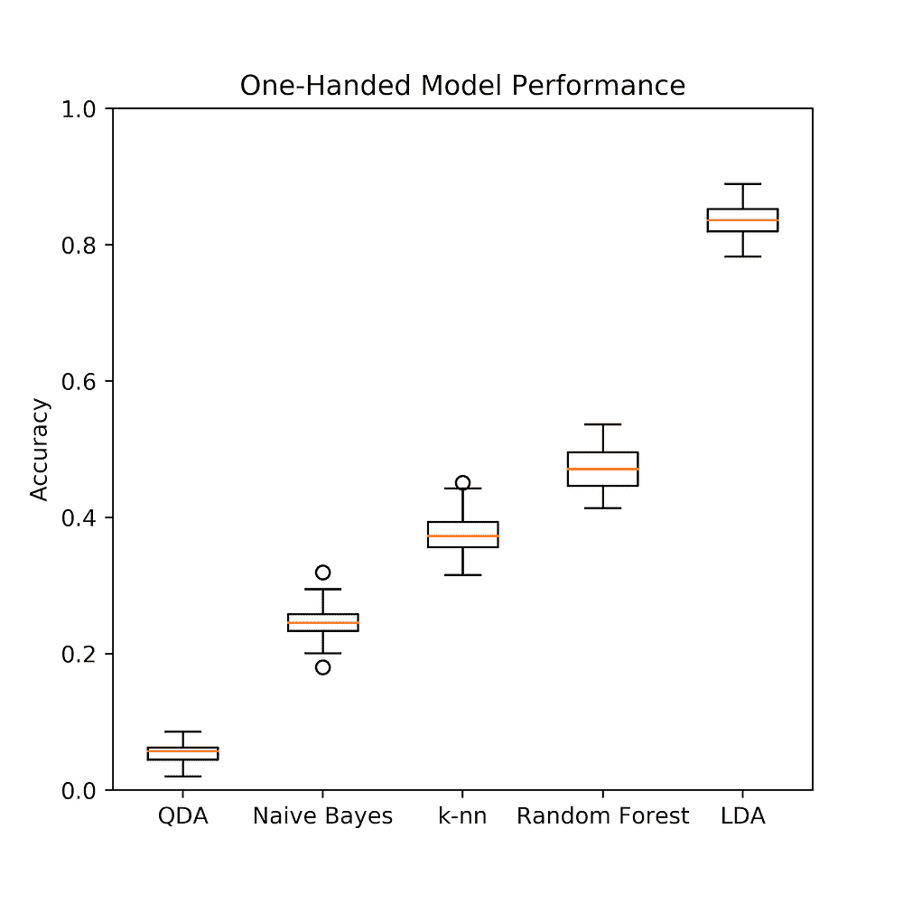****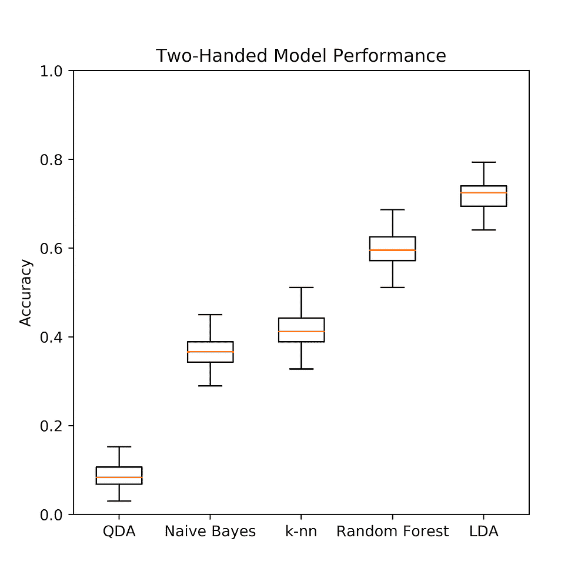**

**Figure 10: Comparison of model performance for one-handed signs (left) and two-handed signs (right), Images by authors**

## ****结果****

**图 12 中的图显示了我们的模型使用 LDA 运行 100 次的结果，每次迭代采用不同的随机选择的训练/测试分割，该分割由我们的分类标签分层。两条信息立刻凸显出来。首先，分离单手和双手手势的策略非常有用。第二，给定一组随机的训练数据，我们的模型精度在分类精度方面具有相对高的标准偏差。然而，考虑到 25 名受试者的小样本量，这并不奇怪。**

**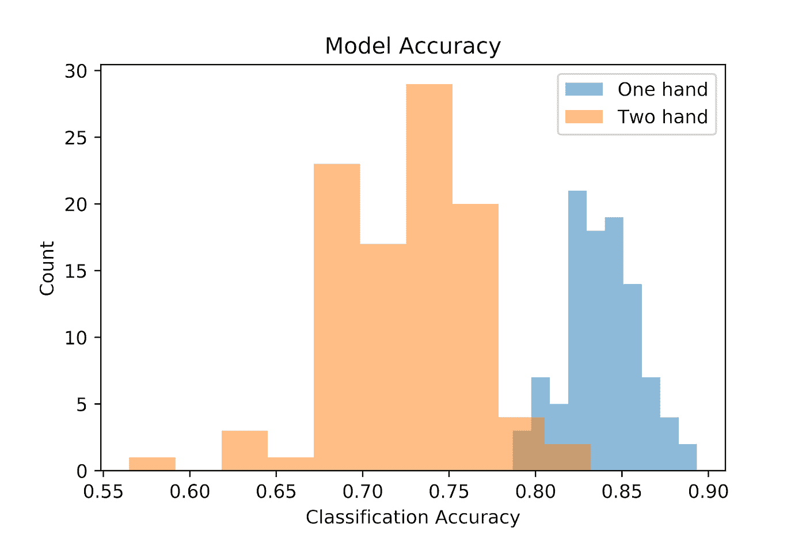**

**Figure 12: Distribution of classification accuracy for different train/test splits, Image by authors**

**上面的图表明，我们的双手手势比单手手势更容易被系统地错误分类。自然的问题是识别出对我们的模型可能有问题的特殊标志。下表显示了最常见的混淆迹象:**

**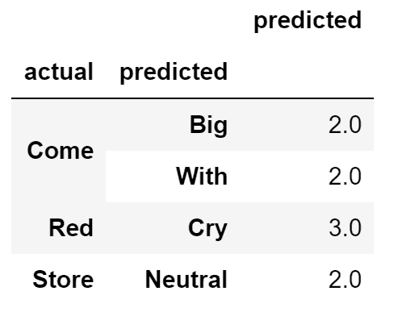**

**Table 1: Some of the signs that were misclassified with each other, Image by authors**

**表 1 显示了相互错误分类的符号，即“来”的符号被错误分类为“大”或“有”。同样，在我们的数据集中,“红色”的符号被误认为是“哭泣”。这是意料之中的，因为这两对星座的运动非常相似。**

**此外，整个模型的错误分类可以分为两类。**

1.  **“预测过度”的迹象。换句话说，当实际的征兆是别的什么的时候，这些征兆就被预测了。这相当于两类问题中的误报。**
2.  **“预测不足”的迹象。换句话说，应该预测的时候没有预测到的迹象。这相当于两类问题中的假阴性。**

**下面是识别这些情况的两个图表:**

**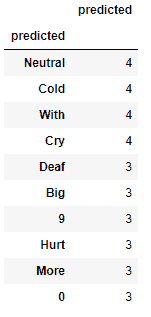**

**Table 2: The list of ‘over-predicted’ signs, Image by authors**

**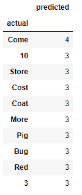**

**Table 3: The list of ‘under-predicted’ signs, Image by authors**

**例如，标志“冷”([链接到视频](https://www.signingsavvy.com/sign/COLD/533/1))经常无法预测。直觉上，我们看到的是，因为这个符号涉及双手在非常小的运动范围内移动，所以我们的模型很容易预测这个符号来代替另一个符号。**

**为了进一步可视化这些体征在我们的分类模型中的表现，我们基于“一对静止”分类(仍使用 LDA)为每个体征生成 ROC 图，其中对于每个单独的体征，我们将我们的模型视为与两类模型一起工作(例如“冷”对“不冷”)。下面我们看到了最有问题的迹象之一的结果:**

**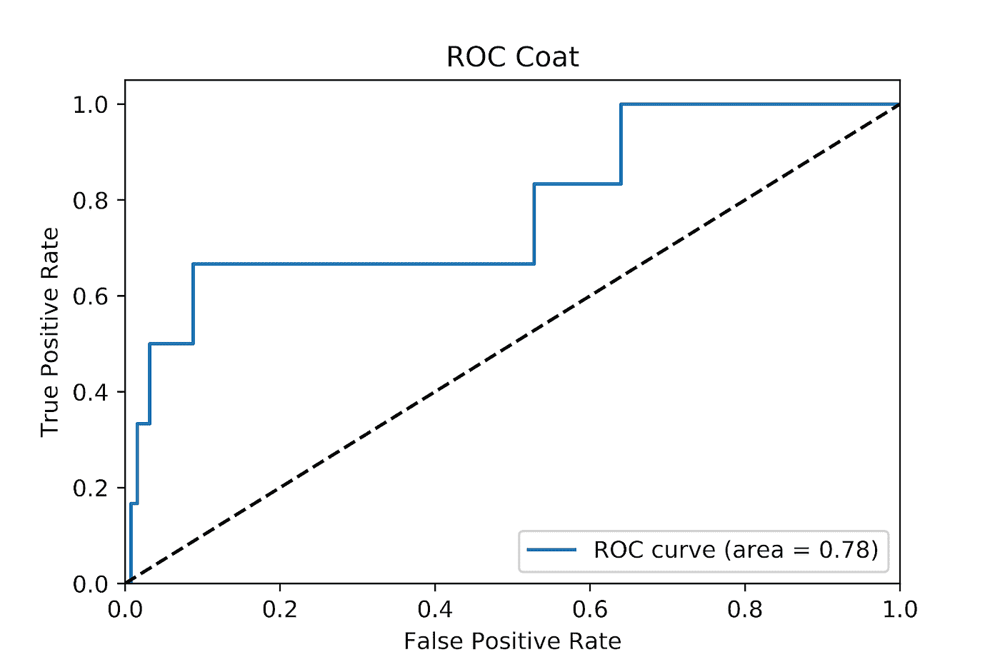**

**Figure 13: ROC for the word ‘Coat’ versus the rest of the signs, Image by authors**

**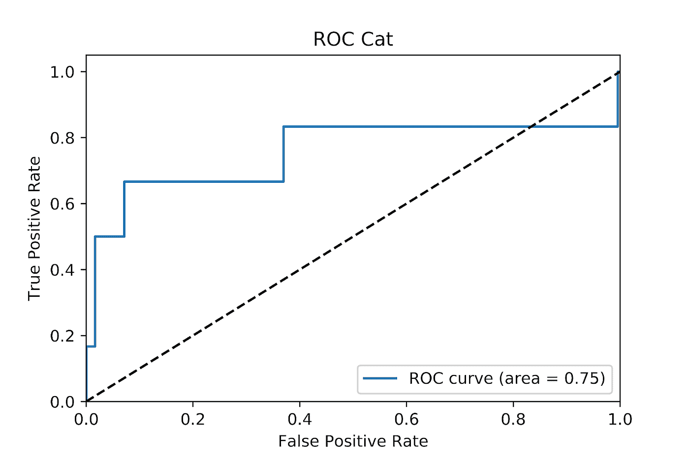**

**Figure 14: ROC for the word ‘Cat’ versus the rest of the signs, Image by authors**

# **结论**

**虽然这一分析为美国手语识别奠定了坚实的基础，但要实时应用这一概念，还需要做更多的工作。这需要进一步使用 LeapMotion API 来实现数据的实时生成、模型的反馈以及单词和/或数字的识别。这也将要求模型能够处理它目前处理的 60 多个类别标签。**

**总之，我们认为这种应用在改善听力受损者的生活方面具有真正的潜力，因此这将是一个值得继续开发的目标。**

## **参考**

1.  **http://blog.leapmotion.com/getting-started-leap-motion-sdk/**
2.  **[https://www . researchgate . net/figure/ReLU-activation-function _ fig 3 _ 319235847](https://www.researchgate.net/figure/ReLU-activation-function_fig3_319235847)**
3.  **[https://www . ka ggle . com/data munge/sign-language-Mn ist # sign _ Mn ist _ test . zip](https://www.kaggle.com/datamunge/sign-language-mnist#sign_mnist_test.zip)**
4.  **[https://data.mendeley.com/datasets/c7zmhcfnyd/1](https://data.mendeley.com/datasets/c7zmhcfnyd/1)**