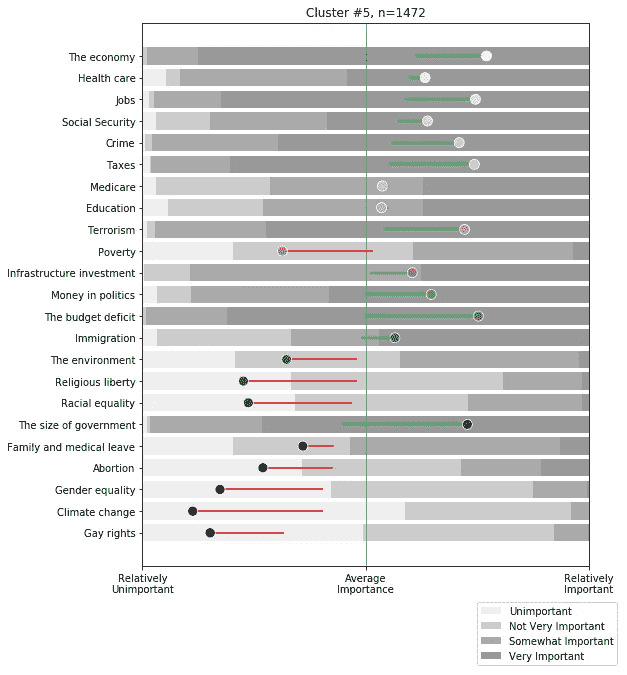
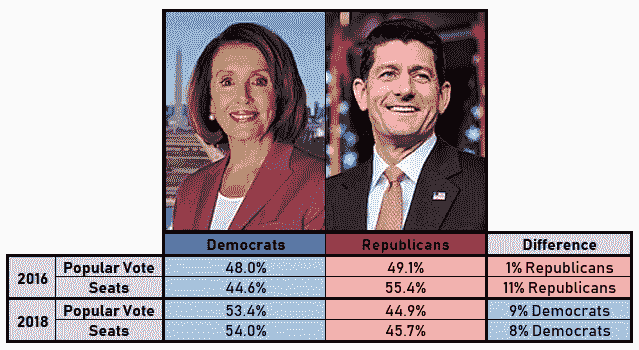
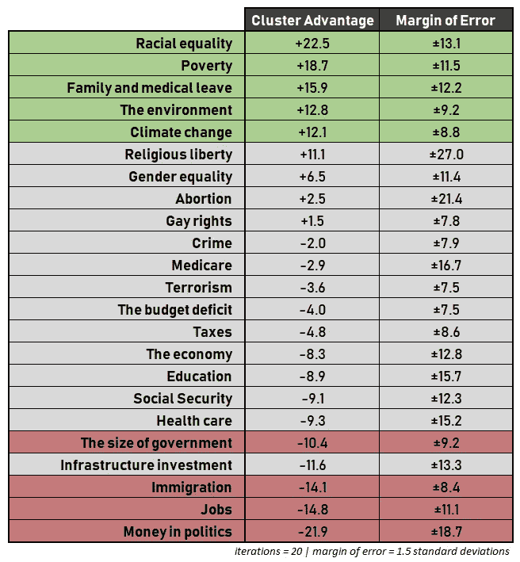
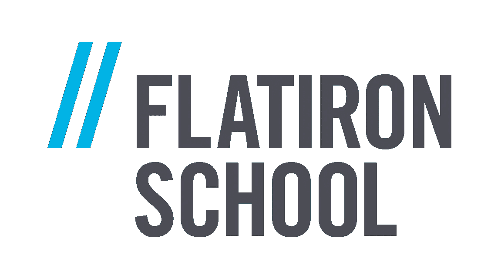

# 美国的集群共识

> 原文：<https://towardsdatascience.com/americas-clustered-consensus-6a1a714a286e?source=collection_archive---------31----------------------->

## 使用无监督的机器学习技术来更好地理解美国大多数选民是如何获得或没有获得他们想要的东西的

Photo illustration by author. [Original photo](https://unsplash.com/photos/-uqMjRCBzMk) by [Paul Weaver](https://unsplash.com/@paulweaver) used via an [Unsplash license](https://unsplash.com/license).

> *****到底怎么了？*****

**如今，民主党不断受挫的一个原因是，公众意见似乎没有直接转化为公共政策。例如，大多数美国人希望看到[竞选财务改革](https://www.pewresearch.org/fact-tank/2018/05/08/most-americans-want-to-limit-campaign-spending-say-big-donors-have-greater-political-influence/)、枪支所有权背景调查[、化石燃料消耗减少](https://news.gallup.com/poll/1645/guns.aspx)。然而，尽管压倒性的公众支持促成了一些强大的基层运动，甚至一些地方一级的行动，但我们还没有看到我们所期望的由如此大多数人实现的全国性公共政策行动。**

**这个难题是一个有许多拼图块的难题。在这里，我不打算尝试解决整个难题，而是提出一个特定的拼图块，可以帮助其他块点击到位。我把这个特殊的拼图块叫做**“议题拥挤”**:个人选民通常在大多数但不是所有议题上都得到很好的代表，选民没有得到很好代表的比例因议题而异，特别是当一个代表可能必须代表多个议题时。**

**代议制民主中问题排挤其他问题的想法不应该太令人惊讶——在我看来，这是社会选择理论中其他想法的表亲，如“[话语困境](https://en.wikipedia.org/wiki/Discursive_dilemma)”和“[孔多塞悖论](https://blogs.lse.ac.uk/brexit/2016/06/15/what-do-the-people-really-want-the-condorcet-paradox-and-the-referendum/)”。我不想在理论基础上对此进行论证，而是想提供来自数据分析中机器学习方法的经验证据，表明这是一种可测量和可量化的现象。**

**我从两个关键前提开始:**

*   **首先，**政治代表的机会是有限的** —也就是说，只有这么多人竞选民选职位，除此之外，只有这么多宣传和公民社会的机会可供人们在选举日之后影响政策制定过程**
*   **此外，由于这种政治经济的性质，**代表们倾向于采用反映选民政治偏好“重心”的政纲。**此外，这些代表将试图说服个人选民的政治偏好更接近他们自己的平台，从而形成一个积极的反馈循环。**

**换句话说，无论是正式代表(由民选官员代表)还是非正式代表(由公民社会代表)，当选民通过代表表达他们的政治偏好时，他们会被归入与他们的政治偏好在很大程度上(但不完全)类似的其他选民。这反过来又会造成一种局面，即在一个问题上大多数公众意见不足以保证大多数人喜欢的公共政策结果。**

**考虑下面的动画图表。每个点代表一个选民，把横轴想象成“经济问题”，纵轴想象成“社会问题”可能会有所帮助。**

****

**Difference between their individual voters versus their clustered representation. Animated illustration by author. Illustration + animation by author.**

**在这里，虽然橙色点占大多数(17 到 13)，但当代表沿着水平轴分层时，多数蓝色“斑点”的代表占大多数(2 到 3)。蓝点赢了，尽管是少数，而且不一定是因为任何邪恶的东西，除了是数学事故的幸运赢家。**

**在接下来的内容中，我提出，这个我称之为“**问题拥挤”**的数学事故，可以通过聚类分析的机器学习技术以有意义的方式进行测量。我首先简要概述了允许我计算我称之为**“集群优势”**的技术，描述了如何计算和解释集群优势得分，然后尝试对我的结果进行描述性分析，表明这种测量如何可能对政策企业家和政治科学家等有价值。**

# **集群 101**

**聚类分析——根据许多不同变量的相似性将许多对象分组在一起的过程——是一个计算密集型过程，通常属于“人工智能”(AI)和“机器学习”(ML)的范畴。**

**这里值得暂停片刻，并认识到，在大多数情况下，人工智能和人工智能不一定是民主的好东西(例如，见这里的、这里的、这里的和这里的)。我相信这其中的一个原因是因为人工智能和人工智能经常被用于*预测*，这通常会将决策权从人们手中夺走，并将其放在计算机的“黑匣子”中——当然，人类很难与计算机进行辩论！**

**在这里，为了*描述的目的，我将重点放在聚类分析的能力上——*也就是说，使用计算机的能力来创建一个新的现实地图，该地图可以检测人类否则无法观察到的模式，甚至可能指出挑战文化中根深蒂固的假设和刻板印象的关联。这种计算机生成的描述旨在帮助人类做出正确的决策，而不是取代它。作为这种描述性机器学习的一个例子，耶鲁大学气候变化交流项目使用聚类分析生成了他们的 [*全球变暖的六个美洲*](https://climatecommunication.yale.edu/publications/global-warmings-six-americas-short-survey-audience-segmentation-of-climate-change-views-using-a-four-question-instrument/)；对于这个项目，我有兴趣看看聚类分析是否可以同时应用于多个问题。**

**为此，我使用了来自选民研究调查(选民)的[观点的数据子集，以 1-4 或“非常重要”到“不重要”的等级衡量美国选民对广泛问题的关注程度(注意，这个问题是在 2016 年 12 月和 2017 年 7 月提出的；当受访者在这两年都给出答案时，我使用了更近的 2017 年 7 月的回复)。我最终使用的特定算法是 Ward 的方法，用于生成凝聚层次聚类。](https://www.voterstudygroup.org/publication/2018-voter-survey-1)**

**鉴于当代美国的两极分化和对各种参数的实验，我发现数据的第一次划分产生了通常与“左和中”相关的两个集群，大约占样本的三分之二，然后是“右”，剩余的三分之一。但是因为我使用了一种*分级*聚类方法，计算机可以挖掘得更深，并在其中创建更多的聚类。**

**下面显示的是由该过程生成的许多聚类之一的图形解释(当我们告诉计算机总共生成 11 个聚类时):**

****

**This graph is only one of many being considered simultaneously (that is, number five in a set of eleven). Don’t try to make too much sense of it, other than trying to understand what a single cluster represents! If you really want to go deep, I have a document that visualizes a whole set of clusters along with their family tree ([**click here**](https://github.com/KalebNyquist/voters-clustering/blob/master/images/dendrogram_cheatsheet.pdf)). Illustration by author.**

**绿色条(右边)表示，对于特定的群体整体而言，这个问题被认为比所有美国人的平均水平更重要。红色条(左侧)表示该问题被认为不如平均水平重要。**

**随便看一下这个集群，它代表了大约 3%的美国人口，表明它是美国政治右翼的一个子集群。在许多方面，它满足了我们常见的刻板印象(即，不太关心同性恋权利和气候变化，更关心政府的规模和犯罪)。但是至少有一个明显的例外出乎我们的意料:[宗教自由](https://www.usatoday.com/story/news/politics/2017/04/24/republicans-congress-push-religious-liberty-executive-order/100842590/)。**

**如果我们更仔细地观察，我们会发现集群的另一个重要动态。即使对于该组中趋向于“非常重要”的问题，例如**政治中的金钱**，仍有少数受访者认为该问题“不重要”。同样，对于该群中趋向于“不重要”的问题，例如**家庭和医疗休假**，有少数受访者认为该问题“非常重要”。如果我们要创建更多的集群，这些离群值可能会形成一个新的集群；同样，这个群体很可能代表了总体“右”群体中的许多离群者，他们认为宗教自由“不重要”。**

**一旦我们有了我们的集群，我们现在可以计算“集群优势”分数。**

# **计算和解释集群优势**

**简单地说，群集优势是群集的组合百分比大小，其中特定问题的趋势比平均值更重要(即，在上面的图形表示中由右侧的绿色条表示)。然后我们减去 50，这样更容易理解。数学上:**

****

**想象一下，如果我们有四个集群，分别占总人口的 10%、20%、30%和 40%。对于一个特定的问题，比如说医疗保健，10%和 30%的聚类趋势是负面的，20%和 40%的聚类趋势是正面的。那么聚类优势得分将为+10(即 20+4050)。**

**那么我们如何解释集群优势分数呢？正的集群优势分数表明对这些问题的支持分布均匀，而对这些问题的冷漠或敌意高度集中(也就是说，与他们对民主代表的最佳选择相比，诋毁者更有可能是特殊的)。负的集群优势分数表明了相反的情况。**

**想象一下这会给民主进程带来什么样的后果，想想 2016 年和 2018 年的美国众议院选举。众所周知，不公正的选区划分操纵了美国众议院，主要有利于共和党，也就是说，用我们的话说，共和党绘制了地图(战略性地将选民分散开来，并将反对派集中到特定的地区)，以便给自己带来积极的代表优势。**

****

**Note that some numbers might not add as expected up due to rounding and third-party popular votes. Illustration by author. Original photos of [Nancy Pelosi](https://commons.wikimedia.org/wiki/File:Official_photo_of_Speaker_Nancy_Pelosi_in_2019.jpg) and [Paul Ryan](https://commons.wikimedia.org/wiki/File:Paul_Ryan_official_photo.jpg) available in the public domain.**

**我们看到，在 2016 年，共和党在普选中领先 1%，但在席位方面取得了 11%的优势(11 比 1 的比例！).与此同时，在 2018 年，当民主党在普选中领先 9%时，他们在席位方面只获得了 8%的优势(8 比 9 的比例！).**

****

*****The “bowtie plot” from Samuel Wang, “***[***Three Tests for Practical Evaluation of Partisan Gerrymandering***](http://www.stanfordlawreview.org/wp-content/uploads/sites/3/2016/06/3_-_Wang_-_Stan._L._Rev.pdf)***”, Stanford Law Review: Volume 68\. June 2016\. Page 1286\.*** *In the terms of our argument, this graph represents a Cluster Advantage of 0: a 50%-50% vote share results in 50%-50% representation; if there was a positive Cluster Advantage, then the intersection point would shift to the left.* Notice how, after factoring out third party votes, the 2018 and 1964 U.S. House election results are within the reasonable “eu-proportional” zone, but the 2016 U.S. House election results are in the “dysproportional” zone.**

**虽然有人只看 2018 年的结果可能会认为这可能*似乎*公平，甚至对民主党人稍微有利:53%的选票导致 54%的代表权。错过的是，与 2016 年的比较清楚地表明，民主党人必须以 9%的优势击败共和党人，才能获得这种一对一的投票代表制！在[“得票最多者当选”的地区选举](https://en.wikipedia.org/wiki/First-past-the-post_voting)，比如美国众议院代表的选举，或者比如说[加拿大联邦选举](https://upload.wikimedia.org/wikipedia/commons/e/e6/Canada-election-2015.jpg)，普选中的优势在代表性方面得到了某种程度的乘数红利。一个明显的例子是 1964 年的美国众议院选举，57%的普选结果是民主党赢得了 68%的席位！**

**这幅插图，从黑白(或者红蓝？)党派政治的世界有助于我们更好地理解我们的问题的利害关系，在这个问题上，多个问题同时被考虑。我敢打赌，集群优势指标有助于我们*估计*这个代表乘数在哪个点开始起作用。如果集群优势为 0，那么当大众投票分为 50%-50%时，代表人数也应同样分为 50%-50%。但是，如果有+10 的集群优势，我们可能会期望 50%-50%的民众投票会产生更接近 55%-45%的代表性(即 10%的差异)；反之亦然，对于任何高于 40%的民众投票百分比(低于 50%的 10%)，代表乘数可能开始起作用，因此可能只需要 45%的民众投票就可以实现民众投票百分比和代表百分比之间的 1 比 1 的比例。**

*****免责声明:*** *需要更强大的数学理论来更好地量化甚至证明大众投票、集群优势和代表比例之间的这种关系。为了代替这种专业知识，我提供了这些“经验法则”评估指南，用于严格根据我自己的直觉来解释集群优势。***

# **结果和解释**

**我用党派界限的地理不公正划分作为“问题拥挤”现象的具体对比，我试图用“集群优势”度量来描述“问题拥挤”现象。然而，还是有一些重要的区别。首先，不公正的选区划分是操纵系统使之有利于一个政党的卑鄙企图，而议题拥挤只是一个数学上的意外。第二，虽然不公正的选区划分基本上可以通过看地图和做一些奇特的几何图形来衡量，但问题拥挤是一种更加多维和主观的现象。**

**为了克服这些和其他统计上的挑战，我让计算机生成了 100 多个聚类方案，每个方案的参数都略有不同。然后，我汇总了 20 组最具信息量的集群优势得分，得到了下面的结果。**

****

**Table illustration by author.**

**绿色突出显示的问题是正的集群优势分数超过误差范围的问题，而红色突出显示的问题是负的集群优势(或“集群劣势”)分数超过误差范围的问题。请记住，这些数字并不代表总体的公众支持(如果是这样，这份名单中的首要问题将是“经济”、“医疗保健”和“就业”)，而是这些数字给了我们一种方式来预测民意调查可能如何预测政策结果！**

**当然，统计数据不是自我解释的。下面，我给出了这些数字的更多背景，以更好地说明聚类分析对政策企业家和政治科学家的价值。但是，请随意查看上面的数字，自己去理解它们——我的猜测远不是这些数字意味着什么的最终结论！**

## **种族平等**

**以高达+22.5 的集群优势得分高居榜首，我们看到种族平等是一个在选民中特别有利的问题。这可能部分是由于关于“[交叉性](https://www.vox.com/the-highlight/2019/5/20/18542843/intersectionality-conservatism-law-race-gender-discrimination)”的进步话语，将围绕种族问题的激进主义与其他明确定位的问题(例如，性别平等、同性恋权利、环境和贫困都具有积极的集群优势得分，尽管重要性程度不同)结合起来。但更容易看到这种集群优势对政治右翼的影响，许多共和党代表经常发现自己在与自己党内公开的种族主义分子玩打地鼠游戏(例如，[在发表白人至上的言论后将众议员史蒂夫·金从委员会分配中除名](https://www.nytimes.com/2019/01/14/us/politics/steve-king-white-supremacy.html)，以及[公然的种族主义平台通常仍然是一种失败的选举策略，尽管目前白宫言辞激烈](https://www.vox.com/policy-and-politics/2018/11/7/18064670/white-supremacist-candidates-2018-midterm-elections)(注意，鉴于现代初选和选举人团的双重打击，美国总统不一定是这种集群分析很有意义的代表办公室)。**

## **探亲假和病假**

**我现在还不清楚为什么这组问题能够获得+15.9 的集群优势分数。已经有了一些两党共识的迹象，包括 T2 对伊万卡·特朗普的支持，这也许强化了这不一定是一个沿着典型的政党路线两极分化的问题。然而，特别是因为在过去的许多年里，这不是一个主导新闻周期的“热点问题”，我的最佳猜测是，有利的集群优势分数只是由于偶然。然而，这种随机性并没有减少这样一个事实，即这个数字对于家庭和医疗休假倡导者来说是个好消息，他们可以声称在他们的竞选活动中顺风顺水，向他们的支持者争辩说，现在是齐心协力将公众意见转化为公共政策的最佳时机。**

## **环境和气候变化**

**不出所料，这些密切相关的问题分别与+12.8 和+12.1 的集群优势得分密切相关。这里可以收集到一些假设:**

1.  **对环保行动的反对是高度集中和特殊的。我想到了否认气候变化的运动，他们可能会在“群体”中找到接受他们谎言的观众，而不是在整个人群中。**
2.  ****仅凭积极的集群优势无法预测公共政策结果。**当气候否定运动在人群中达到饱和点时，他们仍然可以选择通过游说和提供其他非民主激励等制度手段来影响公共政策。**
3.  **但是积极的集群优势确实意味着超越典型党派界限的广阔的支持窗口。参议院最近宣布成立两党气候变化核心小组表明，至少一些共和党参议员认为，公众舆论的模式对他们足够有利，足以让他们在通常被视为民主党的问题上采取行动，并在这样做的选举后果中幸存下来。**

## **政府规模**

**我们现在把焦点从具有集群优势的问题转向具有集群劣势的问题。虽然“政府规模”(10.4)的集群劣势小于“基础设施投资”(11.6)的集群劣势，但我只强调前者，因为集群劣势大于误差幅度。**

**尽管对“政府规模”的担忧在调查受访者中并不那么受欢迎(这是该组中排名最低的保守问题)，但集群劣势表明，持这一观点的人进一步集中在“削弱”他们投票的投票联盟中。这可能有助于解释为什么小政府倡导者在过去的许多年里基本上不起作用(美国记录预算盈余已经[近 20 年了)，并且](https://www.thefiscaltimes.com/Columns/2018/06/22/Bill-Clinton-s-Surplus-Miracle-20-Years-Later)[这甚至可能有助于解释为什么这些同样的保守派](https://www.vox.com/policy-and-politics/2019/10/31/20925074/gop-trump-mitt-romney-conservatism-impeachment) [失去了对他们曾经掌控的共和党的控制](https://www.newyorker.com/news/our-columnists/donald-trump-and-the-gop-confirm-their-fiscal-conservatism-was-a-sham)。**

## **乔布斯**

**乍一看,“工作”是一个集群劣势为 14.8 的问题，这一事实表明，关心工作的受访者普遍有一些特质。也许这类人有着特殊的政治信仰，在工作中遇到困难，更有可能失业，因此这群局外人作为一个整体更关心公共政策对创造就业机会的影响？诚然，这种解释有点牵强。**

**当我最深入地研究这些数字时，我发现“就业”是整个数据中排名第一的问题，仅次于“经济”和“医疗保健”。值得注意的是，尽管只在“工作”方面有意义，但所有这三个排名靠前的问题也都有负的集群优势分数。这可能反映的不是一个政治现实，而是一个数学现实:当计算机形成集群时，它会根据人们的特定激情来划分他们，这可能会削弱整体顶级问题的边缘，否则如果整个数据集被简单地视为一个巨大的集群，就会出现这种情况。**

## **政治中的金钱**

**问题拥挤概念背后的一个前提是，民主代表的机会是有限的，对于那些有更特殊的政策偏好因而代表性较弱的选民来说，这可能是一种令人沮丧的经历。如果是这样的话,“金钱在政治中”具有最强的集群劣势的事实实际上可能证实了这个前提！**

**作为唯一与政治直接相关的问题，“政治中的金钱”的数据可能会让选民感到沮丧(当然，大笔政治捐款是不具代表性的民主可能受到指责的众多因素之一)。就选民的挫折感与选民的特质有关而言，就支持者的特质与增加特定问题的集群劣势有关而言，我们似乎有一个合理的解释来解释为什么“政治中的金钱”具有最高的劣势，或许也有一句话要提醒任何类型的政治改革者(比如说，全国普选倡导者)对有利的民意调查持保留态度，因为他们的事业也可能遭受类似的集群劣势。**

## **移民和堕胎**

**这可能看起来是一个奇怪的配对，不仅因为潜在问题本身完全不同，还因为一个具有显著的集群劣势(“移民”，14.1，8.4)，而另一个显然分布更加均匀(“堕胎”，+2.5，21.4)。我之所以将这两者放在一起考虑，是因为它们都指向了潜在调查数据的一个问题:这些数字是否反映了受访者对权利或限制的渴望？这个答案应该是支持堕胎权利还是反对堕胎权利的信号？支持移民还是反对移民？**

**由此产生的数据是如此模糊，以至于至少在堕胎的情况下，计算机经常会创建群集，这些群集似乎是基于回答者对问题所问内容的观点，而不是他们潜在的政治观点。这导致我总是排除“堕胎”作为聚类算法的变量，以适应它生成的模型，对于少数几个聚类，我也排除了“移民”。我提出这些数字是为了透明，但告诫不要对它们作任何形式的解释。**

## **同性恋的权利**

**有趣的是，就集群优势分数(+1.5)而言，同性恋权利是我们最中立的议题。这意味着对同性恋权利的支持相当均匀地分布在一系列潜在群体中。我想假设这种相对平均的分布的一个原因是[支持“同性恋权利”的催化因素之一是在一个人的家庭或亲密朋友群体中有一个人是 LGBTQ](https://www.nbcnews.com/feature/nbc-out/just-one-gay-acquaintance-can-change-hearts-minds-lgbtq-rights-n948911)。至关重要的是，LGBTQ 人群在他们的性取向可以表达之前就进入了一个家庭系统，或者可能在仍然“在壁橱里”的时候就进入了一个朋友群体。因此，那些倾向于忽视 LGBTQ 权利的人现在可能会遇到一个思想开放的特洛伊木马，以亲人的形式出现。由于这种经历在很大程度上是随机的，可能发生在任何人身上，其可能性几乎完全与他们的其他政治偏好无关，所以对同性恋权利的支持往往是均匀分布的，而不是不成比例地集中在任何政治偏好模式中。**

## **宗教自由**

**最后，我想考虑宗教自由的问题:不是因为温和的集群优势分数(+11.1)，而是因为误差幅度很大(27.0)。换句话说，我用来汇总这些分数的聚类模型中，将近一半的人的宗教自由分数要么在负 20 分，要么在正 30 分！**

**这种大量的变化似乎反映了我们聚类中的另一个现象:即，在典型的“右”/“中”和“左”划分(表征最初生成的两个聚类)之后，在我看来，第一个子聚类划分通常表征为一个宗教自由具有正聚类优势分数的子聚类和另一个宗教自由具有负聚类优势分数的子聚类。不出所料，当我深入挖掘数据时，这些子群分别由宗教受访者(如“新教徒”)和非宗教受访者(如“不可知论者”)主导。**

**在美国政治两极分化的时代，考虑是否有机会在两极之间建立共识，以便在特定问题上取得进展，这可能是有趣的。宗教保守派(右边的)和社会福音派(中间的和左边的)可能会在哪里合作来实现爱、快乐和和平的政策？尽管存在轻微的群体劣势，无宗教信仰的自由意志主义者(右边)和世俗主义者(中间和左边)可能会联合起来纠正我们社会中因腐败的宗教机构而产生的权力失衡吗？**

**数据和计算机都没有这类问题的答案。所有这些技术为我们提供的只是已经很复杂的地图的另一层。就这种植根于政治现实的“集群优势”得分而言，地图的这一特定层面可以告诉政策企业家，对于他们的特定事业，前面的道路是上坡还是下坡。**

# **结论**

**本文旨在说明存在一种具有民主意义的现象，即“问题拥挤”，其中某些问题得到不成比例的代表，因为大量认为该问题非常重要(或不重要)的选民不顾他们其他政治偏好的预期而这样做，因此与他们实际可获得的有限政治代表机会相反。**

**我相信我已经提出了一个足够有力的案例，机器学习技术有机会应用于这个关于代表模式的问题，这个问题对政治科学家和政策企业家都有价值。不过，我确实想对这篇文章可能带来的理论或实践影响保持更加谦虚的态度:在这样做之前，除了能够运行聚类模型的更多迭代(这需要时间或金钱来承担所需的计算)以及来自政治学领域的一些同行评议之外，我还希望获得更专门为这个问题设计的数据，而不是临时拼凑另一个数据集。也就是说，我希望这篇文章足以引发对这一现象的兴趣，并引发这些对话，讨论如何获得数据、资金和一些专家评论，以更好地理解能够将“问题拥挤”理论化并量化任何“集群优势”的价值。**

**如果你想继续对话，可以随意查看这篇文章对应的 [GitHub 知识库](https://github.com/KalebNyquist/voters-clustering/)或者给我[发一封电子邮件](http://contact@kalebnyquist.me)。我欢迎对话！**

**

Flatiron School logo a trademark of Flatiron School. Permission given to author to reuse as part of fellowship program, but usage does not imply endorsement.** 

***这项分析源于一个项目，该项目是熨斗学校华盛顿 DC 校区* *数据科学研究项目的一部分。特别要感谢无数的导师、教练、课程设计者和同学，他们在我的学习和发展过程中指导了我。***

***如果您有兴趣了解更多关于熨斗学校数据科学项目的信息，并欣赏这篇文章，* [*使用此推荐链接了解更多信息，并支持更多类似您在此处看到的内容*](https://flatironschool.com/scholarships/2022q2ar/?utm_campaign=ec2a7f51-e911-403e-8e92-50950d9f7c32&utm_source=emailbatch&utm_medium=email&utm_term=txtlink) *。***