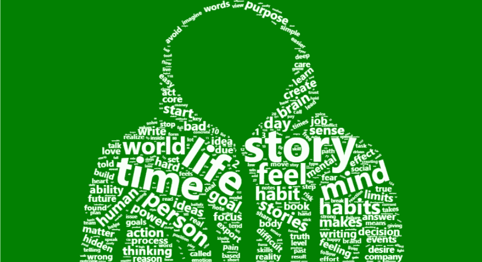
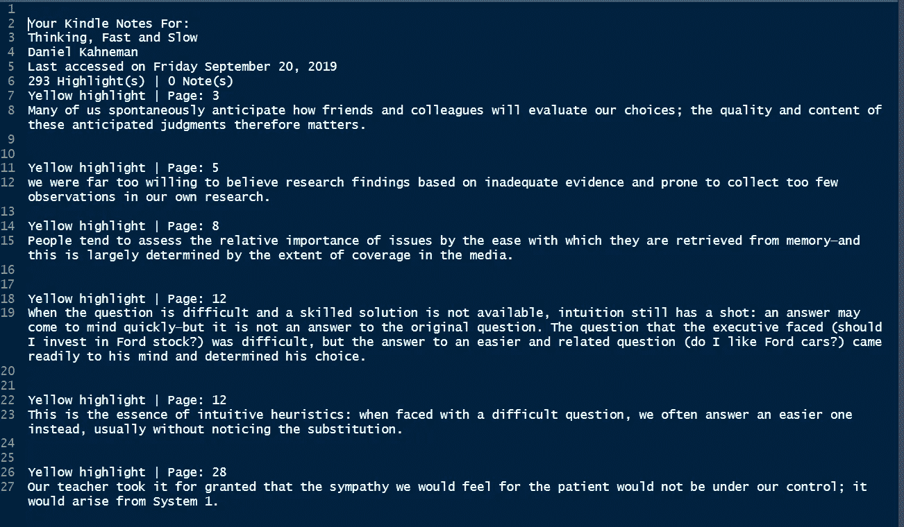
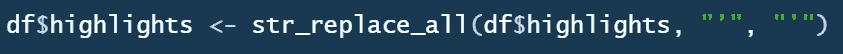
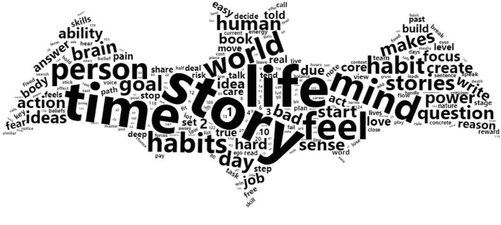
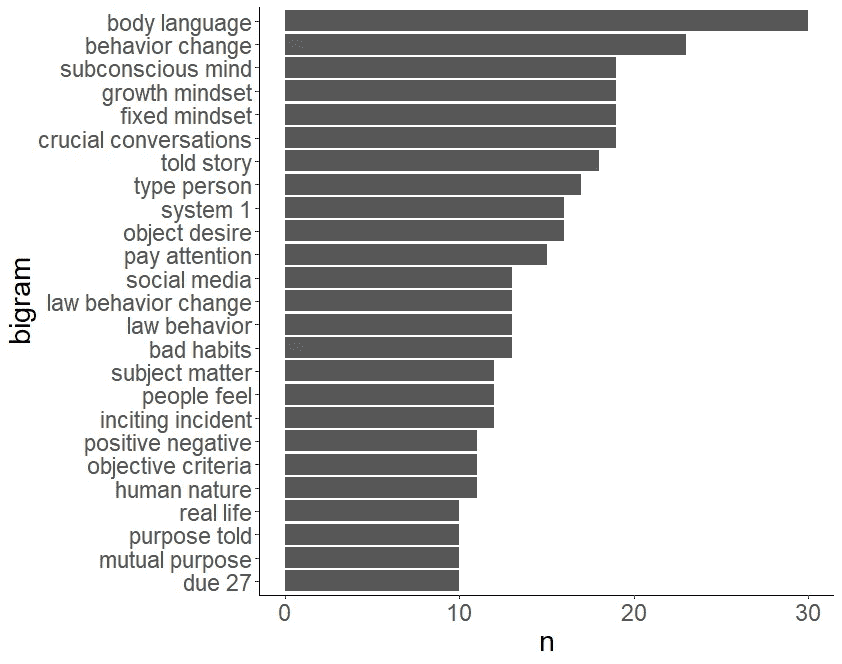
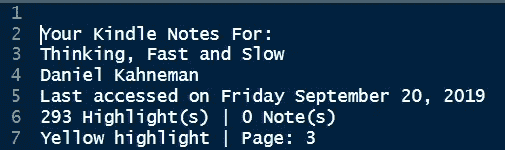
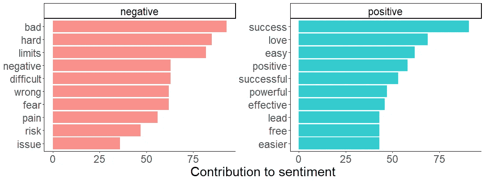
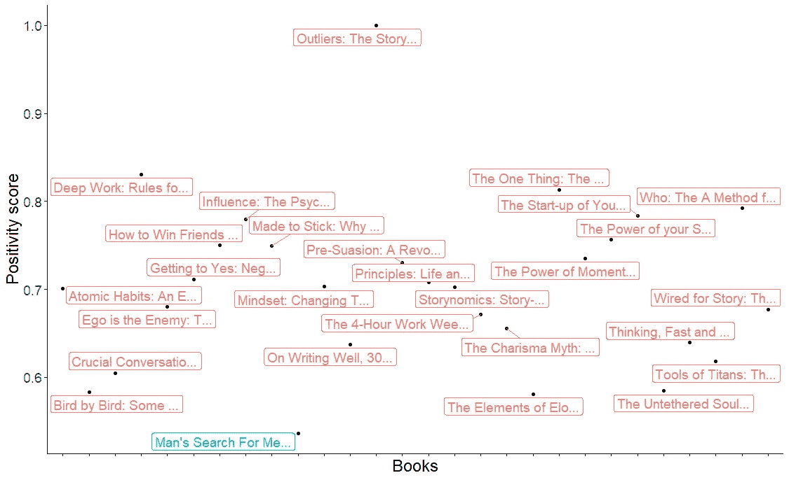

# 文本挖掘的意外副作用

> 原文：<https://towardsdatascience.com/an-accidental-side-effect-of-text-mining-4b43f8ee1273?source=collection_archive---------25----------------------->



## 文本挖掘真的有用吗？第一手测试。

> “我们探索的终点将是到达我们开始的地方，并第一次了解这个地方。”
> 
> —t·s·艾略特

我最近读了很多关于生产力和自我发展的书，经常会发现一些我想以后再读的建议。kindle 上的高亮选项使这变得非常容易。通过持续阅读和强调，我积累了大量的文本，这些文本很好地代表了我读过的书。

因为我对内容非常了解。我想对这些数据应用**文本挖掘**和**情感分析**，这样我就可以将结果与我对书籍的真实看法进行比较。如果它们匹配，我会更有信心将其应用于我的下一个业务问题。

在某种程度上，这也是一次自我探索，因为我可以回答一些问题，比如我更喜欢什么样的内容，他们的情感诉求是什么？

**让我们来寻找答案。**

客观的说，我会创造一个独立的角色，叫做“蝙蝠”。他的下一个任务是黑进我的数据并分析它，为卖给我更多的书收集见解。可惜读书不是他的特长。

他进来时，房间里乱七八糟。当他把 USB 驱动器插在笔记本电脑上时，他几乎听不到还开着的收音机。记者:

> 从我们一大早打开手机处理 Whatsapp 或脸书信息或推文形式的大量信息的那一刻起，直到我们在晚上睡觉时重写或阅读产品评论，我们在互联网上留下了面包屑给自己的个人口味。
> 
> 许多企业使用这种非结构化数据，通过有针对性的产品推荐进行更好的营销来推动销售，或者隔离他们的客户…

看到 28 本书 21000 行文字的数据，他咬紧牙关。他的第一次接触是卡罗尔·德韦克的书[“心态”](https://www.amazon.com/Mindset-Psychology-Carol-S-Dweck/dp/0345472322)，书中她介绍了 [**成长心态**的概念。背后的想法是，有成长心态的人相信他们的能力可以通过努力来提高，而有固定心态的人相信他们的能力在出生时就固定了。结果，有固定思维模式的人错过了在许多事情上做得更好的机会，尽管他们可以做到。很简单，因为他们一开始就不相信。](https://www.mindsetworks.com/science/)

如果你对这个概念不熟悉，这里有一段卡罗尔·德韦克的视频，解释她对成长心态的研究。

Carol Dweck explaining her research on growth mindset.

长长的文字让他疲惫不堪，他没有意识到时间是如何流逝的。现在，他是一个成长中的人。他决定学习文本挖掘。

他开始学习用于文本挖掘的 R 包，他不喜欢这个包的名字 [tidytext](https://www.tidytextmining.com/) ，但是他正在稍微失去他的偏见。这是一个漫长的夜晚。太阳慢慢升起时，他趴在桌子上睡着了。

它照亮了我的后花园，在那里我可以不时地瞥一眼被一夜⛄️.的雪涂成的树我不知道镇上的另一个地方发生了什么，我继续阅读，一边喝着红酒一边点着我的 kindle🍷。

我们稍后会知道我们的黑客发生了什么。首先，我们一起去翻翻他的笔记本。

**黑客笔记**

这是导出的 kindle highlights 的样子。



**读取并解析文本文件**

```
# Use readLines function to parse the text filehighlights <- readLines("Kindle_highlights_Serdar.Rmd", encoding = "UTF-8")# Create a dataframe where each row is a line from the textdf <- data.frame(highlights)# Packages
library(tidyverse)   
*# includes* ***ggplot2****,* ***dplyr****, tidyr, readr, purrr,* ***tibble****,* ***stringr****, forcats*library(tidytext)
library(wordcloud2)
```

每个数据科学项目都需要某种数据准备。**停用词**通常是语言中最常见的词，通常在处理文本数据之前被过滤掉。

让我们看看 tidytext 包中的 **stop_words** 数据集。因为这是一个很长的单词列表(> 1K) **我将打印每第五个单词作为例子。**

```
**data(stop_words)**# print every 50th word stop_words_small <- **stop_words[seq(1, nrow(stop_words), 50),]**stop_words_small %>% print(n=50)# A tibble: 23 x 2
   word       lexicon 
   <chr>      <chr>   
 1 a          SMART   
 2 at         SMART   
 3 contain    SMART   
 4 few        SMART   
 5 hers       SMART   
 6 last       SMART   
 7 nine       SMART   
 8 presumably SMART   
 9 some       SMART   
10 they'd     SMART   
11 very       SMART   
12 without    SMART   
13 what       snowball
14 they'll    snowball
15 during     snowball
16 again      onix    
17 but        onix    
18 finds      onix    
19 if         onix    
20 much       onix    
21 parted     onix    
22 since      onix    
23 under      onix
```

**仔细观察可以发现，停用词使用单引号，而在文本数据中使用撇号(')。**

```
e.g. **they'll** in stop_words
```

以及单词**他们将**如何出现在文本中:

> 黄色高亮| Page: 200
> 记忆随着我们从中获得的意义不断被修正，因此在未来**它们会**更加有用。

我们必须使停用词和我们的数据兼容，否则一些词如**他们会，不会，不能可能出现在我们的结果中。**

我们可以使用 stringr 包中的 **str_replace_all()** 函数，找出所有的撇号，转换成单引号。



现在，文本已经准备好进行频率分析了。文本挖掘项目中的单词称为**记号。**我们可以通过 tidytext 包中的 **unnest_tokens()** 函数将文本拆分成单个单词，过滤 **stop_words** 并计数。

```
df$highlights <- str_replace_all(df$highlights, "’", "'")df <- df %>% unnest_tokens(word, highlights) %>%
             anti_join(stop_words) %>% 
             filter(!word %in% c("highlights","highlight", "page", 
                      "location", "yellow", "pink", "orange", "blue"))
```

他还在这里添加了一些经常出现在 kindle highlights 输出中的额外单词。

Dplyr()包函数对于对数据框中的单词进行分组和计数非常有用。

```
**top_kindle_highlights** <- df %>% 
 group_by(word) %>% 
 count() %>% 
 arrange(desc(n))
```

他记下了他的第一个见解。**我的 kindle 最常用的 10 个单词。**

```
**people** 592   
**story**  340   
life   318   
time   309   
**mind **  213   
**change** 212   
feel   211   
world  171   
person 170   
**habits** 157 
```

如果你不喜欢看一长串单词**的话，单词云**和**T3 都是不错的选择。Wordcloud2 包为你的 Wordcloud 提供了额外的定制选项，例如你可以使用任何图像作为标记。**



上面的单词云代码是:

```
**wordcloud2**(top_kindle_highlights, figPath = bat, size = 1, backgroundColor = "white", color = color_vector(data$freq) )
```

一些想法开始出现在他的脑海里。他认为做出这些亮点的人是对讲故事、写作和良好的沟通感兴趣的人，是有良好习惯的人。想以积极的方式影响自己生活的人。**他对书籍越来越感兴趣。他想深入挖掘。**

**二元模型分析**

单词是书籍内容的一个很好的起点。**但是没有上下文，它们就受到限制。**还可以执行频率分析来测量单词对**(二元模型)**在文本中出现的频率。这使我们能够捕捉到文本中更细微的细节。

为此，他将上面隔离的未嵌套的单个标记组合回一个连续文本，然后执行二元语法分析。您可以使用 stringr 包中的 **str_c()** 函数来连接单个单词。

```
df_com <- **str_c**(df$word, “ “) 
df_com <- data.frame(df_com)
```

让我们将文本拆分成二元模型，并找出最常见的。

```
df_bigram <- df_com %>% 
 **unnest_tokens**(bigram, df_com, token = “ngrams”, 
 n = 3, n_min = 2)**top_bigrams** <- df_bigram %>% 
 group_by(bigram) %>% 
 count() %>% 
 arrange(desc(n))%>% 
 print(n=20)
```

并将它们可视化在图上

```
top <- top_bigrams[1:25,]

top %>% ungroup() %>% mutate(bigram = fct_reorder(bigram, n)) %>% 
 ggplot(aes(x=bigram, y=n)) + 
 geom_col() + 
 coord_flip() +
 theme_classic() + 
 theme(legend.position = “none”,
 text = element_text(size=18)) 
```



我发现最常见的二元模型之一是**行为变化。我们可以利用这些信息来理解我们之前的发现。例如，一个最常见的词是变化。我们从二元模型分析中看到,“改变”这个词主要用在行为改变的上下文中。**所以二元模型是获得关于文本内容的更深层次见解的有用工具。****

我突出显示的文本数据来自 28 本不同的书，通过查看整个文档中最常见的单词和二元模型，我们对它们有了一个概述。

为了了解每本书的不同之处，我们可以对每本书重复这一过程。

但是我们如何单独捕捉它们呢？

让我们先把课文再看一遍。



在每本书之前都会出现**“您的 Kindle 笔记:”**。让我们找出每本书的开头和结尾的行号，并使用这些索引来找出每本书。

我们将重用上面创建的数据帧 df。 **str_which()** 函数返回包含给定输入模式的行索引号。

在最后一步，一个 for 循环**捕获两个连续索引之间的文本**将给出它们之间的书。

```
**# Getting the index number for each book**indexes <- **str_which**(df$highlights, **pattern** = fixed(**"Your Kindle Notes For"**))
**book_names** <- df$highlights[indexes + 1]
**indexes** <-  c(indexes,nrow(df))**# Create an empty list** books <- list()**# Now the trick. Capture each 28 book separately in a list.** **for**(i in 1:(length(indexes)-1)) {
    books[[i]] <- data.frame(df$highlights[(indexes[i]:indexes[i+1]-1)])
    colnames(books[[i]]) <- "word_column"
    books[[i]]$word_column <- as.character(books[[i]]$word_column)
} 
```

让我们看看它是否有效，例如你可以在我们的列表中查找第五本书。

```
**head(books[[5]])** word_column
1                                                    
2                              Your Kindle Notes For:
3 Bird by Bird: Some Instructions on Writing and Life
4                                         Anne Lamott
5             Last accessed on Saturday July 27, 2019
6                         75 Highlight(s) | 4 Note(s)
```

现在，我们捕获了所有 28 本书，我们可以应用相同的过程，通过另一个 for 循环来分析它们。

```
top <- list()**for**(i in 1:28){
**books[[i]]** <- books[[i]] %>% **unnest_tokens**(word, word_column) %>%
             anti_join(stop_words) %>% 
             filter(!word %in% c("highlights","highlight", "page", 
                      "location", "yellow", "pink", "orange", "blue"))**# Find out the top words in each book and capture them in a list (top)** **top[[i]]** <- books[[i]] %>% 
              group_by(word) %>% 
              count() %>% 
              arrange(desc(n))}**for(i in 1:28)**{
  print(book_names[[i]])
  print(top[[i]])
}
```

这是上面代码输出的一部分。

```
## [1] "Crucial Conversations Tools for Talking When Stakes Are High, Second Edition"## # A tibble: 1,834 x 2
## # Groups:   word [1,834]
##    word          n
##    <chr>     <int>
##  1 people       84
##  2 dialogue     40
##  3 stories      40
##  4 due          34
##  5 export       33
##  6 feel         33
##  7 hidden       33
##  8 limits       33
##  9 truncated    33
## 10 crucial      31
## # ... with 1,824 more rows## [1] "Pre-Suasion: A Revolutionary Way to Influence and Persuade"## # A tibble: 526 x 2
## # Groups:   word [526]
##    word             n
##    <chr>        <int>
##  1 attention        6
##  2 influence        5
##  3 mental           5
##  4 trust            5
##  5 visitors         5
##  6 comfort          4
##  7 emotional        4
##  8 experience       4
##  9 message          4
## 10 associations     3
## # ... with 516 more rows## [1] "Made to Stick: Why some ideas take hold and others come unstuck"## # A tibble: 1,754 x 2
## # Groups:   word [1,754]
##    word          n
##    <chr>     <int>
##  1 people       64
##  2 knowledge    27
##  3 story        25
##  4 ideas        24
##  5 concrete     18
##  6 surprise     17
##  7 care         16
##  8 time         15
##  9 attention    14
## 10 core         14
```

现在，看看每本书中最常用的单词，我们可以更深入地了解它们是关于什么的。

同一本书的二元模型。

```
**## [1] "Crucial Conversations Tools for Talking When Stakes Are High, Second Edition"**## # A tibble: 8,774 x 2
## # Groups:   bigram [8,774]
##    bigram                    n
##    <chr>                 <int>
**##  1 due export               33
##  2 due export limits        33
##  3 export limits            33
##  4 hidden truncated         33
##  5 hidden truncated due     33
##  6 truncated due            33
##  7 truncated due export     33
##  8 crucial conversations    19
##  9 export limits 27         10
## 10 limits 27                10**
## # ... with 8,764 more rows**## [1] "Pre-Suasion: A Revolutionary Way to Influence and Persuade"**
## # A tibble: 1,265 x 2
## # Groups:   bigram [1,265]
##    bigram                      n
##    <chr>                   <int>
##  1 attention goal              2
##  2 concept audience            2
##  3 levels importance           2
##  4 mandel johnson              2
##  5 mental activity             2
##  6 social proof                2
##  7 thousand dollars            2
##  8 twenty thousand             2
##  9 twenty thousand dollars     2
## 10 writing session             2
## # ... with 1,255 more rows**## [1] "Made to Stick: Why some ideas take hold and others come unstuck"**## # A tibble: 6,376 x 2
## # Groups:   bigram [6,376]
##    bigram                      n
##    <chr>                   <int>
##  1 curse knowledge             7
##  2 guessing machines           6
##  3 people care                 6
##  4 goodyear tires              5
##  5 knowledge gaps              5
##  6 people's attention          5
##  7 popcorn popper              5
##  8 security goodyear           5
##  9 security goodyear tires     5
## 10 sinatra test                5
```

现在，你可能在第一本书里看到了奇怪的二元模型。Kindle 限制你可以高亮显示的文本长度，例如你不能高亮显示 5 页的文本。这可以防止人们突出显示整本书并导出到 word 文档。

因为我偶尔会高亮显示很长的文本，所以像“到期”、“导出”和“限制”这样的词会作为警告出现在我导出的高亮显示上。

现在，我将返回并通过将这些单词添加到 filter()函数中来进行更多的清理。

**一本书一本书地看着，他对我 kindle 里的书越来越着迷。他决定订购几个。**

*如果你想看这个捕捉过程的另一个例子，你可以在这里看看我最近的* [*帖子。*](https://dataatomic.com/r/data-wrangling-text-mining/)

我们可以使用**情感分析**来评估文本数据中的情感负荷。最常见的用途是社交媒体监控、客户体验管理和客户之声，以了解他们的感受。

> bing 词典以二进制方式将单词分为积极和消极两类。nrc 的词典使用了积极、消极、愤怒、期待、厌恶、恐惧、快乐、悲伤、惊讶和信任等类别。

**使用必应词典**

我列出了对每个情感类别贡献最大的单词。例如成功和有效对于积极情绪，不好和困难对于消极情绪。



下面是 R 是如何制作出上述情节的:

```
bing_word_counts <- df %>% inner_join(get_sentiments("bing")) %>% 
  count(word, sentiment, sort = TRUE) %>%
  ungroup()bing_word_counts# **Sentiment plot for top positive negative contributors**
# Select top 10 positive and negative wordsbing <- bing_word_counts %>% 
  group_by(sentiment) %>% 
  top_n(10) %>% 
  ggplot(aes(reorder(word, n), n, fill=sentiment)) + 
  geom_bar(alpha=0.8, stat="identity", show.legend = FALSE)+
  facet_wrap(~sentiment, scales = "free_y") +
  labs(y= "Contribution to sentiment", x = NULL) +
  coord_flip()bing
```

**使用 nrc lexion**

如果一篇文章是正面的而不是负面的，我更有可能突出它。还有信任、期待和喜悦，而不是悲伤或愤怒。

```
sentiment <- df %>%
        left_join(get_sentiments("nrc")) %>%
        filter(!is.na(sentiment)) %>%
        count(sentiment, sort = TRUE)
sentiment## # A tibble: 10 x 2
##    **sentiment        n**
##    <chr>        <int>
##  1 positive      8471
##  2 trust         4227
##  3 negative      3963
##  4 anticipation  3466
##  5 joy           2701
##  6 fear          2467
##  7 sadness       1853
##  8 anger         1814
##  9 surprise      1353
## 10 disgust       1102
```

**正常化情绪**

重要的是要补充一点，因为每种情感类别在一种语言中有不同数量的单词。字数少的情感类，在给定文本中出现的可能性更小。因此，**我想根据它们在词典中的出现频率对它们进行标准化，看看它与上面的结果有何不同。**

```
***# I will add numbers of each categories from the NRC lexicon***lexicon <- c(2317, 3338, 1234, 842, 1483, 691, 1250, 1195, 1060, 535)
polarity <-  c(1,1,1,1,1,0,0,0,0,0)
sentiment <- data.frame(sentiment, lexicon)
norm_sentiment <- sentiment %>% mutate( normalized = n/lexicon) %>% arrange(desc(normalized))
sentiment <- data.frame(norm_sentiment, polarity)
sentiment##       sentiment    n lexicon **normalized** polarity
## 1  anticipation 3466     842   4.116390        1
## 2      positive 8471    2317   3.656021        1
## 3          fear 2467     691   3.570188        1
## 4      negative 3963    1234   3.211507        1
## 5       disgust 1102     535   2.059813        1
## 6           joy 2701    1483   1.821308        0
## 7         anger 1814    1195   1.517992        0
## 8       sadness 1853    1250   1.482400        0
## 9      surprise 1353    1060   1.276415        0
## 10        trust 4227    3338   1.266327        0
```

现在，**期待**是文本中发现的最高情感。在我看来，这不是巧合。因为我们分析的大部分书籍都是关于生产力和自我发展的。生产力提示和工具通常包含与预期相关的词汇。

**同样，我可以看看个人对书籍的看法**

```
sentiment <- list()
**for** (i **in** 1:28){
sentiment[[i]] <- books[[i]] %>%
        left_join(get_sentiments("nrc")) %>%
        filter(!is.na(sentiment)) %>%
        count(sentiment, sort = TRUE)
        print(book_names[i])
        print(sentiment[[i]])
}
```

对个人书籍的看法。我在这里展示了其中的几个。

```
## [1] "Crucial Conversations Tools for Talking When Stakes Are High, Second Edition"## # A tibble: 10 x 2
##    sentiment        n
##    <chr>        <int>
##  1 positive       758
##  2 negative       496
##  3 trust          412
##  4 fear           282
##  5 anticipation   258
##  6 anger          243
##  7 joy            216
##  8 sadness        196
##  9 disgust        142
## 10 surprise       108## Joining, by = "word"## [1] "Pre-Suasion: A Revolutionary Way to Influence and Persuade"
## # A tibble: 10 x 2
##    sentiment        n
##    <chr>        <int>
##  1 positive        84
##  2 trust           51
##  3 negative        31
##  4 anticipation    27
##  5 fear            24
##  6 joy             22
##  7 anger           14
##  8 sadness         12
##  9 surprise         9
## 10 disgust          3## Joining, by = "word"## [1] "Made to Stick: Why some ideas take hold and others come unstuck"
## # A tibble: 10 x 2
##    sentiment        n
##    <chr>        <int>
##  1 positive       499
##  2 trust          236
##  3 anticipation   198
##  4 negative       167
##  5 joy            156
##  6 fear           123
##  7 surprise       107
##  8 sadness         74
##  9 anger           65
## 10 disgust         60
```

为了有一个概述，你可以通过绘制每本书的阳性率来总结数据。



我们来看看积极性得分最低的那本书。[**男人的寻找意义**](https://www.amazon.com/Mans-Search-Meaning-Viktor-Frankl/dp/080701429X) **。这本书是根据维克多·弗兰克在第二次世界大战期间的遭遇写成的。这也是意料之中的。**

> 我越来越感受到文本挖掘的力量。

《局外人》这本书出现在积极性图的顶部，是一个真正的局外人。😮

从头开始了解一切是很难的，我们将回去做一些额外的清理。《局外人》一书的字数是 107 个。**这个真的很低。因此在下一次迭代中，我将从分析中删除它，因为它不可靠。**

```
book_names[[27]]**## [1] "Outliers: The Story of Success"**top[[27]]# A tibble: 107 x 2
# Groups:   **word [107]**
word             n
<chr>        <int>
1 ability          3
2 knowing          3
3 sense            3
4 communicate      2
5 distance         2
6 family           2
7 intelligence     2
8 power            2
9 practical        2
10 sternberg        2
# ... with 97 more rows
```

以下是我用来绘制积极性得分的代码:

```
books <- **str_trunc**(book_names, width=22) # Shorten the book namesall <- list()for (i in 1:28) {
all[[i]] <- sentiment[[i]] %>% 
  filter(sentiment %in% c('positive','negative')) %>% 
  mutate(n2 = n/sum(n)) %>% 
  print()
}all_bound <- do.call("rbind", all) %>% filter(sentiment == "positive")**library(ggrepel) # Useful for preventing overlapping labels**all_bound %>% ggplot(aes(x= book_names, y=n2)) + 
              geom_point() + 
              **geom_label_repel**(aes(label=books, color = ifelse(n2 <0.55, "red", "blue")), size = 4) + 
              theme_classic() + 
              theme(legend.position = "none",
                    text = element_text(size=18), 
                    axis.text.x = element_blank()) + 
              xlab("Books") + 
              ylab("Positivity score")
```

# 摘要

阅读数百万页来检查文本挖掘是否可靠是不可行的。但在这里，我得到了一些我知道内容的数据，并应用了文本挖掘和情感分析。

字母组合或字母组合都表明了这些书的相似之处。这种情绪和我 kindle 里的书的类型有关系。

让我们回到我们的黑客。

文本挖掘的一个意想不到的副作用永远改变了他。分析我的书并从中获得真知灼见使他对阅读越来越感兴趣。他开始关心他周围的世界。世界变了。

我为自己做的事，他也为自己做了。他变成了一个更好的自己。

世界变得更加明亮。☀️

收音机打破了寂静。

> “brrring…..br 正在…..br 正在……”

我醒了。

感谢您的阅读。你可以在我的 [github repo 中找到数据和代码。](https://github.com/korur/textmining)

希望你从中有所收获或者有所启发。请随时留下评论、建议和问题。(你可以通过电子邮件联系我，地址是 serdar.korur@gmail.com)

下次见！

塞尔达尔