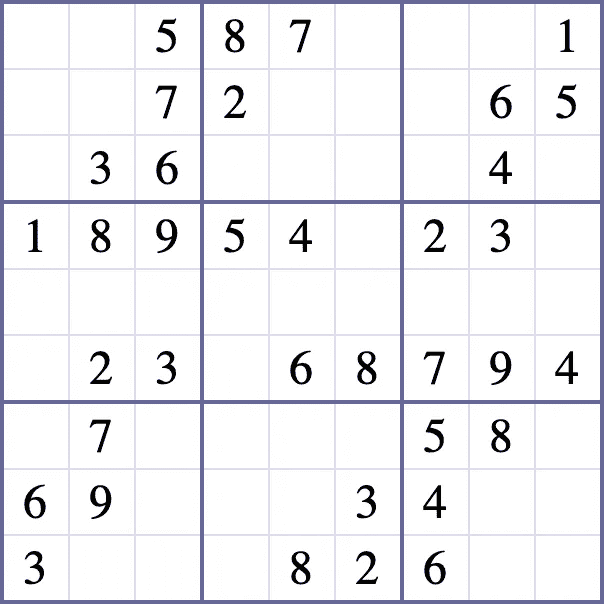
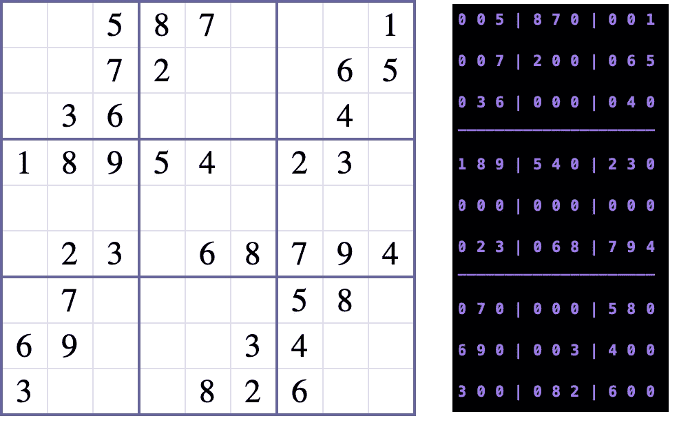
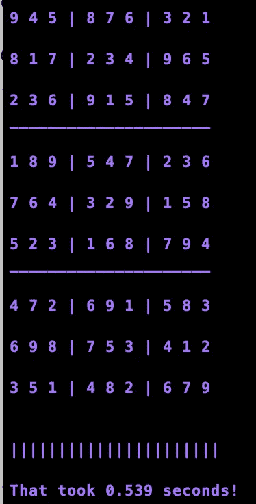

# MNIST 数字分类器的实际应用

> 原文：<https://towardsdatascience.com/an-actual-application-for-the-mnist-digits-classifier-bbd76548bf2f?source=collection_archive---------18----------------------->

## 解决数独谜题的速度比宣传的还要快

你有没有想过“我刚刚做了一个很棒的 MNIST 分类器！现在怎么办？”。虽然手写数字数据集是进入机器学习的一种伟大、干净的方式(至少在分类方面)，但它被正确地称为该领域的“Hello World”。你可以用它来创建一个合理的 ML 管道，并学习如何实现不同类型的模型，但是它没有太多的用处，直到现在。我在这里的第一篇帖子之一使用了一些基本的 python 数据结构和逻辑来解决关于[的数独难题，速度是眨眼的两倍](https://www.quora.com/How-long-does-one-take-to-blink)，但是我必须手动将数字输入数组来准备求解器。在这篇文章中，我想了解如何使用一些图像处理工具和卷积神经网络来实现光学字符识别(OCR)。

有很棒的 OCR 工具可以免费获得，比如[谷歌的 Tesseract](https://opensource.google.com/projects/tesseract) ，我在[我的强化学习系列](/creating-ai-for-gameboy-part-2-collecting-data-from-the-screen-ccd7381a1a33)中用了很多，但是 Tesseract 在识别数字/数位方面表现不佳。如果我想将数独谜题读入 Python 界面，我需要一个专门进行数字识别的 OCR 工具。我突然意识到，在手写数字上训练的神经网络可能会检测到键入数字中固有的相同模式，所以只要图像预处理得当，我就能够使用每个人都喜欢的深度学习入门将数字图像转换为实际数字！和往常一样，我将浏览的代码将在我的 Github 上。

An example image of an ‘Easy’ puzzle

这个应用程序背后的前提是，我已经编写了一个程序，可以在不做任何缓慢、计算量大的猜测和检查工作的情况下解决数独难题，但必须手动输入难题。在一个完美的世界中，我可以对我的难题进行截图或拍照，运行我的应用程序，然后让问题得到解决。左边是我希望能够解析并从方块中提取数字的图像，下面是我用来将这个复合拼图转换成 9x9 图片数组的代码:

现在我有了一个 9x9 的图像数组，其中只包含数字，是时候创建 OCR 工具将这些图像转换成数值了。正如我之前提到的，我选择拿出这方面的大枪——在 digits 数据集上训练一个卷积神经网络，作为我将这些图像分类为数字的工具。下面你可以看到使用 [Tensorflow 2.0](https://www.tensorflow.org/beta) 的 Keras 实现来构建、训练和使用神经网络是多么容易——我们所要做的就是实例化模型、添加层、编译和训练:

现在我已经有了一个经过训练的模型，是时候在我的应用程序中实际实现它的使用了！我想遵循的逻辑是:如果图像中有一个数字，我想使用我的模型来预测图像中的数字，否则就没有数字，所以我可以使用零作为空正方形的占位符。使用整个图像的平均像素值，我可以判断图片中是否有数字:有数字的图像平均“亮度”约为 15，而没有数字的图像通常“亮度”约为 2。下面的代码片段显示了如何为一个难题创建一个模板，然后使用上面新训练的神经网络填充它:

现在，我已经在矩阵中填入了与拼图匹配的值，如图片和控制台输出并排显示的那样:

The code above turns the left image into the right!

现在图像处理已经完成，我已经有了需要编程解决的格式的拼图，我可以运行[这个脚本](https://github.com/aaronfrederick/SudokuSolver/blob/master/load_and_solve.py)调用数独拼图的任何图像，在不到一秒的时间内解决！

The final output and time

半秒钟——数独竞速者面临的新挑战！随着 Kaggle 成为公共机器学习挑战的主要来源之一，似乎机器学习往往只是为了机器学习而进行的。我希望您喜欢这个使用深度学习作为解决实际问题(或者可以说是难题)的一个小应用程序！