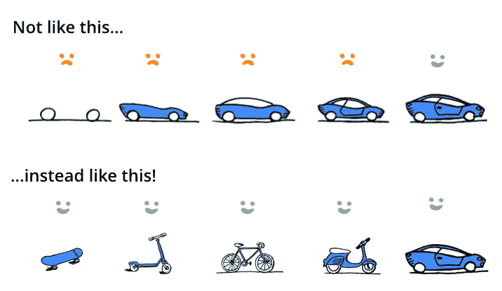
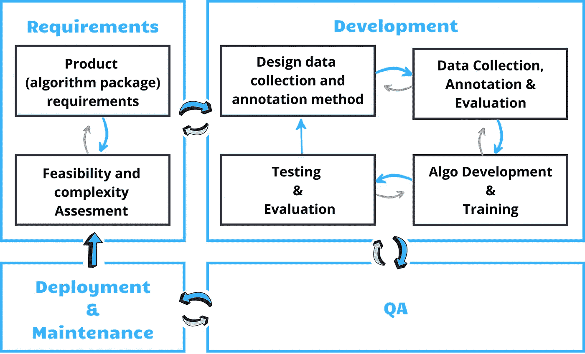
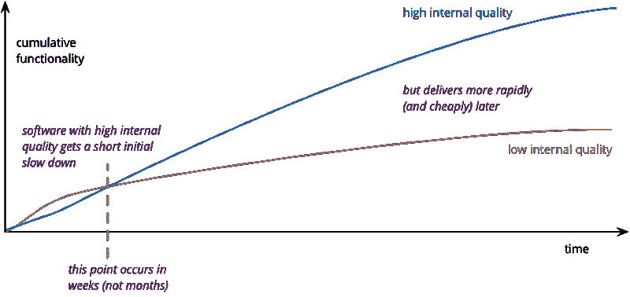

# 人工智能项目的敏捷框架

> 原文：<https://towardsdatascience.com/an-agile-framework-for-ai-projects-6b5a1bb41ce4?source=collection_archive---------15----------------------->

多年来，软件开发社区已经达成了广泛的共识，即软件应该以**迭代生命周期**来开发。像 Scrum(敏捷)和精益这样的主流方法论支持这个概念。迭代生命周期的本质:

> 在您发布一个版本之后，项目并没有完成——因为只有到那时，您才能从现实世界的交互中收到用户反馈，这使您能够为下一次迭代细化目标。因此——你应该努力执行非常短的迭代，专注于理解用户想要什么。

在达成这个共识之前，许多软件工程团队曾经犯过错误，例如:

1.  几个月来实现一个系统，并且惊讶地发现用户没有发现许多有用的特性——需求没有被很好地定义。
2.  大大超出了系统所需的可伸缩性。

今天许多人工智能团队都有类似的困难。**人工智能并没有改变打造符合市场需求的优秀产品的本质。**然而，人工智能确实有细微差别和复杂性，这使得应用现有的方法很困难。目前的博文是系列博文的第一篇。这些帖子的目标是提出一个**迭代生命周期框架，该框架适用于以人工智能为中心的软件**。当前的帖子将关注这个框架的动机，提供一个概述，并为很好地执行它打下基础。

# 为什么要迭代生命周期？

对于创新产品来说，预见正确的产品需求(以及相应的算法需求)是非常困难的。因此，通常的做法是**尽快将产品送到用户手中**，并根据用户反馈和分析决定下一步。从而将开发工作集中在给用户带来最大价值的东西上。它最大限度地降低了风险，包括在人工智能的情况下，在建立错误的模型、优化错误的指标或超过任何指标的要求成就方面投入大量精力的风险。

Credit: [https://twitter.com/karenlindemann/status/525701601944932352](https://twitter.com/karenlindemann/status/525701601944932352)

使用下图中描述的框架，迭代开发流程可适用于人工智能开发。在这篇文章和接下来的文章中，我将详细阐述构成生命周期的以下每个模块，以及我推荐在每个模块中应用的标准。

# 标准对于人工智能迭代的重要性。

随着项目的成长和成熟，迭代工作会变得越来越具有挑战性。迭代意味着周期之间的暂停。以低标准构建的项目也将是在暂停几个月获取客户反馈后很难恢复工作的项目。

因此，高且**清晰的标准**(例如软件工程标准)**、方法和过程**(例如实验管理系统、数据收集和模型开发过程)**促进了敏捷性**。这些显著地减少了迭代时间(通过减少您在开始每个新的迭代之前需要支付的“技术债务”)。

在大多数情况下，随着产品变得更加成熟——采用和实现开发过程、软件工程等的标准。—变得越来越重要。

Google [的研究和工程总监 Peter Norvig 教授向](https://www.linkedin.com/feed/update/urn:li:activity:6499801583226888192/)推荐了下面的[博客文章](https://medium.com/thelaunchpad/the-ml-surprise-f54706361a6c)，该文章阐述了**“机器学习惊喜”的概念，如下**:

> *“由于 ML 算法和优化在文献和媒体中谈论得更多，所以人们通常会认为它们在实际实现过程中发挥的作用比实际大。* *…优化一个 ML 算法相对来说花费的精力要少得多，但是收集数据、构建基础设施和集成* ***每一项都要花费更多的工作*** *。* ***期望与现实的差异是深刻的*** *”。*

算法项目的领导者应该理解*机器学习的惊喜*——为了在多次迭代中优化算法的性能——正确定义需求并执行这些需求是不够的。如果标准、过程和内部质量不是核心工作，那么随着项目的进展，执行需求会变得非常困难。

正如 Martin Fowler 在他最近的博客文章中明确指出的那样:“[高质量的软件值这个价吗？](https://martinfowler.com/articles/is-quality-worth-cost.html)”:

> 内部质量的基本作用是降低未来变革的成本。但是编写好的软件需要一些额外的努力，这在短期内会增加一些成本
> 
> 这就是内在质量差的后果。起初进展很快，但随着时间的推移，添加新功能变得越来越难。即使很小的变化也需要程序员理解大部分代码，这些代码很难理解。当他们进行更改时，会发生意外的中断，导致长时间的测试和需要修复的缺陷。"

Credit: “[Is High Quality Software Worth the Cost?](https://martinfowler.com/articles/is-quality-worth-cost.html)”

**当我们前进到项目的更高级迭代时，迭代时间和“迭代之间的时间”可能会由于项目的复杂性(也称为技术债务)而成倍增长**——如果“内部质量”不是中心工作的话。

引用的博文主要关注“内在质量”的软件工程方面。

**“内部质量”的相同概念和重要性适用于机器学习项目的许多其他方面**。例如:

1.  对于机器学习团队来说，不记录用于实现在先前迭代中部署的结果的确切数据(或数据准备代码)是非常常见的。
2.  不记录用于训练部署到生产中的模型的确切代码\超参数是很常见的。
3.  甚至软件工程标准——对机器学习项目的重要性不亚于“传统软件”。机器学习项目通常包含大量的重复代码、硬编码值、死标志等。它们被放在那里是为了优化完成当前研究迭代所需的时间(这在许多情况下可能是一种有效的方法)，但是人们没有支付债务就继续下一个研究任务。

这些低内部质量的例子(以及更多的例子)显著地加速了当前迭代执行的时间。然而——项目在下一次迭代中明显变慢，其中**以前开发的模型直到**才能改进

1.  重新发明数据准备方法(例 1)，或-
2.  数周的工作致力于从数据中重新发现用于生成模型的超参数(示例 2)，或者-
3.  两个星期的工作毫无结果，只是发现硬编码的值使一切都失败了(例 3)。

当以实现算法的需求为目标时——一个人必须正确地定义需求，并且**理解项目不仅仅是当前的迭代**——并且**在考虑长期目标时考虑优先级**。

在下面的帖子中，我们将讨论人工智能项目框架的 4 个阶段:[需求](/an-agile-framework-for-ai-projects-requirements-2d40d6a4fd4c?source=friends_link&sk=7c805106528ac05041e87bec2595c12c)，[开发，QA 和部署&维护](https://medium.com/@jennyabramov/an-agile-framework-for-ai-projects-development-cbe115ba86a2?source=friends_link&sk=b5f0a9a008ac37d3f42d988444df46b9)。我将很高兴听到你的想法和经验。

这个帖子系列是与 [Idan Bassuk](https://medium.com/u/1c7ec28c4b50?source=post_page-----6b5a1bb41ce4--------------------------------) 合著的。