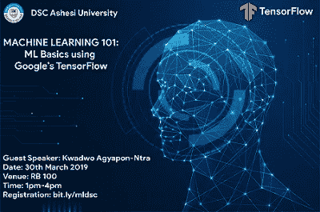
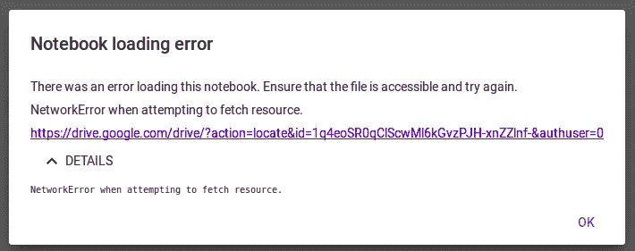

# 人工智能的故事——第三部分

> 原文：<https://towardsdatascience.com/an-ai-story-part-3-python-notebooks-in-the-cloud-f7d4d62af1ae?source=collection_archive---------13----------------------->

## 云中的 Python 笔记本

## 阿什西 DSC

从二月到三月的六周时间里，我几乎全职从事 React JS 项目。我和两个很棒的兄弟(Yannick 和 Osborne，见下图)一起在 MEST 大学(T1)工作，开发一个产品，帮助展现加纳高中教育系统的精华。现在告诉你细节还为时过早，但我们的推销进行得很顺利。这里有几张图片:

当然，这个项目占用了我相当多的数据科学和人工智能时间…真令人失望。我的[最后一个故事](https://medium.com/@kayo_gh/an-ai-story-part-2-google-devfest-tensorflow-and-tony-db5189e967d5)是在 2018 年。

在项目即将结束时，我收到了 Ashesi 大学开发者学生俱乐部(Ashesi DSC)的邀请，要我使用 TensorFlow 主持一个机器学习研讨会。我直接跳了进去。我爱阿什西！

我们在 2019 年 3 月 30 日星期六举办了研讨会。

Ashesi DSC 负责人 Wayne 和 Hannah 很好地记录了我们在研讨会上的活动，包括内容和图片。他们的博客帖子包含了我们周六所做事情的详细概要和解释。

你可以在这里找到。它还包含到我的幻灯片和实时代码的链接。

现在，我们今天的主题是:

## 云中的 Python 笔记本

在研讨会期间，我们使用 Google co laboratory——简称 Google Colab——来运行我们的代码。我一会儿会解释为什么它这么棒，以及需要注意什么，但首先，让我们谈谈 Python 笔记本。

当我第一次发现 Jupyter 笔记本电脑(每个数据科学家最喜欢的环境)时，我欣喜若狂。代码和文本和谐相处……我想事情不会再好了。伙计，我错了。

## 免费 GPU！

使用免费的图形和张量处理单元(分别是 GPU 和 TPU)可以缩短训练时间，这是我第一次使用谷歌 Colab 的原因，这是谷歌基于云的 Python 笔记本环境。

GPU 和 TPU 的，基于他们的架构，真的可以加速机器学习模型的训练。CPU 会用一个小时，GPU 可能用几分钟；CPU 会用几天(说真的，人们已经训练了几天的模型)，GPU 可能会用几个小时。但是，当你有一台像我这样的笔记本电脑，没有希望连接 GPU 时，Colab 是一个天赐之物。

一个额外的优势是，对于初学者来说，该平台预装了大量的数据科学和机器学习工具和库，如 TensorFlow、PyTorch、NumPy、Matplotlib 等。你所需要做的就是导入你最喜欢的库并编写你的代码。Colab 笔记本还可以直接保存到你的 Google Drive 上，让分享变得极其容易。

好处非常明显。如果你还不熟悉，这里有一个 [Colab 教程](/getting-started-with-google-colab-f2fff97f594c)可以帮助你开始。

然而，就像所有人类创造的东西一样，Colab 也有它不顺利的时候。

## Google Colab 陷阱

想象一下，你要给 Ashesi DSC 做一个演讲，那天早上你决定在云中检查你的演示项目，却看到了这个:

嗯，我差点就发作了。

我换了浏览器，隐姓埋名，换了网络资源。什么都没用。在很大程度上，这看起来像是一个互联网问题，尽管我所有的其他互联网应用程序都在工作，我可以访问我的谷歌驱动器。

这让我们注意到两个主要陷阱:

1.  如果你的网络连接很差，Colab 会让你很沮丧。这很简单，非洲的许多开发人员很早就接受了这一点…稳定的互联网连接非常重要。
2.  这是谷歌技术:很好，但并不完美。有时，Colab 会出问题，特别是因为它是一个相当新的谷歌产品。当这种情况发生时，你很可能无能为力。

于是 Colab 就胡作非为了，几个小时后我就有了工作坊。我不得不随机应变。我可以使用我的 CPU 并在本地运行，但那会很慢。我需要一个选择，我找到了。

## Kaggle 内核

Kaggle.com 是一个流行的数据科学和机器学习竞赛平台。在任何给定的时间点，网站上都有大约 20 个活跃的数据科学或机器学习问题，获胜者可以获得现金奖励。

然而，Kaggle 不仅仅是一个竞争平台，它还是学习、海量数据集和称为内核的实时 Python 笔记本的中心。

Kaggle 内核与 Colab 笔记本非常相似，除了 TPU 可用性和 Google Drive 集成。但是我们还有免费的 GPU！此外，即使在那个看起来很差的网络上，我也能够重新上传我的演示项目，并以免费 GPU 的速度在 Kaggle 上运行它们。

## 其他选择

我的困惑促使我向数据科学社区寻求帮助。我在一个来自 Omar 的 PyData 加纳 WhatsApp 群中找到了一个链接，它向我展示了 Kaggle 内核和 Google Colab 的更多替代品:像 [Binder](https://mybinder.org/) 、 [Azure Notebooks](https://notebooks.azure.com/) 、 [CoCalc](https://cocalc.com/) 和 [Datalore](https://datalore.io/) 这样的平台。

要全面比较这些平台，请点击[此链接](https://www.dataschool.io/cloud-services-for-jupyter-notebook/)。

## 结论

我们处在数据时代，最能驾驭数据的人几乎总是赢家。如果你认为完成这项工作的技术远远超出了你的能力，我刚刚已经向你展示了它不是，所以再想想。

如果一个平台失败了，至少还有五个平台可以尝试，如果都失败了，我们还有很好的 ol' Jupyter 笔记本可以安装在本地。我希望这能帮助一些人摆脱困境。

编码快乐！

击倒

*原载于* [*KayO 的博客*](http://blog.kantra.xyz/index.php/2019/04/03/an-ai-story-part-3-python-notebooks-in-the-cloud/) *。*