# 批处理规范化的替代方法

> 原文：<https://towardsdatascience.com/an-alternative-to-batch-normalization-2cee9051e8bc?source=collection_archive---------6----------------------->

Image from Experfy

**批处理规范化(BN)** 作为一种规范化技术的发展是深度学习模型发展的转折点，它使各种网络能够训练和收敛。

尽管 BN 取得了巨大的成功，但它也表现出了一些缺点，这些缺点是由它沿批维度归一化的独特行为引起的。BN 的一个主要缺点是它需要足够大的批量来产生好的结果 *(for-eg 32，64)。*这个禁止人们探索更高容量的模型，这将受到记忆的限制。为了解决这个问题**脸书人工智能研究所【FAIR】**开发了一种新的归一化技术**【GN】**。

> 在本文中，我们将主要关注**组标准化(GN)** 以及它如何作为**批标准化(BN)** 和其他标准化变体(**层标准化(LN)、实例标准化(IN)** )的替代方案。

# 群体规范化

**组归一化(GN)** [论文](https://arxiv.org/pdf/1803.08494.pdf)提出 GN 作为将通道分成组并归一化每个组内的特征的层。GN 与批量大小无关，它不像 BN 那样利用批量维度。GN 在很大的批量范围内保持稳定。

> 在本文的后半部分，你会更深刻地理解这几行字想表达的意思。所以抓紧了！！

# 组规范化和其他规范化变体

> 在本节中，我们将首先描述特征规范化的一般公式，然后在此公式中表示组规范化和其他变体。

**(1)通式**

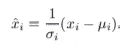

Equation-1

这里 *x* 是由层计算的特征，而 *i* 是索引。对于一幅 *2d* 图像， *i* = *(i_N，i_C，i_H，i_W)* 是一个 *4d* 向量，其形式为 *(N，C，H，W)* ，其中 *N* 是批次大小， *C* 是通道数， *H* 和 *W 这里和σ是平均值和标准差，计算公式如下:*

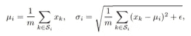

Equation-2

这里和σ是在由 *S_i.* **定义的一组像素上计算的。所有这些归一化变量彼此不同，仅基于如何为它们中的每一个定义*S _ I***。变量 *m* 和*ε*分别定义集合的大小和一个小常数*(for-eg 0.00001)**。添加ε*是为了确保我们在计算 *x_i* 时不会被零除，但它也可以略微增加每批的方差。

**(2)分组规范化和其他变量的制定**

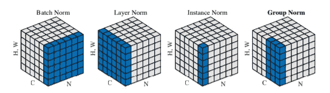

**Normalization Variants**. Image from [Group Normalization paper](https://arxiv.org/pdf/1803.08494.pdf)

> 在上面的图像中，每个子图显示一个特征图张量，其中 N 为批次轴，C 为通道轴，而(H，W)为空间轴。蓝色像素使用相同的平均值和方差进行归一化，通过聚合这些像素的值来计算。

*   在**批定额**、**、**套 *S_i* 被**、**定义为:

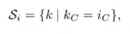

Condition-1

其中 *i_C* (和 *k_C* )表示 I(和 k)沿 *C* 轴的分指数。这意味着共享相同通道索引的像素被一起归一化。这里和σ沿 *(N，H，W)* 轴计算。

*   在**图层规范**中，集合 *S_i* 定义为:

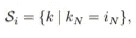

Condition-2

其中 *i_N* (和 *k_N* )表示 I(和 k)沿 N 轴的子索引。这意味着共享相同批索引的像素被一起归一化。这里和σ是沿着 *(C，H，W)* 轴计算的。

*   在**实例规范**中，集合 S_i 定义为:

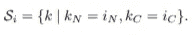

Condition-3

对于每个样本和每个通道，沿着 *(H，W)* 轴计算这里的和σ。

*   在**组规范**中，集合 S_i 定义为:

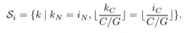

Condition-4

这里 *G* 是组数，是预定义的超参数*(默认 G = 32)*。 *C/G* 是每组的通道数。看起来像支架的东西是地板操作。GN 沿着 *(H，W)* 轴和一组 *C/G* 通道计算和σ。For-eg 如果 ***G = 2*** 和 ***通道数= 6*** 在*规格化变体图像(最右边)*中会有 ***2 组*** ，每组有***3 个通道*** *(C/G*

此时，我们有一个标准化的值，表示为 *x_i.* ，但是我们没有直接使用它，而是将它乘以一个 ***伽马*** 值，然后加上一个 ***贝塔*** 值。 *gamma* 和 *beta* 都是网络和服务的可学习参数，分别用于缩放和移动归一化值。因为它们就像权重一样是可以学习的，所以它们给了你的网络一些额外的旋钮来在训练中调整，以帮助它学习它试图逼近的函数。

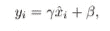

Equation-3

现在，我们有了层的最终批量标准化输出，然后我们将它传递给一个非线性激活函数，如 sigmoid、tanh、ReLU、Leaky ReLU 等。

# 履行

到目前为止，我们已经讨论了组规范化以及它与其他规范化变体的不同之处。现在，是时候讨论实现细节了。在 Pytorch 和 Tensorflow 中，用几行代码就可以轻松实现 GN。所以，让我们开始吧…

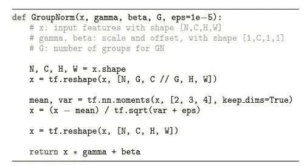

Python code on Group Norm based on Tensorflow. Image from [Group Normalization paper](https://arxiv.org/pdf/1803.08494.pdf).

**解释**

*   这里的 *x* 是形状为 *(N，C，H，W)* 的输入特征。Gamma 和 beta:比例和形状偏移 *(1，C，1，1)* 和 *G* 是 GN 的组数。
*   对于每一批，我们以*【N，G，C//G，H，W】**(其中 C//G 是整数除法，定义了每组的通道数)*的形式对特征向量 *x* 进行整形
*   *tf.nn.moments* 帮助计算每个批次沿轴*【C//G，H，W】的平均值和方差。*如果 *Keep_dims* 为 *true* ，则表示保留其长度为 1 的缩减尺寸。
*   在归一化特征向量 *x(基于等式-1 的图像中的公式)*之后，它被整形为其初始形状*【N，C，H，W】。*
*   此时，归一化值被表示为 *x.* ，但是我们没有直接使用它，而是将它乘以一个 *gamma* 值，然后加上一个 *beta* 值*(shape(1，C，1，1))* ，并返回最终向量。

如果你对组规范化的 Pytorch 实现感兴趣，可以在这里找到[。](https://github.com/vjrahil/pytorch-groupnorm)

**注意:**通过对代码做一些小的调整，GN 实现可以转换成 LN 或 in。

*   在层标准化(LN)的情况下，设置组数(G) = 1。
*   在实例规范化(In)的情况下，设置组数(G) =通道数(C)。

# 比较结果

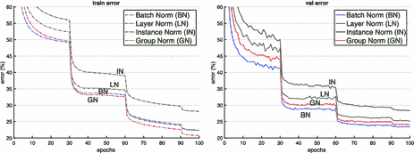

Comparison of error curves. Image from [Group Normalization paper](https://arxiv.org/pdf/1803.08494.pdf)

> 以下结果是通过在 ImageNet 训练集上以 32 个**图像/GPU** 的批量训练 ResNet-50 模型获得的。左图是 ImageNet 训练错误，右图是 ImageNet 验证错误。默认情况下，GN 的 g 为 32。

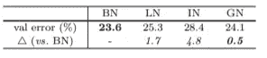

Comparison of error rates. Image from [Group Normalization paper](https://arxiv.org/pdf/1803.08494.pdf)

从上图我们可以推断出 BN 是最好的。第二好的归一化技术是 GN，其退化为 *0.5%。*

现在，让我们尝试在不同的批处理大小上训练 ImageNet 训练集。保持所有其他超参数不变，看看我们得到了什么。

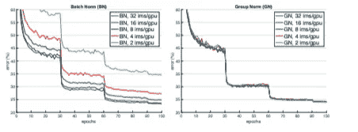

Sensitivity to batch size.Range of batch size = [32,16,8,4,2]. Image from [Group Normalization paper](https://arxiv.org/pdf/1803.08494.pdf)

> 左图显示了在 ImageNet 训练中对批量大小的敏感度，右图显示了在 ImageNet 验证错误中对批量大小的敏感度。默认情况下，GN 的 g 为 32。

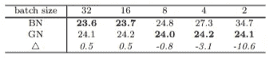

Sensitivity to batch size error comparison. Image from [Group Normalization paper](https://arxiv.org/pdf/1803.08494.pdf)

从上图中，我们可以推断出，随着批量的减少，BN 的性能急剧下降。然而，GN 在很大的批量范围内保持稳定。因此，在您将处理小批量图像的地方，例如， **Fast/er** 和 **Mask R-CNN** 框架，由于高分辨率，您将使用 1 或 2 个图像的批量大小，BN 将是无用的。因此，相反，我们可以在这样的框架中使用组归一化(GN)作为批量归一化(BN)的替代，在大批量时给出与 BN 相当的结果。

> 如果你想比较其他数据集的结果，你可以查看原始的[论文](https://arxiv.org/pdf/1803.08494.pdf)以获得更多信息。

# 结论

*   GN 是一个有效的标准化层，不需要利用批次维度。
*   GN 与 LN 和 IN 相关，这两种归一化方法在训练**递归(RNN/LSTM)** 或**生成(GAN)模型时特别成功。**
*   GN 在检测、分割和视频分类方面的改进表明，在这些任务中，GN 是强大的且目前占主导地位的 BN 技术的强有力替代。

本文推导的所有结果都是基于[群归一化](https://arxiv.org/pdf/1803.08494.pdf)的原始论文。