# 亚马逊森林火灾分析

> 原文：<https://towardsdatascience.com/an-analysis-of-amazonian-forest-fires-8facca63ba69?source=collection_archive---------0----------------------->

## 雨林中的野火是如何开始的？

2019 年是亚马逊盆地十多年来最严重的火灾。在环境问题变得越来越政治化的时代，亚马逊野火已经成为一个具有煽动性的话题，在国际舞台上引起了广泛关注。外国势力和环保机构的密集媒体报道和公开谴责只能说是火上浇油。

但是为什么会发生这些火灾呢？主要原因是什么，比往年差多少？一场森林大火是如何在雨林中开始的？

在这篇文章中，我们将讨论亚马逊雨林的环境和地缘政治背景，然后分析前几年的森林火灾数据，以及已发表的关于 2019 年森林火灾及其未来影响的研究的新信息。

A forest fire in Altamira, in Brazil’s Pará state. President Jair Bolsonaro has rejected help from G-7 members.

在我们讨论火灾之前，有必要了解一下亚马逊的环境和政治背景以及它与火灾的关系。

# 环境

亚马逊生物群落占地约 670 万平方公里，是印度面积的两倍。该盆地为八个国家(巴西、玻利维亚、秘鲁、厄瓜多尔、哥伦比亚、委内瑞拉、圭亚那和苏里南)以及海外领地法属圭亚那所共有。大约 60%的亚马逊盆地位于巴西境内，因此巴西的政治局势对该地区有很大的影响。

The Amazon Basin

## 谁会受到森林火灾的影响？

虽然亚马逊雨林远离大多数人，但它拥有世界上最丰富的生物多样性，拥有大约 30%的世界已知物种(T3)，以及 16，000 多种不同物种的 3，900 亿棵树(T5)(是地球上人类数量的 50 多倍)。根据 2010 年巴西地理统计局的人口普查，817，000 名巴西人认为自己是土著。

由于物种过多，树木占优势，以及大量土著人主要生活在亚马逊的偏远地区，这些群体在与毁林、城市化和森林火灾有关的土地使用变化中损失最大。

亚马逊盆地的河流占世界河流入海总流量的 15-16%。亚马逊河全长 6600 多公里，有数百条支流和溪流，是世界上淡水鱼类最多的地方。

## 如果亚马逊河燃烧，世界会缺氧吗？

虽然亚马逊是世界上最大的热带雨林，占全球热带雨林的 50%以上，但经常重复的亚马逊雨林产生地球上 20%的氧气的说法是基于误解。事实上，地球上几乎所有可呼吸的氧气都来自海洋，而且足够维持数百万年。有很多理由对今年的亚马逊大火感到震惊，但耗尽地球的氧气供应不是其中之一。

森林植物产生大量氧气，森林微生物消耗大量氧气。结果，森林——事实上，所有陆地植物——的氧气净产量非常接近于零。然而，准确地说，亚马逊雨林产生了大约 20%的世界氧气周转率。

## 雨林里怎么会有火灾？

尽管名为*【雨林】*，亚马逊雨林确实有旱季。然而，这个旱季仍然有很多水，只是明显少于雨季，雨季每天都会发生。

> **热带雨林**的特点是温暖湿润的气候，没有明显的旱季:通常出现在赤道南北 10 度以内。一年中所有月份的月平均温度超过 18°C(64°F)。平均年降雨量不低于 168 厘米(66 英寸)，可以超过 1000 厘米(390 英寸)，尽管它通常在 175 厘米(69 英寸)和 200 厘米(79 英寸)之间。

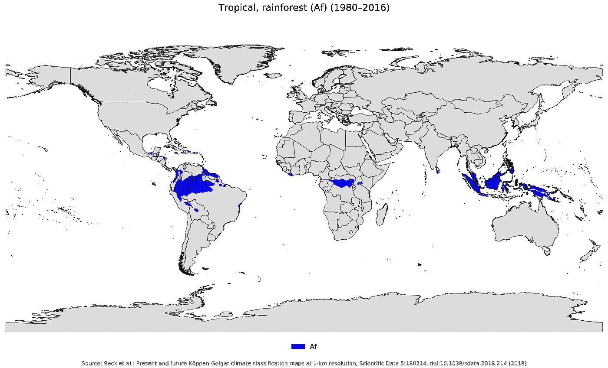

也就是说，亚马逊热带雨林中的大多数火灾是人为的，而不是生物引发的。这可能有很多原因，如非法砍伐、砍伐森林、农业燃烧等。

正如林业专家解释的那样，在潮湿的雨林中，自发的火灾很少发生。相反，工人们首先砍伐树木，让它们晾干，最后在旱季放火焚烧。通常情况下，只有被砍伐的部分足够干燥，可以燃烧，火仍然被限制在预定的区域。在没有交通工具或道路的情况下，木材无法出售，而焚烧是清理土地最简单的方法。

这些方法被称为刀耕火种法，用于清除森林，为农业、畜牧业、伐木业和采矿业让路。虽然这在包含部分亚马逊雨林的国家是非法的，但法规的执行是宽松的，并且近年来巴西环境署的预算削减导致在受影响最严重的地区执行法规的人力和资源大大减少。

这些“受控制的”火灾很容易失去控制，蔓延到森林地区，而众所周知，森林地区很难被扑灭。

此外，即使是锯木厂也存在不被重视的问题。锯木厂流程如下图所示。

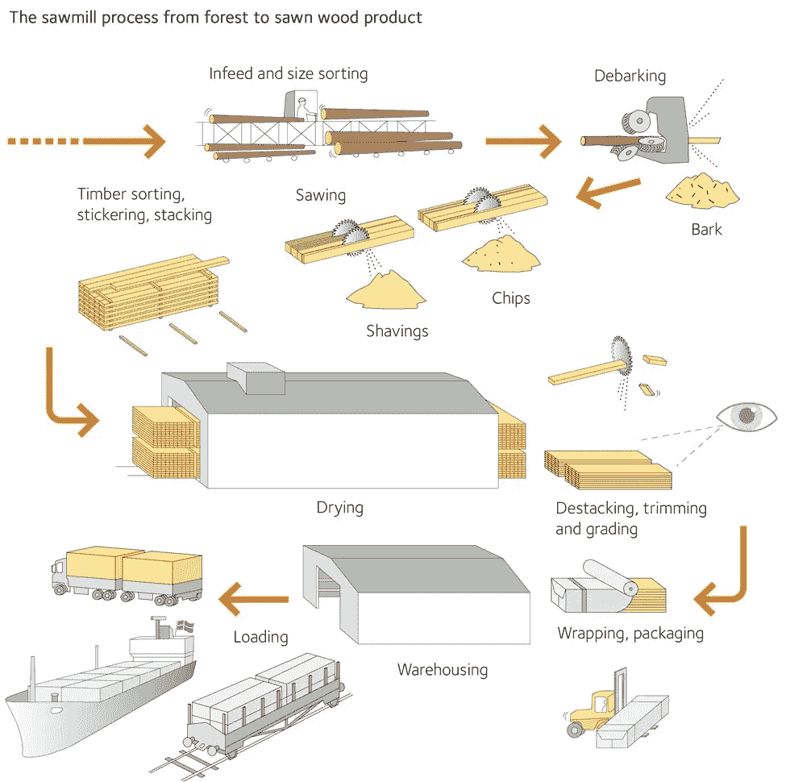

Logging life cycle. ([Source](https://www.swedishwood.com/about_wood/choosing-wood/from-log-to-plank/))

目前还没有处理锯木厂加工过程中产生的废品的法律。它们可以被用作生物质发电厂的燃料，或者被埋在垃圾填埋场。然而，没有生物质工厂会购买木屑或刨花，在垃圾填埋场掩埋废物会导致罚款。因此，许多锯木厂只是在露天焚烧他们的废品。木材的直接燃烧对大气的破坏尤其严重，甚至超过煤。

虽然亚马逊的大多数火灾都是由人类引起的，但情况并非总是如此。森林火灾的三个主要原因是:

*   干燥环境
*   雷击
*   火山爆发

我们在热带亚马逊地区唯一经常看到的是雷击，以及厄尔尼诺年期间相对干燥的环境，这通常与南美洲的干旱有关。

典型地，高水分含量防止着火并减缓其蔓延，因为需要更高的温度来蒸发材料中存在的任何水并将材料加热到其燃点。

热带亚马逊雨林的大部分地区都有茂密的森林，那里有更多的树荫，导致环境温度更低，湿度更大，使这些地区更不容易发生野火。

密度较低的材料(如草和树叶)更容易点燃，因为它们比密度较高的材料(如树枝和树干)含有更少的水。

植物通过[蒸发](https://en.wikipedia.org/wiki/Evapotranspiration)不断失去水分，但水分的损失通常由从土壤、湿度或雨水中吸收的水分来平衡。当这种平衡得不到维持时，植物就会干枯，因此变得更加易燃，这通常是干旱的后果。

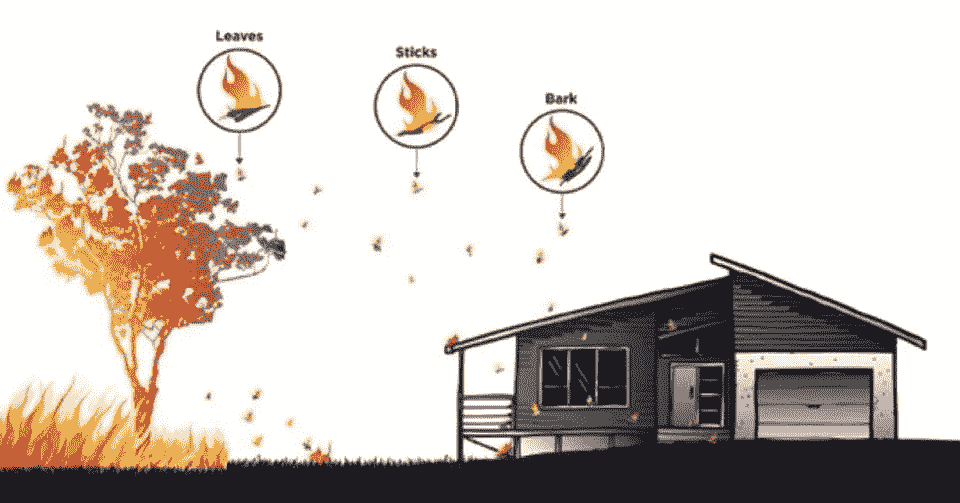

How forest fires spread.

森林火灾也是碳的巨大来源，并向大气中释放数吨二氧化碳。最重要的是，燃烧的树木不能从大气中清除二氧化碳，因此对气候变化有着复杂的影响。

## 都是树吗？

即使在亚马逊的深处，也有许多城市、城镇和村庄。

例如，马瑙斯是亚马逊热带雨林中心的一个拥有 200 万居民的大都市。马瑙斯以“水域交汇”而闻名，这里是内格罗河和索利莫斯河的交汇处，形成了亚马逊河。

在燃烧季节，自然燃烧树木的排放因工业的人为排放和烹饪、取暖等的家庭排放而加剧。

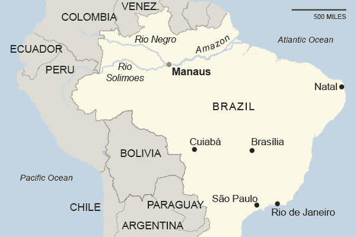

The city of Manaus is located in roughly the center of the Amazon basin.

这种协同作用导致了比普通城市更高水平的颗粒物、气溶胶和地面臭氧。下图显示了在 gulf team-1 飞机上进行研究活动期间，马瑙斯燃烧季节某一天的空气质量。

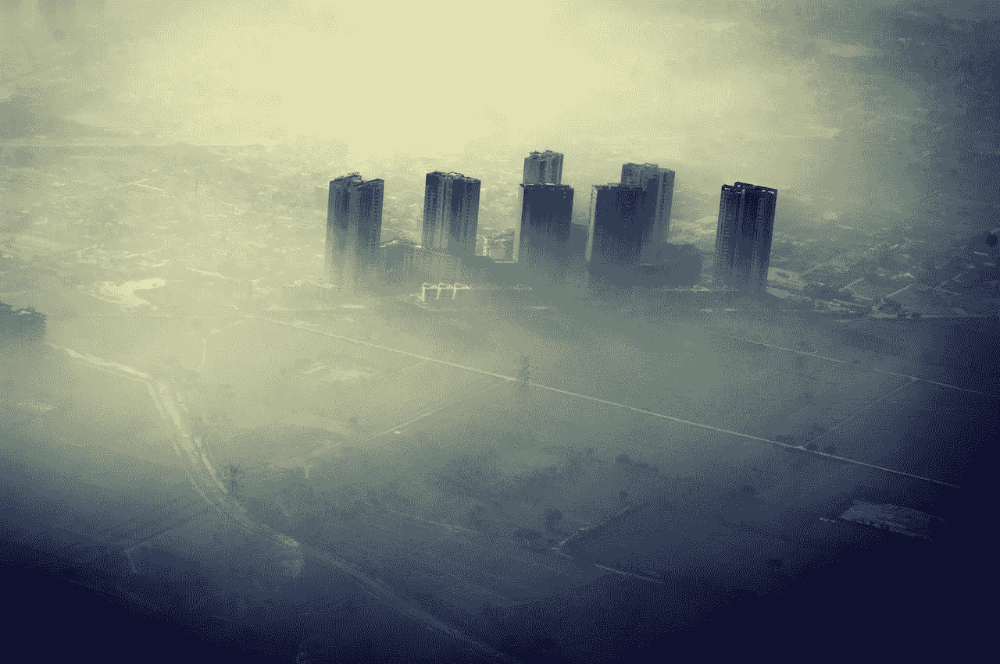

Researchers analyzed air samples captured over the Amazon rainforest and the city of Manaus by the Gulfsteam-1 research aircraft and the picture revealed the startling effect of man-made pollution on the air quality. ([source](https://sciencebriefss.com/earth/zipping-through-pristine-air-tells-us-how-bad-pollution-is))

在雨林中找到与北京这样的城市相媲美的污染水平，应该会让你感到惊讶和担忧，这也是环境科学家研究的内容。可以想象，随着火灾数量的增加，城市空气质量会进一步下降。

# **政治**

世界领导人几乎一致同意气候变化是一个现实。自从亚历山大·冯·洪堡在 1800 年第一次提到气候变化，气候变化就一直在讨论中，并且自 20 世纪 90 年代以来，在科学家中已经是一个无可争议的事实。

在这一点上，否认气候变化的现实就像否认进化的现实或地球的球形本质一样荒谬。

有争议的争论仍在发生，但现在的主要分歧可以归纳为两个主要问题:

*   气候变化正在发生，但我们如何知道这是人类造成的？
*   我们应该如何最好地解决这个问题？

第一个问题主要针对科学家，由于地球及其生物地球化学循环的高度动态性和复杂性，这个问题极难证明。

这一困难在第二期中再次出现。影响气候的因素有一百万种，有数百种技术可以用来帮助减轻气候变化的影响。

将这一点与经济和国家利益以及这样一个全球性问题的范围结合起来，很容易看出没有人知道该做什么，而且，即使他们知道，他们也没有什么经济动力去采取行动。

这是气候变化的地缘政治有点混乱的原因之一，这是全球范围的公地悲剧。

## 政治是如何影响亚马逊大火的？

多年来，雨林的政治一直很激烈，涉及的问题包括为了牲畜的生长而破坏橡胶种植园(环境友好型)(不环境友好型)，20 世纪 80 年代的环境激进主义，最终导致了[奇科·门德斯](https://en.wikipedia.org/wiki/Chico_Mendes)的谋杀，以及土著人口的大量减少。

近年来，由于气候变化和其他环境问题导致的日益增长的环境保护主义，这个问题的政治变得更加激烈。

一个多世纪以来，一系列巴西政府都试图进入该国内陆，开发亚马逊。从 20 世纪 30 年代将早期工业推进森林的民粹主义总统转变为独裁者，到从 1964 年到 1985 年统治该国 20 年的军事独裁，理由基本相同:经济利益。

这一最初的计划被称为亚马逊行动，该计划是在军政府设想通过修建道路和发展农业和公司企业将该领土并入巴西期间制定的。

2019 年 1 月 1 日宣誓就职的新总统雅伊尔·博索纳罗也有一个类似的开发该国内陆的计划。Bolsonaro 是农业综合企业的支持者，并强烈反对几个旨在保护亚马逊雨林的机构和外国国家。他说他不会容忍世界野生动物基金会(WWF)的议程，并强烈反对为土著部落保留土地。

你可以想象，所有这些支持商业的言论对环境都有负面影响。通过激励农民种植更多的牲畜和大豆，这实质上激励了大规模的森林燃烧，为牧场和农业让路。

最重要的是，Bolsonaro 削减了对巴西环境署的资助，导致缺乏有效监管内陆的资源。与 2018 年同期相比，今年上半年该机构的执法行动减少了 20%。

在一次新闻发布会上，他说负责执行环境法的主要联邦机构 IBAMA 的代理人开出了太多的罚单。

> *“那个家伙会两手各拿一支笔，开出天文数字的罚单……我们结束了这一切。”*

众所周知，这些事件随后导致了 2019 年 8 月引起世界关注的大规模无管制焚烧森林事件。

这一事件导致多个环保机构和外国势力公开谴责巴西总统雅伊尔·博索纳罗，尤其是法国总统埃马纽埃尔·马克龙。

博尔索纳罗暗示，非政府组织放火焚烧森林是为了败坏他的政府的名声。巴西环境部长 Ricardo Salles 在推特上说*“干燥的天气、风和热”*是罪魁祸首。

Paulo Artaxo(一位杰出的大气物理学家)表示“毫无疑问，火灾活动的增加与森林砍伐的急剧增加有关”。

Bolsonaro 最初拒绝了媒体和外国势力的关注，声称火灾的报道是耸人听闻的。然而，在第 45 届 G7 峰会上，由于 EU-南方共同市场自由贸易协定的损失，他受到了越来越大的国际压力，Bolsonaro 派遣了超过 44，000 名士兵到内陆灭火。

尽管这个问题已经解决，但这不太可能是我们最后一次听到这个故事，因为总统还将执政几年。

Bolsonaro 计划在亚马逊盆地开发核能和水力发电，并扩大镍的开采业务，这可能会引起一些人的争议，特别是在之前的项目出现环境问题之后，如新古河上的[贝洛蒙特大坝](https://en.wikipedia.org/wiki/Belo_Monte_Dam)。

# 2019 年森林火灾

作为一名经常访问和研究亚马逊雨林的环境科学家，我亲眼目睹了这些火灾的后果。

正如我们所讨论的，经历一些燃烧并不罕见，尤其是在旱季——这是亚马逊地区大多数火灾发生的时候——今年亚马逊地区的火灾数量值得关注。

由于森林火灾是危险的，而且很难提前预测，因此主要是利用卫星仪器对其进行研究。

巴西国家空间研究所(INPE)统计，1 月 1 日至 8 月 24 日期间有 41，000 多个“火点”，而去年同期为 22，000 个。位于马里兰州格林贝尔特的美国宇航局戈达德太空飞行中心和两所大学合作的[全球火灾排放数据库](https://www.globalfiredata.org/)也发现了类似的趋势。

这些数字是自 2010 年以来最高的，当时亚马逊经历了厄尔尼诺和北大西洋变暖引发的严重干旱。然而，气候异常并不能解释目前火灾的上升。

这些火可能来自燃烧的庄稼或牧场吗？

许多最近检测到的斑点都活跃了一天以上，燃烧着强烈的热量，产生又高又粗的烟柱——所有这些都表明树木正在着火，而不是杂草丛生的牧场、作物残余或路边的植被。

2019 年 10 月，FOSS4G 利用 MODIS 卫星数据对火灾进行了分析，这是森林火灾的主要信息来源之一。这些结果的演示和 GitHub 存储库可以在这里找到:

 [## 亚马逊森林疯狂数据大火的回归

### Daniel Araújo Miranda 播放列表:“foss4g2019”视频从此处开始/音频/相关活动你们中的许多人都问过…

媒体. ccc.de](https://media.ccc.de/v/bucharest-516-the-return-of-crazy-data-fires-in-the-amazon-forest)  [## 米兰达姆/火灾

### 于 2019 年 10 月 30 日在 Simfonia 室 14h00 以 FOSS4G 2019 发表的演示文稿。FOSS4G 代表免费和开源…

github.com](https://github.com/mirandadam/fires) 

2019 年 10 月 8 日，几位作者向一份名为*全球变化生物学*的著名环境期刊的编辑发送了一封[信，该期刊使用这些数据源来评估这些火灾的程度和原因。](https://onlinelibrary.wiley.com/doi/epdf/10.1111/gcb.14872)

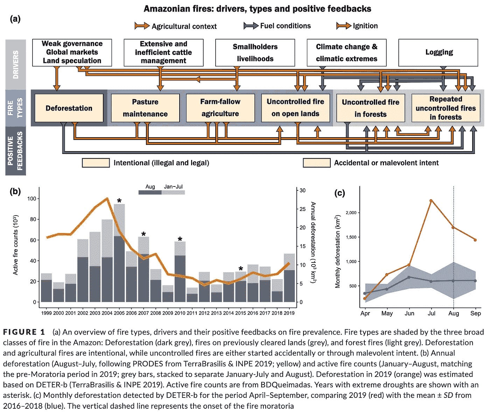

提交人指出:

> 与森林砍伐有关的火灾的重要贡献与媒体报道的森林砍伐地区的大规模火灾相一致，而进入大气层的巨大浓烟只能用大量生物质的燃烧来解释。
> 
> 一些保护区异常高的火灾数量也强调了 2019 年的不寻常性，如 Jamanxim 国家森林公园，从 2018 年到 2019 年，活跃的火灾增加了 355%，比长期平均水平高出 44%(BDQueimadas 和 INPE，2019 年)

用于检查亚马逊雨林火灾的主要数据来源是 dete-b(Detec ao de Desmatamento em Tempo Real)，这是巴西科学技术部的 INPE 国家森林研究所的一项实时森林砍伐检测服务。

该系统使用美国宇航局 Terra 和 Aqua 卫星上的 MODIS 传感器获得的数据。它对巴西亚马逊地区超过 6.25 公顷的森林砍伐发出警报。这些数据是森林砍伐率的一个指标，但并不代表全部砍伐面积，这是由全球森林观察的 PRODES 系统测量的。

PRODES 过去使用 Landsat 5 图像，但现在也使用 Landsat 7 和 8、CBERS-2、CBERS-2B、Resourcesat-1 和 UK2-DMC 的图像。PRODES 由 INPE 与环境部和巴西环境和可再生自然资源研究所(IBAMA)合作运营。

当查看图 1(b)中的年度活跃火灾数量时，与前几年相比，上升似乎并不特别明显。主要的区别是，今年没有厄尔尼诺或其他气候异常现象来解释这种增加。

2019 年 9 月，Bolsonaro 宣布暂停燃烧，基本上停止了所有燃烧。这一点，加上他派往内地处理火灾 60 天的部队，导致 2019 年 9 月火灾大幅减少，尽管很难肯定地说这是减少的原因。

发表在 *Nature* 上的数据显示了类似的故事，但提供了 2019 年每个月的火灾次数。

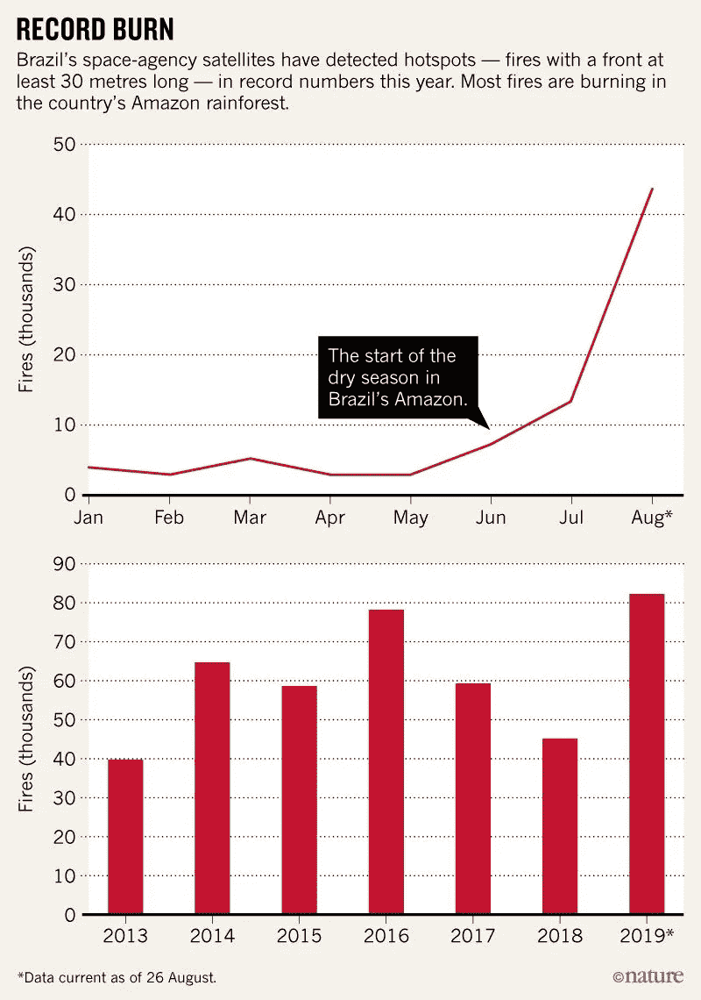

美国宇航局 2019 年 11 月 6 日的一篇[文章](https://phys.org/news/2019-11-drought-stressed-forest-fueled-amazon.html)发现，今年夏天亚马逊盆地燃烧的一些火灾集中在雨林缺水地区。

受胁迫的植物释放到空气中的水蒸气比未受胁迫的植物少得多；换句话说，他们努力保持凉爽和节约用水，使他们更容易受到火灾的伤害。

NASA’s ECOSTRESS sensor measured the stress levels of plants when it passed over the Peruvian Amazon rainforest on Aug. 7, 2019\. The map reveals that the fires were concentrated in areas of water-stressed plants (brown). The pattern points to how plant health can impact the spread of fires. Credit: NASA/JPL-Caltech/Earth Observatory

[大火](https://phys.org/tags/fire/)图标代表了美国宇航局的 Terra 卫星在 8 月 19 日至 26 日拍摄的大火。

> “对肉眼来说,[大火似乎随机分布在整个森林中。但是，如果你叠加生态压力数据，你可以看到火灾主要局限在高度缺水的地区。大火避开了压力较低的区域，那里的森林似乎有更多的水源。 ***—乔希·费舍尔，美国宇航局喷气推进实验室生态压力科学负责人***](https://phys.org/tags/naked+eye/)

目前还不知道为什么某些植物会受到胁迫，而其他植物则不会，但人们怀疑这取决于植物种类或土壤含水量等方面。

## 全球森林观察

研究火灾的最佳资源之一是[全球森林观察](https://www.globalforestwatch.org/dashboards)，它提供了一个仪表板 GUI 来研究气候、土地使用和其他影响森林生态系统的变量的变化。我们可以使用[全球森林观察火灾](http://fires.globalforestwatch.org/home/)来具体分析火灾。

如果你看看 2019 年 6 月 1 日至 11 月底期间各省的火灾警报数量，大多数火灾发生在亚马逊雨林的各州。

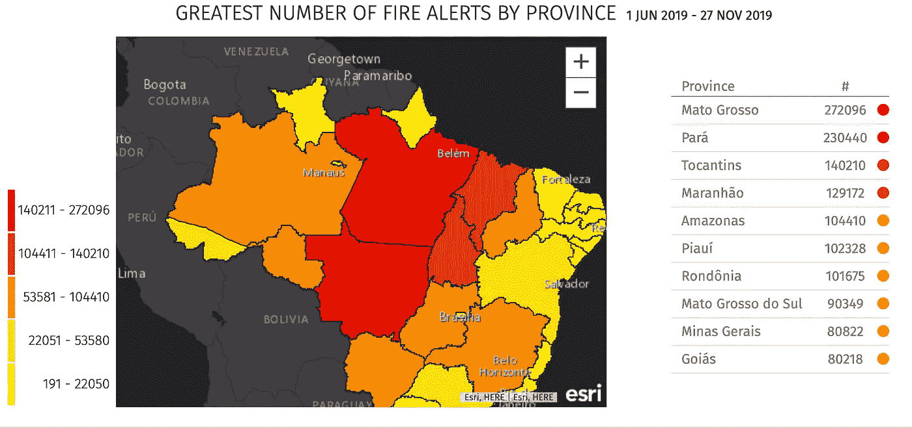

Number of fire alerts by province. Mato Grosso: 272,096; Pará: 230,440; and Amazonas: 104,410\. Alerts detected 1 June to 27 November 2019\. Data: [Global Forest Watch Fires](http://fires.globalforestwatch.org/report/index.html#aoitype=GLOBAL&reporttype=globalcountryreport&country=Brazil&dates=fYear-2019!fMonth-6!fDay-1!tYear-2019!tMonth-11!tDay-27).

同一个数据库还告诉我们这些火灾发生在 WDPA 投影区域的比例，根据分析的时间段，是 18-20%。

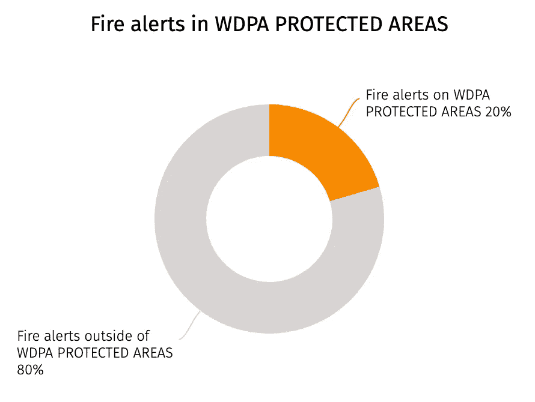

The proportion of fire alerts in 2019 in World Database on Protected Areas (WDPA) projected areas between June 1 and November 27 2019\. Data: [Global Forest Watch Fires](http://fires.globalforestwatch.org/report/index.html#aoitype=GLOBAL&reporttype=globalcountryreport&country=Brazil&dates=fYear-2019!fMonth-6!fDay-1!tYear-2019!tMonth-11!tDay-27).

The proportion of fire alerts in 2019 in mining areas between June 1 and November 27 2019\. Data: [Global Forest Watch Fires](http://fires.globalforestwatch.org/report/index.html#aoitype=GLOBAL&reporttype=globalcountryreport&country=Brazil&dates=fYear-2019!fMonth-6!fDay-1!tYear-2019!tMonth-11!tDay-27).

我们还可以区分发生在完整森林景观区域的火灾和发生在已经被破坏的地方的火灾。与发生在农民耕地上的火灾相比，之前未被触及的森林区域的火灾对生物多样性的影响更大。

The proportion of fire alerts in 2019 in mining areas between June 1 and November 27 2019\. Data: [Global Forest Watch Fires](http://fires.globalforestwatch.org/report/index.html#aoitype=GLOBAL&reporttype=globalcountryreport&country=Brazil&dates=fYear-2019!fMonth-6!fDay-1!tYear-2019!tMonth-11!tDay-27).

我们还可以利用 MODIS 火灾警报来观察火灾的季节性变化，并与前几年进行比较。接近年底时火灾更加普遍，因为这是旱季的高峰期。

我们看到，与某些年份相比，2019 年在火灾警报数量方面并不是特别糟糕的一年。然而，最糟糕的年份发生在与厄尔尼诺和严重干旱相关的年份，或者是生态系统仍在恢复的年份的后果。

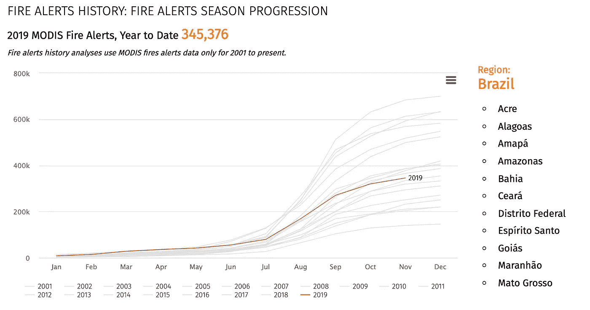

The seasonal progression of fire alerts in 2019 in Brazil. Data: [Global Forest Watch Fires](http://fires.globalforestwatch.org/report/index.html#aoitype=GLOBAL&reporttype=globalcountryreport&country=Brazil&dates=fYear-2019!fMonth-6!fDay-1!tYear-2019!tMonth-11!tDay-27).

我们还可以根据 MODIS 数据评估特定月份的火灾警报有多“不寻常”。从结果来看，与一年中的其他时间相比，八月和九月的火灾警报特别高，与前几年旱季相比，低于平均水平。

9 月份后火灾数量急剧下降，部分原因可能是由于总统博尔索纳罗在国际压力不断增加后暂停了 2 个月来解决火灾问题。

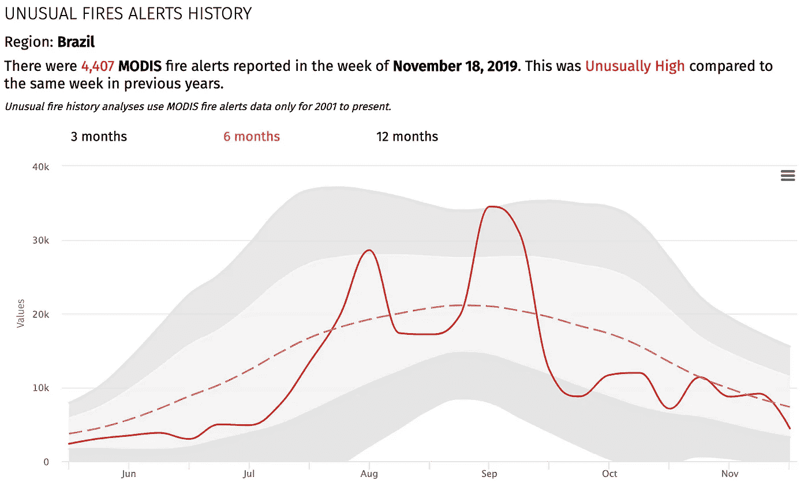

The monthly MODIS fire alerts during 2019 in Brazil compared to previous years data. Data: [Global Forest Watch Fires](http://fires.globalforestwatch.org/report/index.html#aoitype=GLOBAL&reporttype=globalcountryreport&country=Brazil&dates=fYear-2019!fMonth-6!fDay-1!tYear-2019!tMonth-11!tDay-27).

## 维伊尔斯

我们还可以使用可见光红外成像辐射计套件(VIIRS)来分析火灾，这是 Suomi 国家极地轨道伙伴关系(Suomi NPP)航天器上的关键仪器之一。

VIIRS 为我们提供了关于森林火灾的近实时数据，可以在这里访问[。](https://www.globalforestwatch.org/map/country/BRA?mainMap=eyJzaG93QW5hbHlzaXMiOmZhbHNlLCJoaWRlTGVnZW5kIjpmYWxzZX0%3D&map=eyJjZW50ZXIiOnsibGF0IjotOC45MDU5NDQ4ODcyNjM5NDQsImxuZyI6LTU5LjQ2ODcyOTg0NTgxNzY4NH0sImJlYXJpbmciOjAsInBpdGNoIjowLCJ6b29tIjo0Ljg0MTI0MTY1MjY5NzIzOSwiZGF0YXNldHMiOlt7ImRhdGFzZXQiOiJmZGM4ZGMxYi0yNzI4LTRhNzktYjIzZi1iMDk0ODUwNTJiOGQiLCJsYXllcnMiOlsiNmY2Nzk4ZTYtMzllYy00MTYzLTk3OWUtMTgyYTc0Y2E2NWVlIiwiYzVkMWUwMTAtMzgzYS00NzEzLTlhYWEtNDRmNzI4YzA1NzFjIl0sIm9wYWNpdHkiOjEsInZpc2liaWxpdHkiOnRydWV9LHsiZGF0YXNldCI6IjBmMGVhMDEzLTIwYWMtNGY0Yi1hZjU2LWM1N2U5OWYzOWUwOCIsIm9wYWNpdHkiOjEsInZpc2liaWxpdHkiOnRydWUsImxheWVycyI6WyI1MzcxZDBjMC00ZTVmLTQ1ZjctOWZmMi1mZTUzODkxNGY3YTMiXSwicGFyYW1zIjp7Im51bWJlcl9vZl9kYXlzIjoiNyJ9fSx7ImRhdGFzZXQiOiIxM2UyODU1MC0zZmM5LTQ1ZWMtYmIwMC01YTQ4YTgyYjc3ZTEiLCJvcGFjaXR5IjowLjY5LCJ2aXNpYmlsaXR5Ijp0cnVlLCJsYXllcnMiOlsiZmQ0NGI5NzYtNjJlNi00MDcyLTgyMTgtOGFiZjZlMjU0ZWQ4Il19XSwiY2FuQm91bmQiOmZhbHNlLCJiYm94IjpbXSwiZHJhd2luZyI6ZmFsc2V9&menu=eyJkYXRhc2V0Q2F0ZWdvcnkiOiJmb3Jlc3RDaGFuZ2UiLCJtZW51U2VjdGlvbiI6IiJ9)

来自 VIIRS 的数据可以与关于在完整森林景观内发生了多少起火灾的信息相结合，这些信息对排放及其对生物多样性的影响有更大的影响，如前所述。

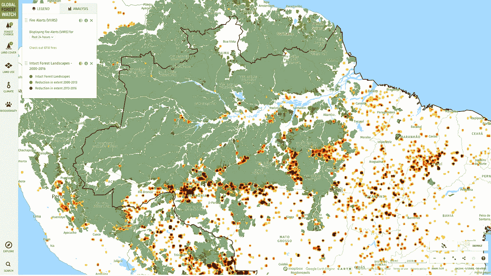

Location of VIIRS fire alerts over the week of 20 August 2019 in relation to areas of intact forest landscapes. Data: [Global Forest Watch](http://bit.ly/2KPFuko), accessed on 27 August 2019.

VIIRS 的数据告诉我们，许多火灾发生在朗多尼亚，而相对较少的火灾发生在亚马逊。这一数据与全球森林观察的数据相吻合，后者告诉我们只有 4%的火灾发生在完整的森林景观中。

## 火灾分析

我们也可以考察一些与巴西森林火灾相关的数据，自己考察情况。我们将使用巴西政府从国家信息系统收集的数据。为了获得巴西及其各州的最新地图，我们使用了来自[“GADM 全球行政区域数据库”](http://www.gadm.org/country)的 shapefile。

**注意:**我本可以提供 MODIS 数据的分析，但是这些数据集有几百千兆字节，众所周知很难预处理和分析。然而，如果你对这个话题感兴趣，我会推荐你下载一些卫星数据，然后玩玩。

这个分析对应的 Jupyter 笔记本和数据可以在我的 GitHub 知识库中找到(文末链接)。

我们可能感兴趣的第一件事是哪个地区火灾最多。

据位于巴西贝伦的亚马逊环境研究所称，火灾发生率最高的 10 个城市也是今年森林消失最快的地方。

火灾总数如何达到图 1(b)中的数据以及我们之前讨论的《自然》杂志文章中的数据？

事实证明，并不是特别好。图 1(b)中 2011 年至 2017 年的数据显示，火灾次数应在 10，000 至 40，000 次之间波动。当我们查看来自自然的数据时，我们看到这些值在 40，000 到 80，000 次火灾之间波动。

这种差异可能是由于不同的数据库、测量的分辨率以及“火灾”的构成。如果我们看看图 1(b)中的黄线，我们会发现我们的结果在 2011 年后相当一致。这有助于说明比较火灾测量值及其解释方式所带来的困难。

如果我们画出每个州的平均火灾次数，并叠加在巴西的图上，我们可以看到火灾次数在过去十年中是如何演变的。某些年份会发生更多的火灾，这与 ENSO 的干旱年份相对应。

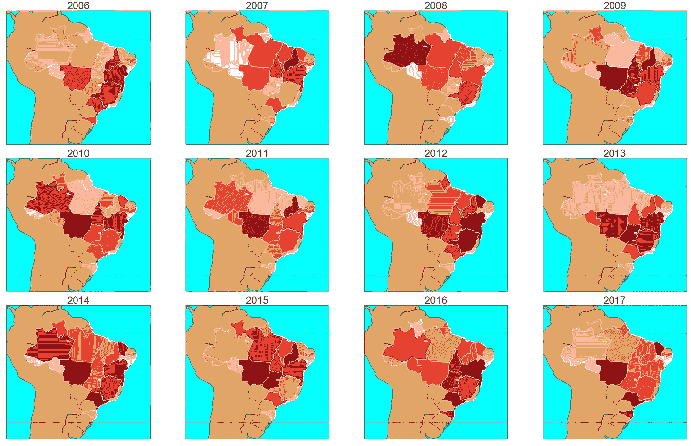

各州每天的平均火灾次数是多少？

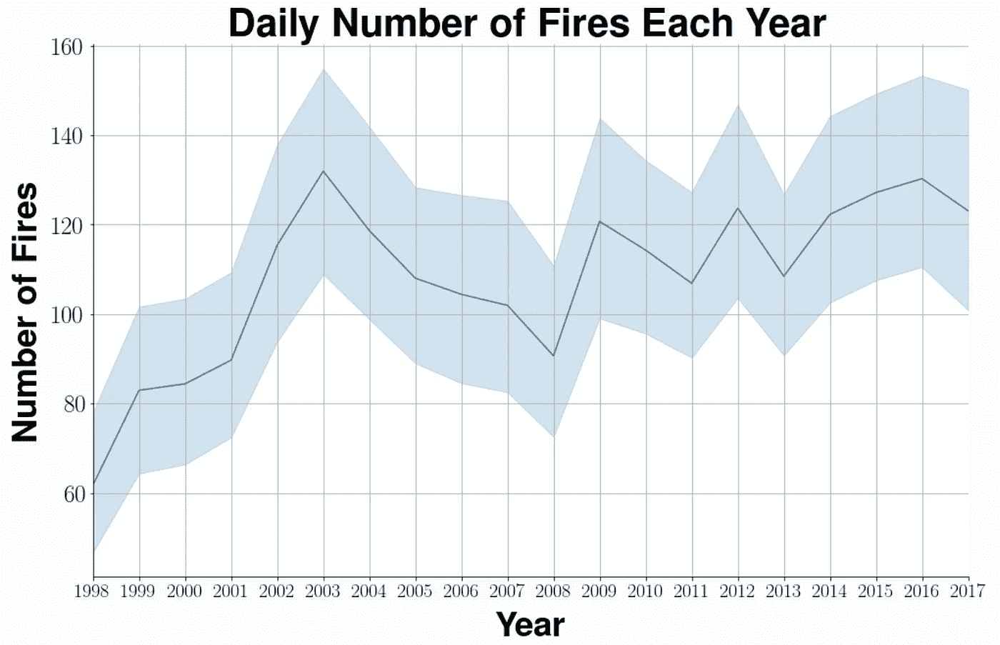

我们再次看到，早期的结果似乎特别低，这可能是由于技术限制，没有足够的能力进行准确的测量。

干旱后的几年火灾数量较少，可能是因为生态系统仍在从干旱带来的压力中恢复。

为了获得更丰富的结果，也许一个更好的指标是该州是否是 *'* [*亚马逊法律*](https://en.wikipedia.org/wiki/Amaz%C3%B4nia_Legal) *'* 的一部分，这对应于作为亚马逊盆地一部分的巴西的九个州。

States of the Amazônia Legal.

通过将这些州标记为亚马逊法律的一部分，我们发现马托格罗索州是所有州中火灾最多的一个州，并且一些火灾发生率高的州不属于这个区域。

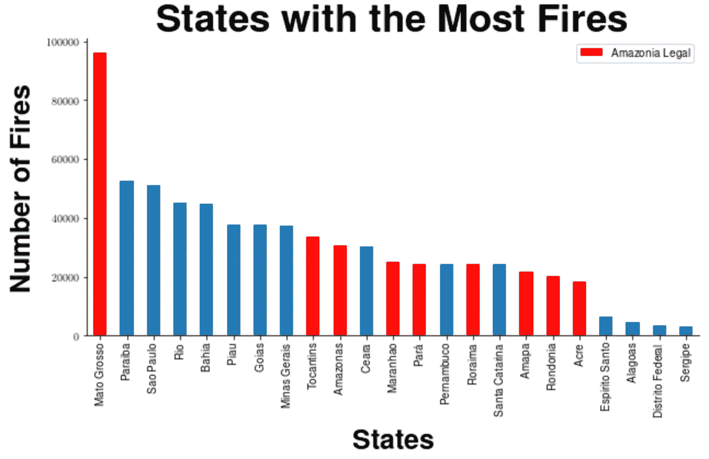

如果我们看一下每个月的数据，我们会发现很多火灾发生在亚马逊法律管辖范围之外的地区。

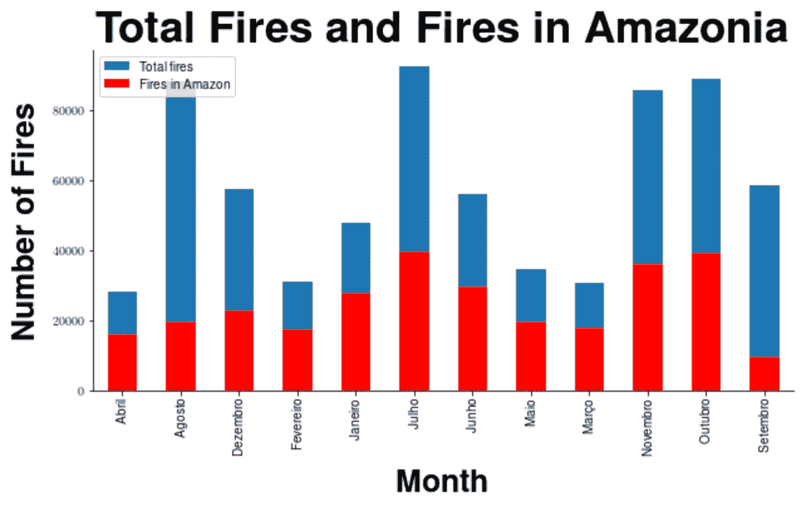

根据美国宇航局文章的讨论，我们可能会怀疑该地区的降雨量和火灾数量之间存在相关性。我们使用降水数据对此进行评估。

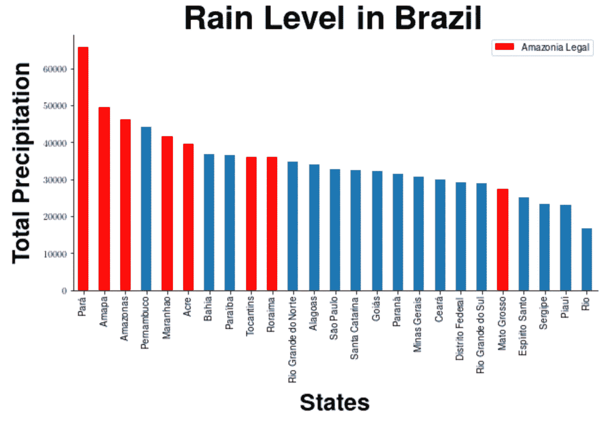

数据显示，大部分降水发生在亚马孙河流域的各州，这些州是亚马孙热带雨林的一部分。尽管这些地区的湿度很高，降水量也很大，但这些地区的火灾仍然占到巴西火灾总数的一半左右。

一年中降水量如何变化？

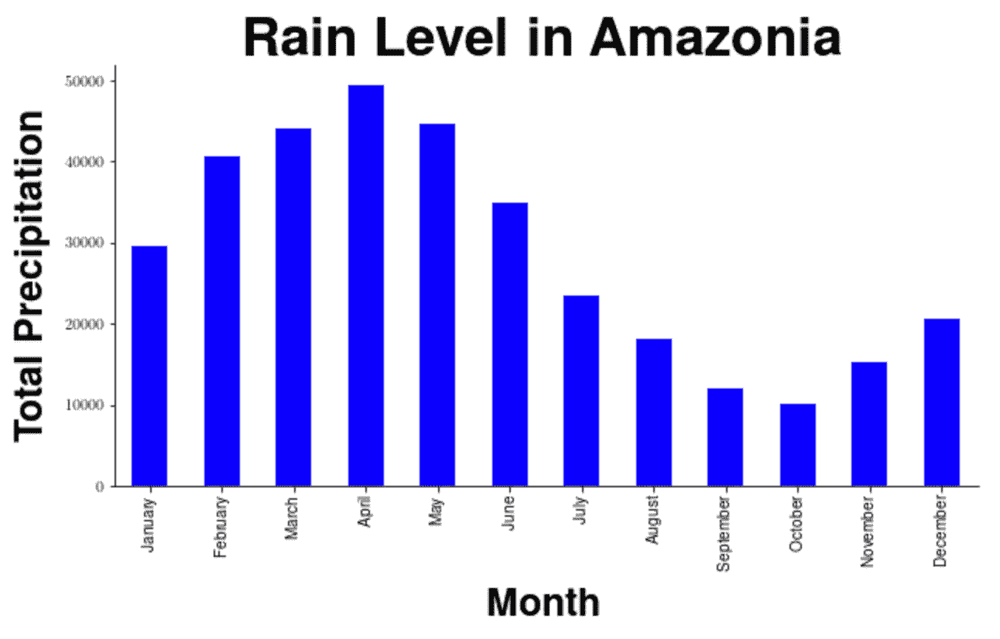

根据降水量值，旱季的峰值出现在 10 月，雨季的峰值出现在 4 月。这与每月发生的火灾数量有多大关系？

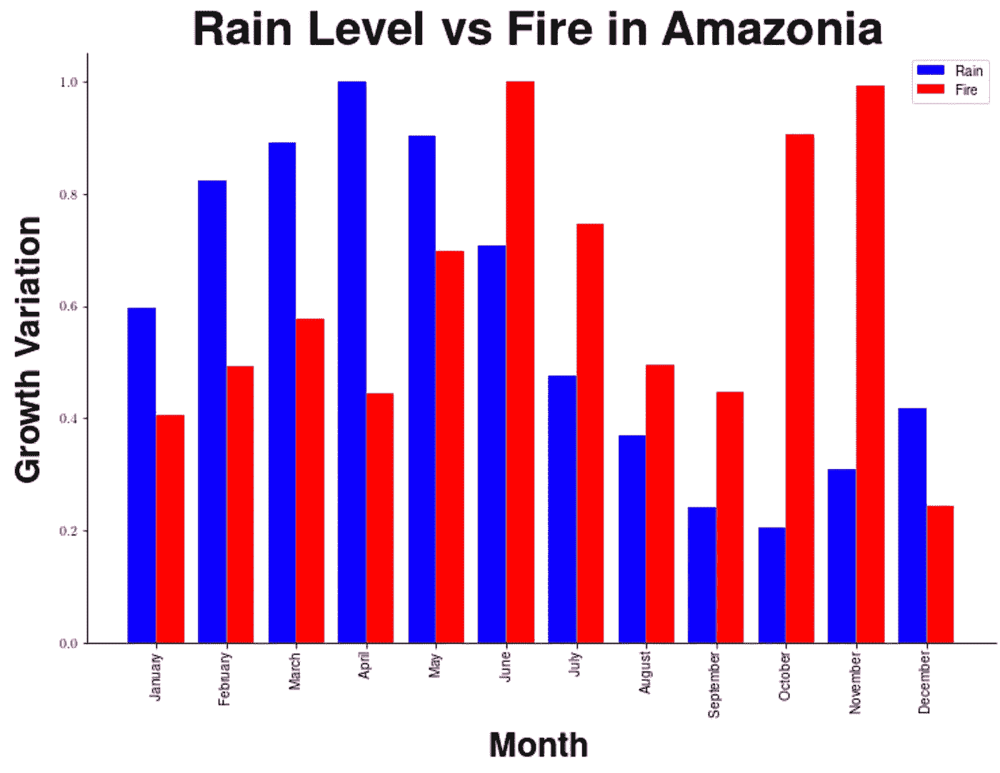

火灾数量和降雨量之间没有太多的一致，尽管这是对形势的基本分析，没有考虑到可能影响结果的许多细微差别。然而，即使大部分火灾是人为的，我们预计在旱季开始时火灾会明显增加。

正如我们所怀疑的那样，大多数火灾发生在旱季。

# 未来的分歧

2018 年的一篇名为 [*【亚马逊引爆点】*](https://advances.sciencemag.org/content/advances/4/2/eaat2340.full.pdf) 的著名文章，由托马斯·洛夫乔伊和卡洛斯·诺布尔发表，这两位杰出的科学家的工作重点是亚马逊雨林，文章描述了森林砍伐对森林生态系统未来的影响:

> 我们认为，森林砍伐、气候变化和广泛使用火之间的负协同作用表明，在 20-25%的森林砍伐率下，亚马逊系统将转向亚马逊东部、南部和中部的非森林生态系统。
> 
> 2005 年、2010 年和 2015 年至 2016 年的严重干旱很可能代表了这一生态临界点的第一缕曙光。这些事件，加上 2009 年、2012 年(以及 2014 年亚马逊西南部)的严重洪水，表明整个系统正在振荡。在过去的二十年里，亚马逊南部和东部的旱季越来越长。大尺度因素，如热带北大西洋海面温度升高，似乎也与陆地上的变化有关。

最后一段提出，亚马逊正在偏离其动态稳定性，并开始达到一个临界点，此后系统将变得不稳定。这对应于下图中的场景 C。

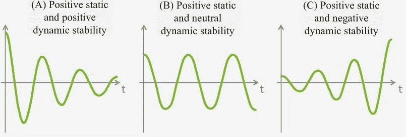

Possible patterns of stability for dynamic systems.

虽然未来的火灾是不可避免的，但防止人为火灾和未来的森林砍伐对于稳定雨林生态系统和确保亚马逊的生存至关重要。

# 最终意见

我希望你喜欢这篇文章，并发现它的信息。这一次更多的是关于数据科学的环境和政治问题，但我认为了解情况的背景很重要。

如果你对我写的东西有任何疑虑或异议，请随时通过社交媒体联系或在这里回应，我总是很高兴讨论我的文章并接受建设性的批评。

您可以在我的 Github 存储库中找到相应的 Jupyter 笔记本，其中也包含一个 Binder 链接，您可以自己运行代码。

 [## GitHub - mpstewart1/AmazonFires

### 带有 environment.yml 文件的与 Binder 兼容的 repo。通过以下 URL 访问此活页夹…

github.com](https://github.com/mpstewart1/AmazonFires) 

我用作参考的文章在整篇文章中都有，但是下面也给了感兴趣的人一个详尽的列表。

## 时事通讯

关于新博客文章和额外内容的更新，请注册我的时事通讯。

 [## 时事通讯订阅

### 丰富您的学术之旅，加入一个由科学家，研究人员和行业专业人士组成的社区，以获得…

mailchi.mp](https://mailchi.mp/6304809e49e7/matthew-stewart) 

# 参考

科学家称，亚马逊大火显然与森林砍伐有关。*赫顿·埃斯科瓦尔。科学。*

【https://science.sciencemag.org/content/342/6156/1243092 

[https://www . PBS . org/news hour/science/no-the-Amazon-fires-won-deplete-the-earth-oxygen-supply-heres-why](https://www.pbs.org/newshour/science/no-the-amazon-fires-wont-deplete-the-earths-oxygen-supply-heres-why)

[https://onlinelibrary.wiley.com/doi/epdf/10.1111/gcb.14872](https://onlinelibrary.wiley.com/doi/epdf/10.1111/gcb.14872)

[https://advances . science mag . org/content/advances/4/2/eaat 2340 . full . pdf](https://advances.sciencemag.org/content/advances/4/2/eaat2340.full.pdf)

[https://www-jstor-org . ezp-prod 1 . hul . Harvard . edu/stable/pdf/1693078 . pdf？refreqid = excelsior % 3a 8 B3 f 40 df1 b 6021 ce 1e 16871 c 019 e 97 f 2](https://www-jstor-org.ezp-prod1.hul.harvard.edu/stable/pdf/1693078.pdf?refreqid=excelsior%3A8b3f40df1b6021ce7e16871c019e97f2)

file:///Users/matt/Downloads/schoengartel 2004 _ 01。便携文档格式

【https://www.ncbi.nlm.nih.gov/pmc/articles/PMC2373904/ 

[https://IOP science . IOP . org/article/10.1088/1748-9326/aadbb 9/pdf](https://iopscience.iop.org/article/10.1088/1748-9326/aadbb9/pdf)

[https://www.nature.com/articles/srep33130](https://www.nature.com/articles/srep33130)

[https://agu pubs . online library . Wiley . com/doi/pdf/10.1002/2014 GB 005080](https://agupubs.onlinelibrary.wiley.com/doi/pdf/10.1002/2014GB005080)

[https://advances.sciencemag.org/content/4/9/eaat8785](https://advances.sciencemag.org/content/4/9/eaat8785)

[https://agu pubs . online library . Wiley . com/doi/full/10.1002/2013 JD 020758](https://agupubs.onlinelibrary.wiley.com/doi/full/10.1002/2013JD020758)

[https://royal society publishing . org/doi/full/10.1098/rstb . 2018.0085](https://royalsocietypublishing.org/doi/full/10.1098/rstb.2018.0085)

[https://news . mong abay . com/2017/01/record-2015-16-El-Nino 期间亚马逊遭遇的高温干旱/](https://news.mongabay.com/2017/01/record-heat-and-drought-seen-in-amazon-during-2015-16-el-nino/)

[https://www.pnas.org/content/106/49/20578](https://www.pnas.org/content/106/49/20578)

[http://www.scielo.br/scielo.php?script=sci_arttext&PID = s 1519-69842008000500003](http://www.scielo.br/scielo.php?script=sci_arttext&pid=S1519-69842008000500003)

[https://www.jstor.org/stable/3061252?seq = 1 # page _ scan _ tab _ contents](https://www.jstor.org/stable/3061252?seq=1#page_scan_tab_contents)

[https://phys . org/news/2018-08-亚马逊-降雨-季节. html](https://phys.org/news/2018-08-amazonian-rainfall-season.html)

[https://www . frontier sin . org/articles/10.3389/feart . 2019.00215/full](https://www.frontiersin.org/articles/10.3389/feart.2019.00215/full)

【https://www . Atmos . UMD . edu/~ Zeng/papers/Yoon+Zeng 2010 _ Atlantic _ Amazon _ linkage . pdf

[https://advances . science mag . org/content/advances/4/2/eaat 2340 . full . pdf](https://advances.sciencemag.org/content/advances/4/2/eaat2340.full.pdf)