# 黑色星期五的消费者行为分析

> 原文：<https://towardsdatascience.com/an-analysis-of-consumer-behavior-on-black-friday-9dd7952fc172?source=collection_archive---------25----------------------->

## 使用`pandas`、`matplotlib`和`seaborn`从客户数据中产生洞察力的教程

W 无论你是在 B2C 还是 D2C 公司工作，你都很有可能会被要求查看一些销售数据集，以创建预测模型或了解消费者行为。在本帖中，我们将探讨一些我们可能想问的关于数据的问题，以及如何尽快提取这些答案。为此，我们将编写两个函数来简化我们的工作，因为我们将绘制一些条形图来回答不同的问题。

我们将使用黑色星期五数据集，该数据集可以在 [Analytics Vidhya 网站](https://datahack.analyticsvidhya.com/contest/black-friday/)上找到。您可以查看我们将使用的工具下面的数据信息。

***你可以在我的***[***Github***](https://github.com/jmcabreira)***页面*** 上查看我开发的所有代码

# 工具:

-Seaborn 和 matplotlib 用于数据可视化
- Pandas 和 numpy 用于数据分析

# 我们想要回答的问题:

**年龄组分析:**

*-各年龄段购买总额
-各年龄段及城市购买均值*

**产品类别分析:**

- *各产品类别各城市购买次数
-产品 _ 类别 1 各城市购买平均数
-产品 _ 类别 2 各城市购买平均数
-产品 _ 类别 3 各城市购买平均数*

**性别分析:**

*-按性别分列的购买均值
-按性别和年龄组分列的购买均值
-按性别和城市分列的购买均值*

**职业分析:**

*-按职业分类的购买均值
-按职业和城市分类的购买均值*

**序数变量之间的相关性:**

*-热图
-聚类图*

# 变量:

# 数据帧:

虽然我们对数据的第一印象是它们似乎是有组织的，但仍有一些值缺失。Product_Category (2 和 3)列有大量 NaNs 变量，而不是数字表示。我们可以从中获得的信息是，每个 NaN 代表一个事实，即该给定行的产品不属于该特定类别。例如，第一行的产品(Product_id = P00069042)被标识为产品 3，并且只属于类别 1。另一方面，第二行的产品在类别 1 中被标识为 1，在第二类别中被标识为 6，在第三类别中被标识为 14，这意味着它属于所有类别。

除此之外，我们还要注意一个事实，即 **g *roupby 和 pivot_table 自动忽略 NaNs*。这使得我们的工作变得非常容易，因为我们将使用这两种技术来对一些数据进行分组并对它们进行计算操作。除此之外，重要的是要提到，即使我们的数据可能有一些异常值，我们也会认为它已经在这个问题上挖掘出来了。**

# 年龄组分析:

## **按年龄组划分的购买总量**

我们将通过确定年龄组的购买总量以及年龄组和城市的购买方式来开始这个项目。为了做到这一点，我们必须首先使用 value_counts()方法来统计每个组的购买数量，并绘制一个简单的酒吧聊天。其次，我们必须创建一个多级数据透视表数据框架，其中的索引是列 Age 和 City_Category，然后绘制一个条形图。

下图显示，26 岁至 35 岁之间的人在购买数量方面占据首位，其次是 36 岁至 45 岁和 18 岁至 25 岁年龄组，与第一组相比，这两个年龄组的购买量约为第一组的一半。

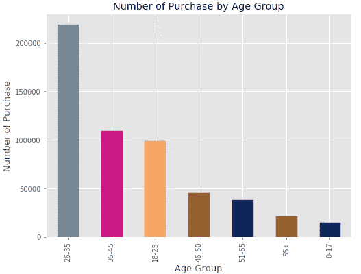

## 按年龄组和城市划分购买均值

如果我们绘制一个直观的图像来回答这个问题，我们将得到下图。

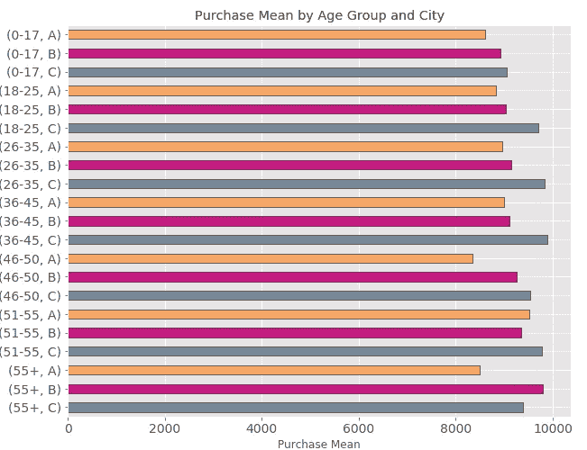

尽管上面的情节给了我们想要的信息，但还是有点混乱。我们必须记住，越容易理解故事情节，读故事的人就会越“快乐”。作为数据科学家或数据分析师，我们有义务尽可能清晰地传递信息，以便那些查看图表或仪表板的人能够立即理解所有内容。因此，为了清楚地比较这些组，我们将分别对它们进行绘图。

您可能会想:“我不想为每个不同的情节编写代码！”。你是对的！谁有时间做那个？！记住时间就是金钱！因此，让我们编写一个函数来完成这项工作，另一个函数来设置轴列表，使其长度与我们在每个可视化中需要的长度完全相同。

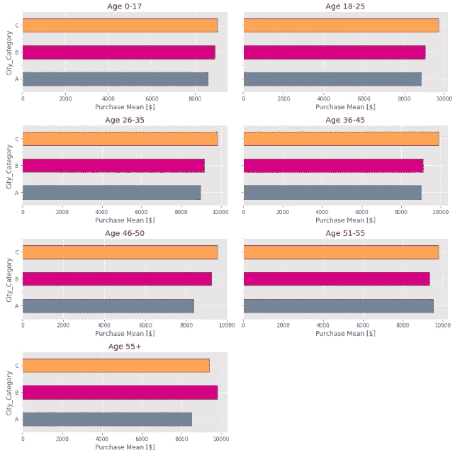

那些情节不是比我们之前做的那个更好理解吗？现在我们可以清楚地看到，例如，从 0 岁到 55 岁，C 城市的平均购买量大于其他城市。我们还可以看到，B 城市仅在 55 岁以上年龄组中占据首位。简而言之，我们可以从那些情节中获得很多信息，那些需要它们来做商业决策的人可能会很高兴。

# 产品类别分析:

我们的第二个任务是分析类别和产品。我们将首先绘制一个条形图，显示每个城市每个类别的总购买量。然后，我们将利用我们构建的函数为每个类别的所有产品绘制单独的图表。值得一提的是，一个产品可能属于不同的类别和群体。例如，产品 **P00248942** 属于所有类别，但在第一类中被命名为组 1，在第二类中被命名为组 6，在第三类中被命名为组 14。说完这些，我们开始分析吧。

## 按城市划分的每个产品类别的购买数量:

下面的图表显示了我们在购买数量方面的某种模式。正如我们所看到的，在所有城市中，产品类别 1 占据首位，其次是产品类别 2 和产品类别 3。每个城市在购买数量上的不同之处在于，城市 B 的消费者比城市 A 和 c 购买更多的所有类别的产品。

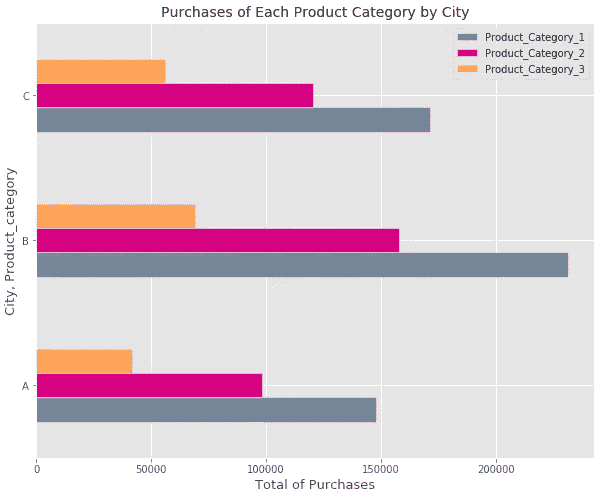

## 按城市划分的产品 _ 类别 1 的购买均值:

从现在起，您将会注意到，对于每个可视化，我们将组合数据帧来选择我们想要可视化的数据，并应用我们已经创建的两个函数。

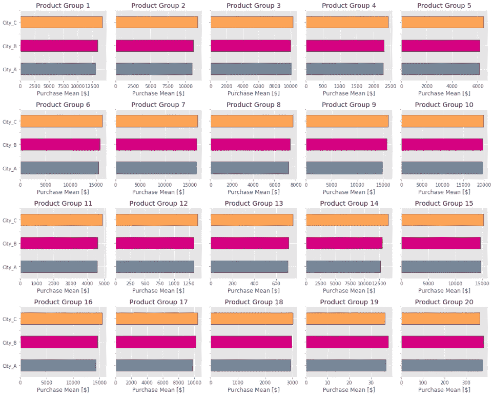

我们不会仔细检查所有的情节。相反，让我们只关注我们能从他们那里得到的主要信息。也就是说，首先引起我注意的是产品 19，与其他产品相比，它的购买价格更低(平均不到 40 美元)。此外，我们可以注意到，产品 4 的购买意愿最强，城市 C 排名第一，其次是城市 B，城市 B 比城市 C 稍有优势。

## 按城市划分产品 _ 类别 2 的购买均值:

现在让我们分析类别 2 的所有产品。正如数据描述中提到的，该产品可能属于其他类别，我们可以通过查看下面的图表来注意到这一点。我们有一组也属于第一类的 17 种产品，可以看出，产品 10 具有最大的购买意义。城市 C 再次占据第一位，其次是城市 B 和 A(类似于产品类别 1)。

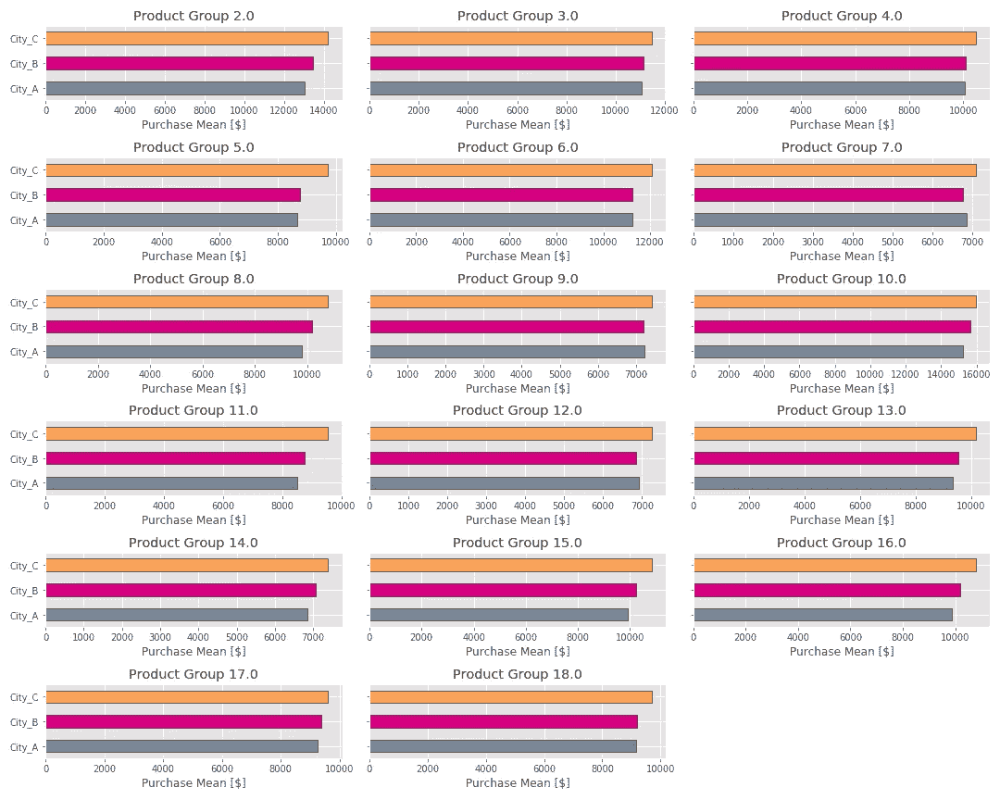

## 按城市划分产品 _ 类别 3 的购买均值:

下图显示了第三个产品类别的信息。我们可以看到，这一类别有 15 种产品，产品 3 在所有城市中具有最高的购买价值。

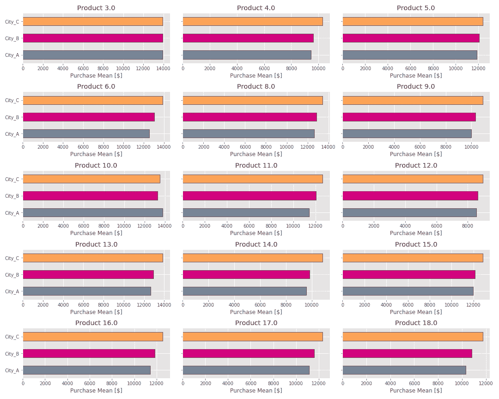

# 性别分析:

我们都知道了解性别对购买决策的影响的重要性。事实上，许多研究已经提出了一些问题，例如，在家庭中谁做购买决定。除此之外，考察性别在购买决策风格和产品类别、价格和其他特征方面的差异也很重要。

也就是说，让我们进行数据分析，获得一些简单但相关的客户行为洞察。首先，我们将绘制总购买量和每个性别的平均购买量。然后，我们将按年龄组绘制购买均值图，最后，我们将看到在城市 A、B 和 c，男性和女性在购买产品方面的差异。

## **按性别分列的购买数量和购买均值**

现在，看下面的图表我们可以看到男性消费者的总数( **414259** )大约是女性( **135809** )的三倍。我们还可以注意到，令人惊讶的是，两性的购买手段并没有太大的差异。尽管男女人数存在明显差异，但男性消费者的平均购买量仅略高于女性(700 美元)。基于这一点，我会说这些女性消费者对企业来说真的很重要，例如，可以成为特别营销活动的目标。

## **按性别和年龄组划分的购买均值:**

出于比较不同年龄段和性别的购买模式的目的，我们可以看看下面的条形图。他们显示，对于 18 至 25 岁的顾客，男性群体的购买均值比女性群体的购买均值高出 1000 美元以上。我们还可以看到，男性消费者在所有年龄组中都占据首位，尽管这种差异在 18-25 岁年龄组中并不明显。

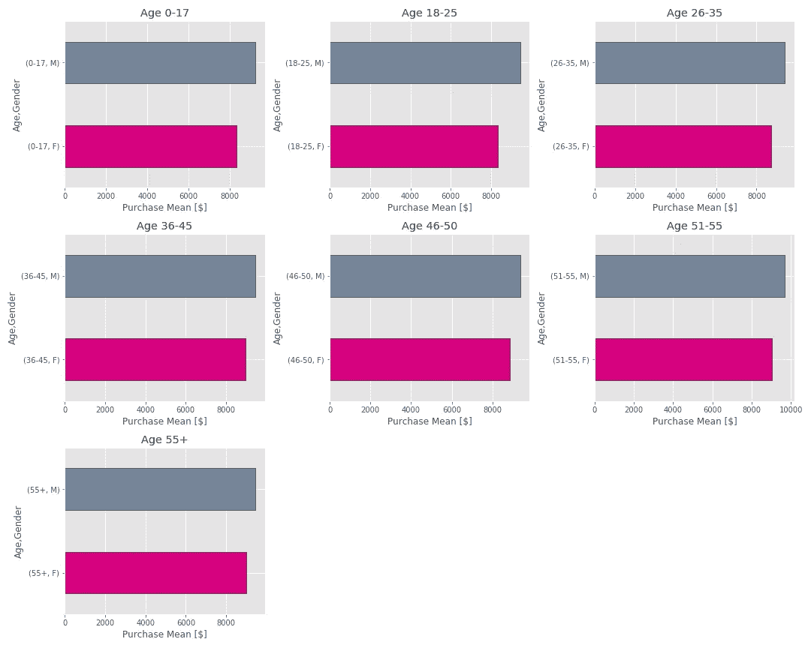

## **按性别和城市划分的购买均值:**

最后一项性别分析包括了解每个城市的两性是如何购物的。为了实现这一目标，让我们花一点时间来分析下面的条形图，它准确地描述了我们正在寻找的东西。他们显示，在所有城市中，男性比女性花费更多的钱(*这一差异仅在 C 市*有显著意义)，C 市在两性的购买手段方面都名列第一。同样值得注意的是，居住在 B 市的男性比居住在 A 市的男性购买更多，而来自 A 市的女性比居住在 B 市的女性购买更多。

# 职业分析:

你认为消费者的职业类型会影响他们的购买行为吗？嗯，我希望职业和消费者对他们所花金额的态度之间有一些联系。让我们通过绘制条形图来检验这一点。

让我们从绘制每个职业的购买均值开始。该柱状图为我们提供了每位消费者在职业方面的购买习惯的综合信息。

看下面的图，我们可以注意到，职业 12、15 和 17 位于购买方式的前三位。我们还可以看到，职业 9、19 和 20 比其他职业花费的钱少。这些信息真的有帮助吗？我们能利用关于每个专业人员在城市花费的金额的洞察力吗？这正是我们在随后的可视化中看到的。

虽然第一个条形图给了我们重要的信息，但第二个数据 viz 让我们更好地了解了 A、B、c 三个城市中每个职业所花的钱。

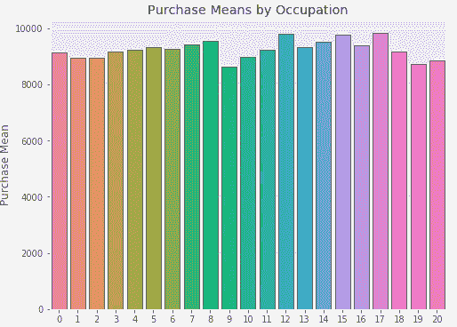

## **城市职业:**

下面的条形图描述了每个城市中每个职业的购买均值。有趣的是，在几乎所有的职业中，C 城拥有最大的购买手段。我们只在职业 8、9 和 19 中看到了这种模式的变化。另一个有趣的事实是，在 A 城市，数字 8 是他们职业的人花费最多的钱。

所以，关键是，如果我们在不同的图表中把每个职业分开，我们更有可能轻松地利用洞察力。换句话说，这使得其他团队(如市场部)的同事使用我们的发现变得特别容易。我们可以简单地将它们导出到 plots 文件夹，人们可以浏览这些图像，并能够将它们拖放到 PowerPoint 演示文稿或其他报告中。

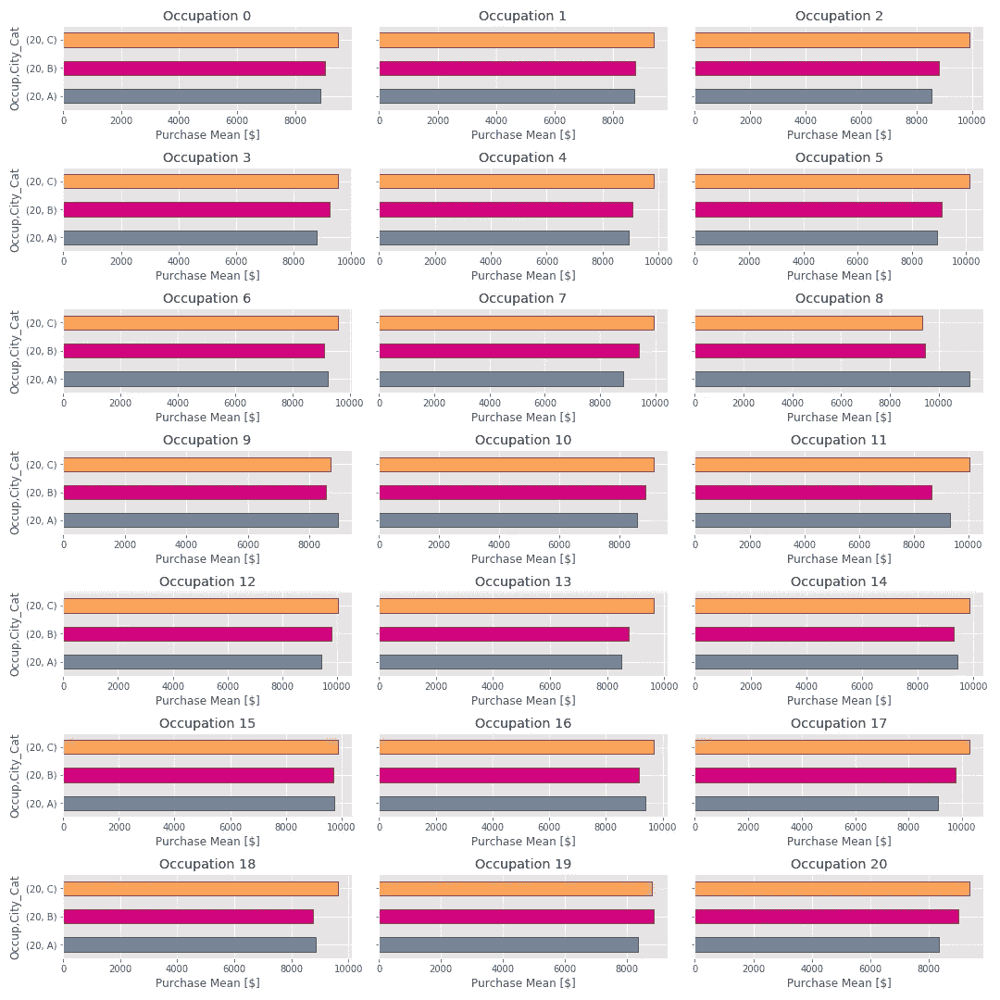

# 热图:

基本上，热图是一种图形数据表示，使用颜色编码方案来表示不同的值。在我们的例子中，我们正在生成数据集特征之间相关性的热图。

为了生成热图，我们必须对分类数据进行数字编码。换句话说，我们必须将列 Product_ID、Gender、Age、City_Cat 和 Stay_In_Current_City_Years 转换为数字列，如下面的代码行所示。

编码之后，我们得到了下图。有趣的是，这两种产品之间存在正相关关系，这正是我们可能期望看到的，因为它们可能属于不同的类别。此外，年龄和婚姻状况之间的相关性还有一点值得一提。

# 聚类图:

我们将通过绘制一个集群图来完成这个分析。聚类图使用层次聚类将要素按其相关程度进行分组。当我们分析变量之间的关系时，这使得变量之间的相关性特别有用。在我们的例子中，我们有 11 个要研究的特性，因此，不是目测变量是正相关还是负相关的热图，而是将图表分割成簇，这样更容易分析。

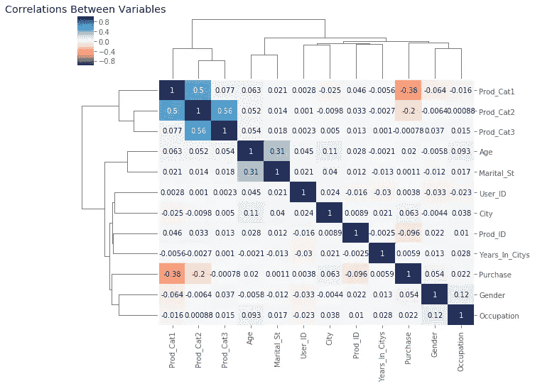

查看上面的图，我们可以看到，聚类算法认为产品类别 2 和 3 聚类在一起，而年龄和婚姻状况形成了另一个强关联的聚类。我们可以通过查看它们之间的
链接来观察。它们首先形成并具有最短的分支，这表明它们更类似于具有最高分支的那些。

我希望你和我一样喜欢这个分析。我们已经看到，当我们需要尽快产生洞见时，写作如何快速生成我们的发现的可视化，并使我们的生活变得更容易。如果你有更有效的方法，请随意评论。

