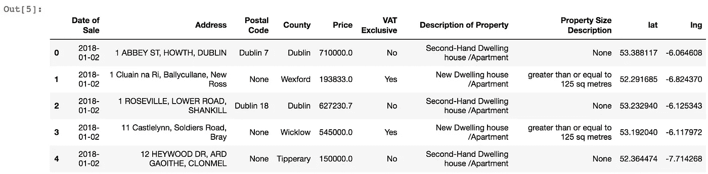
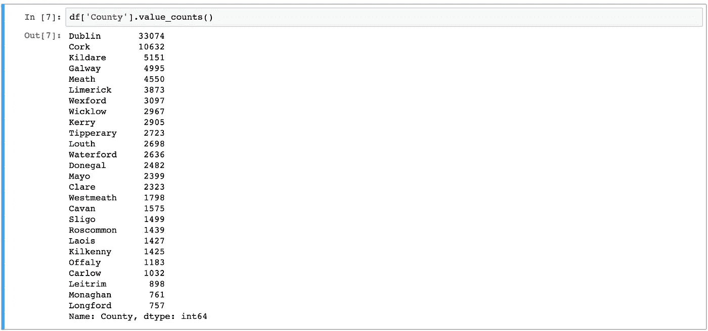
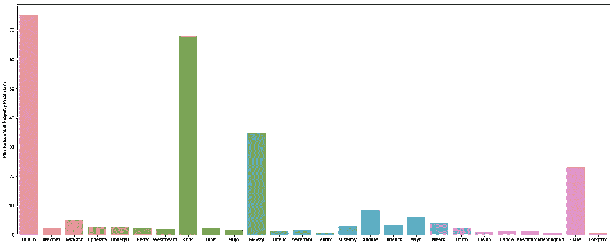
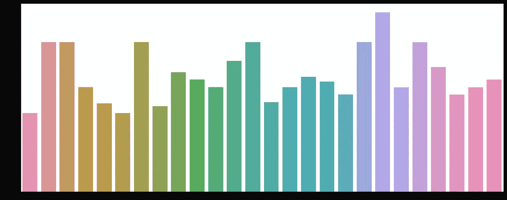
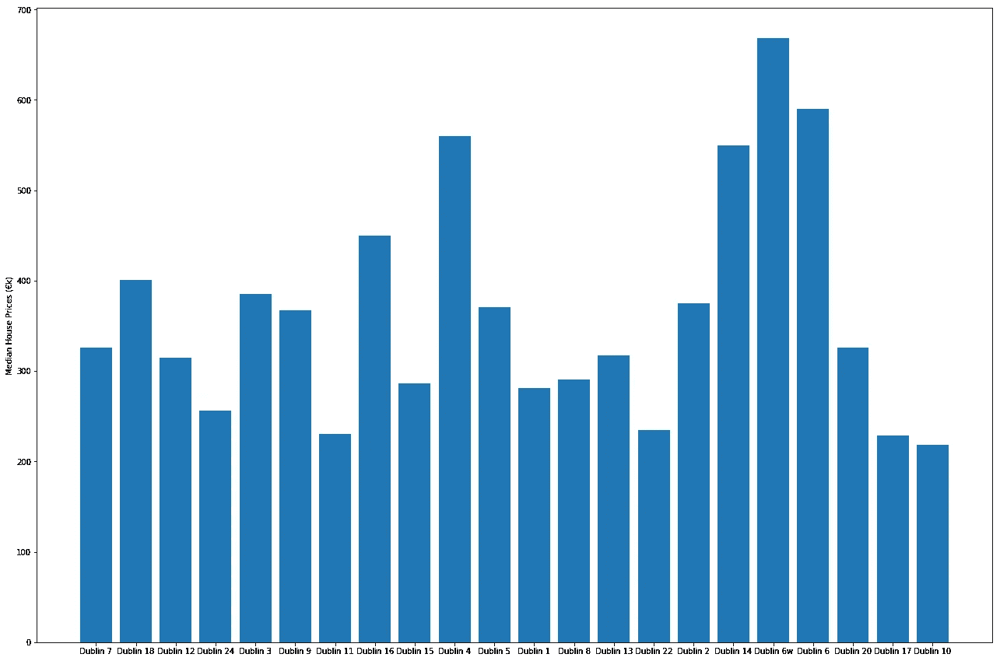

# 爱尔兰房地产价格分析

> 原文：<https://towardsdatascience.com/an-analysis-of-property-prices-in-ireland-6fc34a56ac87?source=collection_archive---------19----------------------->


都柏林正处于住房危机之中。城市的部分地区已经引入了租金控制，但是还没有对价格产生影响。许多年轻工人无力租房，更不用说凑钱购买住宅了。作为数据探索的一个练习，我想看看爱尔兰的房屋购买价格以及影响房产成本的因素。

2011 年，物业服务监管局(PRSA)建立了一个住宅物业价格登记册，以努力使物业价格对买家更加透明。从他们的[站点](https://www.propertypriceregister.ie/website/npsra/pprweb.nsf/page/ppr-home-en):

> 它包括自 2010 年 1 月 1 日以来在爱尔兰购买的所有住宅物业的销售日期、价格和地址，已向税收专员申报，用于征收印花税。

# 处理数据

所有记录均可从 PPR 物业价格登记处网站以 CSV 格式下载。在这篇文章中，我们将看看过去两年的数据。应该注意的是，PPR 页面包含一个免责声明:

> PSRA 不以任何方式编辑数据。它只是以完全透明的方式公布向税务专员提交的申报数据。如果数据文件包含印刷错误，那么这些错误将出现在登记册上。

让我们来看看使用 Pandas 清理原始信息的一些步骤:

1.  删除价格不是完全市场价格的属性，并删除包含少量爱尔兰语言属性描述的行。

```
df = df[df['Not Full Market Price'] == 'No']df = df.drop('Not Full Market Price', axis=1)df = df[(df['Description of Property'] == 'Second-Hand Dwelling house /Apartment') | (df['Description of Property'] == 'New Dwelling house /Apartment')]
```

2.看看 2017 年以后的数据子集。

```
df['Date of Sale (dd/mm/yyyy)'] = pd.to_datetime(df['Date of Sale (dd/mm/yyyy)'], dayfirst=True, format='%d/%m/%Y')df = df.rename(columns={'Date of Sale (dd/mm/yyyy)': 'Date of Sale', 'Price (€)': 'Price'})df = df[(df['Date of Sale'] > '2017-01-01')].reset_index(drop=True)
```

3.将 price 列从字符串解析为浮点数。

```
df['Price'] = df['Price'].apply(lambda x: x.lstrip('\x80'))df['Price'] = df['Price'].apply(lambda x: float(x.split()[0].replace(',', ''))).astype(float)
```

4.尝试使用[谷歌的 API](https://developers.google.com/maps/documentation/geocoding/start) 进行地理编码，以获取属性的纬度和经度。

为了清楚起见，我应该指出，我为过去两年的 PPR 数据获得的坐标证明是不够准确的，所以我没有把结果包括在这篇文章中。错误很可能在于数据中包含的记录地址(这是 PRSA 自行报告和未经编辑的)，而不是谷歌的实际 API。如果将每个房产的县附加到地址的末尾(有些地址包含县，但有些不包含)，则准确性可能会提高。不管有多不准确，我觉得包含请求坐标的代码是很重要的。

获取请求 url 创建者功能:

```
def url_creator(address, url='https://maps.googleapis.com/maps/api/geocode/json?address=', api_key=''):
    logger.debug('Creating API request URL')
    add_list = address.split()
    add_list = [line + '+' for line in add_list[:-1]]
    add_list.append(address.split()[-1])
    add_url = "".join(add_list)
    return url + add_url + '&key=' + api_key
```

纬度和经度请求功能:

```
def lat_lng(address, api_key=''):
    logger.debug('Requesting geospatial info from Google API')
    url = url_creator(address, api_key=api_key)
    try:
        response = requests.get(url)
        response.raise_for_status()
    except requests.exceptions.HTTPError as e:
        logger.error(e)

    results = response.json()['results']
    if len(results) != 0:
        logger.debug('Found geospatial coordinates')
        return results[0]['geometry']['location']['lat'], results[0]['geometry']['location']['lng']
    else:
        logger.debug('Could not find geospatial coordinates')
        return np.nan, np.nan
```

我之所以编写自己的代码来使用地理编码 API 完成这些(以及更多)工作，而不是使用流行的 [geocoder](https://github.com/DenisCarriere/geocoder) 库，是因为该库中强加的 API 的配额行为已经过时。Google 最近已经可以对其地理编码 API 进行无限数量的请求，但是 geocoder 的 Google 地理编码方法似乎将 API 调用限制在 2500 次。如果您感兴趣，我在本文末尾链接的 GitHub repo 中包含了我用于处理数据和地理编码的所有代码。

# 房地产价格登记册分析

查看数据的标题，我们可以看到每一列都包括分类数据，不包括房产的实际价格。



Figure 1: Head of PPR data.

大多数列也只包含 2-3 个唯一值。缺乏数字数据(如卧室数量、可用设施、房产的确切面积，单位为平方米)。m 等。)和重要的分类变量(例如，该物业所面向的方向)使得该数据对于机器学习来说不是最佳的。然而，我们仍然可以对影响爱尔兰房地产价格的因素获得一些有价值的见解。

让我们看看每个县在数据中的表现如何:



Figure 2: Value counts for counties in PPR data.

我们可以看到，都柏林、科克、基尔代尔、戈尔韦和米斯在过去两年中购买房产的数量最多。绘制这 5 个县的房地产价格分布图:

Figure 3: Distributions of 5 most represented counties.

一些明显的异常值，尤其是在都柏林，正在打破小提琴阴谋的规模。让我们只看看高达€200 万英镑的价格。

Figure 4: Distributions of 5 most represented counties with property price limit at €2m.

不出所料，都柏林拥有最昂贵的住宅物业(即使在剔除极端异常值后)，平均房价在€17 万到€15 万之间，高于上述其他 4 个县。有趣的是，基尔代尔和米斯的平均房价更高，尽管科克和戈尔韦提供了蓬勃发展的学生文化、夜生活、旅游以及熟练和非熟练工作机会。这可以归结为他们靠近都柏林的城市扩张。让我们深入研究这个问题，并把与都柏林接壤的另一个县——威克洛纳入我们的分析，看看那里的房价是否与基尔代尔和米斯的房价相当。

Figure 5: Distributions of counties bordering Dublin with property price limit at €2m.

从图 5 来看，维克罗的平均房价甚至比基尔代尔和米斯还要高。似乎大多数人宁愿住在都柏林的郊区，也不愿搬到更远的地方，如戈尔韦或科克。都柏林及其周边县的综合房价中值为€31 万英镑，而爱尔兰其他地区的房价中值正好是€15.5 万英镑的一半。人们想要住在爱尔兰的经济中心或附近，这并不完全令人震惊，但这些县和都柏林之间的住宅价格差异的确切程度看起来很明显。

让我们回到图 3，仔细看看极端的异常值。我们可以看到，都柏林 2017 年至 2018 年间的最高房价为€7500 万英镑。让我们看看所有其他县的最高房价，因为我们也可以看到，在过去的两年里，科克的一所房子以 6770 万英镑的价格卖给了€。



Figure 6: Most expensive residential property in each county.

都柏林、科克、戈尔韦，有趣的是，克莱尔在过去几年拥有最昂贵的住宅。但是这些仅仅是整栋公寓大楼吗？无数公寓的价格被汇总并列在一个地址下？正如 PPR 网站所述，情况很可能就是这样:

> 在许多公寓以单一价格出售的情况下(例如橡树大道 1 号至 15 号公寓以€200 万英镑的价格出售)，登记册上的信息取决于向税务专员提交的内容。
> 
> 例如，文件管理器可能已经输入了-
> 
> -只有一套公寓(如橡树路 1 号)的价格为 200 万€；
> 
> -每套公寓分开，并在每套公寓之间划分价格(例如，1 号公寓为€133，333，2 号公寓为€133，333，依此类推，15 号公寓为€133，333)。
> 
> -所有公寓(如橡树大道 1 号至 15 号)，价格为 200 万€。
> 
> 出售日期是印花税报税表的申报人输入的日期，作为转让物业所有权的契据日期。

深入挖掘构成前 4 名最昂贵房产的个人地址，发现它们确实都是公寓楼(其中一栋是学生宿舍)。然而，基尔代尔的小幅上涨是一栋单房以 800 万€的价格售出。我敢肯定，如果我们挖掘都柏林的离群值，我们会发现一些非常富有的个人的昂贵房产。各县卖的最便宜的楼盘呢？



Figure 7: Cheapest residential property in each county.

这里的县与县之间有很多相似之处。我把这归因于都柏林、科克和戈尔韦的大量公寓，它们打破了图 6 中的比例。每个县最便宜的住宅可能是小公寓(在城市地区)或小屋(在农村地区)。这个情节最有趣的一面是，都柏林实际上在过去的两年里卖出了最便宜的住宅。

你可能会认为都柏林周围的价格如此之高是因为人口过剩和城市的溢出。快速浏览一下全国售出的房屋数量就可以发现，情况并不一定如此。都柏林购买了 33，074 套房产，都柏林及其周边各县购买了 45，742 套房产，除都柏林、基尔代尔、米斯和威克洛之外，该国其他地区购买了 54，557 套房产。同样，整个公寓楼在登记册中被列为一个地址的事实可能会使这些数字偏离一个很好的位置，但有趣的是，尽管该国大多数人口生活在都柏林或其周围，但仍有大量住宅物业在首都以外被购买。在过去的两年里，爱尔兰总共购买了 100，299 套住房。其中 81，886 套是二手房，其余 18，413 套是新房/公寓。€新房的中值价格是 28.1 万英镑，而€旧房的中值价格是 20.7 万英镑——两者之间的平均差距接近€的 8 万英镑。看起来购买一套二手房可能是个不错的选择(如果你安顿下来后不需要太多的维修)。

此时，你可能会说“好吧，我明白了。都柏林的房价很贵”，你不会错的。但你会问，都柏林哪里的房子平均最贵？从图 8 来看，答案就在南边。



Figure 8: Median property prices per Dublin postcode.

并非所有都柏林的邮政编码都出现在最近两年的 PPR 数据中。有很多缺失值，在这些值中，提交房产购买的人没有包括邮政编码，或者只是在地址中包括了邮政编码，而没有填写实际的邮政编码字段。查看我们现有的数据，我们发现都柏林 6 区和 6w 区的平均房价最高。这些都是都柏林富裕南区的特别富裕的地区。都柏林 14 酒店也位于该区域旁边，因此它拥有第二贵的酒店是有道理的。都柏林 4 和 16 完成了这个图表的南部统治。任何熟悉该地区的人都不会感到惊讶，该县西部和北部的邮政编码构成了这里最便宜的房产。当然，这并不是对这些地区的任何人的轻视——都柏林 15 区(我住的地方)也是房产价值中值最低的地区之一。

那么我们从这个分析中学到了什么呢？嗯，我们知道，如果我们想省钱，我们应该在都柏林及其周边 3 个县之外购买一处房产(也许有人可以对搬到奥法利和通勤到都柏林所节省的钱进行成本效益分析？).然而，PPR 的数据远非完美，因此，任何基于这些数据的房地产价格分析都应持保留态度。房产价值被像整个公寓大楼被列为一个地址这样的事情打乱了——特别是在都柏林、科克和戈尔韦，这些地方已经建起了城镇中心，并拥有爱尔兰最大的大学。最后，这些数据的自我报告、未被触及的性质带来了错误，使得地理编码等工作比发布前编辑数据要困难一些。

Chirag Chadha 是爱尔兰都柏林 UnitedHealth Group/Optum 的数据科学家。你可以通过他的电子邮件(chadhac@tcd.ie)或通过他的 [*LinkedIn*](https://www.linkedin.com/in/chirag-chadha-83316333/) *联系到他。*

[](https://github.com/cchadha2/ppr-housing) [## cchadha 2/PPR-外壳

### 使用房地产价格登记数据预测爱尔兰的房价- cchadha2/ppr-housing

github.com](https://github.com/cchadha2/ppr-housing)