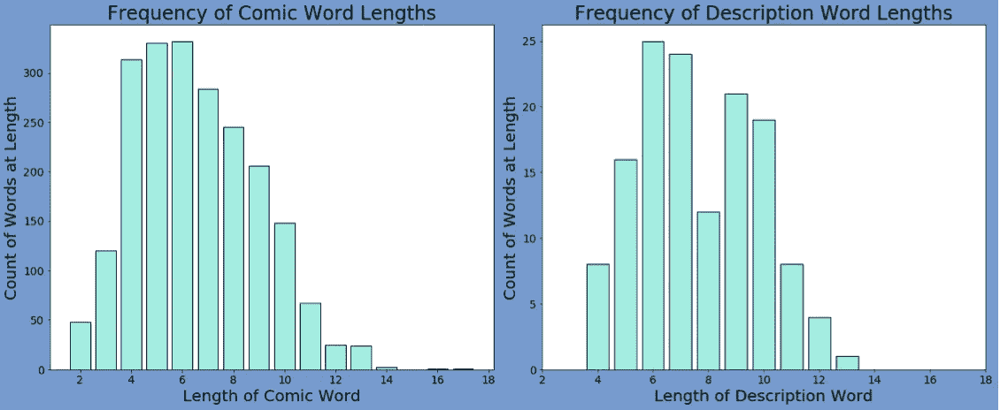

# 《奇异星球》系列漫画解析

> 原文：<https://towardsdatascience.com/an-analysis-of-the-strange-planet-comic-series-56410af3a5b1?source=collection_archive---------24----------------------->

## 以及构建分类模型以从任意长度的列表中选择项目的挑战

# 对于那些不熟悉陌生星球的人来说:

## 这是什么？

[奇异星球](https://www.instagram.com/nathanwpylestrangeplanet/)是内森·w·派尔创作的网络漫画。在这些漫画和他拟人化鸽子的周末故事之间，他的是我最喜欢关注的 instagrams 之一。在漫画中，派尔发表了关于普通人类互动的文章，将人类描绘成外星生物

我花时间分析了 instagram 上发布的所有漫画，以便建立一个模型，可以预测任何给定漫画的帖子描述。

## 为什么会有人想预测描述？

几乎每篇帖子都包括一个单词的漫画描述，格式如下:

随着时间的推移，追随者在阅读这个单词之前就已经开始猜测它了(并且在他们猜对的时候宣布)。这引发了如下讨论:

如果你不跟着漫画走，很难解释为什么玩这个猜谜游戏很有趣或令人兴奋，但对我和许多其他人来说，就是这样。

这一切都启发了我，让我看看我是否能创造出一种能替我猜测的算法。

# 选择用于分析的漫画

为了更容易地训练我的预测模型，我只分析了符合以下标准的漫画:

*   漫画正好是 4 个面板
*   漫画中准确地列出了描述
*   描述只有一个词

几乎每部漫画都符合这些标准，给了我 138 部漫画。

# 探索性数据分析

## 字数

《奇异星球》漫画平均 35 个字。最短的漫画有 5 个字，最长的漫画有 74 个字。第三面板最有可能没有文字(14%的漫画第三面板是空的)。

随着时间的推移，漫画也变得稍微长了一些:

## 漫画中帖子描述的位置

关于漫画中描述出现的字数，似乎没有明显的趋势。然而，描述更有可能出现在第三个或第四个面板中，而不是第一个或第二个面板中(如果描述性单词在漫画中出现不止一次，所有实例都会在下面显示)。

## 词汇使用频率

我运行了两个模型，看看哪些词在帖子中使用频率最高。在第一个模型中，我没有排除停用词，因为我认为陌生星球宇宙中的生物的语言可能没有 Python 分配给英语的停用词。我发现漫画中最常用的 20 个单词都属于停用词的范畴，所以我做了一个新的模型，把停用词排除在外。(经常阅读的读者不会惊讶，找到了走向巅峰的“寄托”。)

从第二个词表开始，我还构建了一个词云，展示《奇异星球》中最常用的词。

## 情感分析

我利用了 TextBlob 库中的朴素贝叶斯情感分析。从这个分析中，我记录了一个漫画或描述词有积极情绪的可能性。

从这个情绪分析中需要注意一些事情:

*   该描述更有可能被分析为具有中性情绪(概率=0.5)。这是有意义的，因为描述比整个漫画更少的材料来推断情绪。
*   蓝线表示图表中漫画的情感和描述的情感相同的区域。在这条线以上，描述比漫画更可能是正面的。在这条线以下，漫画比描述更可能是正面的。大多数点都在这条线以下，表明漫画倾向于被解释为更积极的。
*   一般来说，奇怪的星球漫画很可能有积极的情绪(更多的点在图表的右侧)。

## 单词长度

描述往往比漫画中的平均单词长，如下面的两个直方图所示。漫画中的单词长度倾向于右偏，而描述性单词具有更正态/双峰分布，平均为更长的单词。

# 模型

## 一些假设

到目前为止，停用词从未被用作描述。为了简化我的模型并使它(可能)表现得更好，我假设一个停用词永远不会被用来描述一篇文章。

在所有的漫画中，只有两个描述性的词用了两次(其余的都是独一无二的):

> d e l i b e r a t e
> 
> c o m p l e t i o

为了建立模型，我做了一个类似的假设，即一个描述词永远不会被重新使用。即使我知道这不是真的，但这种情况经常发生，我更愿意使用正确的假设，因为我知道当一个单词被重复时，我将是不正确的。

## 模型构建挑战

通常，在创建分类模型时，您希望它接受输入数据并输出该数据的分类:

然而，在这种情况下，我们并不是确切地看着一个单词并猜测它是否是描述。相反，我们查看不同长度的列表，并预测列表中的哪个单词是描述。

为了解决这个问题，我将我的训练数据转换成一个传统的分类问题，其中漫画中的每个单词都是一个独特的样本。对每个单词样本进行的预测是将它放入两个类别之一:“是描述”或“不是描述”这允许我建立一个标准的分类模型(在这个项目中，是一个随机的森林模型)。

一旦我建立了模型，我就以稍微不同的方式处理我的测试数据。对于漫画中的每个单词，我使用分类模型来分配成为漫画中每个单词的描述的概率。然后，一个单独的模型选择概率最高的单词作为其对描述的猜测。

## 不平衡的班级

由于我用来创建训练数据集的方法，我的数据被拆分为:

*   我的样本中有 3.8%属于“描述”组
*   我的样本中有 96.2%属于“不是描述”组

对于不平衡的类，我努力创建一个模型，它不会只是假设所有的样本都不是描述。为了解决这个问题，我在我的训练数据上使用了这里列出的过采样和欠采样技术。

为了传达重采样如何改变我的模型所基于的数据，这里有两个配对图，显示了我的模型正在使用的一些输入要素。在下面的图中，蓝点表示漫画中的单词，而不是描述中的单词。橙色圆点表示描述词。

左边是我重新平衡之前的数据。右边是我重新平衡后的数据。请注意右图中橙色点的百分比有多大。

还要注意，EDA 部分列出的一些观察结果可以在上面的散点图和直方图中看到。例如:

*   描述词的长度通常比漫画中的其他词长(参见第 2 行第 2 列的直方图，其中描述的分布更长)
*   漫画情感与描述(紫色点)的早期散点图表明，描述比整体漫画更可能是中性的。然而，该配对图包括单独的所有单词，利用该数据，我们看到不是描述单词的单词最有可能是中性的，而描述单词相对于其他单词具有相当正常的情感分布(参见配对图中的第三行)。

# 结果呢

我很难过地说，我的模特表现得很可怜。在我试图用数据拟合的 37 部漫画中，我没有一个单词是正确的。下面是我试图猜测的单词(“单词”)和我的模型预测的单词(“rf_predict”)。

当我在重新采样的训练数据上拟合模型时，我有理由相信模型会表现良好。我的 f1 成绩是 0.95，准确率是 0.97。这远远高于我采样的 75%的基线精度。

## 那么为什么我的模型表现这么差呢？

对于在训练数据中表现良好而在测试数据中表现不佳的模型，我的第一直觉是该模型过度适合训练数据。然而，在这种情况下，这可能是也可能不是一个问题。

训练数据有一个更容易解决的分类问题:

> 一个给定的词是不是描述？

通过随机猜测，这个模型有 50%的可能性是正确的。

然而，测试数据是一个更具挑战性的问题:

> 在这个单词列表中，哪个单词最有可能是描述？

通过随机猜测，正确的几率从 20%到 2%不等。

其他一些很难预测的原因描述如下:

*   虽然 138 幅漫画对于创作者来说在短时间内完成是一个很大的数目，但这真的不足以制作一个好的模型。
*   在这个训练营中，我的数据建模工具每天都在增加。我在两周内学到的一项新技能可能会帮助我更好地构建这个模型。一整年后，有了新的漫画和新的技能，谁知道我的准确度还能提高多少。
*   我使用的输入特征可能不能很好地预测输出
*   我用来对数据进行重采样以改善不平衡类的方法可能会引入新的问题。

# 结论

我本来非常希望做一个模型，能在大部分时间(或者部分时间，或者至少一次)告诉你一个帖子的描述。不幸的是，在对我的模型进行多次更新后，我无法到达那里。

作为对派尔先生的敬意，也为了表达我看到我的预测模型的性能时的感受，我画了下面这幅漫画。

a n t i c i p a t e

我还欣慰地知道，已经有一部奇怪的星球漫画承认做出某些预测是多么具有挑战性:

[1]停用词是既频繁使用又传达不了什么意思的词。在英语中，这些单词包括:I，the，it，who，that，因为，any…删除这些单词通常很有用，因为它们主要是给模型添加噪声。

[2]在自然语言处理(NLP)中，朴素贝叶斯模型从所有单词相互独立的假设开始。在某些情况下，这可能是有问题的(例如，如果文本说“不快乐”，单词“不”和“快乐”被解释为不相关)。虽然这看起来像是一个天真的假设(明白吗？明白了吗？:) )，它通常可以创建有用的预测。在这种情况下，我将漫画的情感分析与漫画分析中的一个词进行比较，我相信通过独立地分析每个词，我会得到最好的结果。

[3]在建立预测模型时，您总是希望将现有的数据拆分为训练数据和测试数据。您的模型是围绕给定的训练数据构建的。然后，为了让您看到模型实际上有多预测，您给它您的测试数据集(它以前没有见过)来进行预测。

在大多数情况下，您会以相同的方式处理训练数据和测试数据。然而，为了更清晰地训练我的模型和更真实地测试我的数据，我对训练数据和测试数据进行了不同的处理。