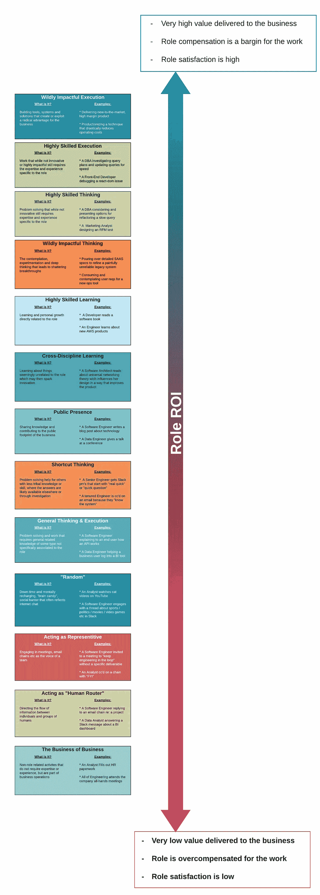
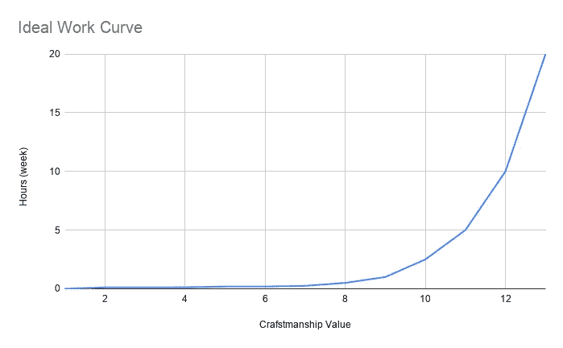

# 知识工作者度量方法

> 原文：<https://towardsdatascience.com/an-approach-to-knowledge-worker-metrics-55574efc210c?source=collection_archive---------26----------------------->

如果你不能管理你不能衡量的东西，那么我们中的很多人实际上都是无法管理的。这是我如何解决这个问题的方法。

Photo by [Austin Distel](https://unsplash.com/@austindistel?utm_source=medium&utm_medium=referral) on [Unsplash](https://unsplash.com?utm_source=medium&utm_medium=referral)

在最近的一次“振作起来”的探索中，我首先确定了基石目标——能够有效地成就或毁灭我的世界的大的、影响广泛的生活组成部分。当列出这些目标时，我立即写下“在工作中更加有效”。这是我最大的挑战之一(也是潜在回报最大的潜在改进领域)。我缺乏专业效率表现在很多方面:虽然我的实际工作成果高于平均水平，但这是以加班和周末加班为代价的，在工作日把自己磨得筋疲力尽，发现自己经常处于近乎疯狂的状态，这与我周围的文化格格不入。我工作的方式不是…工作。

解决复杂挑战的第一步总是研究，了解比我聪明得多的人对这个问题的看法。由于我的研究必须支持我更大的跨职能目标(不仅限于工作效率，还包括我更大的目标“让我的 sh*t 在一起”)，如果没有上下文，这些来源可能会显得有点古怪；然而，来自每个工作线程的位一起建立该方法所基于的给定原则。以下是我阅读清单中的相关标题，排名不分先后:

*   [**【米哈里·契克森米哈】**](https://www.amazon.com/Flow-Psychology-Experience-Perennial-Classics/dp/0061339202)
*   *[***如果在路上遇到佛，杀了他*** *(谢耳朵*](https://www.goodreads.com/book/show/119390.If_You_Meet_the_Buddha_on_the_Road_Kill_Him) *)**
*   *[***店铺类*** *(马修克劳福德*](https://www.goodreads.com/book/show/6261332-shop-class-as-soulcraft) *)**
*   *[***深度作品****(Cal Newport)*](https://www.goodreads.com/book/show/25744928-deep-work)*
*   *[***制造者的时间表，管理者的时间表*** *【保罗·格拉厄姆】*](http://www.paulgraham.com/makersschedule.html)*

*出于多种原因，所有这些作品都值得一读，如果你有时间，直接去阅读它们的来源会更好。从综合的假设、断言和普遍支持的结论中，我得出了这些原则:*

*   ***手艺可以赋予生活意义，可能是通往幸福的捷径。自从尼采宣布上帝已死，我们被迫寻找自己的人生目标；掌握一门手艺并从我们的劳动中结出实实在在的果实，这种行为已经被证明是做到这一点的方法。***
*   ***手艺要求一个人深深地投入到自己的工作中。**这种深度参与有多种名称(“心流”、“深度工作”以及某种程度上的“实际掌握”)，是收获工艺益处的关键因素。*
*   ***对于知识工作者来说，手工艺(通常)的投资回报率最高。一名年薪 15 万美元的资深营销人员最有价值的实践是:在这种情况下，设计大获成功的新活动或提高广告支出的效率。离开他们的工作(如填充报告)的时间会产生非常低的投资回报率。***
*   *因为知识工作很难衡量，我们默认用“忙碌”来衡量这在 Newport 的深度工作中得到了很好的扩展；没有具体的、短期的迭代(即每日)度量来定义成功，商业文化倾向于关注谁在做最 ***可见的*** 工作——而不考虑工作的价值。谁在聊天中回复最快，或者凌晨 3 点发送的电子邮件最多？谁和老板见面次数最多，cc 的人最多？这通常是知识工作者价值的实际衡量标准。*
*   *对于大多数知识工作者来说，忙碌是成本中心，而不是利润中心。回复电子邮件、参与即时消息聊天和在状态会议中坐在幻灯片台前都不是有利可图的任务。没有针对“很少使用的中层管理电子邮件链”的第三方市场；客户购买创新的产品、有影响力的服务、更高效的流程和令人兴奋的功能。这些有价值的东西是知识工作者执行工艺的产品——设计、发明、工程、审计和营销——这几乎总是与繁忙的工作不一致。电子邮件、聊天和开放式办公室飞临都属于商务旅行中的销售费用。奖励凌晨 3 点发邮件者的知识工作的公司文化，也可能会根据销售人员在销售活动中的花费来奖励他们。*
*   *如果知识工作者从工艺中获得最大的投资回报，并且工艺最有可能为知识工作者提供意义和快乐的源泉，那么管理知识工作者就变成了让他们在工作日尽可能多的时间从事深度工艺工作。*

**

*Woah. You said it NDT.*

# *该理论*

*我的职业是数据工程师。我一直认为，与其他知识工作者不同，我们这些从事软件工作的人拥有真正的生产力指标优势——我们有故事点，对吗？除了当我更深入地探究我在效率上的挫折和失败时，它们几乎*从未*植根于架构和开发软件的技术工作中。我能够把我的团队锁在一个有白板的房间里并解决一个复杂问题的时候，是我感到活着、有目标并深深沉浸在“心流”中的时候。这些时期充满活力。会议的冲击，像俄罗斯方块一样塞满我收件箱的电子邮件流，像数字爆米花一样充斥在我的通知栏中的松弛脉冲，成为我精疲力竭的重压。更重要的是，这些工作没有一项是我的度量标准可追踪的；回复一封 25 人的电子邮件链已经有 3 周了，有多少敏捷故事点？*

*所以我收集了我所做的所有不同类型的工作，并把它们分成不同的商业价值类型。然后我把它们按照从**深度工艺工作→浅度无用功**的等级分类(深度工作、浅度工作和这个一般概念的大部分直接来自[纽波特的书](https://www.goodreads.com/book/show/25744928-deep-work)，同样 100%值得一读)。这是我想到的:*

**

*Gradient of different types of knowledge work*

*我的排序是从最忙碌的工作(最没有价值)到最有技术含量的工作(最有价值):*

1.  ***业务的业务**是我所说的公司会议、管理和评估工作，以及通常知识工作者作为员工需要做的与他们的实际角色无关的所有事情。*
2.  ***充当人类路由器**直接取自*深度工作*，这可能是我听到的关于大量电子邮件和即时消息的最佳描述，这些邮件和即时消息用于移动信息，而没有在这个过程中增加任何高技能价值。经常包括“请指教”这样的话。*
3.  ***作为代表**出席会议，通常表现为“我们这里应该有一个<的人插入你的团队>”。*
4.  ***“随机”即传统上被认为是“偷懒”的事情，比如聊足球比赛或在社交媒体上看视频。***
5.  *****一般思维&执行**像医生给病人量血压。***
6.  ***捷径思维,比如一个经验丰富的营销人员告诉一个初级人员发送电子邮件应该使用什么样的模板。***
7.  *****公共场合**比如建筑师在会议上演讲。***
8.  *****跨学科学习**即数学家阅读有关拿破仑的战术。***
9.  ***高技能学习就像一名工程师阅读应用程序设计的新理论。***
10.  ***广泛而有影响力的思维比如一名机械工程师在考虑一种新的内燃机方法。***
11.  *****高技能思维**比如一名会计师在为一家大公司考虑最佳的税收方案。***
12.  *****高度熟练的执行**比如做你擅长的手术。***
13.  *****极具影响力的执行**即建立一项改变世界的技术，如反重力或汽车。***

***其他知识工作者可以并且应该移动这些，添加它们，根据需要取走一些，直到感觉合适为止。不同的组织会对不同的工作有不同的评价——因此，虽然一个团队可能都同意前 3 条，但管理层可能会觉得高技能学习比考虑大事更重要。一些要点:***

*   ***与许多人相比，我把捷径思维放在了较低的位置，因为“快速提问”对深入工作的过程极具破坏性。为新开发人员节省 10 分钟搜索代码库的时间(无论如何，他们可能会从中受益)可能会打破高级开发人员的创造性思维，这将会是一笔财富。***
*   ***一般的想法是，当人们被“因为他们聪明”而卷入一些他们不需要的事情时。首席执行官想要一个有经验的人来检查这个电子表格，所以他们指派了一个首席会计师，这个人非常胜任这项工作。***
*   ***注意，这个模型中的“随机”比参加一个松散相关的会议更有价值。如果一个知识工作者一天中长时间沉浸在工艺中，花 15 分钟看一段猫视频(一种精神净化)来冷却他们的大脑可能是他们投入“第二轮”所需要的***
*   ***我在公众面前挣扎。对于一些公司来说，在招聘人才时保持公众的关注是至关重要的。对于一些知识工作者来说，这是他们职业自我形象的重要组成部分。但是在两端都有一些公司和一些知识工作者，他们根本不在乎宣传，这将导致这种情况。***

# ***如果它有价值，就有衡量标准***

***所以我现在对我每天做的不同类型的知识工作有了一个标量值。如果我记录了我在每种知识工作上花费的时间，我就有了第二个数据点来矢量化我的工作分解。我可以将这些看做单独的条形图(每种类型的工作一个条形图，高度代表我每周投入的时间),或者我可以将 x 轴作为“工艺等级”,值为 1 代表业务的业务工作，值为 13 代表具有广泛影响力的执行工作，值为 13 代表具有广泛影响力的执行工作，值为 T3，y 轴代表累计小时数。然后我们有一个理想主义的国家目标，在一张图中，看起来像这样:***

******

***现在这和我现在的工作曲线看起来相差甚远。但这给了我和我的领导一套清晰可追踪的衡量标准，告诉我时间的使用效率(本质上是我的“知识工作者投资回报率”)。***

# ***在实践中***

***过去我在组织系统上失败的地方之一是保留我现有的工作流，同时试图从技术上从它们中提取指标。我设计了复杂的系统，从几十个应用程序中导入数据，从一个应用程序中的动作触发带时间戳的警报，以在另一个应用程序中捕捉。正如软件开发人员经常了解到，与其构建复杂的测试流程，不如首先编写更多可测试的代码，我也了解到，最好调整我的工作流程和习惯，使其更易于管理。以下是方法。***

1.  *****放好电话。**认真。我不是说“与世隔绝”，我是说通过只使用一个设备来克服管理多个设备的第一个主要障碍。我们通过电话交流的任何方式都有一个桌面等价物；短信、社交媒体和大多数聊天应用都可以在浏览器中使用。如果这意味着我的一些朋友需要停止使用他们坚持使用的任何深奥的聊天应用程序，选择一个主流应用程序，那么就这样吧。我不想错过我的另一半打来的紧急电话，所以为了以防万一，我把手机锁在了桌子上，把铃声的音量调到最大。***
2.  *****简化工具集。**目前，我仅使用几个组件来跟踪我的知识型员工的投资回报率。
    *谷歌日历(我的工作日历)
    * [本网站](https://www.projectwizards.net/en/support/ics2csv-converter)转换下载的日历。ics 文件到 a .csv
    * [这个 Chrome 扩展](https://github.com/Stigmatoz/web-activity-time-tracker)来跟踪我的浏览器使用
    * Google Sheets 来收集和整理数据
    我想建立一个完全自动化的系统，每天从每个来源 ETLs 数据(毕竟我是一个数据工程师)，但我决定最好是*证明然后润色*。如果几个月的手动生成的报告*证明*是有价值的，我将采取下一步，将*实现为一个完全自动化的系统。而且我保证让它开源:)。****
3.  *****单任务。你可以自己阅读所有关于[注意力残留的内容，但是可以说，一心多用对生产力有复合的负面影响。同样，如果我试图同时做几件不同的事情，也没有合理的方法来跟踪我在每一项任务上花了多少时间。这意味着当我在解决一个软件问题时，我会关闭我的电子邮件、Slack、Instagram 等。](http://citeseerx.ist.psu.edu/viewdoc/download?doi=10.1.1.183.1776&rep=rep1&type=pdf)*****
4.  *****从日历开始。对于我日历上的每一项，我都在描述中添加了一个标签，类似于`KWV=3`，其中 KWV 代表“知识工作者的价值”，3 代表工作类型(在我的量表中是“作为代表”)。对于我不拥有的会议，这只会显示在我的个人副本上，对于我拥有的会议，没有人会知道这意味着什么。现在，我可以在我的日历上安排一些块来代表对特定任务的专注。如果我要在午饭前处理一张 JIRA bug 票，我可以在我的日历中创建这个块，并在主体中包含适当的`KWV=12`标记。*****
5.  *****跟踪其余的。对于白天需要做的所有“肤浅的工作”,使用我的浏览器可以让跟踪插件替我做这些工作。写电子邮件、回复邮件、给朋友发短信、查看黑客新闻——这一切都发生在时间紧迫的时候。如果你认同“创造者/管理者”理论(我也认同)，这些应该发生在一个指定的时间段，与你一天中最有效率的时间相对(所以对我来说，我在早上状态最好，所以我会在午饭后处理这个“肤浅的工作”)。*****
6.  *****仅使用浏览器(无操作系统应用)。**因为我们使用一个简单的 Chrome 插件来跟踪参与时间，你不会想用 Slack 应用这样的原生工具把事情复杂化。使用基于浏览器的工具也使得锁定和保持专注变得格外容易。***
7.  *****导出、收集和测量。**每周从我的谷歌日历导出(使用设置中的手动“导出”按钮)上传到[这个网站](https://www.projectwizards.net/en/support/ics2csv-converter)进行转换。浏览器扩展的设置页面也有一个简单的 csv 导出功能。结合这两个数据集，做一点清理并添加一个 v-lookup 来快速分类具有相同`KWV=`值的常见网站，然后嘣！您有基本的指标来分析您的知识工人的投资回报率。(注意:我意识到对于许多人来说，这可能是说起来容易做起来难，所以我将尝试一个非常基本的手动数据转换器，并在后续文章中发布在这里)。***

# ***为什么这很重要***

***任何类型的管理都包括两个主要部分:量表和杠杆。
**量表**是管理者用来确定当前状态、方向性和未来可能状态的度量、输入和指标。
**杠杆**是一个经理可以对量表做出反应的事情。
报告您的知识型员工投资回报为我的管理团队提供了这两个方面。这些指标本身就充当了标尺——经理们可以看到我在低价值会议上花费了越来越多的时间，或者发现电子邮件的突然激增或现成的深度技术工作的匮乏。它们还为杠杆创造了基础:经理们可以联系那些长期滥用会议的人，他们掌握着这些过程正在损害我的工作效率的数据，或者恳求那些热衷于发送状态邮件的人(“我们这个月的工作效率如此接近峰值，你是否认为你可以检查一下你这个月机票上的 JIRA 状态，而不是给开发人员发电子邮件，这样我们就可以多发送两张机票？”).
将这些知识工作者 ROI 指标与传统的成功衡量指标(如软件团队的故事点、营销人员的广告收入归属等)结合起来，我们就有了一个完整的仪表板，从中我们可以准确地了解现代知识工作者的生产力状况。***

# ***未来状态(科技产品)***

***这个想法仍处于萌芽阶段，看看我的价值尺度、测量技术和组织对数据的反应将如何展开，将会很有趣。我已经可以看到手动提取和清理数据的感觉很“恶心”，我不得不阻止自己构建那个预定的提取器。我在想，它会将原始数据上传到 Postgres(可能是 RDS)，通过 [DBT](https://www.getdbt.com/) 模型运行清理和整合转换，然后生成一些简单的 matplotlib 或 Google charts HTML，直接从 s3 桶提供给每日 KWVROI 仪表板。只有时间会证明一切！***