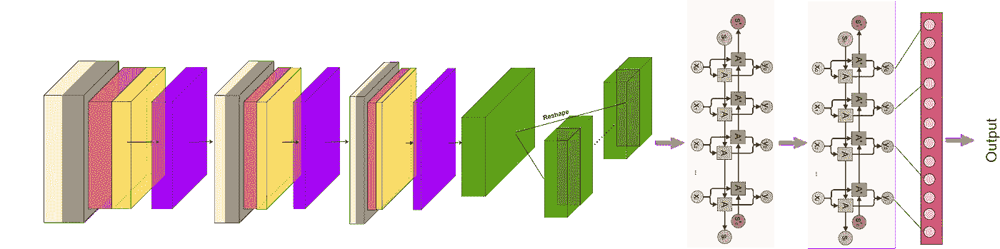
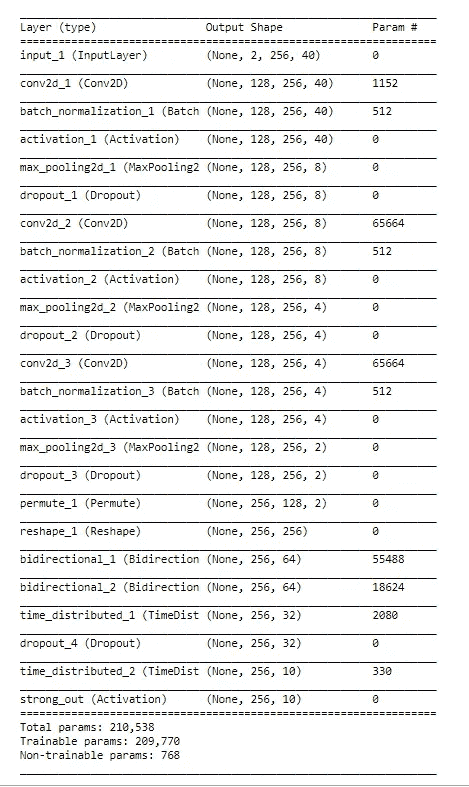

# 卷积递归神经网络的一种方法

> 原文：<https://towardsdatascience.com/an-approach-towards-convolutional-recurrent-neural-networks-a2e6ce722b19?source=collection_archive---------7----------------------->



Proposed CRNN

卷积递归神经网络是两个最重要的神经网络的结合。CRNN(卷积递归神经网络)包括 CNN(卷积神经网络),之后是 RNN(递归神经网络)。所提出的网络类似于 CRNN，但是产生更好或最优的结果，特别是对于音频信号处理。

## 网络的组成

该网络从传统的 2D 卷积神经网络开始，然后进行批量归一化、ELU 激活、最大池化和 50%退出率的退出。三个这样的卷积层以它们相应的激活顺序放置。卷积层之后是置换和整形层，这对于 CRNN 是非常必要的，因为特征向量的形状在 CNN 和 RNN 之间是不同的。卷积层是在三维特征向量上开发的，而递归神经网络是在二维特征向量上开发的。

置换层改变特征向量的轴的方向，随后是整形层，整形层将特征向量转换为二维特征向量。RNN 与二维特征向量兼容。所提出的网络包括两个双向 GRU 层，每层中有“n”个 GRU 单元，其中“n”取决于使用相应网络执行的分类的类别数。使用双向 GRU(门控循环单元)代替单向 RNN 层，因为双向层不仅考虑未来时间戳，还考虑未来时间戳表示。结合来自两个时间戳的二维表示允许以非常优化的方式结合时间维度特征。

最后，双向层的输出被馈送到时间分布密集层，随后是全连接层。

建议网络的实施如下:

```
def get_model(data_in, data_out, _cnn_nb_filt, _cnn_pool_size, _rnn_nb, _fc_nb):spec_start = Input(shape=(data_in.shape[-3], data_in.shape[-2], data_in.shape[-1]))
 spec_x = spec_start
 for _i, _cnt in enumerate(_cnn_pool_size):
 spec_x = Conv2D(filters = cnn_nb_filt, kernel_size=(2, 2), padding=’same’)(spec_x)
 spec_x = BatchNormalization(axis=1)(spec_x)
 spec_x = Activation(‘relu’)(spec_x)
 spec_x = MaxPooling2D(pool_size=(1, _cnn_pool_size[_i]))(spec_x)
 spec_x = Dropout(dropout_rate)(spec_x)
 spec_x = Permute((2, 1, 3))(spec_x)
 spec_x = Reshape((data_in.shape[-2], -1))(spec_x)for _r in _rnn_nb:
 spec_x = Bidirectional(
 GRU(_r, activation=’tanh’, dropout=dropout_rate, recurrent_dropout=dropout_rate, return_sequences=True),
 merge_mode=’concat’)(spec_x)for _f in _fc_nb:
 spec_x = TimeDistributed(Dense(_f))(spec_x)
 spec_x = Dropout(dropout_rate)(spec_x)spec_x = TimeDistributed(Dense(data_out.shape[-1]))(spec_x)
 out = Activation(‘sigmoid’, name=’strong_out’)(spec_x)_model = Model(inputs=spec_start, outputs=out)
 _model.compile(optimizer=’Adam’, loss=’binary_crossentropy’,metrics = [‘accuracy’])
 _model.summary()
 return _model
```

可以显示模型摘要，如下所示:

```
# Load model”
model = get_model(X, Y, cnn_nb_filt, cnn_pool_size, rnn_nb, fc_nb)
```



Model Summary for a 10 class classification for audio analysis.