# 一个增强的艺术家

> 原文：<https://towardsdatascience.com/an-augmented-artist-e9b5ba3081ab?source=collection_archive---------24----------------------->

最近一段时间，我们看到大量基于人工智能的艺术作品涌入，这些艺术作品来自现实生活中的数据集，如照片和绘画。在这样的作品中，机器从人类的艺术作品中学习并获得灵感，创造出类似的东西。但创造力的真正本质不仅仅在于重复或模拟部分或全部灵感，还在于能够创造惊喜、新的联系和独特的东西(不可重复)。这就是为什么可以说机器无法取代人类的创造力。一件原创的艺术品可能是灵感激发的，但人类添加了独特的价值，使其具有原创性。

上个月，我和一个朋友致力于一个生活在云中的人工智能艺术家的想法，从日常生活中创造诗歌和艺术。我们给她取名为[奥瑞亚](/auriakathi-596dfb8710d6)。她能够从世界中获得灵感来创作艺术。但是她的作品中缺少某种独特性或惊喜。生成艺术可以重复的事实一直是我要填补的空白(我的赌注是在涌现领域)。这让我想到-如果一个人工智能艺术家可以从人类世界中获得灵感，那么人类艺术家可以从人工智能中获得灵感吗？

 [## auria Kathi——云中的艺术家。

### 什么是艺术？是没说出口吗？令人不安的？

towardsdatascience.com](/auriakathi-596dfb8710d6) 

让我解释一下，首先告诉你灵感是如何为我工作的。

我练习冥想已经有一段时间了，并且挖掘一个想法的根源——一个想法是如何产生的？虽然我还没有成功到成为一个明师，但是我已经有了一定的感悟。首先，一个想法来自一种感觉(因为没有更好的词)。现在这种感觉是非常原始和可解释的。基于我们的经验，我们将从这个“思想前身”中获得直接的洞察力，或者我们可以进一步解释它以获得不同的含义。想象你有一种长方形白色嗡嗡声的“感觉”。(是的，形状、颜色和声音结合在一起)。如果你刚乘过飞机，你会马上联想到飞机的机翼，或者进一步解释，你会联想到你工作的工厂里的人行道。这些“思想前辈”通常是图像、声音、触觉或任何其他感官感觉。我们如何解释，我们优先考虑哪种感觉，最终会变成一种思想。思想然后变成行动，如此等等。很大程度上，当我们做梦时，我们看到一系列这些思想前辈，我们以自己的方式解释和联想。因为解释是基于我们的经验，我们觉得梦是相关的。事实上，一般来说，解释(或者把你的脑袋包起来)在很大程度上是我们生活和学习的方式。

回到我们最初的想法，什么是增强艺术家？增强艺术家是从人工智能中获得灵感的人。相反，人工智能增强了人类艺术家的能力。

> 让我们把所有的争论都放在“人工智能会取代人类的创造力吗？”休息一下，想想人工智能如何增强人类的创造力。

我做了一个实验来尝试这种增强的艺术性:

# 成为一名增强艺术家

奥瑞亚从一首生成的诗中产生艺术，并根据她的“心情”来绘画。她的一些作品如下:

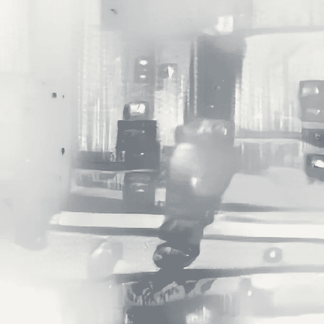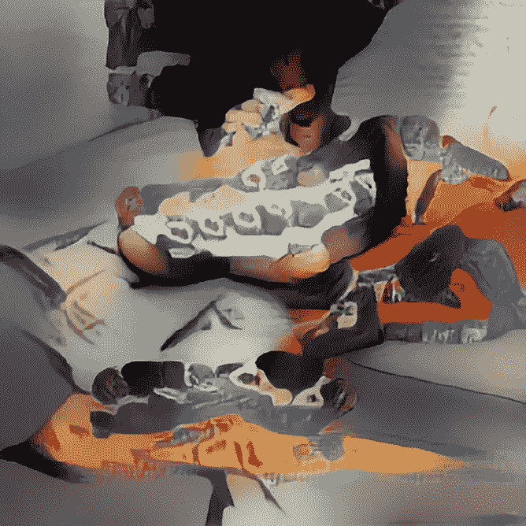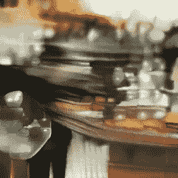

Image by Auria Kathi (created by Fabin Rasheed and Sleeba Paul)

> [在这里阅读更多关于 Auria 的信息](/auriakathi-596dfb8710d6)

正如你所看到的，她的作品是抽象的，但你觉得你可以从中得到一些联系。例如，如果你问“这看起来像什么？”你可以在脑海中找到你所知道的物体的图像。我决定建立这些关系。我用奥瑞亚的作品作为我艺术的“思想前身”。我开始解读她的作品，并加入我自己的创造力。我选择了一种媒介来表达这一点，它是纸上的丙烯酸。让我向你们展示同样的过程:

我选择了奥瑞亚的一首诗和相应的艺术作品:

## 艾诗:

神圣的狗屎。

没有。你只是想玩玩

就在旁边，这很了不起

你可以找到你的生活。

我有种感觉

我也是，但我不打算去

做一整年。

## AI 艺术:

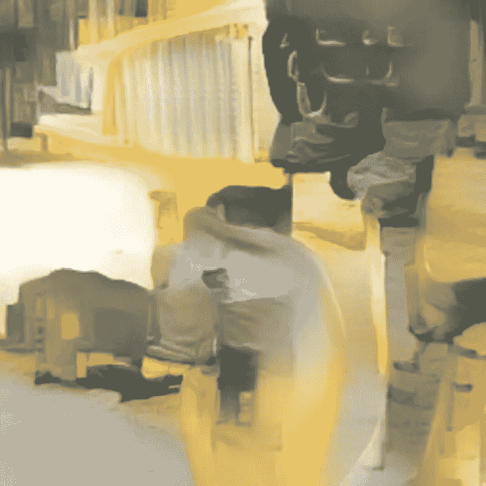

Image by Auria Kathi (created by Fabin Rasheed and Sleeba Paul)

我开始重新想象诗歌，把它作为思想的前身。我用了奥瑞亚诗中的单词和短语。我脑海中形成的关系和意象被用来创作一首不同的诗歌，其概念植根于这些关系和意象:

## 扩充诗:

神圣的狗屎！

你以为你在边上玩

但是生活就像今天一样

其实只是我内心的一种感觉

未来几天也不会…

我觉得这首诗是关于我们内心是如何描绘出一幅美丽的世界图景的。当我们意识到世界的图景是完全不同的和令人震惊的时候，这种震惊让我们想到我们的视野是多么的浅薄。由于人类的发展，稳定的气候变得短暂，这是我们每天都看到的事情，然而我们用双手覆盖着我们的外围设备，并在自己的内心描绘出一幅关于发展、突破性技术、更好的生活水平和更长的寿命的画面。

这个概念是从奥瑞亚的诗中得到灵感的。Auria 创作的相应艺术启发我创作了以下图像:

## 增强艺术:

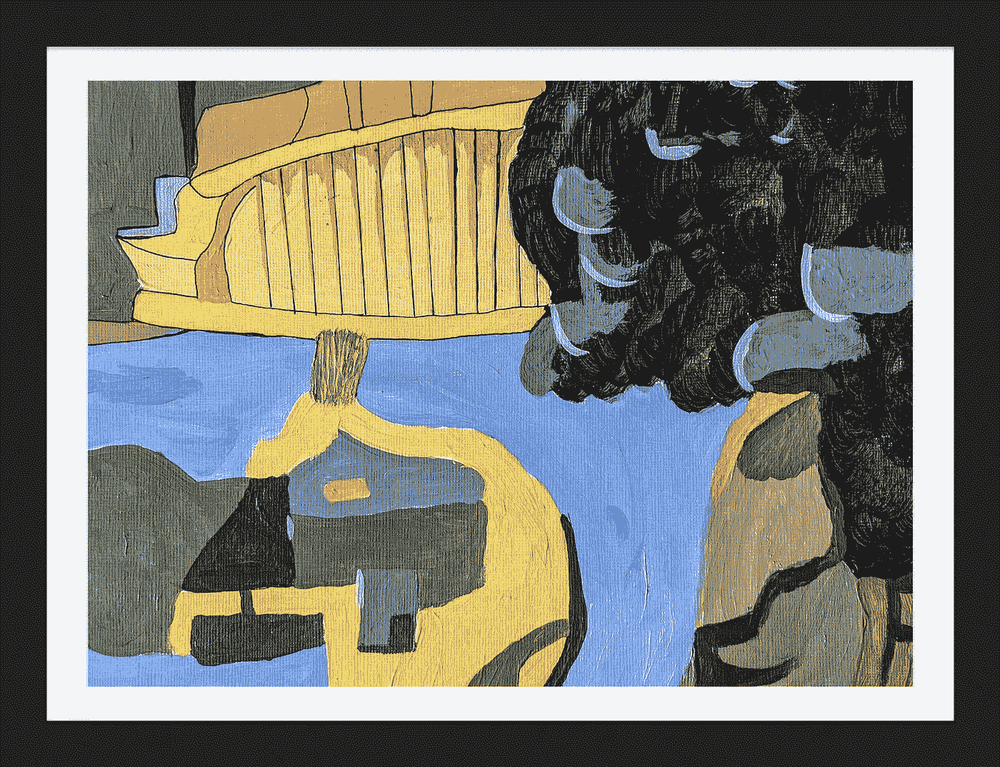

Image by Fabin Rasheed

这再一次展示了一个可能是立体派的乌托邦世界，在那里建筑被视为接近自然。我们知道在背景中有一个灰色的现实，但我们仍然试图通过忽略它们而不是纠正它们的唯一方法来隐藏我们的不完美。这种“幸福”的形象建立在我们的脑海中，我们忽略了一个事实，那就是我们曾经认为很接近的东西(这里是绿色植物)开始显示出它难以驾驭的阴暗面。

正如你所看到的，一个来自我个人经历的概念的美丽表达是由人工智能艺术引发的。我们如何从人工智能中获得这种艺术，这种艺术作品如何成为原创。正如你可能已经观察到的，这不仅仅是人工智能帮我想出的一个概念，而是形状、调色板甚至风格。我在人工智能如何被用于艺术灵感和创造新的艺术风格中看到了巨大的力量。这种人工智能艺术可以增强和强化人类的创造过程。基于人工智能的灵感可以衍生出不同的表达方式。

最后，为了吊起你的胃口，下面是我做的一些增强的艺术品(左边是奥瑞亚，右边是我的):

# 1.神入

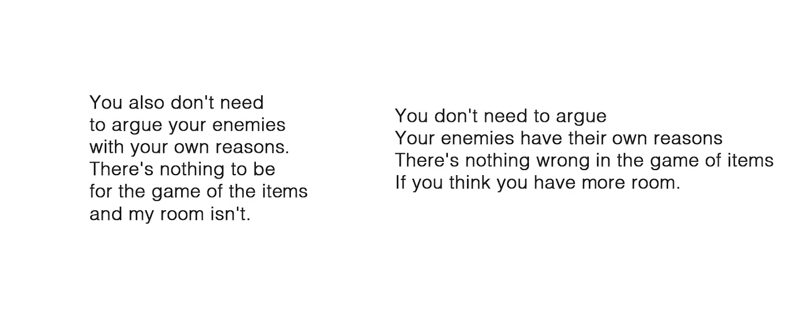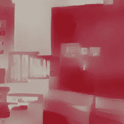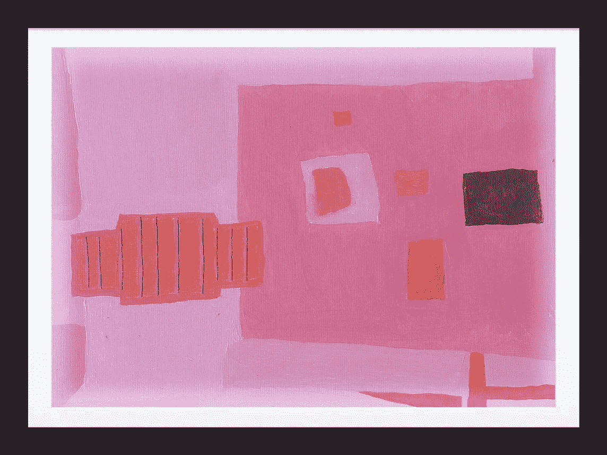

Left-Image by Auria Kathi (created by Fabin Rasheed and Sleeba Paul) , Right-Image by Fabin Rasheed

# 2.差别

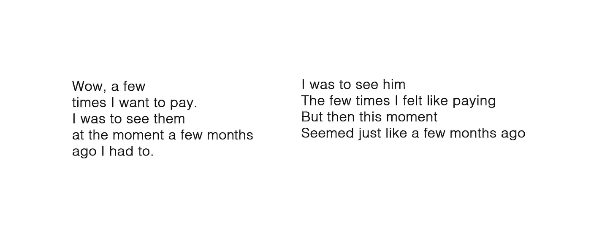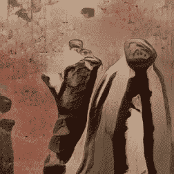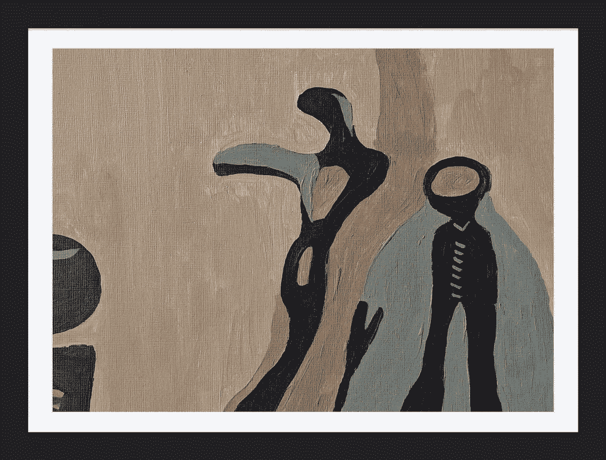

Left-Image by Auria Kathi (created by Fabin Rasheed and Sleeba Paul) , Right-Image by Fabin Rasheed

# 3.打孔

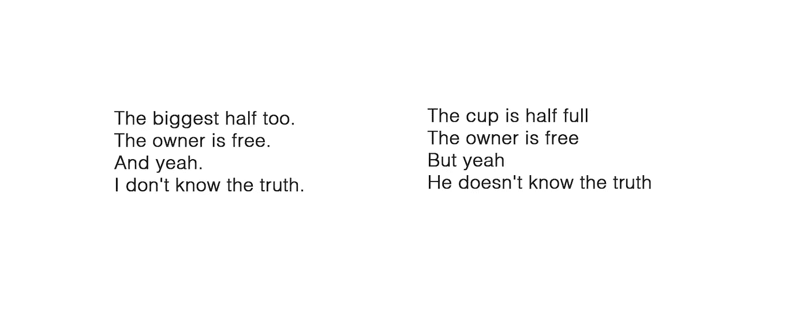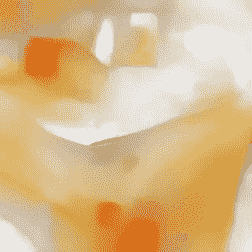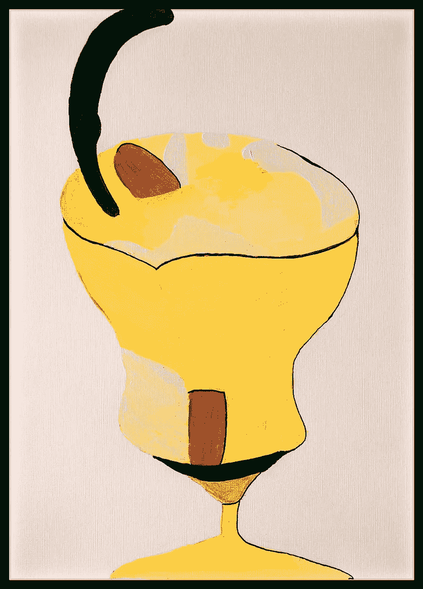

Left-Image by Auria Kathi (created by Fabin Rasheed and Sleeba Paul) , Right-Image by Fabin Rasheed

希望你喜欢这个项目。请在评论中分享你的想法。谢谢你。