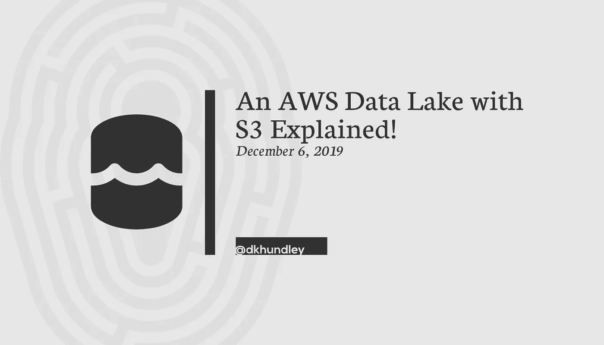
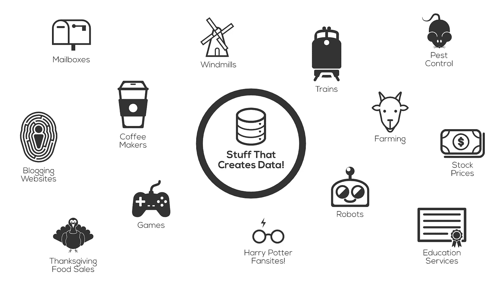
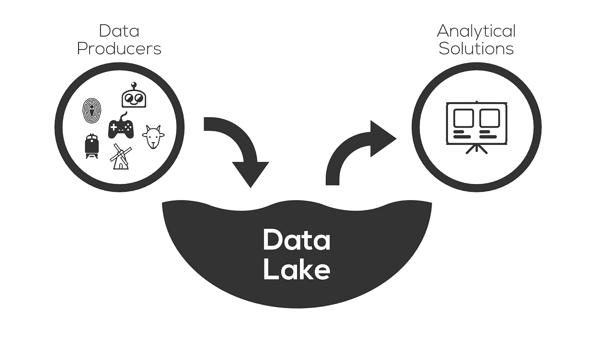
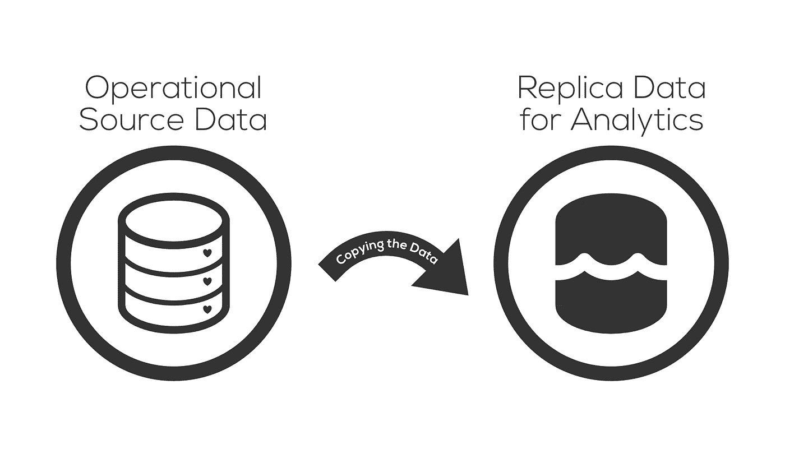
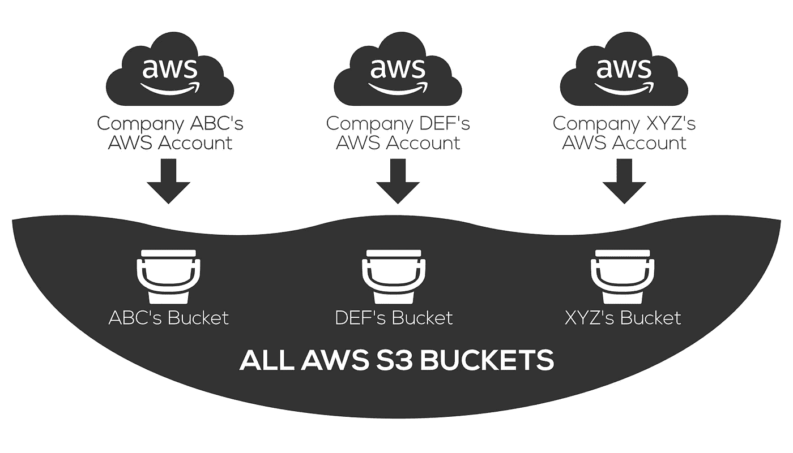
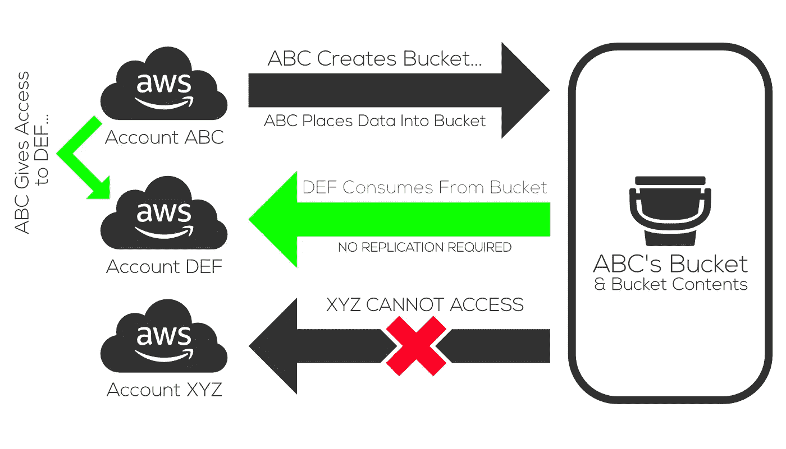

# S3 解释了 AWS 数据湖！

> 原文：<https://towardsdatascience.com/an-aws-data-lake-with-s3-explained-c67c5f161db3?source=collection_archive---------8----------------------->

## 了解 S3 如何帮助你在 AWS 中设计一个理想的数据湖

如果你与数据世界有过任何联系，你可能听说过一些令人难忘的，通常是古怪的关于数据有多有价值的短语。我在想这样的短语…

*   “数据是新的石油。”
*   “没有大数据，你在高速公路上就像聋子和瞎子一样。”
*   “数据是新的培根！”🥓

说实话，炒作是值得的。(除了我不确定我是否同意关于熏肉的那个……)**从分析的角度来看，数据帮助我们做出明智的决定，决定我们应该在业务中采取的下一步措施。**这可以通过表格报告和数据仪表板的形式体现出来，这是一种被称为机器学习的新事物，受到了很多宣传。“昔日”的人们对如何做出最佳商业决策一无所知，而今天我们有大量的数据资源来帮助我们。使用我为以前的博客帖子创建的图标后备目录(😃)，我说下面视觉里的东西都能产生有价值的数据，一点都不夸张。

因此，鉴于所有这些东西都在创造数据，下一个合乎逻辑的问题是…我们如何最好地利用它？

这就是数据湖概念的由来。**简而言之，数据湖是一个统一的空间，用于放置所有结构化和非结构化数据，以构建分析解决方案。**因为我是一个喜欢图片的人，这里有一张简单的图片可以说明这一点。

当然，您希望管理这个数据湖，以确保它不会成为数据转储场。数据治理非常重要，因此您需要确保使用您放入这个数据湖的东西来管理元数据、数据质量等等。这已经超出了这篇文章的范围，但是如果我不至少提一下的话，我就是在伤害你。

对于这篇文章，我特别想关注在 Amazon Web Services (AWS)中构建一个数据湖意味着什么。随着云解决方案风靡一时，人们希望在 AWS 中构建自己的数据湖是有道理的。更具体地说，人们希望使用 AWS 简单存储服务(S3)作为数据湖的基础是有道理的。

问题来了…无意冒犯 AWS，但我不认为他们在解释 S3 如何不同于“旧世界”概念方面做得很好。我拥有四个 AWS 认证，包括大数据专业，我遇到的学习这些认证的学习材料中没有一个真正很好地解释了我在这篇文章中将要解释的内容。我将在这篇文章中分享的内容可能会从根本上改变你对如何正确设计 AWS 数据湖的想法。

但是在我们进入那个之前，让我们谈论那些“旧世界”的概念…

## 物理数据隔离的内部世界

在 AWS 和云计算时代到来之前，公司确实有责任确保他们能够使用正确的物理基础架构来支持所有的数据库需求。我说的是购买这些巨大笨重的机器，有人必须用服务器补丁之类的东西来连接网络和维护。这并不容易(如果您目前维护一个内部基础架构，这仍然不容易)，当然，从一个硬件只能容纳有限数量的数据的意义上来说，这是有限的。如果你想保存更多的数据，你必须加快新硬件的速度。如果你想把测试数据从生产数据中分离出来，你可能还需要安装新的硬件。

因此，如果您在一个物理环境中的数据必须在另一个物理环境中用于分析目的，您可能必须将该数据复制到新的副本环境中。当然，您可能还与源环境保持联系，以确保副本环境中的内容仍然是最新的。

上面的小图表示将数据从一个运营源复制到一个分析副本。当然，您的运营源数据很可能不在一个单一的环境中。您可能有数十个(如果不是数百个)收集数据的操作源。这是大量的数据移动！但是由于字面上的物理限制，复制必须完成。数据不可能同时出现在两个地方，对吧？

好吧，这就是 AWS 和他们的 S3 木桶的不同之处…

## S3 水桶如何改变游戏

还记得我说过，我不认为 AWS 在解释 S3 桶如何被分割的整个事情上做得很好吗？如果你参加过任何 AWS 认证——包括云从业者——你可能记得 S3 对所有账户的存储桶使用一个共享的名称空间。例如，如果我在我的 AWS 帐户中创建一个名为“dkhundley”的存储桶，那么您在您的帐户中也不能创建一个名为“dkhundley”的存储桶。不幸的是，在大多数学习材料中，他们对它的解释就到此为止了。

但是你知道为什么会这样吗？如果没有也不要烦恼！也许一个简单的图片将有助于说明这一点…

从某种意义上说，认为 AWS 已经是一个巨大的数据湖并不公平！你不能创建一个名为“dkhundley”的桶的原因是，在这个我们称之为 S3 的巨大“数据湖”中已经有一个了。物理基础架构已经从我们身边抽象出来，所以从逻辑上来说，每个公司的数据就像是一个快乐的大家庭。

别让我吓到你！按照这种逻辑，您可能会得出一个自然的结论，即您的 S3 桶中的数据可以很容易地被其他人的公司和他们各自的 AWS 帐户访问。谢天谢地，这不是真的。AWS 一直有意为 AWS 中的所有内容提供适当的安全性，包括 S3 存储桶，因此只有在您拥有正确的凭证的情况下，您才能访问 S3 存储桶。

这是真正的问题，也是 S3 与本地基础设施如此不同的原因(这一点非常重要):**您不一定要在生成 S3 存储桶中的数据的同一个帐户中才能访问这些数据**。例如，如果您为我设置了正确的凭据，我就可以从我自己的个人 AWS 帐户 ***中看到贵公司 S3 存储区的内容，无需物理复制*** 。没错，伙计们。这是思维方式的巨大转变，不同于我们在内部部署环境中的行事方式。*我们将时间集中在用物理基础设施隔离数据上，而云计算转移到了使用安全策略隔离数据上。*

鉴于 AWS 采用的是现收现付模式，您希望以最大化性能和最小化成本的方式进行设计。考虑到存储和数据移动都有相关的成本，将数据从一个 S3 存储桶复制到另一个存储桶不仅成本高昂，而且效率低下。同样，在 S3 的上下文中，AWS 帐户**不会**隔离资源。

## **S3 数据湖的设计考虑**

**我希望到目前为止我们所涉及的内容是有意义的。需要的话再回去复习几遍！再说一次，我是一个喜欢图片的人，所以我希望我简单的插图能让你更容易理解。带着这种新的想法，让我们用一些设计考虑来结束这篇文章，当你在 S3 建立你的数据湖时，你可以考虑一下:**

*   ****测试与生产数据**:当您创建一个对数据进行更改的新 IT 解决方案时，很自然地希望保护您的生产级数据免受该新解决方案的负面影响。在大多数内部基础设施中，这意味着在物理上隔离测试和生产环境。需要考虑如何在 S3 隔离测试和生产数据，这可以通过多种方式实现。最安全和最简单的方法是将数据完全隔离到各自的存储桶中，您可以使用存储桶命名标准或 AWS 标签来管理组织。(或者都是！)但是如果你不想复制所有的东西，有办法在每个桶中隔离某些东西。这将需要你做更多的工作，但是如果成本管理对你来说是一个重要的因素，这可能是值得的。**
*   ****敏感数据保护**:这很像我们刚刚在上面讨论的隔离测试与生产。最简单的方法还是将敏感数据隔离到它自己的桶中，并通过许多安全措施真正锁定它，但同样，也可以将敏感数据和非敏感数据锁定在同一个桶中。我可能不想惹这种麻烦，但是朋友们，你们必须这样做。**
*   ****数据湖与数据仓库**:让我们在这里明确一下……数据湖并不等同于数据仓库。数据仓库通常只包含结构化或半结构化的数据，而数据湖包含所有的东西:结构化的、半结构化的和非结构化的。数据湖通常与数据仓库共存，而数据仓库通常建立在数据湖之上。就 AWS 而言，最常见的实现是使用 S3 作为数据湖，使用红移作为数据仓库。当然，在 AWS 中剥猫皮的方法不止一种，所以不要以为你的仓储需求只局限于红移。**
*   ****数据管理&治理**:我已经在这篇文章中提到过一次，但我认为值得再次提出。如果没有适当的数据管理和治理，数据湖很快就会变成数据转储。当你设计你的数据湖时，AWS 确实提供了像 AWS Glue 这样的服务来帮助你管理像数据目录这样的东西，但是它让你自己去弄清楚这些东西。如果你真的想在这个领域得到额外的帮助，也有许多第三方供应商会在这里提供很多帮助。(Oomph 是一个技术术语。😂)根据您公司的需求，引入第三方供应商来帮助您组织数据湖可能是值得的。(我对此并不太熟悉，但 AWS 确实也提供了一项名为 [Lake Formation](https://aws.amazon.com/lake-formation/) 的服务，或许也值得一试。)**
*   ****湖消耗**:当你想在数据湖的基础上构建分析解决方案时，事情会变得有点棘手。虽然 AWS 帐户在将数据放入数据湖时并不重要，但对于您的消费解决方案来说却更重要。多个帐户可以从同一个数据湖中提取数据，但是您必须确保它们都有适当的安全凭证来访问这些底层 S3 存储桶。很有可能，您不希望让每个人都能访问您数据湖中的每个 S3 存储桶。同样，这也是数据管理和治理极其重要的地方，因此同样值得投资利用这些第三方治理工具来帮助适当地分发安全凭证。**

**好了，这篇文章到此为止！直到最近，这对我来说还是一个非常陌生的概念，所以即使你有 AWS 认证，如果你没有完全掌握这一点，也不要自责。如果你喜欢这篇文章，你可能也会喜欢我的其他一些文章，包括[上周关于我开始使用 AWS 的五个技巧的文章](https://medium.com/@dkhundley/five-tips-to-get-you-started-in-aws-50c733f9d0aa)。感谢阅读！**