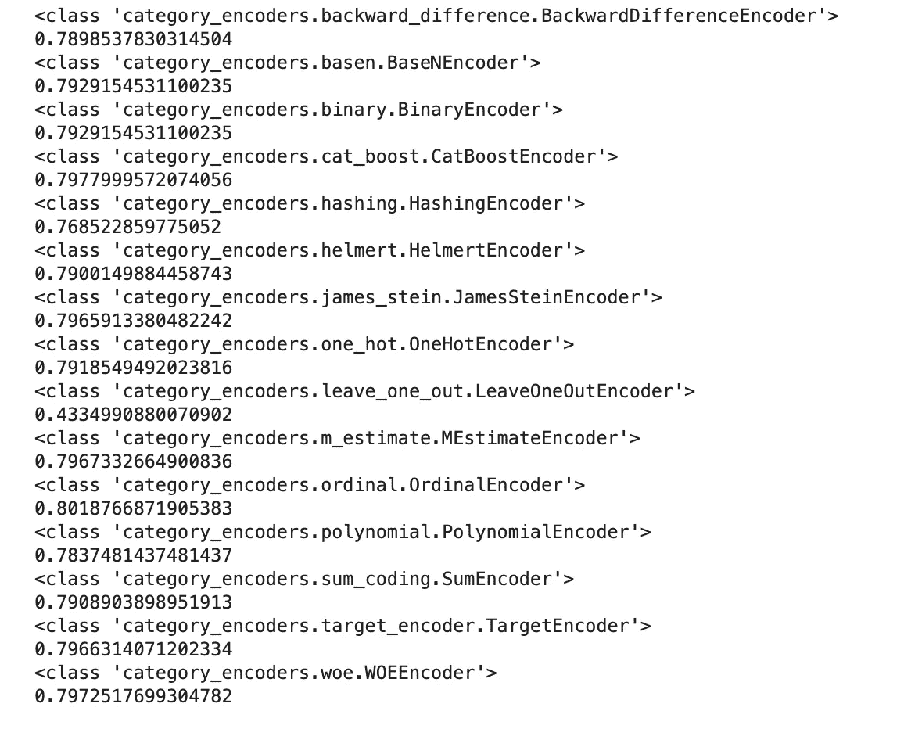

# 一种编码分类特征的简单方法

> 原文：<https://towardsdatascience.com/an-easier-way-to-encode-categorical-features-d840ff6b3900?source=collection_archive---------9----------------------->


Photo by [Ash Edmonds](https://unsplash.com/@badashproducts?utm_source=unsplash&utm_medium=referral&utm_content=creditCopyText) on [Unsplash](https://unsplash.com/s/photos/code?utm_source=unsplash&utm_medium=referral&utm_content=creditCopyText)

## 使用 python 类别编码器库处理机器学习中的高基数变量

我最近一直在做一个机器学习项目，这个项目有几个分类特征。这些要素中的许多都具有很高的基数，或者说，具有大量的唯一值。处理分类变量最简单的方法通常是执行[一键编码](https://hackernoon.com/what-is-one-hot-encoding-why-and-when-do-you-have-to-use-it-e3c6186d008f)，其中每个唯一值被转换成一个新列，用 1 或 0 表示该值的存在或不存在。然而，当一个特征的基数很高时，这种方法通常会产生太多的新特征，从而降低模型性能。

我开始编写自己的编码器，尝试用其他方法对一些特征进行编码，从所谓的证据权重开始。在二元分类问题中[证据权重](https://www.listendata.com/2015/03/weight-of-evidence-woe-and-information.html)使用正负类中特征的唯一值分布，并创建与这些值相关的新特征。自然，这需要一段时间来编码，然后让它在我现有的 scikit-learn 管道中工作。

然后，我偶然发现了这个名为 [category_encoders](http://contrib.scikit-learn.org/categorical-encoding/) 的库，它不仅有证据的权重，而且有几乎所有可能的方式来编码已经编写好并准备好使用的分类特征。这意味着我不再需要编写这个定制的编码器，我现在可以快速评估一大堆不同的编码器并选择最好的一个。在这篇文章中，我想分享这个库，并举例说明如何在 [scikit-learn 管道](https://scikit-learn.org/stable/modules/generated/sklearn.pipeline.Pipeline.html)中使用它。

## 类别编码器

该库包含一组遵循 scikit-learn 风格的转换器，这意味着它们不仅可以单独使用，还可以在 scikit-learn 管道中使用。转换器提供了多种方法来转换分类数据，包括非常流行的 one-hot 编码。这个库对于处理高基数特性特别有用，在这种情况下，一次性编码方法可能会导致较差的模型性能。

让我们看一个使用中的例子。在下面的例子中，我使用的是从 UCI 机器学习库下载的`adults`数据集。该数据包括每个人的一组特征和目标变量，该变量表示他们的年收入是低于还是高于 5 万美元。

该库可以通过 pip 安装。

```
pip install category_encoders
```

或者康达。

```
conda install -c conda-forge category_encoders
```

首先，这里是我正在使用的进口。

```
import pandas as pd
import numpy as npfrom sklearn import preprocessing
from sklearn.model_selection import train_test_split
from sklearn.pipeline import Pipeline
from sklearn.ensemble import RandomForestClassifier
from sklearn.impute import SimpleImputer
from sklearn.preprocessing import StandardScaler
from sklearn.compose import ColumnTransformer
from sklearn.metrics import f1_score
import category_encoders as ce
```

接下来，我将下载数据并将其转换成熊猫数据框。

```
url_data = '[https://archive.ics.uci.edu/ml/machine-learning-databases/adult/adult.data'](https://archive.ics.uci.edu/ml/machine-learning-databases/adult/adult.data')
column_names = ['age', 'workclass', 'fnlwgt', 'education', 'educational-num','marital-status',
                'occupation', 'relationship', 'race', 'gender','capital-gain', 'capital-loss', 
                'hours-per-week', 'native-country','income']
adults_data = pd.read_csv(url_data, names=column_names)
```

然后，我为每个特征类型(分类的和数字的)创建一个变量，供以后在管道中使用，并将值分成测试和训练数据集。需要注意的一点是，尽管 scikit-learn 可以处理非数字目标变量，但 category_encoders 库不能。所以这里的一个额外步骤是使用[标签编码器](https://scikit-learn.org/stable/modules/generated/sklearn.preprocessing.LabelEncoder.html)来转换 y 标签。

```
numeric_features = adults_data.select_dtypes(include=['int64', 'float64']).columns
categorical_features = adults_data.select_dtypes(include=['object']).drop(['income'], axis=1).columnsX = adults_data.drop('income', axis=1)
y = adults_data['income']le = preprocessing.LabelEncoder()
label_encoder = le.fit(y)
y = label_encoder.transform(y)X_train, X_test, y_train, y_test = train_test_split(X, y, test_size=0.2)
```

接下来，我运行下面的代码，它构建了一个管道，并循环遍历 category_encoders 列表，为每个模型打印分数。我使用了一个随机森林模型作为简单的例子。

```
encoder_list = [ce.backward_difference.BackwardDifferenceEncoder, 
               ce.basen.BaseNEncoder,
               ce.binary.BinaryEncoder,
                ce.cat_boost.CatBoostEncoder,
                ce.hashing.HashingEncoder,
                ce.helmert.HelmertEncoder,
                ce.james_stein.JamesSteinEncoder,
                ce.one_hot.OneHotEncoder,
                ce.leave_one_out.LeaveOneOutEncoder,
                ce.m_estimate.MEstimateEncoder,
                ce.ordinal.OrdinalEncoder,
                ce.polynomial.PolynomialEncoder,
                ce.sum_coding.SumEncoder,
                ce.target_encoder.TargetEncoder,
                ce.woe.WOEEncoder
                ]for encoder in encoder_list:

    numeric_transformer = Pipeline(steps=[
    ('imputer', SimpleImputer(strategy='median')),
    ('scaler', StandardScaler())])
    categorical_transformer = Pipeline(steps=[
    ('imputer', SimpleImputer(strategy='constant', fill_value='missing')),
    ('woe', encoder())])

    preprocessor = ColumnTransformer(
    transformers=[
        ('num', numeric_transformer, numeric_features),
        ('cat', categorical_transformer, categorical_features)])

    pipe = Pipeline(steps=[('preprocessor', preprocessor),
                      ('classifier', RandomForestClassifier(n_estimators=500))])

    model = pipe.fit(X_train, y_train)

    y_pred = model.predict(X_test)
    print(encoder)
    print(f1_score(y_test, y_pred, average='macro'))
```

输出如下。从下面可以看出，对于这个模型，顺序编码器给出了最好的分数，而留一编码器给出了最低的分数。



处理分类变量只是调整机器学习模型的一个方面，当然还有许多其他步骤。category_encoder 库提供了一种快速评估处理这些特性的不同方法的方法。在未来的项目中，我肯定会经常用到它。

感谢阅读！