# 使用 Matplotlib 进行 3D 绘图的简单介绍

> 原文：<https://towardsdatascience.com/an-easy-introduction-to-3d-plotting-with-matplotlib-801561999725?source=collection_archive---------1----------------------->

> 想获得灵感？快来加入我的 [**超级行情快讯**](https://www.superquotes.co/?utm_source=mediumtech&utm_medium=web&utm_campaign=sharing) 。😎

每个数据科学家都应该知道如何创建有效的数据可视化。没有观想，你将会被困在试图处理数字和在你的头脑中想象成千上万的数据点！

除此之外，它还是与非技术业务利益相关者进行有效沟通的重要工具，这些利益相关者通过图片而非文字更容易理解您的结果。

大多数数据可视化教程都展示了相同的基本内容:散点图、线图、箱线图、条形图和热图。这些对于快速获得对数据集的高层次洞察都是非常棒的。

但是如果我们更进一步。2D 图只能显示一对轴 *x* - *y* 之间的关系；另一方面，3D 绘图允许我们探索 *3 对轴*的关系: *x* - *y* 、 *x* - *z* 和 *y* - *z* 。

在本文中，我将向您简单介绍如何使用 Matplotlib 实现 3D 数据可视化。最终，您将能够将 3D 绘图添加到您的数据科学工具包中！

在我们开始之前，请查看 [***人工智能智能简讯***](https://aismart.substack.com/subscribe)*以阅读人工智能、机器学习和数据科学方面的最新和最棒的信息！*

# *三维散点图和折线图*

*Matplotlib 中的 3D 绘图从启用实用工具包开始。我们可以通过导入`mplot3d`库来启用这个工具包，这个库通过 pip 与您的标准 Matplotlib 安装一起提供。只是要确保你的 Matplotlib 版本是 1.0 以上。*

*导入该子模块后，可通过将关键字`projection="3d"`传递给 Matplotlib 中的任何常规轴创建函数来创建 3D 图:*

```
**from* mpl_toolkits *import* mplot3d

*import* numpy *as* np
*import* matplotlib.pyplot *as* plt

fig = plt.figure()
ax = plt.axes(projection="3d")

plt.show()*
```

*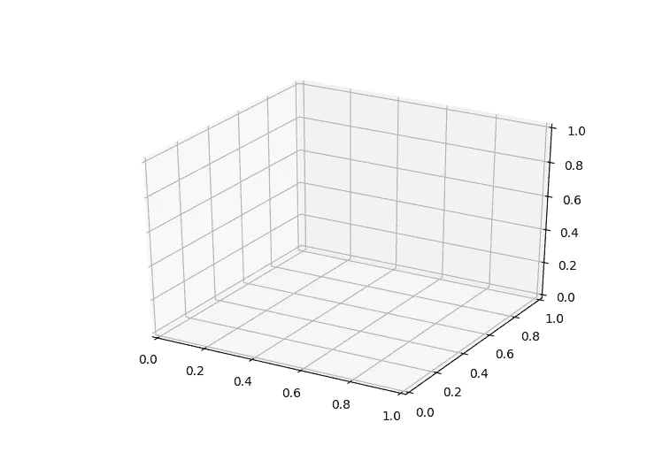*

*现在我们的轴已经创建好了，我们可以开始 3D 绘图了。3D 绘图功能非常直观:我们不仅仅调用`scatter`而是调用`scatter3D`，不仅仅传递 *x* 和 *y* 数据，而是传递 *x* 、 *y* 和 *z* 。所有其他功能设置，如颜色和线型，与 2D 绘图功能保持一致。*

*这是一个绘制 3D 线和 3D 点的示例。*

```
*fig = plt.figure()
ax = plt.axes(projection="3d")

z_line = np.linspace(0, 15, 1000)
x_line = np.cos(z_line)
y_line = np.sin(z_line)
ax.plot3D(x_line, y_line, z_line, 'gray')

z_points = 15 * np.random.random(100)
x_points = np.cos(z_points) + 0.1 * np.random.randn(100)
y_points = np.sin(z_points) + 0.1 * np.random.randn(100)
ax.scatter3D(x_points, y_points, z_points, c=z_points, cmap='hsv');

plt.show()*
```

*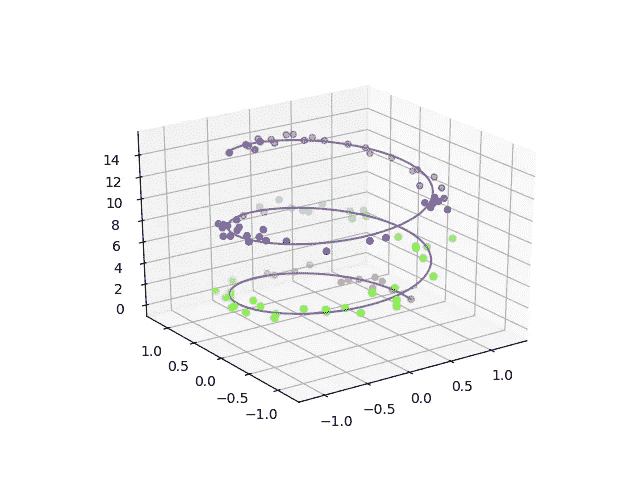*

*下面是 3D 绘图最棒的部分:**交互性**。一旦你在 3D 中绘图，绘图的交互性对于探索你的可视化数据变得非常有用。查看我通过简单的点击和拖动创建的一些不同的视图！*

*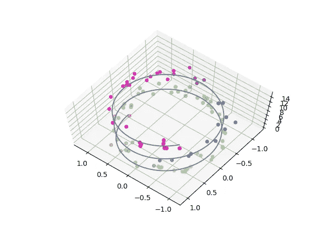**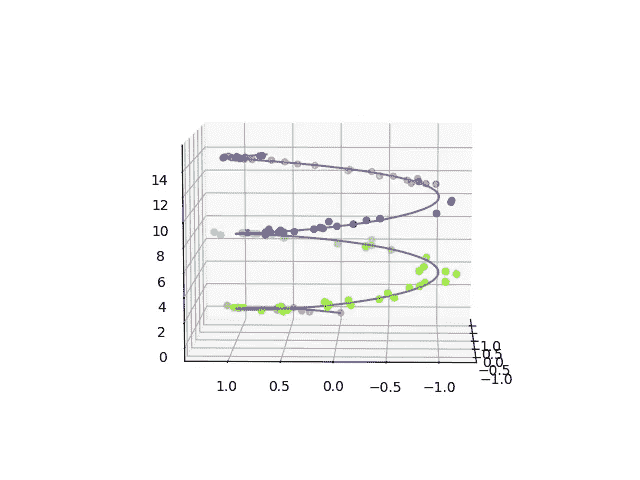**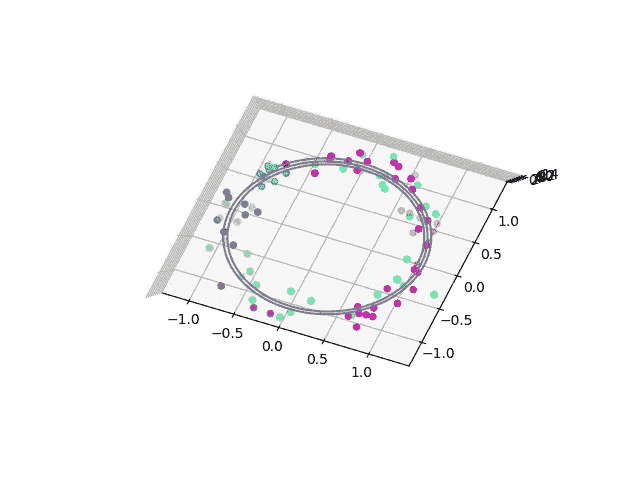*

# *表面图*

*表面图可以很好地显示整个 3D 景观中 3 个变量之间的关系。它们给出了一个完整的结构和视图，显示了每个变量的值如何在其他两个变量的轴上变化。*

*在 Matplotlib 中构建曲面图需要三个步骤。*

*(1)首先，我们需要生成构成表面图的实际点。现在，生成 3D 表面的所有*点是不可能的，因为它们的数量是无限的！因此，我们将生成足以估计表面的数据，然后外推其余的点。我们将定义 *x* 和 *y* 点，然后使用函数计算 *z* 点。**

```
*fig = plt.figure()
ax = plt.axes(projection="3d")*def* z_function(*x*, *y*):
    *return* np.sin(np.sqrt(*x* ** 2 + *y* ** 2))

x = np.linspace(-6, 6, 30)
y = np.linspace(-6, 6, 30)

X, Y = np.meshgrid(x, y)
Z = z_function(X, Y)*
```

*(2)第二步是绘制一个线框——这是我们对表面的估计。*

```
*fig = plt.figure()
ax = plt.axes(projection="3d")ax.plot_wireframe(X, Y, Z, color='green')
ax.set_xlabel('x')
ax.set_ylabel('y')
ax.set_zlabel('z')

plt.show()*
```

*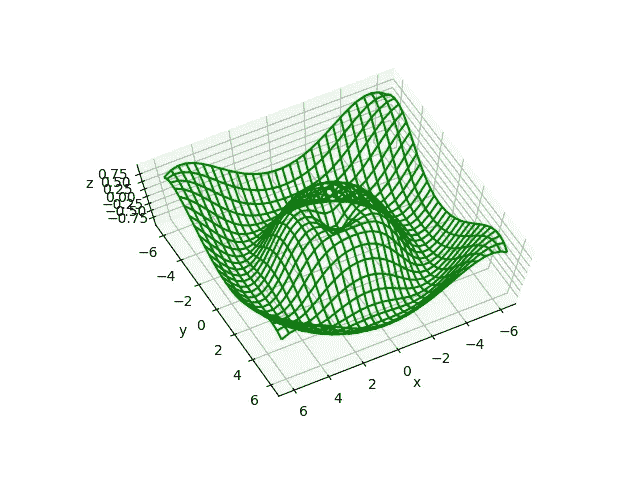****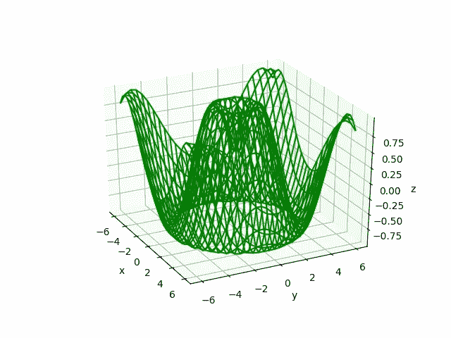*

*(3)最后，我们将把我们的表面投影到我们的线框估计上，并外推所有点。*

```
*ax = plt.axes(projection='3d')
ax.plot_surface(X, Y, Z, rstride=1, cstride=1,
                cmap='winter', edgecolor='none')
ax.set_title('surface');*
```

*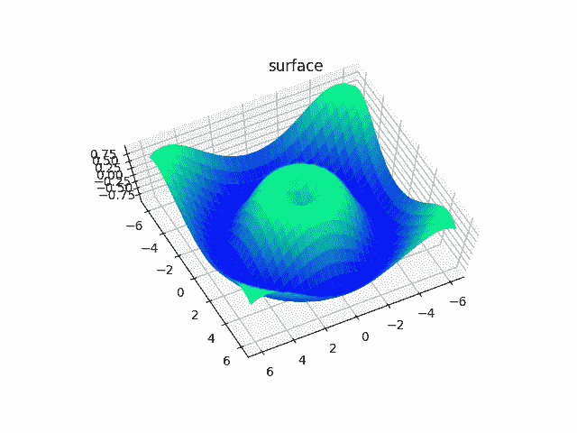**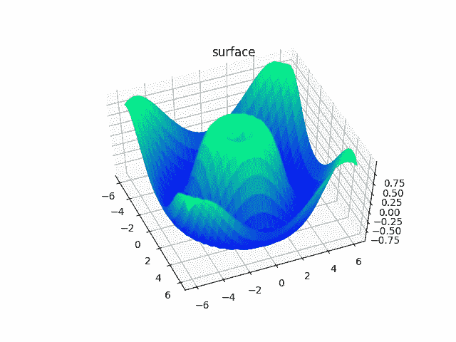**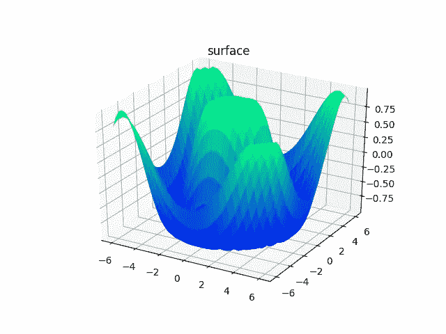*

*美女！这是我们丰富多彩的 3D 表面！*

# *三维条形图*

*柱状图在数据可视化项目中经常使用，因为它们能够以简单直观的方式传达信息，通常是某种类型的比较。三维条形图的美妙之处在于，它们保持了 2D 条形图的简单性，同时扩展了其表示比较信息的能力。*

*条形图中的每一条都需要 2 样东西:位置和大小。对于 3D 条形图，我们将为所有三个变量 *x，y，z* 提供该信息。*

*我们将选择 *z* 轴来编码每个条形的高度；因此，每个条形将从 *z = 0* 开始，其大小与我们试图显示的值成比例。 *x* 和 *y* 位置将代表横过 *z = 0 的 2D 平面的杆的坐标。*我们将把每个条形的 *x* 和 *y* 尺寸设置为 1，这样所有的条形都具有相同的形状。*

*查看下面的代码和 3D 图作为示例！*

```
*fig = plt.figure()
ax = plt.axes(projection="3d")

num_bars = 15
x_pos = random.sample(xrange(20), num_bars)
y_pos = random.sample(xrange(20), num_bars)
z_pos = [0] * num_bars
x_size = np.ones(num_bars)
y_size = np.ones(num_bars)
z_size = random.sample(xrange(20), num_bars)

ax.bar3d(x_pos, y_pos, z_pos, x_size, y_size, z_size, color='aqua')
plt.show()*
```

*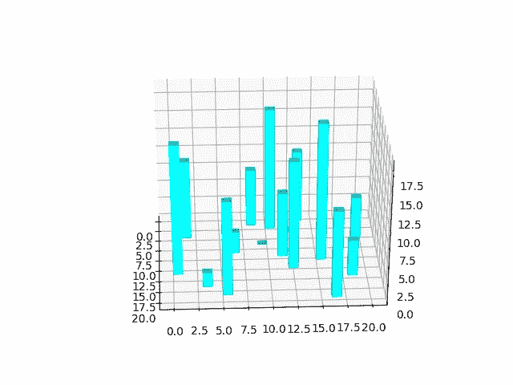**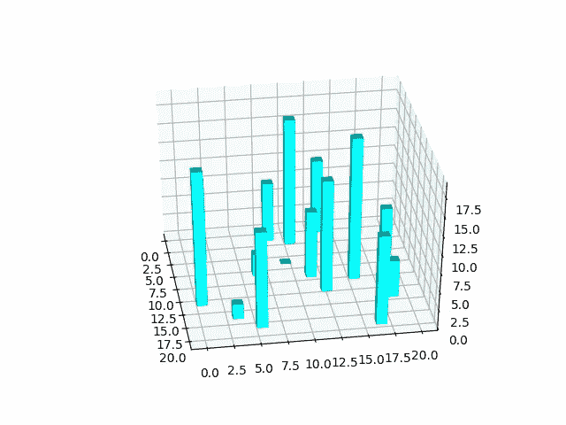**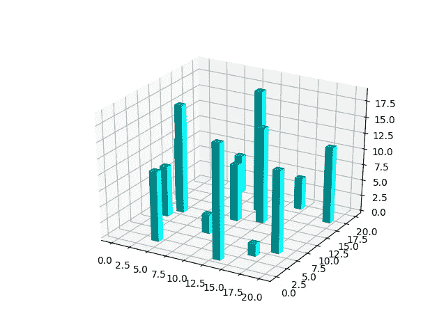*