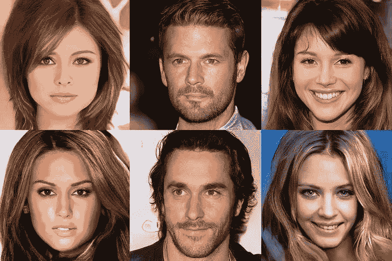
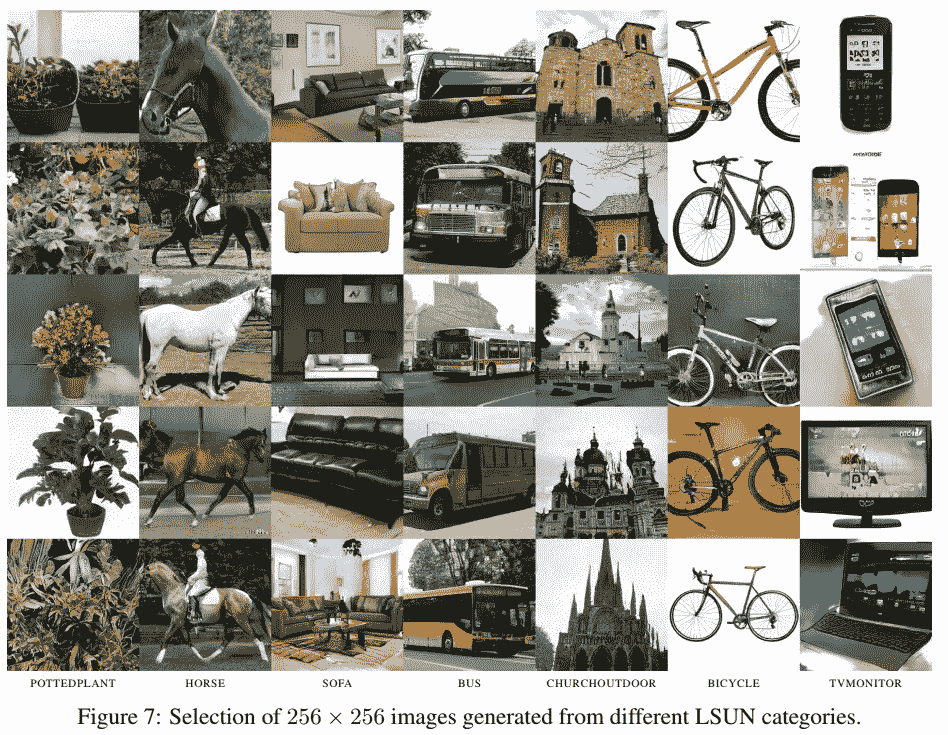
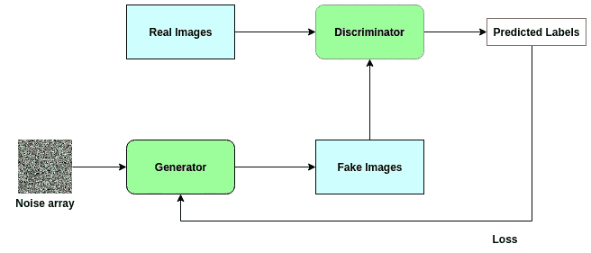
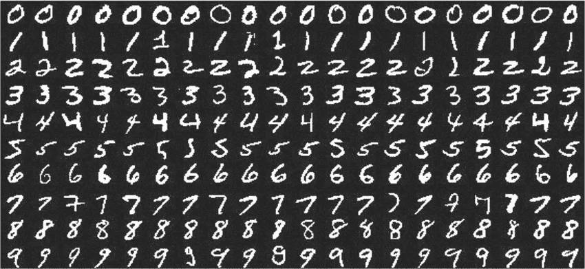
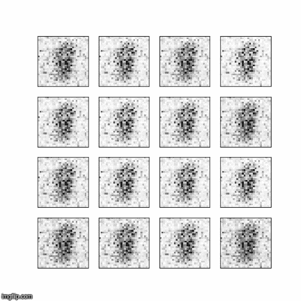

# 深度学习中生成对抗网络的简单介绍

> 原文：<https://towardsdatascience.com/an-easy-introduction-to-generative-adversarial-networks-6f8498dc4bcd?source=collection_archive---------10----------------------->

## 了解深度学习最强大的网络！

> 想获得灵感？快来加入我的 [**超级行情快讯**](https://www.superquotes.co/?utm_source=mediumtech&utm_medium=web&utm_campaign=sharing) 。😎

[生成对抗网络](https://en.wikipedia.org/wiki/Generative_adversarial_network) (GANs)是一种神经网络架构，能够自行生成新数据。对这些 gan 的研究是深度学习中的热门话题，因为它们的力量。短短几年间，他们已经从生成模糊的数字发展到创造照片般逼真的人脸图像。

# GANs 如何工作

生成对抗网络(gan)被分类在[生成模型](https://en.wikipedia.org/wiki/Generative_model)组中。这意味着它们能够生成全新的“有效”数据。所谓有效数据，我们的意思是网络的输出应该是我们认为目标可以接受的。

为了说明，考虑一个例子，其中我们希望生成一些新图像来训练一个[图像分类](http://cs231n.github.io/classification/)网络。当然，对于这样的应用程序，我们希望我们的训练数据尽可能真实，也许在风格上与其他图像分类训练数据集非常相似。

下图显示了 GAN 生成的一组图像的示例。它们看起来很真实！如果我们没有被告知它们是计算机生成的，我们可能真的会相信这些是人类收集的！

An example output of Progressive GANs. [Source](https://arxiv.org/pdf/1710.10196.pdf)

为此，gan 由两个独立的*反向*网络组成:发生器*和鉴别器*。当仅给定噪声图像阵列作为输入时，生成器被训练来创建看起来逼真的图像。鉴别器被训练来分类图像是否是真实的。

GANs 的真正力量来自他们所遵循的对抗训练风格。基于鉴别器的损耗学习发电机网络的权重。因此，生成器被推动以这样一种方式训练，即对于它生成的图像，很难辨别它们是否真实。在这些图像看起来越来越真实的同时，鉴别器也越来越好地分辨出哪些图像是真实的，不管肉眼看起来有多相似。

从技术角度来说，鉴别器的损失将是对哪些图像是假的，哪些是真的进行分类的误差；我们正在测量它辨别真假图像的能力。发生器损耗将基于其利用假图像“愚弄”鉴别器的能力——即鉴别器对假图像的分类误差仅在假图像上出现，因为发生器希望该误差尽可能高。

因此，GANs 建立了一种反馈回路，发电机帮助训练鉴别器，鉴别器帮助训练发电机。他们一起变得更好。下图有助于说明这一点。

An illustration of the structure of a Generative Adversarial Network

# 训练 GAN 在 Pytorch 中生成数字

现在我们将通过一个例子来说明如何在 Pytorch 中构建和训练我们自己的 GAN！ [MNIST 数据集](https://en.wikipedia.org/wiki/MNIST_database)包含 60，000 张黑白数字的训练图像，范围从 1 到 9，其中每张图像的大小为 28x28。它非常适合我们的用例，因为它仍然非常常用于机器学习概念验证，并且是一个成熟的集合。

Part of the MNIST dataset. [Source](https://www.researchgate.net/figure/A-subset-of-the-MNIST-database-of-handwritten-digits_fig4_232650721)

我们将从我们的进口开始。我们只需要 Pytorch 的东西！

接下来，我们将为训练数据准备我们的*数据加载器*。记住，我们要为 MNIST 生成随机数，即从 0 到 9。因此，我们需要为这 10 位数字设置标签。

现在我们可以建立我们的网络。我们从下面的鉴频器网络开始。回想一下，鉴别器网络对图像是否真实进行分类，这是一个图像分类网络。因此，我们的输入是一个标准 MNIST 大小的图像:28x28 像素。我们将该图像展平成长度为 784 的单个向量。输出是一个单一值，表示图像是否是一个真正的 MNIST 数字。

现在来看看下面的发电机。发生器网络负责创建实际的图像——它可以从纯噪声输入中做到这一点！对于本例，我们将让发生器从一个长度为 100 的向量开始，这也是一个纯粹的随机噪声。从这个向量，我们的生成器将输出一个长度为 784 的向量，稍后我们可以将它整形为标准的 MNIST 28x28 像素。

要设置我们的培训，我们需要一些东西:

*   损失函数
*   每个网络的优化器
*   时代数
*   批次数量

Pytorch 还要求，如果我们希望我们的网络在 GPU 上运行，我们必须显式地将模型移到它上面。所有代码如下所示。

现在是我们的训练循环。Pytorch 中的训练循环通常由遍历历元的外循环和遍历批数据的内循环组成。训练 gan 的关键部分是我们需要在一个循环中更新生成器和鉴别器。查看下面的代码来训练 GAN 和 Pytorch。这些步骤在代码下面有更详细的描述。

(1)我们开始为鉴别器准备我们的*真实*图像数据。输入是一批真实的 MNIST 图像。输出是全 1 的向量，因为 1 表示图像是真实的。

(2)接下来，我们将为生成器准备输入向量，这样我们就可以生成假图像。回想一下，我们的生成器网络采用长度为 100 的输入向量，所以这就是我们在这里创建的。images.size(0)表示批量大小

(3)根据我们在步骤(2)中创建的随机噪声数据向量，我们可以绕过向量到生成器来生成我们的伪图像数据。这将与我们在步骤 1 中获得的真实数据结合使用，以训练鉴别器。还要注意，这一次我们的标签向量全是零，因为 0 代表假图像的类别标签。

(4)给定伪图像和真实图像以及它们的标签，我们可以训练我们的鉴别器进行分类。总损失将是伪图像的损失+真实图像的损失

(5)现在我们的鉴别器已经更新，我们可以使用它来进行预测。这些预测的损失将通过发生器反向传播，使得发生器的权重根据它欺骗鉴别器的程度而被特别更新。
(5a)生成一些伪图像在
(5b)使用鉴别器对该批伪图像进行预测并保存输出。

(6)使用来自鉴别器的预测，我们训练我们的生成器。请注意，我们使用全 1 的 _real_labels_ 作为目标，因为我们的生成器的目标是创建看起来真实并且预测为 1 的图像！因此，发生器丢失 0 将对应于鉴别器预测全 1。

瞧啊。这就是我们训练 GAN 生成 MNIST 图像的全部代码！你需要做的就是安装 Pytorch 来运行它。查看下面的 gif，查看 40 多个时期生成的图像的输出！

# 喜欢学习？

在[推特](https://twitter.com/GeorgeSeif94)上关注我，我会在那里发布所有最新最棒的人工智能、技术和科学！也在 [LinkedIn](https://www.linkedin.com/in/georgeseif/) 上和我联系吧！