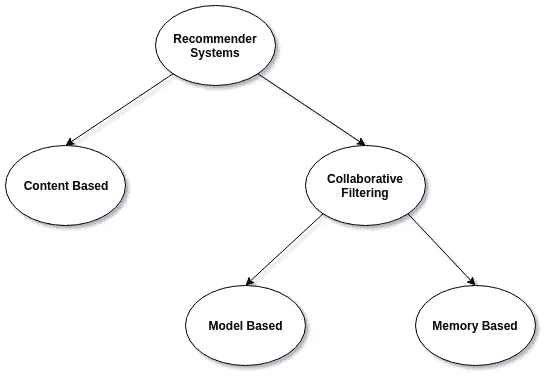
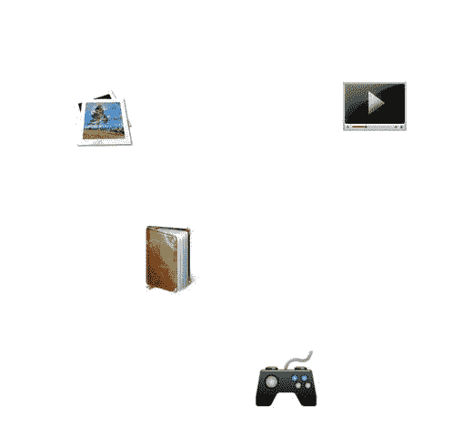
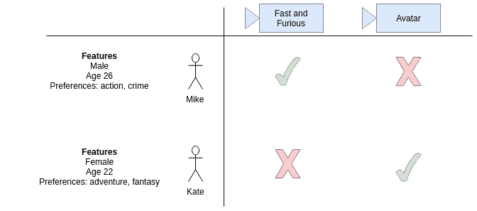

# 机器学习推荐系统简介

> 原文：<https://towardsdatascience.com/an-easy-introduction-to-machine-learning-recommender-systems-efc8f7ece829?source=collection_archive---------12----------------------->

> 我为学习者写了一份名为《强大的知识》的时事通讯。每一期都包含链接和最佳内容的关键课程，包括引文、书籍、文章、播客和视频。每一个人都是为了学习如何过上更明智、更快乐、更充实的生活而被挑选出来的。 [**在这里报名**](https://mighty-knowledge.ck.page/b2d4518f88) 。

YouTube 怎么知道你会看什么视频？谷歌似乎总是知道你会读到什么新闻，这是怎么回事？他们使用一种叫做 [*推荐系统*](https://en.wikipedia.org/wiki/Recommender_system) 的[机器学习](https://en.wikipedia.org/wiki/Machine_learning)技术。

实际上，推荐系统包括一类能够向用户建议“相关”项目的技术和算法。理想情况下，建议的项目尽可能与用户相关，这样用户就可以参与这些项目:YouTube 视频、新闻文章、在线产品等等。

根据项目的相关性对项目进行排序，并向用户显示最相关的项目。相关度是推荐系统必须确定的，并且主要基于历史数据。如果你最近看了 YouTube 上关于大象的视频，那么 YouTube 将开始向你展示许多标题和主题相似的大象视频！

推荐系统通常分为两大类:协同过滤和基于内容的系统。

Figure 1: A tree of the different types of Recommender Systems

# 协同过滤系统

[协同过滤](https://en.wikipedia.org/wiki/Collaborative_filtering)推荐系统的方法是仅基于用户和目标项目之间的过去交互的方法。因此，对协同过滤系统的输入将是用户与目标项目交互的所有历史数据。这些数据通常存储在一个矩阵中，其中行是用户，列是项目。

这种系统背后的核心思想是，用户的历史数据应该足以做出预测。也就是说，我们不需要比历史数据更多的东西，不需要来自用户的额外推送，不需要当前的趋势信息等等。

Figure 2: Illustration of how collaborative filtering works for predicting a user’s rating of 4 things: an image, a book, a video, and a video game. Based on the users' historical data, the likes and dislikes of each item, the system tries to predict how the user would rate a new item that they haven’t rated yet. The predictions themselves are based on past ratings of other users, whose ratings and therefore supposed preferences, are similar to the active user. In this case, the system made the prediction / recommendation that the active user won’t like the video. [Source](https://en.wikipedia.org/wiki/Collaborative_filtering) by [Moshanin](https://commons.wikimedia.org/w/index.php?title=User:Moshanin&action=edit&redlink=1)

除此之外，协同过滤方法被进一步分为两个子组:基于记忆和基于模型的方法。

基于记忆的方法是最简单的，因为它们不使用任何模型。他们假设可以根据过去数据的纯“记忆”进行预测，并且通常只采用简单的距离测量方法，如最近邻法。

另一方面，基于模型的方法总是假设某种潜在的模型，并且基本上试图确保无论什么预测都将很好地装备模型。

例如，假设我们有一个用户偏好午餐项目的矩阵，其中所有用户都是喜欢芝士汉堡的美国人(它们非常棒)。基于记忆的方法将只查看用户在过去的一个月里吃了什么，而不考虑他们是喜欢奶酪汉堡的美国人这一小事实。另一方面，基于模型的方法将确保预测总是更倾向于奶酪汉堡，因为潜在的模型假设是数据集中的大多数人应该喜欢奶酪汉堡！

## 代码

我们可以使用 [Graph Lab](https://turi.com/) 轻松创建一个协同过滤推荐系统！我们将采取以下步骤:

1.  用熊猫加载数据
2.  将熊猫数据帧转换为图形实验室帧
3.  训练模型
4.  提出建议

# 基于内容的系统

与协同过滤相比，基于内容的方法将使用关于用户和/或项目的附加信息来进行预测。

例如，在我们上面看到的 gif 中，基于内容的系统在进行预测时可能会考虑年龄、性别、职业和其他个人用户因素。如果我们知道这个视频是关于滑板的，但是用户已经 87 岁了，那么预测这个人不喜欢这个视频就容易多了！

这就是为什么当你注册许多在线网站和服务时，他们会要求你(选择性地)提供你的出生日期、性别和种族！这只是为他们的系统提供了更多的数据来做出更好的预测。

因此，基于内容的方法更类似于经典的机器学习，也就是说，我们将基于用户和/或项目数据构建特征，并使用这些特征来帮助我们进行预测。我们的系统输入是用户的**特征**和物品的**特征**。我们的系统输出是对用户是否喜欢或不喜欢该商品的预测。

## 代码

我们可以使用 [Graph Lab](https://turi.com/) 轻松创建一个协同过滤推荐系统！我们将采取以下步骤:

1.  用熊猫加载数据
2.  将熊猫数据帧转换为图形实验室帧
3.  训练模型
4.  提出建议

# 喜欢学习？

在 twitter 上关注我，我会在这里发布所有最新最棒的人工智能、技术和科学！也在 LinkedIn 上与我联系！