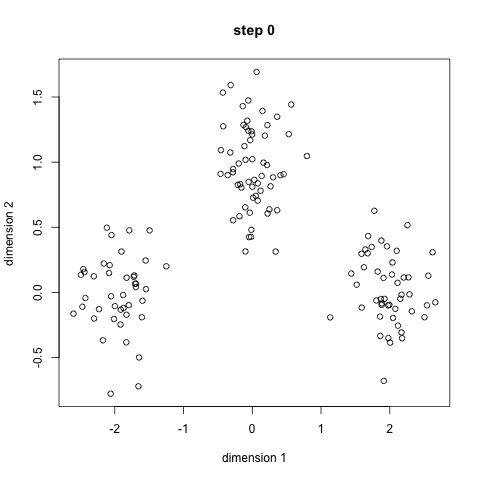
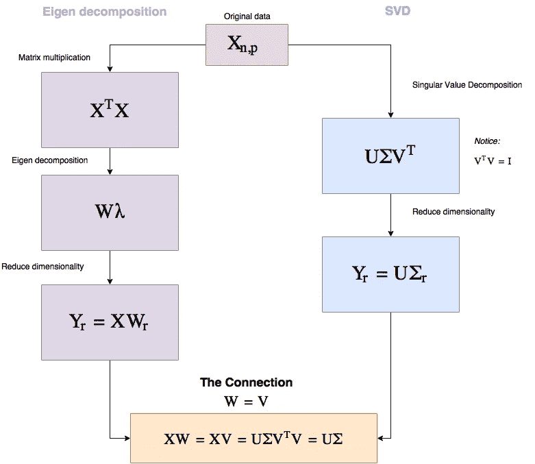

# 用 4 种基本技术简单介绍无监督学习

> 原文：<https://towardsdatascience.com/an-easy-introduction-to-unsupervised-learning-with-4-basic-techniques-da7fbf0c3adf?source=collection_archive---------17----------------------->

> 想获得灵感？快来加入我的 [**超级行情快讯**](https://www.superquotes.co/?utm_source=mediumtech&utm_medium=web&utm_campaign=sharing) 。😎

深度学习得到了人工智能社区和普通公众的大量喜爱。但最近，研究人员开始质疑和怀疑深度学习真的是人工智能的未来。

今天使用的突出的深度学习技术都依赖于*监督学习，*然而我们非常清楚地看到，人类在没有太多监督的情况下学习事物、模式和概念。从某种意义上说，我们的学习是相当*无人监督的*。

无监督学习没有得到那么多的喜爱，这有几个明显的原因。这很难，效果也不好(目前为止)，还没有做太多的工作，而且无监督框架本身很难具体定义。

也就是说，我们确实有一些无监督学习技术的基础，在某些应用和设置中工作得很好。这些技术可能为人工智能研究的未来提供线索。在这篇文章中，我们将学习 4 种基本的无监督学习技术以及如何应用它们！

# 使聚集

[聚类](/the-5-clustering-algorithms-data-scientists-need-to-know-a36d136ef68)是一种涉及数据点分组的技术。给定一组数据点，我们可以使用聚类算法将每个点分类到特定的组中。

理论上，同一组中的数据点应该具有相似的属性和/或特征，而不同组中的数据点应该具有非常不同的属性和/或特征。点之间的相似性通常由基于某种特征变量集的距离度量来量化。

The popular K-means clustering algorithm

聚类技术简单而有效；它们几乎不需要密集的工作，但通常可以给我们提供非常有价值的数据洞察力。因此，数十年来，它已被用于许多应用中，包括:

*   生物学，用于遗传和物种分组
*   医学成像，用于区分不同种类的组织
*   市场研究，用于根据一些属性了解不同的企业和客户群体
*   推荐系统，比如给你更好的亚马逊建议

…仅举几个例子！

# 自动编码器

在进行机器学习时，我们可能会遇到某些情况，我们的特征表示太大而无法处理。例如，假设我们正在做一个人脸识别应用程序，我们希望将每个人的人脸模板保存在我们的数据库中，以便以后可以再次识别它们。如果我们要保存一张 128x128 的人脸彩色图像，我们必须为每张脸保存 128 * 128 * 3 = 49152 个浮点值！如果我们只需要存储 100 张脸，那么对于这样一个看似简单的任务来说，这将会占用大量的磁盘空间！

这就是自动编码器的用武之地。有了自动编码器，我们可以*对我们的特征进行编码*，这样它们占用的空间就少得多，但仍能有效地表达同样的东西。

为了做到这一点，我们将训练一个神经网络来预测它自己的输入。听起来很奇怪，对吧？！这就是为什么有一个小问题:我们的自动编码器的中间层的**比我们的输入和输出少得多。这个想法是，我们可以训练我们的神经网络来学习我们的特征表示的压缩版本。一旦我们这样做了，我们可以简单地存储这些压缩的要素制图表达，占用更少的存储空间，同时仍然能够准确地表示我们的数据！**

An illustration of a typical autoencoder

# 特征分离技术

特征分离技术允许我们分解数据集的整体特征表示，并独立地查看每个特征。了解我们的每个要素如何对数据集的形成做出贡献，或者单独输出预测，通常会很有用。这样，我们就可以知道哪些特征是重要的，以及每个特征在我们的整体数据中扮演什么角色。

两种最流行的特征分离技术是:

*   *主成分分析(PCA):* 它寻找数据中包含最多方差和信息的线性组合
*   *奇异值分解(SVD):* 它将你的数据分解成 3 个小得多的矩阵的乘积

实际上，这两种技术都可以用来创建可以独立分析的孤立特征向量。由于它们都得到比原始数据集小得多的矩阵，它们也可以通过降维用于数据压缩。

给定孤立的特征向量，我们可以选择最能代表我们的数据及其变化的特征向量，然后将我们的数据重新投影到孤立的向量上。两种降维技术之间的过程和联系如下所示。

PCA and SVD for dimensionality reduction

# 期望值最大化算法

期望最大化(EM)算法是一类迭代方法，旨在估计某些统计模型的参数，以便准确地对数据建模。例如，假设我们的数据如下图所示呈高斯分布，我们希望找到高斯分布的最佳参数来对其建模。期望值最大化算法为我们提供了一种自动估计高斯参数的方法:每个方向的均值和标准差！

在 EM 算法中，我们在期望(E)步骤和最大化(M)步骤之间交替。E 步骤使用当前参数创建我们的统计模型，并将其应用于我们的数据。

基于我们的数据和我们的数据的统计模型表示之间的误差(即值的差异)，M 步骤为模型计算一组新的参数。新的参数被设置成使得我们最小化误差，或者等效地，*最大化*我们的数据属于我们的统计模型的概率。EM 算法可以用在任何我们想要创建一个统计模型来表示我们的数据的地方，同时自动估计参数。

# 喜欢学习？

在[推特](https://twitter.com/GeorgeSeif94)上关注我，我会在那里发布所有最新最棒的人工智能、技术和科学！也在 [LinkedIn](https://www.linkedin.com/in/georgeseif/) 上和我联系吧！