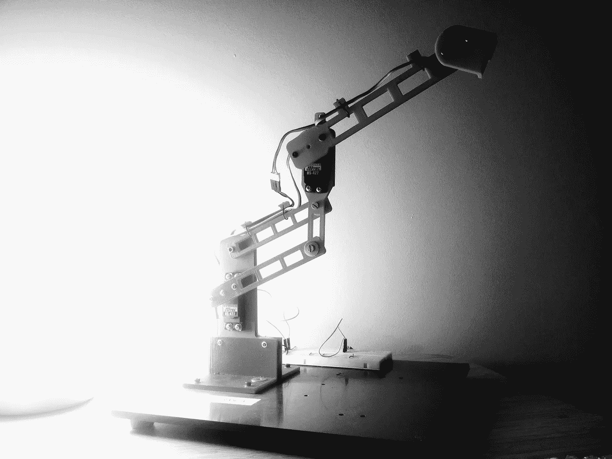
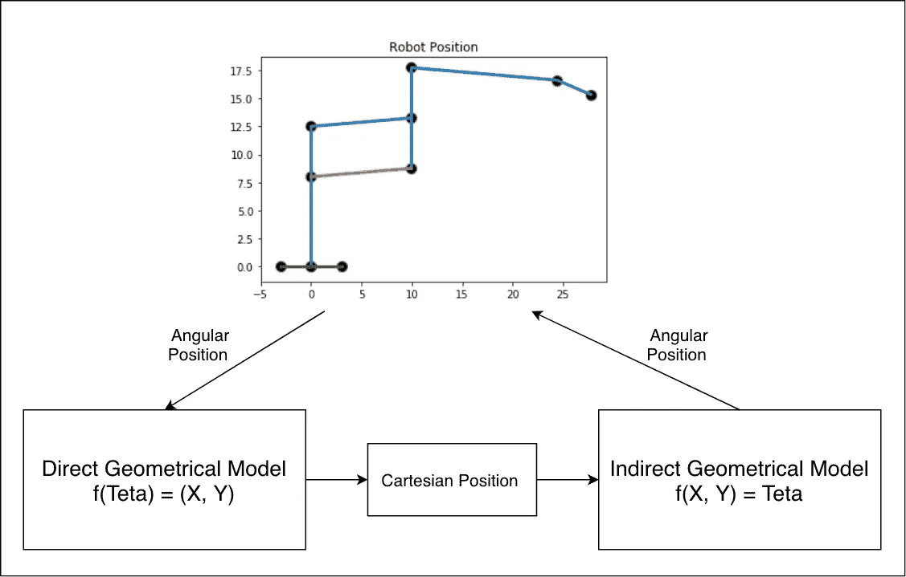
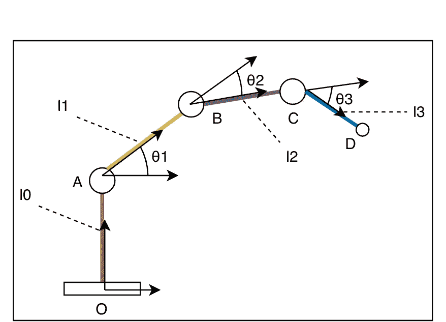
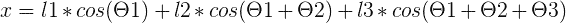
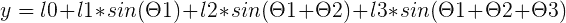
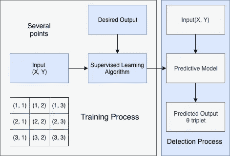
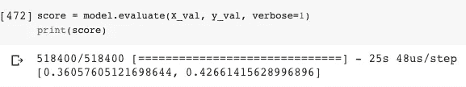
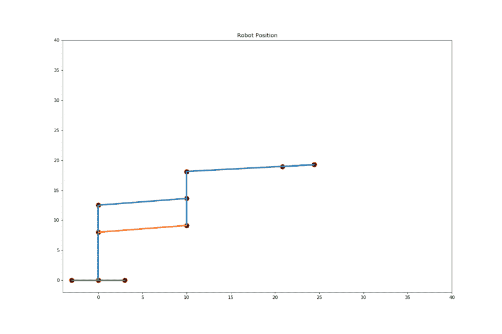

# 一种高效快速的方法来控制你的机器人。真的。

> 原文：<https://towardsdatascience.com/an-efficient-and-fast-way-to-control-your-robots-truly-92ee93aadff5?source=collection_archive---------21----------------------->

去年，我们的教授提出了一个新的课堂项目。从零开始创造机器人手臂。在机器人爱好者的生活中，第一个 DIY 机器人可能会改变游戏规则。应该是！—一个简单的机器人项目肯定是从这个问题开始的:这个机器人的目的是什么？



School project (Sorbonne Université, Paris)

为了解决这个问题，你自然要探索硬件设计领域。那么你可能会在系统的电子架构中找到一些灵感。在这个思考过程的最后，你设计的机器人看起来很棒，你可能对你的机器人会是什么有一个清晰的想法。这是你需要暂停的时候。你考虑过如何驾驶机器人吗？需要什么样的软件或几何模型？对我来说，这一步是一个巨大的挫折。事实上，命令软件可能是你的项目中最模糊的一点。

> 在下面的文件中，我会试着给你一些我希望去年在项目实施过程中知道的信息。

## 如何获得和使用你的机器人的几何模型？



基本上，直接的几何模型非常容易获得。它是关于根据关节的角度位置计算效应器的最终位置。这是一个简单的数学演算。

让我们使用机器人手臂的简化模型来确定直接模型，您可以通过更改这些方程中的一些参数来将解决方案推广到所有项目。



Simplified Model of a 3 joints robotic arm

使用这个简单的 3 关节机械臂模型，我们得到:



X coordinate



Y coordinate

使用这个直接模型，我们现在可以根据角度三元组创建一组笛卡尔坐标。这是一个单向过程——这是几何求解的最初步骤。实际上，人们通常对另一种方式感兴趣:从笛卡尔的一对数字(X，Y)到角度三元组:(θ1，θ2，θ3)

> 好的，那么你的最终目标是获得关于机器人效应器位置的角度三元组。

为此，您可以尝试计算间接模型。这是人们首先要做的，但有时可能会很困难和/或很耗时。为了解决这个问题，我想给你介绍一下**监督学习过程。**

> 命令软件可能是你项目最模糊的点。



Supervised Learning Model

> 我们之前计算的直接模型用于计算分别与所谓的角三元组关联的笛卡尔坐标。

## 使用 MLP 回归器预测角形三胞胎

首先你需要实现你的模型并定义你的机器人关节的参数。这些参数是机器人关节的不同长度。它们也可能是一些预先确定的常数参数，限制你的机器人的移动。

Robot’s model

S 秒您需要创建用于生成模型的数据集。该数据集由角度三元组和笛卡尔位置组成，两者都与直接模型相关联并通过直接模型计算。

Dataset Generation

您还需要生成数据集的分割。第一部分用来训练你的模型，另一部分用来评估它的性能。您应该使用某种洗牌率来避免“糟糕”的学习和灾难性的泛化-永远不要忘记在数据集生成过程中引入洗牌，尽管您可能希望在没有洗牌的情况下尝试观察结果。


T hird，我们使用 keras 顺序实现定义多层感知器。随意改变网络的超参数:隐藏层的数量、学习率、网络的深度、退出、正则化等。所有这些变化都将是适合你自己的基于数据的问题的关键。

MLP

然后，您需要使用 Keras API 函数训练模型以适应您的数据:

```
model.fit
```

第四，你应该为你的模型建立一个基准来评估它的性能和准确性。要对其评分，您可以使用 Keras 函数并将其应用于验证数据集:

```
model.evaluate
```



Evaluation of the model

## 图形评估

我相信机器人的模型达到了一个很好的精度水平，特别是如果你看一下培训时间，碰巧是很短的一段时间。下面是一些使用 Matplotlib 的结果显示。查看 colab 以获得关于这个问题的更多注释和细节。



Command is x = 20 and y = 20–40

你应该尝试许多轨迹来弄清楚你的机器人是否能够响应你最初的目的。

> 别忘了这是基于数据的问题。

有时您会想要约束角度范围。基本上，我的机器人的第一个关节在物理上不能承受负角度:因此，我没有在我的三联输入中引入任何负角度θ1。

## **用途**

最后，利用模型进行预测。您可以使用同一个 Keras API 中的函数:

```
model.predict#Save the model
model.save_weights(‘model_weights.h5’)model.save(‘model.h5’)
```

预测的输入可能如下所示:

```
posCartesian = np.array([[posX, posY]])prediction = model.predict(posCartesian)
```

非常感谢您的阅读，如果您有任何问题，或者您有合理的批评，或者只是想交流您的项目，请随时联系我们。

下一篇文章将关注使用 Python-Arduino 协作在真实机器上的模型部署。敬请期待！

## 参考资料:

您应该在此处访问该项目的 Colab:

[https://gist . github . com/momento 624/d5c 3d 85 f 6 ff 1 BD 507 f 092 DDB 53d 655 f 0](https://gist.github.com/Momento624/d5c3d85f6ff1bd507f092ddb53d655f0)

张量流:[https://en.wikipedia.org/wiki/TensorFlow](https://en.wikipedia.org/wiki/TensorFlow)

https://en.wikipedia.org/wiki/Scikit-learn

https://en.wikipedia.org/wiki/NumPy[号](https://en.wikipedia.org/wiki/NumPy)

https://en.wikipedia.org/wiki/Matplotlib

https://en.wikipedia.org/wiki/Keras