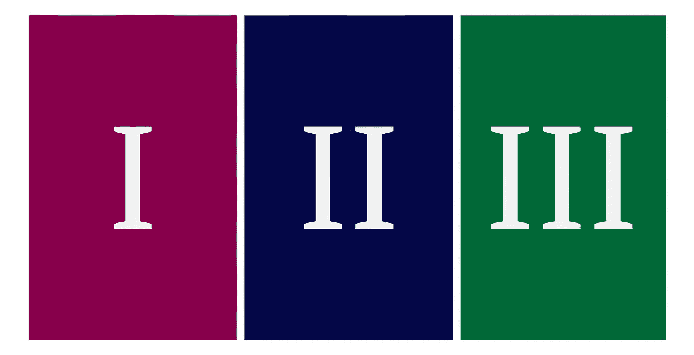

# 电力公司神经网络调峰三部曲指南。

> 原文：<https://towardsdatascience.com/an-electric-utilitys-3-part-guide-to-peak-shaving-with-neural-networks-de5c7752d946?source=collection_archive---------33----------------------->

*协同* [*研究开放式建模框架*](http://omf.coop) *。*

预测技术给了公用事业单位一个机会来拉平他们的负荷曲线，提出了一系列全新的问题。以下是一些重要问题的解决方案，它们可以通过降低电厂调峰的资本和运营费用，为电力公司节省大量资金。所有测试都可以在[这里](https://github.com/kmcelwee/mediumBlog/tree/master/load_forecast)找到。

这项研究也可以在我的网站上查看:

 [## 基于神经网络的⚡️负荷预测和调峰

### 预测技术给了公用事业单位一个机会来拉平他们的负荷曲线，提出了一个全新的家庭…

www.kmcelwee.com](https://www.kmcelwee.com/load-forecasting/) 

# 第一部分:明天的负荷是多少？

 [## 用神经网络预测明天的用电量

### 最小的错误都会在一天内造成数千美元的损失。神经网络可以帮助确保…

towardsdatascience.com](/using-neural-nets-to-predict-tomorrows-electric-consumption-cc1ae3ae7cc2) 

## 主要要点:

*   要获得任何有用的能源消耗预测，简单的机器学习是不合适的。然而，深度学习可以让我们获得我们需要的准确性。
*   给定历史负荷和温度数据，一个简单的神经网络可以给出 24 小时的预测，准确率约为 97%。

 [## 用神经网络预测日用电量。

### 一个简单的三维结构如何减少错误，战胜更复杂的模型，并加倍节省。

medium.com](https://medium.com/@kevinrmcelwee/predict-daily-electric-consumption-with-neural-networks-8ba59471c1d) 

## 主要要点:

*   一整天的负荷预测方法比一小时一小时的方法更准确。
*   尽管两种方法之间只有 1 MAPE 的误差差异，但测试表明，由于发电量减少，该方法在调峰时使我们的节约翻倍。

# 第二部分:但这是月高峰吗？

 [## 神经网络的短期预测如何影响长期决策。

### 电力公司只需三天的天气预报就能探测到每月的高峰。

towardsdatascience.com](/how-short-term-forecasting-with-neural-nets-can-inform-long-term-decisions-9f65eba6fb7e) 

## 主要要点:

*   每天进行调峰调度可能成本很高。
*   多天预测可以帮助我们大幅减少每月的派单次数，而不会错过每月的高峰
*   公用事业公司需要设定他们自己的优先级，但在大多数情况下，他们大约每周只能调度一次，而每隔几年只会错过一次高峰。

# 第三部分:好的，我们正在派遣。我们应该在多大程度上相信预测？

 [## 预测不可靠的调峰。

### 一个 19 世纪的物理方程如何能让电力公司节约超过 60%

towardsdatascience.com](/peak-shaving-with-unreliable-forecasts-78bb9623e6b0) 

## 主要要点:

*   因为我们的预测不可避免地存在误差，所以预测的“最优”调度解决方案不一定是实践中的最佳调度。
*   热量等式可用于分散我们的调度(例如，如果我们的预测预报建议在下午 12 点调度 500 千瓦，则等式可能会在上午 11 点返回 150 千瓦，下午 12 点返回 200 千瓦，下午 1 点返回 150 千瓦。)
*   这个简单的方法可以节省很多钱。一个地区的储蓄增加了 60%以上。
*   该方程需要两个常量作为输入，但是对于实用程序来说，优化它们应该不难。

*疑问？更正？联系我，查看更多项目在* [*我的网站*](http://www.kmcelwee.com) *。*