# GANs 的端到端介绍

> 原文：<https://towardsdatascience.com/an-end-to-end-introduction-to-gans-bf253f1fa52f?source=collection_archive---------4----------------------->

## 柠檬榨汁机

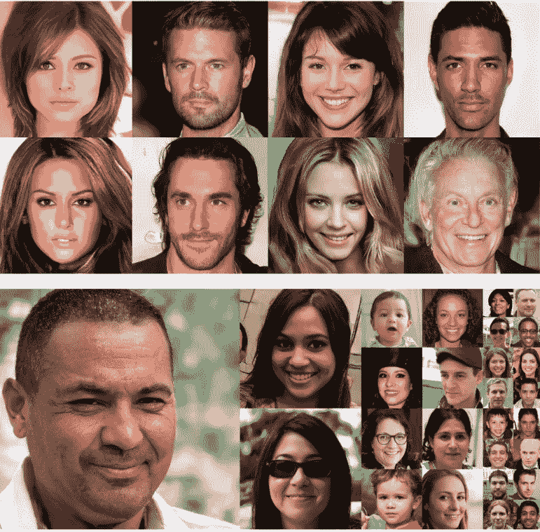

我敢打赌，我们大多数人最近都见过很多人工智能生成的人脸，无论是在报纸上还是博客上。我们已经到达了一个阶段，在这个阶段，区分真实的人脸和人工智能生成的人脸变得越来越困难。

在这篇文章中，我将帮助读者理解他们如何自己创建和构建这样的应用程序。

对于初学者来说，我会尽可能保持这篇文章的直观性，同时不会让它变得太简单。

***这个帖子是关于了解***[***GANs***](https://amzn.to/32FMOWF)***如何工作的。***

# 任务概述

我将致力于使用动漫人物数据集创建我们自己的动漫人物。

我在这里使用的 DC-甘风格的甘不仅可以生成人脸或者新的动漫角色；它还可以用于创建现代时尚风格，用于一般的内容创建，有时也用于数据扩充目的。

在我看来，GANs 将会改变视频游戏和特效的制作方式。这种方法可以按需创建逼真的纹理或角色。

你可以在 Github 库中找到本章的完整代码。我还把代码上传到了谷歌实验室，这样你就可以自己尝试了。


# 使用 DCGAN 架构生成动漫图像

像往常一样，在我们进入编码之前，深入研究一下理论会有所帮助。

DC-甘的主要思想源于亚历克·拉德福德、卢克·梅斯和索史密斯·钦塔拉在 2016 年写的论文[深度卷积生成对抗网络的无监督表示学习](https://arxiv.org/pdf/1511.06434.pdf)。

虽然我将在接下来的几节中解释这篇论文，但是请务必看一看它。这是一篇优秀的论文。

# 直觉:生成假图像的 GANs 简介

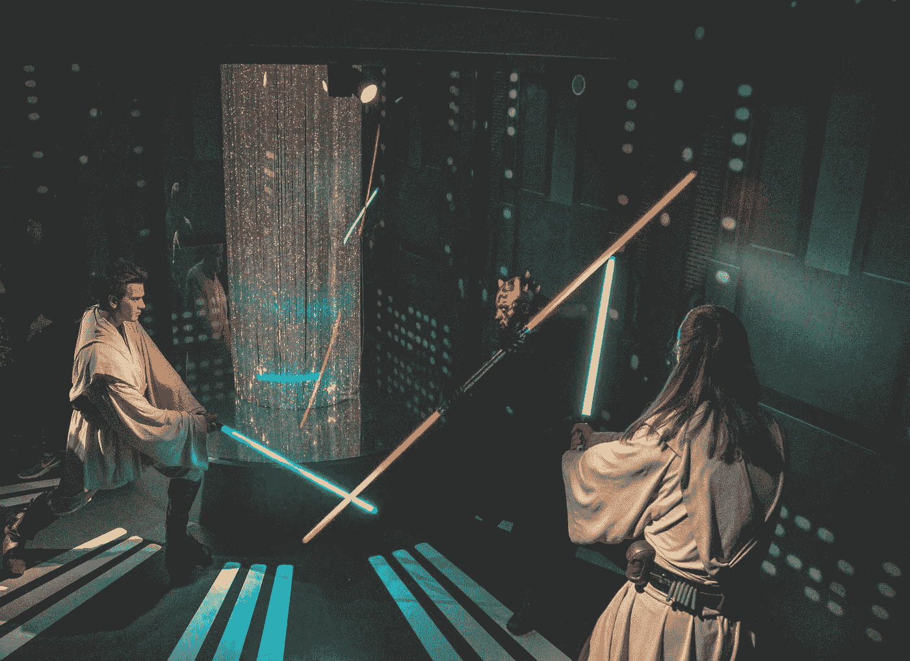

通常情况下， ***GANs 采用两个决斗神经网络来训练计算机学习数据集的性质，足以生成令人信服的假货。***

我们可以将此视为两个系统，其中一个神经网络工作以生成假货(生成器)，另一个神经网络(鉴别器)试图对哪个图像是假货进行分类。

由于发生器和鉴别器网络都重复这样做，网络最终会更好地完成各自的任务。

***把这个想成剑术那么简单。*** 两个 noobs 开始互相对打。过了一会儿，两人的剑术都变得更好。

***或者你也可以把这个想成一个强盗(发电机)和一个警察(鉴别器)。在多次盗窃之后，强盗变得更擅长偷窃，而警察变得更擅长抓强盗。*在理想的世界里。****

这些神经网络中的损耗主要是另一个网络表现如何的函数:

*   鉴别器网络损耗是发生器网络质量的函数——如果鉴别器被发生器的假图像欺骗，那么鉴别器的损耗很高
*   发电机网络损耗是鉴频器网络质量的函数，如果发电机不能欺骗鉴频器，损耗就很高。

在训练阶段，我们依次训练鉴别器和发生器网络，以提高鉴别器和发生器的性能。

目标是最终得到帮助生成器生成逼真图像的权重。 ***最后，我们可以使用生成器神经网络从随机噪声中生成假图像。***

# 发电机架构

我们面对的一个主要问题是 GANs 的训练不是很稳定。因此，我们必须想出一个生成器架构来解决我们的问题，并产生稳定的训练。

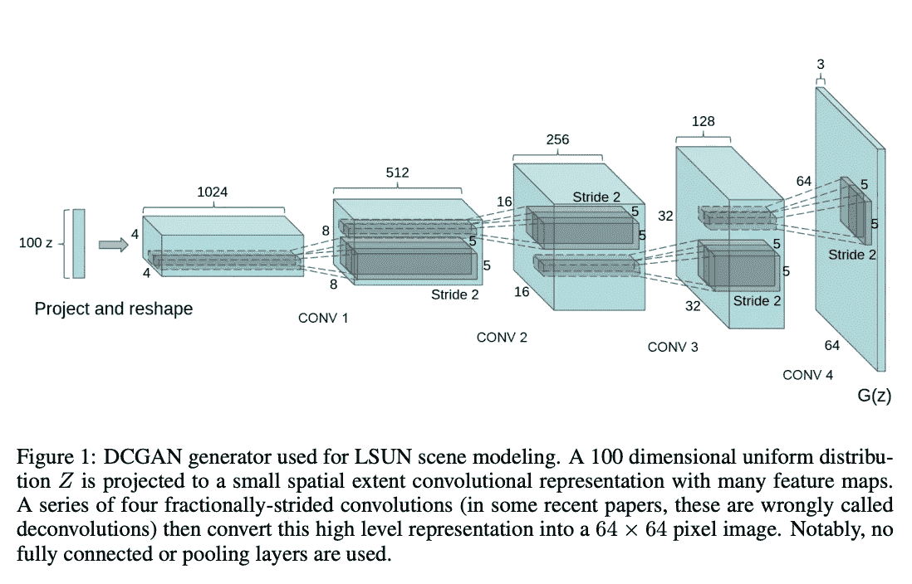

上图摘自论文，解释了 DC-GAN 发生器的架构。这可能看起来有点混乱。

本质上，我们可以将生成器神经网络视为一个黑盒，它接受一个 100 大小的正常生成的数字向量作为输入，并为我们提供一个图像:

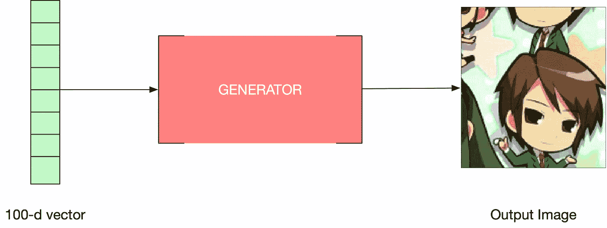

***我们如何得到这样的架构？***

在下面的架构中，我们使用大小为 4x4x1024 的密集层从这个 100 维向量中创建一个密集向量。然后，我们用 1024 个滤镜将这个密集矢量重新塑造成 4x4 的图像形状，如下图所示:

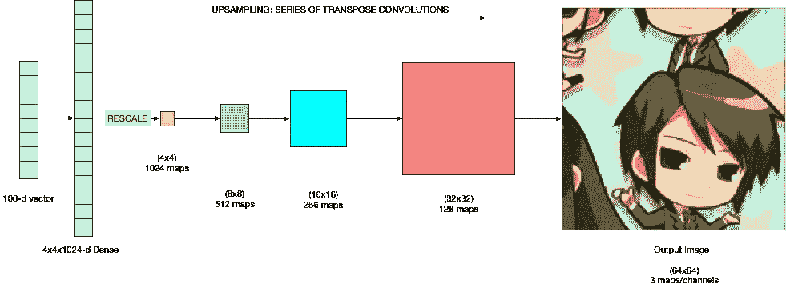

我们现在不必担心任何权重，因为网络本身会在训练时学习这些权重。

一旦我们有了 1024 个 4x4 的贴图，我们就使用一系列转置卷积进行上采样，在每次操作之后，图像的大小加倍，贴图的数量减半。在最后一步中，虽然我们没有将贴图的数量减半，但是将每个 RGB 通道的贴图数量减少到 3 个通道/贴图，因为我们需要 3 个通道来输出图像。

## 什么是转置卷积？

最简单地说， ***转置卷积为我们提供了一种对图像进行上采样的方法。*** 在卷积运算中，我们试图从 4x4 图像到 2x2 图像，而在转置卷积中，我们从 2x2 到 4x4 进行卷积，如下图所示:

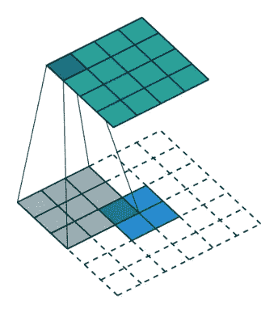

**Upsampling a 2x2 image to 4x4 image**

***问:*** 我们知道，在卷积神经网络(CNN)中，Un-pooling 普遍用于对输入特征图进行上采样。为什么我们不使用取消池？

这是因为取消汇集不涉及任何学习。然而，转置卷积是可以学习的，这就是为什么我们更喜欢转置卷积而不是反池。它们的参数可以被发电机学习，我们将在一段时间内看到。

# 鉴别器架构

现在，我们已经理解了生成器架构，这里是作为黑盒的鉴别器。

实际上，它包含一系列的卷积层，并在末端包含一个密集层，以预测图像是否是假的，如下图所示:

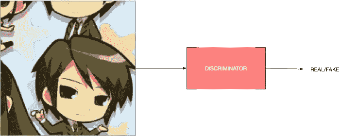

将图像作为输入，并预测它是真是假。***conv 网曾经的每一个形象。***

# 数据预处理和可视化

我们要做的第一件事是查看数据集中的一些图像。以下是可视化数据集中部分影像的 python 命令:

结果输出如下:

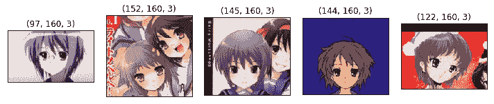

我们可以看到图像的大小和图像本身。

在这种特殊情况下，我们还需要函数将图像预处理为 64x64x3 的标准大小，然后再继续我们的训练。

在我们使用它来训练我们的 GAN 之前，我们还需要标准化图像像素。你可以看到它的代码被很好地注释了。

正如您将看到的，我们将在代码的培训部分使用前面定义的函数。

# DCGAN 的实现

这是我们定义 DCGAN 的部分。我们将定义噪声发生器功能、发生器架构和鉴别器架构。

## 为发电机生成噪声矢量


Kids: Normal Noise generators

下面的代码块是一个帮助器函数，为生成器创建一个预定义长度的噪声向量。它将产生噪声，我们希望使用我们的发生器架构将其转换为图像。

我们使用正态分布

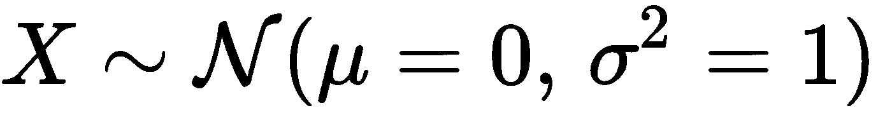

要生成噪声矢量，请执行以下操作:

## 发电机架构

发电机是 GAN 中最关键的部分。

在这里，我通过添加一些转置卷积层来创建一个生成器，以便对图像的噪声向量进行上采样。

正如你所注意到的，这个发生器的结构与 DC-甘最初的论文中给出的不同。

我需要对架构进行一些更改，以更好地适应我们的数据，因此我在中间添加了一个卷积层，并从生成器架构中删除了所有密集层，使其完全卷积。

我也用了很多动量为 0.5，漏 ReLU 激活的 Batchnorm 层。我用的是β=0.5 的亚当优化器。下面的代码块是我将用来创建生成器的函数:

您可以绘制最终的发电机模型:

```
plot_model(generator, to_file='gen_plot.png', show_shapes=True, show_layer_names=True)
```

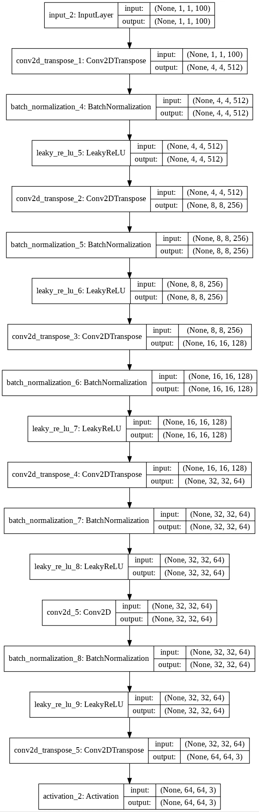

Generator Architecture

## 鉴别器架构

这是鉴别器架构，我使用一系列卷积层和最后的密集层来预测图像是否是假的。

以下是鉴别器的架构:

```
plot_model(discriminator, to_file='dis_plot.png', show_shapes=True, show_layer_names=True)
```

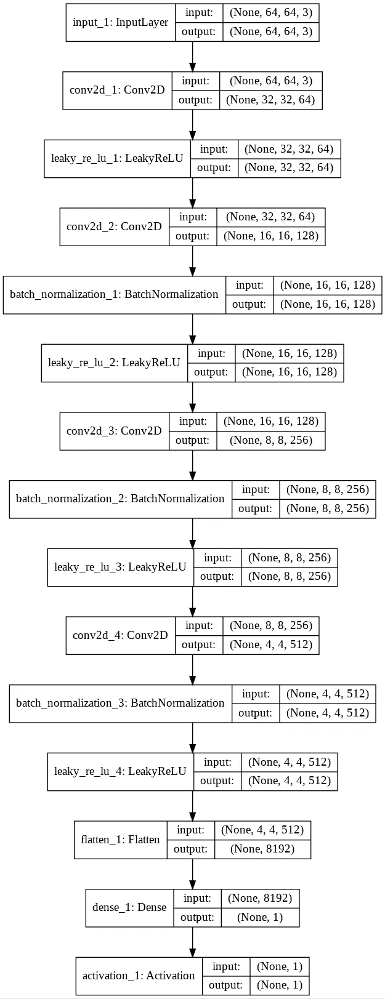

Discriminator Architecture

# 培养

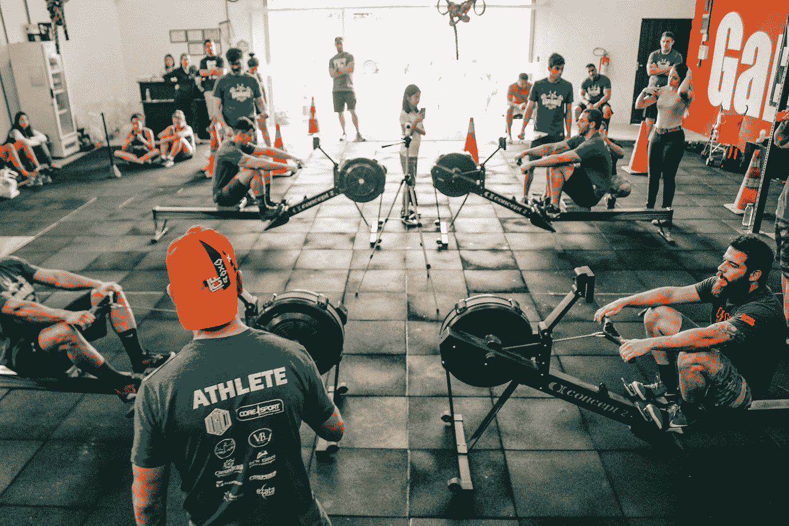

理解 GAN 中的培训是非常重要的。或许还有点意思。

我首先使用上一节中定义的函数创建我们的鉴别器和生成器:

```
discriminator = get_disc_normal(image_shape)
generator = get_gen_normal(noise_shape)
```

然后，发生器和鉴别器相结合，形成最终的 GAN。

```
discriminator.trainable = False# Optimizer for the GAN
opt = Adam(lr=0.00015, beta_1=0.5) #same as generator
# Input to the generator
gen_inp = Input(shape=noise_shape)GAN_inp = generator(gen_inp)
GAN_opt = discriminator(GAN_inp)# Final GAN
gan = Model(input = gen_inp, output = GAN_opt)
gan.compile(loss = 'binary_crossentropy', optimizer = opt, metrics=['accuracy'])plot_model(gan, to_file='gan_plot.png', show_shapes=True, show_layer_names=True)
```

这是我们整个 GAN 的架构:

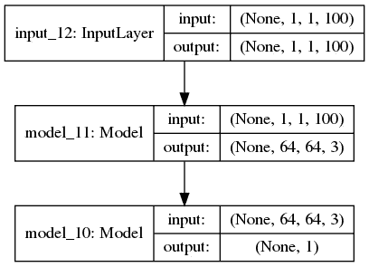

## 训练循环

这是一个主要的区域，我们需要了解到目前为止我们所创建的模块是如何组装和协同工作的。

别担心，我会在这里一步步尝试破解上面的代码。每个训练迭代的主要步骤是:

**步骤 1:** 从数据集目录中采样一批归一化图像

```
# Use a fixed noise vector to see how the GAN Images transition through time on a fixed noise. 
fixed_noise = gen_noise(16,noise_shape)# To keep Track of losses
avg_disc_fake_loss = []
avg_disc_real_loss = []
avg_GAN_loss = []# We will run for num_steps iterations
for step in range(num_steps): 
    tot_step = step
    print("Begin step: ", tot_step)
    # to keep track of time per step
    step_begin_time = time.time() 

    # sample a batch of normalized images from the dataset
    real_data_X = sample_from_dataset(batch_size, image_shape, data_dir=data_dir)
```

**第二步:**产生输入到发电机的噪声

```
# Generate noise to send as input to the generator
    noise = gen_noise(batch_size,noise_shape)
```

**第三步:**使用随机噪声生成器生成图像。

```
# Use generator to create(predict) images
    fake_data_X = generator.predict(noise)

    # Save predicted images from the generator every 100th step
    if (tot_step % 100) == 0:
        step_num = str(tot_step).zfill(4)save_img_batch(fake_data_X,img_save_dir+step_num+"_image.png")
```

**第四步:**使用生成器图像(伪图像)和真实归一化图像(真实图像)及其噪声标签训练鉴别器。

```
# Create the labels for real and fake data. We don't give exact ones and zeros but add a small amount of noise. This is an important GAN training trick
    real_data_Y = np.ones(batch_size) - np.random.random_sample(batch_size)*0.2
    fake_data_Y = np.random.random_sample(batch_size)*0.2

    # train the discriminator using data and labelsdiscriminator.trainable = True
    generator.trainable = False# Training Discriminator seperately on real data
    dis_metrics_real = discriminator.train_on_batch(real_data_X,real_data_Y) 
    # training Discriminator seperately on fake data
    dis_metrics_fake = discriminator.train_on_batch(fake_data_X,fake_data_Y) 

    print("Disc: real loss: %f fake loss: %f" % (dis_metrics_real[0], dis_metrics_fake[0]))

    # Save the losses to plot later
    avg_disc_fake_loss.append(dis_metrics_fake[0])
    avg_disc_real_loss.append(dis_metrics_real[0])
```

**步骤 5:** 使用噪声作为 X，1(有噪声的)作为 Y 来训练 GAN，同时保持鉴别器不可训练。

```
# Train the generator using a random vector of noise and its labels (1's with noise)
    generator.trainable = True
    discriminator.trainable = FalseGAN_X = gen_noise(batch_size,noise_shape)
    GAN_Y = real_data_Y

    gan_metrics = gan.train_on_batch(GAN_X,GAN_Y)
    print("GAN loss: %f" % (gan_metrics[0]))
```

我们使用 for 循环重复这些步骤，最终得到一个好的鉴别器和生成器。

# 结果

最终的输出图像如下所示。正如我们所看到的，GAN 可以为我们的内容编辑朋友生成非常好的图像。

它们可能有点粗糙，但仍然是我们 GAN 之旅的开始。

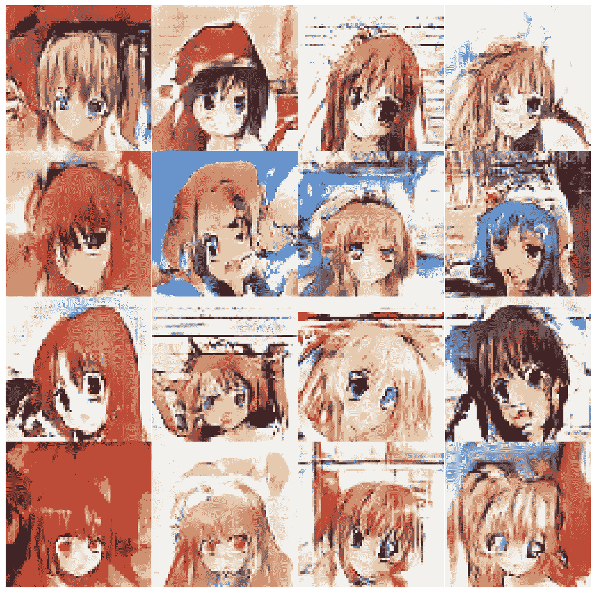

## 训练期间的损失

这是为损失生成的图表。我们可以看到，随着步骤的增加，GAN 损耗平均在下降，方差也在下降。为了获得更好的结果，可能需要进行更多的迭代训练。

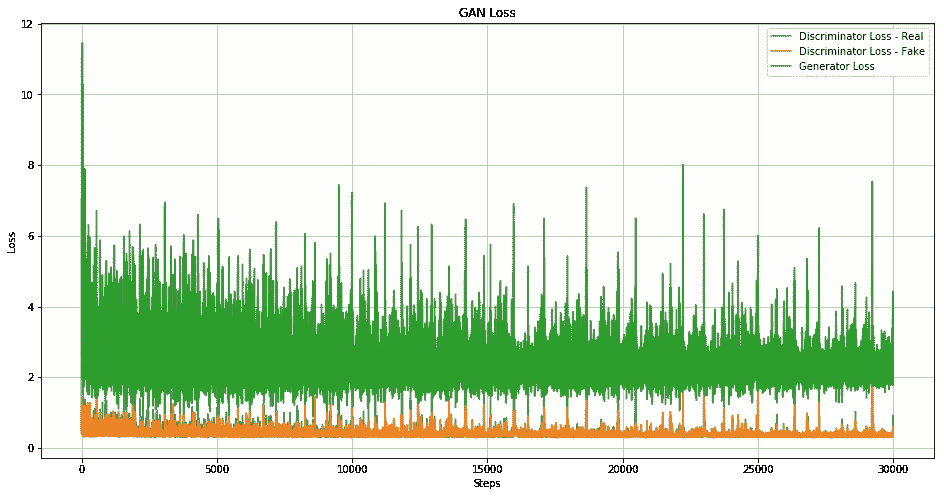

## 每 1500 步生成一幅图像

您可以在 [Colab](https://colab.research.google.com/drive/1Mxbfn0BUW4BlgEPc-minaE_M0_PaYIIX#scrollTo=pqPNyVnSqru1) 中看到输出和运行代码:

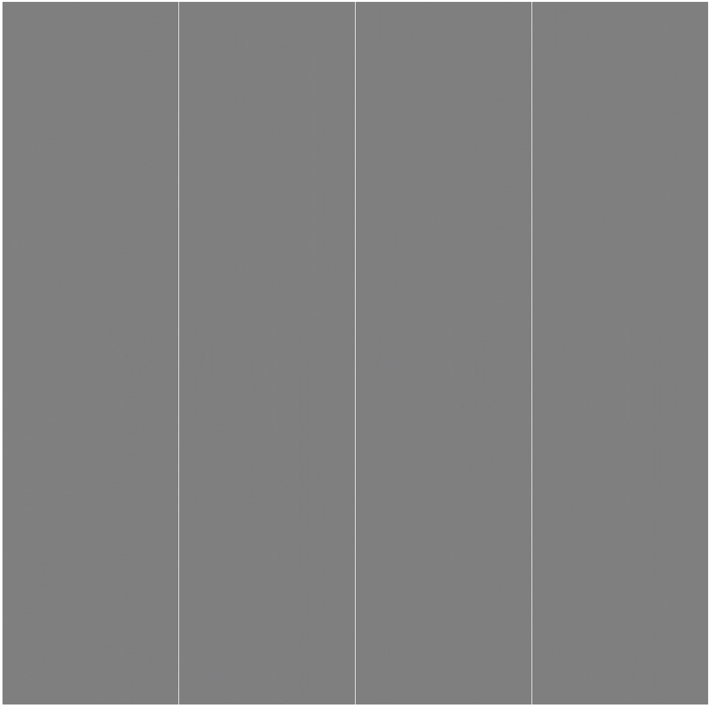

下面给出了在不同的训练步骤中生成一些图像的代码。正如我们所见，随着步数的增加，图像变得越来越好。

下面给出了 GAN 在不同时间步长的结果:

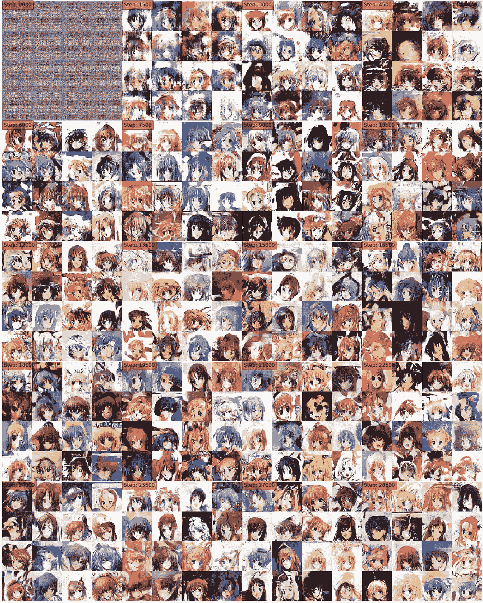

# 结论


Power in your hands

在本帖中， ***我们了解了*** [***甘******s***的基本知识。我们还了解了 DC-甘的生成器和鉴别器架构，并构建了一个简单的 DC-甘来从头开始生成动画图像。](https://amzn.to/32FMOWF)

这个模型不太擅长生成假图像，但我们通过这个项目了解了 GANs 的基本知识，并且随着我们的发展，我们有信心建立更多令人兴奋和复杂的 GANs。

GANs 的 DC-GAN 风格不仅可以广泛应用于生成人脸或新的动画角色，还可以用于生成新的时尚风格，用于一般的内容创建，有时也用于数据增强目的。

如果我们手头有训练数据，我们现在可以按需变出逼真的纹理或角色，这可不是一个小壮举。

如果你想了解更多关于深度学习的应用和用例，可以看看 Andrew NG 的[深度学习专业化](https://coursera.pxf.io/7mKnnY)中的[序列模型](https://coursera.pxf.io/b3rQ7m)课程。Andrew 是一位很棒的讲师，这门课程也很棒。

我以后也会写更多这样的帖子。让我知道你对这个系列的看法。在 [**媒体**](https://medium.com/@rahul_agarwal) 关注我，或者订阅我的 [**博客**](http://eepurl.com/dbQnuX) 了解他们。一如既往，我欢迎反馈和建设性的批评，可以通过 Twitter [@mlwhiz](https://twitter.com/MLWhiz) 联系。