# Python 中的“等式到代码”机器学习项目演练—第 1 部分线性可分问题

> 原文：<https://towardsdatascience.com/an-equation-to-code-machine-learning-project-walk-through-in-python-part-1-linear-separable-fd0e19ed2d7?source=collection_archive---------13----------------------->

## 数学方程式背后的详细解释，为您的机器学习或深度学习之旅奠定实用的数学基础


Photo: Halfpoint/Shutterstock

从工程师到机器学习工程师的一大差距是将数学方程转换为真实代码的能力。有时我们真的需要从头实现一些基本概念，以更好地理解幕后的魔力，而不是在没有进一步理解的情况下只导入库。

所以我决定写一些文章来解释如何将数学方程式转换成真正的代码。这是第 1 部分，我将给出一个使用逻辑回归对一个线性可分问题进行分类的例子。我会尽可能简单地解释。

这里是[数据](https://gist.github.com/BrambleXu/738812287e7900428478c9035157db22#file-linear_data-csv)和[代码](https://gist.github.com/BrambleXu/2640af09b1f43b93c2d951ba91ca3d5c)。

内容结构如下。看起来有点长，

1.  看数据
2.  线性可分问题
3.  向量表示法
4.  标准化
5.  添加偏差
6.  Sigmoid 函数
7.  似然函数
8.  更新参数θ
9.  绘制直线
10.  摘要

# 1 看数据

下面是数据， [linear_data.csv](https://gist.github.com/BrambleXu/738812287e7900428478c9035157db22#file-linear_data-csv)

```
x1,x2,y
153,432,0
220,262,0
118,214,0
474,384,1
485,411,1
233,430,0
396,321,1
484,349,1
429,259,1
286,220,1
399,433,0
403,300,1
252,34,1
497,372,1
379,416,0
76,163,0
263,112,1
26,193,0
61,473,0
420,253,1
```

首先，我们需要绘制这些数据，看看它是什么样子的。我们创建一个 Python 文件，并将其命名为 logistic_regression.py。

```
import numpy as np
import matplotlib.pyplot as plt# read data
data = np.loadtxt("linear_data.csv", *delimiter*=',', *skiprows*=1)
train_x = data[:, 0:2]
train_y = data[:, 2]# plot
plt.plot(train_x[train_y == 1, 0], train_x[train_y == 1, 1], 'o')
plt.plot(train_x[train_y == 0, 0], train_x[train_y == 0, 1], 'x')
plt.show()
```

运行上面的脚本后，您应该会看到下图。

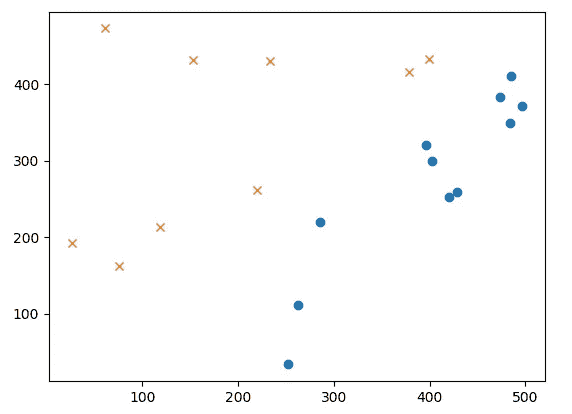

我们可能认为一条直线应该能很好地把 X 和 O 分开。而这是一个[线性可分问题](http://www.ece.utep.edu/research/webfuzzy/docs/kk-thesis/kk-thesis-html/node19.html)。

# 2 线性可分问题

我们需要为这样的问题找到一个模型。最简单的情况是使用[线性函数](https://en.wikipedia.org/wiki/Linear_function_(calculus)?oldformat=true#Properties)。


我们用θ来表示参数。左边的θ标记表示函数 f(x)有参数θ。右边的θ表示有两个参数。

我们可以把它写成代码

```
import numpy as np
import matplotlib.pyplot as plt# read data
data = np.loadtxt("linear_data.csv", *delimiter*=',', *skiprows*=1)
train_x = data[:, 0:2]
train_y = data[:, 2]theta = np.random.randn(2)**def f(x):
    return theta[0] + theta[1] * x**
```

# 3 矢量表示法

我们也可以把线性函数改写成更简单的方式，向量方式。

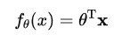

这里的θ和 x 都是列向量。

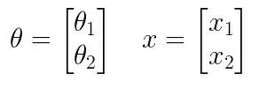

之所以用θ的转置，是因为可以用矩阵乘法。

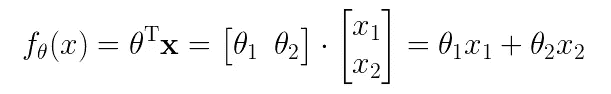

我们可以写下面的代码

```
import numpy as np
import numpy as np
import matplotlib.pyplot as plt# read data
data = np.loadtxt("linear_data.csv", *delimiter*=',', *skiprows*=1)
train_x = data[:, 0:2]
train_y = data[:, 2]# initialize parameter
theta = np.random.randn(2)**# dot product
def f(x):
    return np.dot(theta, x)**
```

你可能想知道为什么我们不写`np.dot(theta.T, x)`？因为[文档](https://docs.scipy.org/doc/numpy/reference/generated/numpy.dot.html)说**如果两个*向量*都是一维数组，那么就是向量的内积(没有复共轭)**。所以`np.dot(theta, x)`做和`np.dot(theta.T, x)`一样的事情。

# 4 标准化

为了使训练快速收敛，我们使用[标准化](https://stats.stackexchange.com/a/10298/116970)，也叫 **z** - **评分。我们是按列来做的。**


*   𝜇在每一栏都很刻薄
*   𝜎是每列的标准偏差

```
import numpy as np
import numpy as np
import matplotlib.pyplot as plt# read data
data = np.loadtxt("linear_data.csv", *delimiter*=',', *skiprows*=1)
train_x = data[:, 0:2]
train_y = data[:, 2]# initialize parameter
theta = np.random.randn(2)**# standardization
mu = train_x.mean(axis=0)
sigma = train_x.std(axis=0)****def standardizer(x):
    return (x - mu) / sigma
std_x = standardizer(train_x)**# dot product
def f(x):
    return np.dot(theta, x)
```

# 5 添加偏差

我们需要在函数中加入一个偏差项，使我们的模型具有更好的泛化能力。所以我们把参数从 2 增加到 3。并且添加常数 x0=1，以便对齐矢量表示。

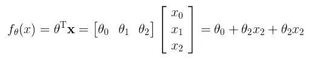

为了使计算更简单，我们把 x 转换成矩阵。

```
import numpy as np
import numpy as np
import matplotlib.pyplot as plt# read data
data = np.loadtxt("linear_data.csv", *delimiter*=',', *skiprows*=1)
train_x = data[:, 0:2]
train_y = data[:, 2]**# initialize parameter
theta = np.random.randn(3)**# standardization
mu = train_x.mean(axis=0)
sigma = train_x.std(axis=0)def standardizer(x):
    return (x - mu) / sigma
std_x = standardizer(train_x)**# get matrix
def to_matrix(std_x):
    return np.array([[1, x1, x2] for x1, x2 in std_x])
mat_x = to_matrix(std_x)**# dot product
def f(x):
    return np.dot**(x, theta)**
```

`std_x`的尺寸为`(20, 2)`。`to_matrix(std_x)`之后`mat_x`的尺寸为`(20, 3)`。至于点积部分，注意这里我们改变了 x 和θ的位置，θ的量纲是`(3,)`。所以点生成的结果应该是`(20,3) x (3,)->(20,)`，这是一个包含 20 个样本预测的一维数组。

# 6 Sigmoid 函数

下面是我们到目前为止讲过的线性函数。


熟悉了线性函数之后。我们将在此基础上构建一个更强大的预测函数，sigmoid 函数。

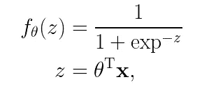

我们用 z 来表示线性函数，并将其传递给 sigmoid 函数。sigmoid 函数将给出每个数据样本的概率。我们的数据中有两个类，一个是`1`，另一个是`0`。


我们可以看到模型基于线性函数部分预测样本。


我们可以写下面的代码

```
import numpy as np
import matplotlib.pyplot as plt# read data
data = np.loadtxt("linear_data.csv", delimiter=',', skiprows=1)
train_x = data[:, 0:2]
train_y = data[:, 2]# initialize parameter
theta = np.random.randn(3)# standardization
mu = train_x.mean(axis=0)
sigma = train_x.std(axis=0)
def standardizer(x):
    return (x - mu) / sigma
std_x = standardizer(train_x)# get matrix
def to_matrix(std_x):
    return np.array([[1, x1, x2] for x1, x2 in std_x])
mat_x = to_matrix(std_x)**# sigmoid function
def f(x):
    return 1 / (1 + np.exp(-np.dot(x, theta)))**
```

# 7 似然函数

> 如果你对方程式的解释不感兴趣，你可以直接跳到第 7 步的最后一部分。

好了，我们准备了数据、模型(sigmoid ),还需要什么？是的，一个目标函数。**目标函数可以指导我们如何以正确的方式更新参数。**对于 sigmoid(逻辑回归)，我们通常使用[对数似然](https://www.wikiwand.com/en/Likelihood_function#/Log-likelihood)作为目标函数


等等，等等…这些东西到底是怎么回事！

**不要慌。冷静点。**

让我们把它拆开。

*   1->2(如何从第 1 行到第 2 行):`log(ab) = log a + log b`
*   2->3: `log(a)^b = b * log a`
*   3->4:由于我们只有两个类，y=0 和 y=1，所以我们可以使用下面的等式:


3->4

*   4->5:我们使用下面的变换使等式更具可读性


所以我们得到了最后一部分。


别忘了我们为什么开始这个。**目标函数可以指导我们如何以正确的方式更新参数。**

我们需要用这个来计算损耗，以更新参数。更具体地说，我们需要计算对数似然函数的**导数**。这里我直接给出最后的更新方程式。(如果你对如何得到这个方程感兴趣，这个[视频](https://www.youtube.com/watch?v=SB2vz57eKgc)应该会有帮助)


**第六步，最重要的方程就是这个。如果你不明白如何做到这一点，这是完全可以的。我们需要做的就是把它写成真正的代码。**

# 8 更新参数θ

第八步稍微长一点，但是很重要。**别慌**。我们会破解它。


θj 是第 j 个参数。

*   η是学习率，我们设为 0.001 (1e-3)。
*   n 是数据样本的数量，在我们的例子中，我们有 20 个。
*   I 是第 I 个数据样本

因为我们有三个参数，所以可以写成三个方程。

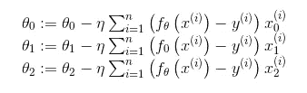

`:=`符号就像`=`。你可以在这里找到解释[。](https://math.stackexchange.com/questions/25214/what-does-mean)

最难的部分是σ(求和符号)，所以为了更好地理解，我扩展了σ。

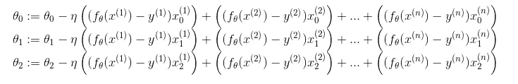

仔细看。

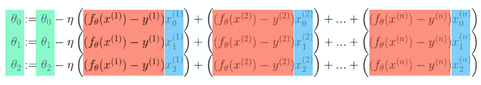

我给等式中的三个部分涂上颜色，因为我们可以用矩阵来表示它们。看第一行红色和蓝色的部分，我们更新了θ0。


我们把红色部分和蓝色部分写成列向量。


因为我们有 20 个数据样本，所以`f`的维数是`(20,1)`。`x0`的尺寸为`(20,1)`。我们可以用转置写矩阵乘法。


所以尺寸应该是`(1, 20) x (20, 1) -> (1,)`。我们得到一个标度来更新θ0。

`x1`和`x2`也是列向量。我们可以把它们写成一个 **X** 矩阵。

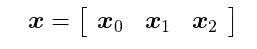

θ是一个行向量

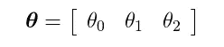

回到等式。


我们可以写为

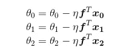

写作是一个等式。


类似 Numpy 数组的版本可能容易理解。

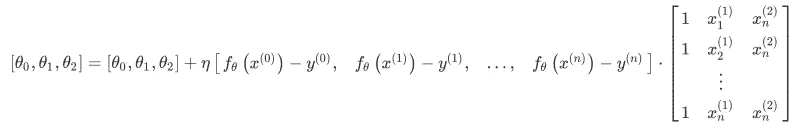

让我们做一点计算，以确保尺寸是正确的。

```
θ: (1, 3) 
f^T: (1, 20) 
x: (20, 3)dot production: (1, 20) x (20, 3) -> (1, 3)
```

一切看起来都那么正确。让我们写代码。实际上，只有两行。

```
import numpy as np
import matplotlib.pyplot as plt# read data
data = np.loadtxt("linear_data.csv", delimiter=',', skiprows=1)
train_x = data[:, 0:2]
train_y = data[:, 2]# initialize parameter
theta = np.random.randn(3)# standardization
mu = train_x.mean(axis=0)
sigma = train_x.std(axis=0)
def standardizer(x):
    return (x - mu) / sigma
std_x = standardizer(train_x)# get matrix
def to_matrix(std_x):
    return np.array([[1, x1, x2] for x1, x2 in std_x])
mat_x = to_matrix(std_x)# dot product
def f(x):
    return np.dot(x, theta)# sigmoid function
def f(x):
    return 1 / (1 + np.exp(-np.dot(x, theta)))# update times
epoch = 2000# learning rate
ETA = 1e-3# update parameter
**for _ in range(epoch):
**    """
    f(mat_x) - train_y: (20,)
    mat_x: (20, 3)
    theta: (3,)

    dot production: (20,) x (20, 3) -> (3,)
    """ **theta = theta - ETA * np.dot(f(X) - train_y, mat_x)**
```

奇怪的事？还记得我们在代码前写了什么吗？

```
dot production: (1, 20) x (20, 3) -> (1, 3)The dimension changes make sense here.
```

但是为什么我们写代码的时候要用`(20,) x (20, 3) -> (3,)`？

实际上，这不是真正的数学符号，这是 Numpy 符号。而且如果你用的是 TensorFlow 或者 PyTroch 的话，应该很熟悉。

`(20,)`表示这是一个包含 20 个数字的一维数组。它可以是行向量，也可以是列向量，因为它只有一维。如果我们将其设置为二维数组，像`(20, 1)`或`(1, 20)`，我们可以很容易地确定`(20, 1)`是一个列向量而`(1, 20)`是一个行向量。

**但是为什么不显式设置维度来消除歧义呢？**

好吧。相信我，我第一次看到这个的时候就有接缝问题。但是经过一些编码实践，我想我知道原因了。

因为它可以节省我们的时间！

我们以`(20,) x (20, 3) -> (3,)`为例。如果我们想得到`(1, 20) x (20, 3) -> (1, 3)`，我们需要用`(20,) x (20, 3) -> (3,)`做什么？

*   将(20，)转换为(1，20)
*   计算(1，20) x (20，3) -> (1，3)
*   因为(1，3)是一个二维列向量，我们需要将其转换为一维数组。(1,3) -> (3,)

老实说，这很令人沮丧。为什么我们不能一步到位？

对，所以我们才能写`(20,) x (20, 3) -> (3,)`。

好了，我们来看看 [numpy.dot()](https://docs.scipy.org/doc/numpy/reference/generated/numpy.dot.html) doc 是怎么说的。

> [numpy.dot()](https://docs.scipy.org/doc/numpy/reference/generated/numpy.dot.html) :如果 *a* 是一个 N 维数组， *b* 是一个 1 维数组，那么它就是 *a* 和 *b* 最后一个轴上的和积。

嗯，事实上我不明白。但是 [np.matmul()](https://docs.scipy.org/doc/numpy/reference/generated/numpy.matmul.html#numpy.matmul) 描述了与(20，1)或(1，20)的整形类似的计算，以执行标准的 2d 矩阵乘积。也许我们能得到一些灵感。

> [np.matmul()](https://docs.scipy.org/doc/numpy/reference/generated/numpy.matmul.html#numpy.matmul) :如果第一个参数是 1-D，则通过在它的维数前加上 1 来将其提升为矩阵。在矩阵乘法之后，前置的 1 被移除。

哈，这就是缺失的部分！所以在我们的例子中，`(20,)`变成了`(1, 20)`，因为`(20,3)`的第一维度是 20。还有`(1, 20) * (20, 3) -> (1, 3)`。然后前置 1 被删除，所以我们得到`(3,)`。一步到位。

# 9 画出这条线

在更新参数 2000 次后，我们应该绘制结果来查看我们的模型的性能。

我们将一些数据点做为 x1，根据我们所学的参数计算 x2。

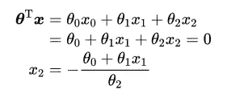

```
# plot line
x1 = np.linspace(-2, 2, 100)
**x2 = - (theta[0] + x1 * theta[1]) / theta[2]**plt.plot(std_x[train_y == 1, 0], std_x[train_y == 1, 1], 'o') # train data of class 1
plt.plot(std_x[train_y == 0, 0], std_x[train_y == 0, 1], 'x') # train data of class 0
**plt.plot(x1, x2, linestyle='dashed') # plot the line we learned** plt.show()
```

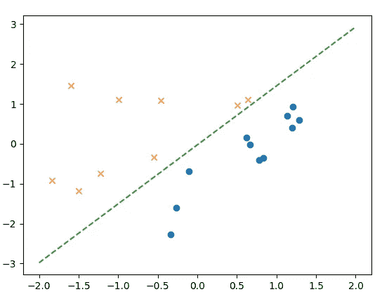

# 10 摘要

恭喜你！我很高兴你能来。希望我的文章对你有帮助。你可以在下面找到完整的代码。留下评论让我知道我的文章是否易懂。请继续关注我的下一篇关于非线性可分性问题的文章。

> ***查看我的其他帖子*** [***中等***](https://medium.com/@bramblexu) ***同*** [***分类查看***](https://bramblexu.com/posts/eb7bd472/) ***！
> GitHub:***[***bramble Xu***](https://github.com/BrambleXu) ***LinkedIn:***[***徐亮***](https://www.linkedin.com/in/xu-liang-99356891/) ***博客:***[***bramble Xu***](https://bramblexu.com)