# “等式到代码”机器学习项目演练—第 2 部分非线性可分问题

> 原文：<https://towardsdatascience.com/an-equation-to-code-machine-learning-project-walk-through-in-python-part-2-non-linear-d193c3c23bac?source=collection_archive---------15----------------------->

## 数学方程式背后的详细解释，为您的机器学习或深度学习之旅奠定实用的数学基础


大家好！这是“等式到代码”演练的第 3 部分。这次

在[第一部分](/an-equation-to-code-machine-learning-project-walk-through-in-python-part-1-linear-separable-fd0e19ed2d7?source=your_stories_page---------------------------)中，我们谈到了如何利用线性回归解决**线性可分问题**。我们学习了向量表示、标准化、添加偏差、sigmoid 函数、对数似然函数和更新参数。

这次我们要解决一个**非线性可分问题**。如果你没有看过第一部分，这完全没问题。第 2 部分是独立的。但是如果你想更好地理解第 2 部分，最好先读第 1 部分。

[](/an-equation-to-code-machine-learning-project-walk-through-in-python-part-1-linear-separable-fd0e19ed2d7) [## Python 中的“等式到代码”机器学习项目演练—第 1 部分线性可分…

### 数学方程式背后的详细解释，为你的机器学习或学习建立实用的数学基础

towardsdatascience.com](/an-equation-to-code-machine-learning-project-walk-through-in-python-part-1-linear-separable-fd0e19ed2d7) 

下面是[数据](https://gist.github.com/BrambleXu/52b0aaf10987015a078d36c97729dace)和[代码](https://gist.github.com/BrambleXu/2640af09b1f43b93c2d951ba91ca3d5c)。

内容结构如下。`*`表示如果您已经完成第 1 部分，可以跳过这一步。

1.  看数据
2.  **非线性可分问题**
3.  标准化*
4.  **添加偏差和多项式项**
5.  Sigmoid 函数*
6.  似然函数*
7.  更新参数θ*
8.  绘制直线
9.  **精度**
10.  摘要

# 1 看数据

下面是数据， [non_linear_data.csv](https://gist.github.com/BrambleXu/a64df128d6c0c26143f82f7b6e889983)

```
x1,x2,y
0.54508775,2.34541183,0
0.32769134,13.43066561,0
4.42748117,14.74150395,0
2.98189041,-1.81818172,1
4.02286274,8.90695686,1
2.26722613,-6.61287392,1
-2.66447221,5.05453871,1
-1.03482441,-1.95643469,1
4.06331548,1.70892541,1
2.89053966,6.07174283,0
2.26929206,10.59789814,0
4.68096051,13.01153161,1
1.27884366,-9.83826738,1
-0.1485496,12.99605136,0
-0.65113893,10.59417745,0
3.69145079,3.25209182,1
-0.63429623,11.6135625,0
0.17589959,5.84139826,0
0.98204409,-9.41271559,1
-0.11094911,6.27900499,0
```

首先，我们需要绘制这些数据，看看它是什么样子的。我们创建一个 Python 文件，并将其命名为 non_logistic_regression.py。

```
import numpy as np
import matplotlib.pyplot as plt# read data
data = np.loadtxt("non_linear_data.csv", delimiter=',', skiprows=1)
train_x = data[:, 0:2]
train_y = data[:, 2]# plot data points
plt.plot(train_x[train_y == 1, 0], train_x[train_y == 1, 1], 'o')
plt.plot(train_x[train_y == 0, 0], train_x[train_y == 0, 1], 'x')
plt.show()
```

运行上面的脚本后，您应该会看到下图。

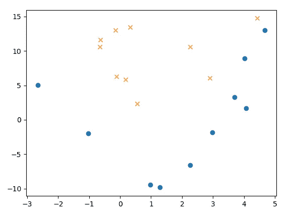

似乎我们不能用一条直线来分离 X 和 o。我们把这样的问题称为非线性可分问题，其中数据不是线性可分的。

# 2 非线性可分问题

在第 1 部分中，我们使用[线性函数](https://en.wikipedia.org/wiki/Linear_function_(calculus)?oldformat=true#Properties)来解决线性可分问题。


linear function

但是对于非线性可分问题，线性函数过于简单，难以处理。所以我们引入了多项式逻辑回归，它在逻辑回归中增加了一个多项式项。

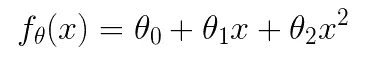

general form

我们用θ来表示参数。左边的θ标记表示函数 f(x)有参数θ。右边的θ表示有两个参数。最后一项是多项式项，它使模型推广到非线性可分数据。

注意我们在 [non_linear_data.csv](https://gist.github.com/BrambleXu/a64df128d6c0c26143f82f7b6e889983) 中有 x1 和 x2 两个特征。我们选择 x1 作为多项式项。所以功能应该变成低于形式。

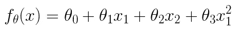

a specific form fit to our data

我们初始化 4 个参数

```
import numpy as np
import matplotlib.pyplot as plt# read data
data = np.loadtxt("linear_data.csv", *delimiter*=',', *skiprows*=1)
train_x = data[:, 0:2]
train_y = data[:, 2]# initialize parameter
**theta = np.random.randn(4)**
```

# 3 标准化

为了使训练快速收敛，我们使用[标准化](https://stats.stackexchange.com/a/10298/116970)，也叫 **z** - **评分。**我们是按列来做的。

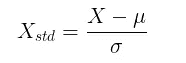

*   𝜇在每一栏都很刻薄
*   𝜎是每列的标准偏差

```
import numpy as np
import matplotlib.pyplot as plt# read data
data = np.loadtxt("linear_data.csv", *delimiter*=',', *skiprows*=1)
train_x = data[:, 0:2]
train_y = data[:, 2]# initialize parameter
theta = np.random.randn(4)**# standardization
mu = train_x.mean(axis=0)
sigma = train_x.std(axis=0)****def standardizer(x):
    return (x - mu) / sigma****std_x = standardizer(train_x)**
```

# 4 添加偏差和多项式项

我们需要添加一个偏差和多项式项来构建数据矩阵。我们添加一个常数 x0=1，以便对齐矢量表示。


a specific form fit to our data

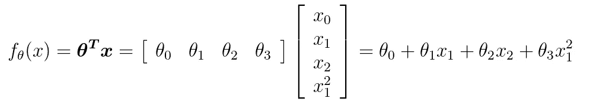

vector representation

您可以在第 1 部分找到更多的矢量表示细节: [3 矢量表示](/an-equation-to-code-machine-learning-project-walk-through-in-python-part-1-linear-separable-fd0e19ed2d7)。

为了使计算更简单，我们把 x 转换成矩阵。

```
import numpy as np
import matplotlib.pyplot as plt# read data
data = np.loadtxt("linear_data.csv", delimiter=',', skiprows=1)
train_x = data[:, 0:2]
train_y = data[:, 2]# initialize parameter
theta = np.random.randn(4)# standardization
mu = train_x.mean(axis=0)
sigma = train_x.std(axis=0)
def standardizer(x):
    return (x - mu) / sigma
std_x = standardizer(train_x)**# add x0 and x1^2 to get matrix
def to_matrix(x):
    x0 = np.ones([x.shape[0], 1]) 
    x3 = x[:, 0, np.newaxis] ** 2
    return np.hstack([x0, x, x3])****mat_x = to_matrix(std_x)** **# dot product
def f(x):
    return np.dot(x, theta)**
```

我们用 x3 来表示`x1*x1`。

`std_x`的尺寸为`(20, 2)`。在`to_matrix(std_x)`之后，`mat_x`的尺寸为`(20, 4)`。至于点积部分，结果的维度是`(4,)`。所以点生成的结果应该是`(20, 4) x (4,) -> (20,)`，这是一个包含 20 个样本预测的一维数组。

# 5 Sigmoid 函数

下面是矢量表示

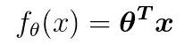

然后我们将基于它建立一个更强大的预测函数，sigmoid 函数。

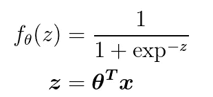

我们用 z 来表示线性函数，并将其传递给 sigmoid 函数。sigmoid 函数将给出每个数据样本的概率。我们的数据中有两个类，一个是`1`，另一个是`0`。

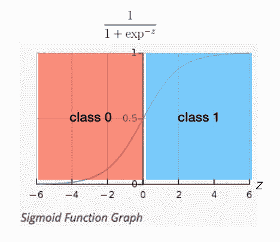

我们可以看到模型基于线性函数部分预测样本。

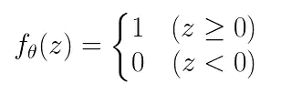

我们可以写下面的代码

```
import numpy as np
import matplotlib.pyplot as plt# read data
data = np.loadtxt("linear_data.csv", delimiter=',', skiprows=1)
train_x = data[:, 0:2]
train_y = data[:, 2]# initialize parameter
theta = np.random.randn(4)# standardization
mu = train_x.mean(axis=0)
sigma = train_x.std(axis=0)
def standardizer(x):
    return (x - mu) / sigma
std_x = standardizer(train_x)# add x0 and x1^2 to get matrix
def to_matrix(x):
    x0 = np.ones([x.shape[0], 1]) 
    x3 = x[:, 0, np.newaxis] ** 2
    return np.hstack([x0, x, x3])
mat_x = to_matrix(std_x)**# change dot production to sigmoid function
def f(x):
    return 1 / (1 + np.exp(-np.dot(x, theta)))**
```

# 6 似然函数

> 如果您对方程的解释不感兴趣，或者您已经在第 1 部分中阅读过，那么您可以跳过这一步

好了，我们准备了数据、模型(sigmoid ),还需要什么？是的，一个目标函数。**目标函数可以指导我们如何以正确的方式更新参数。对于 sigmoid(逻辑回归),我们通常使用[对数似然](https://www.wikiwand.com/en/Likelihood_function#/Log-likelihood)作为目标函数**


等等，等等…这些东西到底是怎么回事！

**不要慌。冷静点。**

让我们把它拆开。

*   1->2(如何从第 1 行到第 2 行):`log(ab) = log a + log b`
*   2->3: `log(a)^b = b * log a`
*   3->4:由于我们只有两个类，y=0 和 y=1，所以我们可以使用下面的等式:

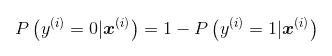

3->4

*   4->5:我们使用下面的变换使等式更具可读性

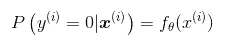

所以我们得到了最后一部分。

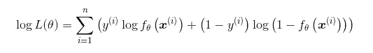

别忘了我们为什么开始这个。**目标函数可以指导我们如何以正确的方式更新参数。**

我们需要用这个来计算损耗，以更新参数。更具体地说，我们需要计算对数似然函数的**导数**。这里我直接给出最后的更新方程式。(如果你对如何得到这个方程感兴趣，这个[视频](https://www.youtube.com/watch?v=SB2vz57eKgc)应该会有帮助)

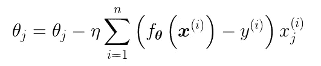

**第六步，最重要的方程就是这个。如果你不明白如何做到这一点，这是完全可以的。我们需要做的就是把它写成真正的代码。**

# 7 更新参数θ

> 如果您已经阅读了第 1 部分，可以跳过这一步

这一步非常重要。**不要慌**。我们会破解它。


θj 是第 j 个参数。

*   η是学习率，我们设为 0.001 (1e-3)。
*   n 是数据样本的数量，在我们的例子中，我们有 20 个。
*   I 是第 I 个数据样本

因为我们有三个参数，所以可以写成三个方程。我们用 x3 来代表`x1*x1`。

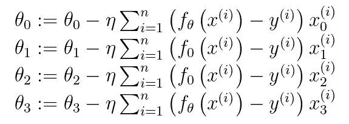

`:=`符号就像`=`。你可以在这里找到解释。

最难的部分是σ(求和符号)，所以为了更好地理解，我扩展了σ。


仔细看。

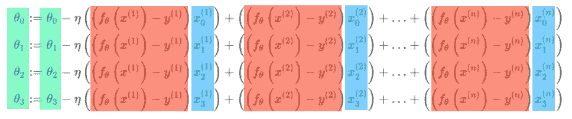

我给等式中的三个部分涂上颜色，因为我们可以用矩阵来表示它们。看第一行红色和蓝色的部分，我们更新了θ0。

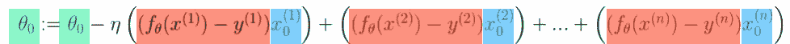

我们把红色部分和蓝色部分写成列向量。

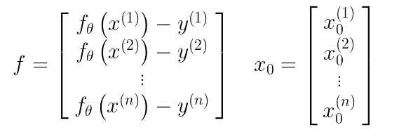

因为我们有 20 个数据样本，所以`f`的维数是`(20,1)`。`x0`的尺寸为`(20,1)`。我们可以用转置写矩阵乘法。

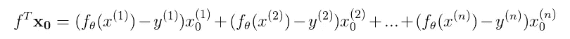

所以维度应该是`(1, 20) x (20, 1) -> (1,)`。我们得到一个标度来更新θ0。

`x1`和`x2`也是列向量。我们可以把它们写成一个 **X** 矩阵。

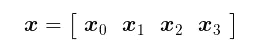

θ是一个行向量

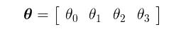

回到等式。


我们可以写为

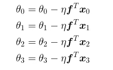

把它写成一个等式。

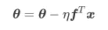

类似 Numpy 数组的版本可能容易理解。

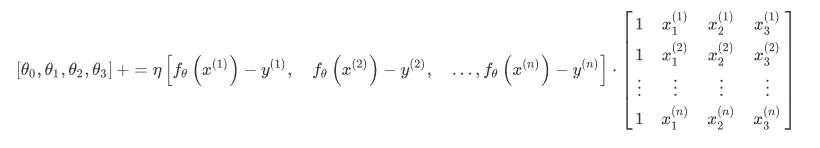

让我们做一点计算，以确保尺寸是正确的。

```
θ: (1, 4) 
f^T: (1, 20) 
x: (20, 4)dot production: (1, 20) x (20, 4) -> (1, 4)
```

一切看起来都那么正确。让我们写代码。其实就两行。

```
import numpy as np
import matplotlib.pyplot as plt# read data
data = np.loadtxt("linear_data.csv", delimiter=',', skiprows=1)
train_x = data[:, 0:2]
train_y = data[:, 2]# initialize parameter
theta = np.random.randn(4)# standardization
mu = train_x.mean(axis=0)
sigma = train_x.std(axis=0)
def standardizer(x):
    return (x - mu) / sigma
std_x = standardizer(train_x)# add x0 and x1^2 to get matrix
def to_matrix(x):
    x0 = np.ones([x.shape[0], 1]) 
    x3 = x[:, 0, np.newaxis] ** 2
    return np.hstack([x0, x, x3])
mat_x = to_matrix(std_x)# sigmoid function
def f(x):
    return 1 / (1 + np.exp(-np.dot(x, theta)))# update times
epoch = 2000# learning rate
ETA = 1e-3# update parameter
**for _ in range(epoch):
**    """
    f(mat_x) - train_y: (20,)
    mat_x: (20, 4)
    theta: (4,)

    dot production: (20,) x (20, 4) -> (4,)
    """
 **theta = theta - ETA * np.dot(f(mat_x) - train_y, mat_x)**
```

奇怪的事？还记得我们在代码前写了什么吗？

```
dot production: (1, 20) x (20, 4) -> (1, 4)The dimension changes make sense here.
```

但是为什么我们写代码的时候要用`(20,) x (20, 4) -> (4,)`？

实际上，这不是真正的数学符号，这是 Numpy 符号。而且如果你用的是 TensorFlow 或者 PyTroch 的话，应该很熟悉。

`(20,)`表示这是一个包含 20 个数字的一维数组。它可以是行向量，也可以是列向量，因为它只有一维。如果我们将其设置为二维数组，像`(20, 1)`或`(1, 20)`，我们可以很容易地确定`(20, 1)`是列向量而`(1, 20)`是行向量。

**但是为什么不显式设置维度来消除歧义呢？**

好吧。相信我，我第一次看到这个的时候就有接缝问题。但是经过一些编码实践，我想我知道原因了。

**因为这样可以节省我们的时间！**

我们以`(20,) x (20, 4) -> (4,)`为例。如果我们想得到`(1, 20) x (20, 4) -> (1, 4)`，我们需要对`(20,) x (20, 4) -> (4,)`做什么？

*   将(20，)转换为(1，20)
*   计算(1，20) x (20，4) -> (1，4)
*   因为(1，4)是一个二维列向量，我们需要将其转换为一维数组。(1,4) -> (4,)

老实说，这很令人沮丧。为什么我们不能一步到位？

对，所以我们才能写`(20,) x (20, 4) -> (4,)`。

好了，我们来看看 [numpy.dot()](https://docs.scipy.org/doc/numpy/reference/generated/numpy.dot.html) doc 是怎么说的。

> [numpy.dot()](https://docs.scipy.org/doc/numpy/reference/generated/numpy.dot.html) :如果 *a* 是一个 N 维数组， *b* 是一个 1 维数组，那么它就是 *a* 和 *b* 最后一个轴上的和积。

嗯，事实上我不明白。但是 [np.matmul()](https://docs.scipy.org/doc/numpy/reference/generated/numpy.matmul.html#numpy.matmul) 描述了与(20，1)或(1，20)的整形类似的计算，以执行标准的 2d 矩阵乘积。也许我们能得到一些灵感。

> [np.matmul()](https://docs.scipy.org/doc/numpy/reference/generated/numpy.matmul.html#numpy.matmul) :如果第一个参数是一维的，那么通过在它的维数前加上 1，它被提升为一个矩阵。在矩阵乘法之后，前置的 1 被移除。

哈，这就是缺失的部分！所以在我们的例子中，`(20,)`变成了`(1, 20)`，因为`(20,4)`的第一维度是 20。还有`(1, 20) * (20, 4) -> (1, 4)`。然后前置 1 被删除，所以我们得到`(4,)`。一步到位。

# 8 画这条线

在更新参数 2000 次后，我们应该绘制结果来查看我们的模型的性能。

我们将一些数据点做为 x1，根据我们所学的参数计算 x2。

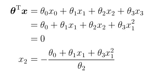

```
# plot line
x1 = np.linspace(-2, 2, 100)
**x2 = - (theta[0] + x1 * theta[1] + theta[3] * x1**2) / theta[2]**plt.plot(std_x[train_y == 1, 0], std_x[train_y == 1, 1], 'o') # train data of class 1
plt.plot(std_x[train_y == 0, 0], std_x[train_y == 0, 1], 'x') # train data of class 0
**plt.plot(x1, x2, linestyle='dashed') # plot the line we learned** plt.show()
```

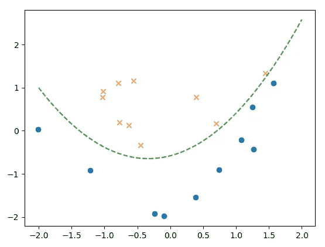

# 9 准确性

在第 2 部分中，我们使用准确性来评估我们的模型性能如何。

```
import numpy as np
import matplotlib.pyplot as plt# read data
data = np.loadtxt("linear_data.csv", delimiter=',', skiprows=1)
train_x = data[:, 0:2]
train_y = data[:, 2]# initialize parameter
theta = np.random.randn(4)# standardization
mu = train_x.mean(axis=0)
sigma = train_x.std(axis=0)
def standardizer(x):
    return (x - mu) / sigma
std_x = standardizer(train_x)# add x0 and x1^2 to get matrix
def to_matrix(x):
    x0 = np.ones([x.shape[0], 1]) 
    x3 = x[:, 0, np.newaxis] ** 2
    return np.hstack([x0, x, x3])
mat_x = to_matrix(std_x)# sigmoid function
def f(x):
    return 1 / (1 + np.exp(-np.dot(x, theta)))**# classify sample to 0 or 1
def classify(x): 
    return (f(x) >= 0.5).astype(np.int)**# update times
epoch = 2000# learning rate
ETA = 1e-3**# accuracy log
accuracies = []**# update parameter
for _ in range(epoch):    theta = theta - ETA * np.dot(f(mat_x) - train_y, mat_x)    **result = classify(mat_x) == train_y 
    accuracy = sum(result) / len(result) 
    accuracies.append(accuracy)****# plot accuracy line
x = np.arange(len(accuracies))
plt.plot(x, accuracies)
plt.show()**
```

*   `classify(x)`:如果概率大于 0.5，我们认为是真的
*   `result`:包含列表形式的预测，[真，假，…]
*   `accuracy = sum(result) / len(result)`:计算当前历元中预测的正确样本数。

最后，我们绘制了精度线。

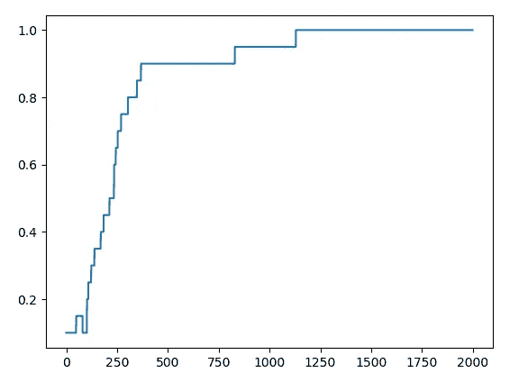

我们可以看到这条线在 1000 个周期后变得稳定。

# 10 摘要

如果你已经看过第 1 部分，你会发现第 2 部分很容易理解。你可以在下面找到完整的代码。留下评论让我知道我的文章是否易懂。请继续关注我的下一篇关于随机梯度下降的文章。

> ***查看我的其他帖子*** [***中***](https://medium.com/@bramblexu) ***同*** [***一个分类查看***](https://bramblexu.com/posts/eb7bd472/) ***！
> GitHub:***[***bramble Xu***](https://github.com/BrambleXu) ***LinkedIn:***[***徐亮***](https://www.linkedin.com/in/xu-liang-99356891/) ***博客:***[***bramble Xu***](https://bramblexu.com)