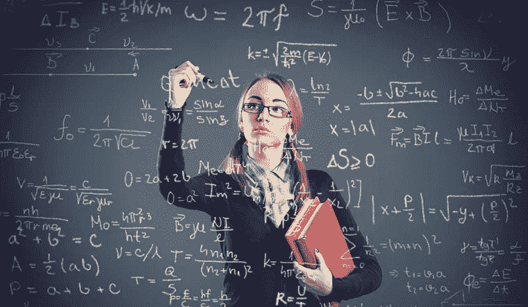
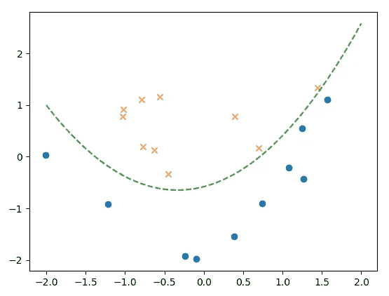
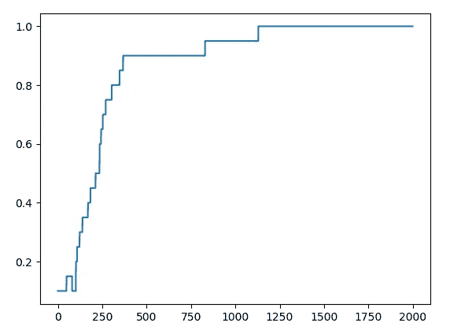
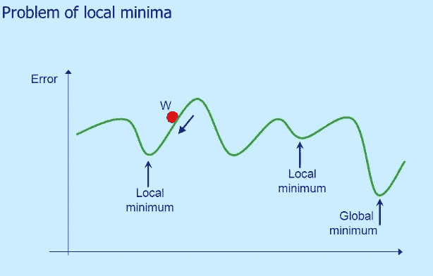
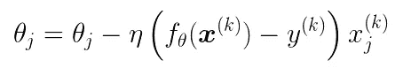
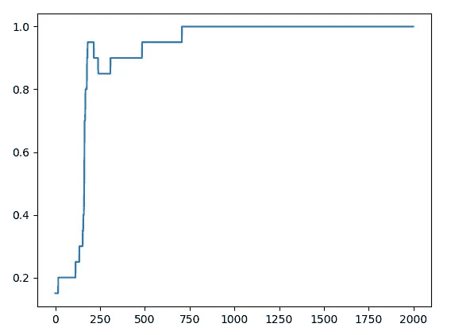
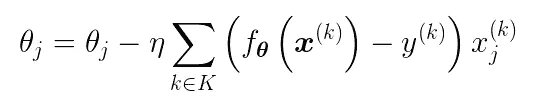
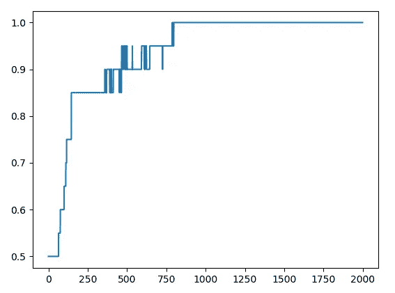

# “等式到代码”机器学习项目演练—第 3 部分 SGD

> 原文：<https://towardsdatascience.com/an-equation-to-code-machine-learning-project-walk-through-part-3-sgd-e4167225504b?source=collection_archive---------15----------------------->

## 用 Python 实现随机梯度下降(SGD)和小批量梯度下降的详细说明



from Shutterstock

大家好！这是“等式到代码”演练的第 3 部分。

在前面的文章中，我们在**中谈到了线性可分问题**在[第一部分](/an-equation-to-code-machine-learning-project-walk-through-in-python-part-1-linear-separable-fd0e19ed2d7)，在[第二部分](/an-equation-to-code-machine-learning-project-walk-through-in-python-part-2-non-linear-d193c3c23bac)中谈到了**非线性可分问题**。这次我们将根据等式实现**随机梯度下降(SGD)** 。

第 3 部分是独立的。但对于 [part 2](/an-equation-to-code-machine-learning-project-walk-through-in-python-part-2-non-linear-d193c3c23bac?source=your_stories_page---------------------------) 中重复的内容我就不做过多解释了。如果你觉得有些东西很难理解，我推荐你先阅读 [part 2](/an-equation-to-code-machine-learning-project-walk-through-in-python-part-2-non-linear-d193c3c23bac) 。

下面是[数据](https://gist.github.com/BrambleXu/52b0aaf10987015a078d36c97729dace)和[代码](https://gist.github.com/BrambleXu/0e00bbd2f11ad7b3fa264c4ea27ea03b)。

内容结构如下。`*`表示如果您已经完成第 2 部分，可以跳过这一步。

1.  预览*
2.  随机梯度下降
3.  小批量梯度下降
4.  摘要

# 1 预览

> 如果您已经阅读了[第 2 部分](/an-equation-to-code-machine-learning-project-walk-through-in-python-part-2-non-linear-d193c3c23bac)，您可以跳过这一步

首先，我们看看我们在第 2 部分做了什么。

这里是数据， [non_linear_data.csv](https://gist.github.com/BrambleXu/a64df128d6c0c26143f82f7b6e889983)

```
x1,x2,y
0.54508775,2.34541183,0
0.32769134,13.43066561,0
4.42748117,14.74150395,0
2.98189041,-1.81818172,1
4.02286274,8.90695686,1
2.26722613,-6.61287392,1
-2.66447221,5.05453871,1
-1.03482441,-1.95643469,1
4.06331548,1.70892541,1
2.89053966,6.07174283,0
2.26929206,10.59789814,0
4.68096051,13.01153161,1
1.27884366,-9.83826738,1
-0.1485496,12.99605136,0
-0.65113893,10.59417745,0
3.69145079,3.25209182,1
-0.63429623,11.6135625,0
0.17589959,5.84139826,0
0.98204409,-9.41271559,1
-0.11094911,6.27900499,0
```

数据如下图所示。


在对数据作图后，我们发现一条直线无法将 X 和 o 分开，这类问题被称为**非线性可分问题**，数据不是线性可分的。

所以我们引入多项式 logistic 回归，在线性函数中增加一个多项式项。


polynomial function

我们用θ来表示参数。左边的θ标记表示函数 f(x)有参数θ。右边的θ表示有两个参数。最后一项是多项式项，它使模型推广到非线性可分数据。

注意，我们在 [non_linear_data.csv](https://gist.github.com/BrambleXu/a64df128d6c0c26143f82f7b6e889983) 中有 x1 和 x2 两个特征。我们选择 x1 作为多项式项。所以功能应该变成低于形式。


a specific form fit to our data

然后我们引入标准化。


*   𝜇在每一栏都很刻薄
*   𝜎是每列的标准偏差

对于预测模型，我们使用 sigmoid 函数。下面是矢量表示。


我们用 z 来表示线性函数，并将其传递给 sigmoid 函数。sigmoid 函数将给出每个数据样本的概率。我们数据中有两个类，一个是`1`，另一个是`0`。


好了，我们准备了数据、模型(sigmoid ),还需要什么？是的，一个目标函数。**目标函数可以指导我们如何以正确的方式更新参数。**对于 sigmoid(逻辑回归)，我们通常使用[对数似然](https://www.wikiwand.com/en/Likelihood_function#/Log-likelihood)作为目标函数。更具体地说，我们需要计算对数似然函数的**导数**。这里我直接给出最后的更新方程式。(如果你对如何得到这个方程感兴趣，这个[视频](https://www.youtube.com/watch?v=SB2vz57eKgc)应该会有帮助)


θj 是第 j 个参数。

*   η是学习率，我们设为 0.001 (1e-3)。
*   n 是数据样本的数量，在我们的例子中，我们有 20 个。
*   I 是第 I 个数据样本

类似 Numpy 数组的版本可能容易理解。


我们绘制模型线和精度线。



model line



accuracy line

下面是我们在第 2 部分之后留下的全部代码。

如果你觉得有些东西难以理解，你可以阅读[第 2 部分](/an-equation-to-code-machine-learning-project-walk-through-in-python-part-2-non-linear-d193c3c23bac)获得详细解释。

# 2 随机梯度下降法

我们使用 SGD 的主要原因是为了避免局部最小值。



the parameter is trapped in a local minimum

基本思想是通过在每次更新中随机选择一个数据来更新参数。所以参数更容易走出局部极小值。


gradient descent

这是梯度下降形式。我们可以看到，为了更新θj，我们使用了整个训练数据(σ部分)。代码如下。

```
# initialize parameter
theta = np.random.randn(4)# update parameter
**for _ in range(epoch):
    theta = theta - ETA * np.dot(f(mat_x) - train_y, mat_x)**
```

但是在 SGD 中，我们一次只用一个数据。



stochastic gradient descent

这里的`k`是指我们随机选取的数据。

```
# initialize parameter
theta = np.random.randn(4)# update parameter
for _ in range(epoch):    # sgd
    **p = np.random.permutation(len(mat_x))
    for x, y in zip(mat_x[p, :], train_y[p]):
        theta = theta - ETA * (f(x) - y) * x**
```

*   p 包含整个数据集的随机索引列表，例如，[ 5，12，17，14，8，9，10，2，13，18，15，16，1，0，6，11，7，4，3，19]
*   for 循环每次取一个数据来更新参数θ

你可以这样想 SGD。在每个历元中，梯度下降和 SGD 都使用整个数据集来更新参数。用**完整有序数据**梯度下降更新参数。但是 SGD 用**一个随机选择的数据**来更新参数，这样更容易**走出局部最小值**。



精确线。我们可以看到收敛比梯度下降快。

# 3 小批量梯度下降

SGD 是好的，但是由于每次用一个数据更新参数，计算效率不高。

**使用整体数据会造成局部极小问题(梯度下降)，每次使用一个数据效率低。这就是为什么我们使用小批量梯度下降。**



与 SGD 不同，我们可以用几个数据样本更新参数。这里的`K`是包含`m`个随机选择的数据样本的索引集。

我们有 20 个数据样本，我们将批量大小`m`设为 5。

```
**import math**# initialize parameter
theta = np.random.randn(4)**# batch size
batch = 5****# calculate steps based on batch size
steps = int(math.ceil(len(train_x)/batch))**# update parameter
for _ in range(epoch):
    **p = np.random.permutation(len(mat_x)) 
    shuffle_x = mat_x[p]
    shuffle_y = train_y[p]****for step in range(steps):
        x = shuffle_x[step:step + batch, :]
        y = shuffle_y[step:step + batch]
        theta = theta - ETA * np.dot(f(x) - y, x)**
```

请注意，我们必须在每个时期混洗数据。该计算与通过矩阵乘法的梯度下降相同。如果你感兴趣，你可以在第一部分或第二部分找到详细的解释。

精确度线



收敛速度与梯度下降相同。但是计算效率更高。

# 4 摘要

在第 3 部分中，我们讨论了如何实现 SGD 和小批量梯度下降。你可以在下面找到完整的代码。留下评论让我知道我的文章是否易懂。请继续关注这个关于正则化的“公式到代码”系列的最后一篇文章。

> ***查看我的其他帖子*** [***中等***](https://medium.com/@bramblexu) ***同*** [***一个分类查看***](https://bramblexu.com/posts/eb7bd472/) ***！
> GitHub:***[***bramble Xu***](https://github.com/BrambleXu) ***LinkedIn:***[***徐亮***](https://www.linkedin.com/in/xu-liang-99356891/) ***博客:***[***bramble Xu***](https://bramblexu.com)