# “等式到代码”机器学习项目演练—第 4 部分正则化

> 原文：<https://towardsdatascience.com/an-equation-to-code-machine-learning-project-walk-through-part-4-regularization-be3b44bb296a?source=collection_archive---------28----------------------->

## 用 Python 从头开始实现正则化的详细说明

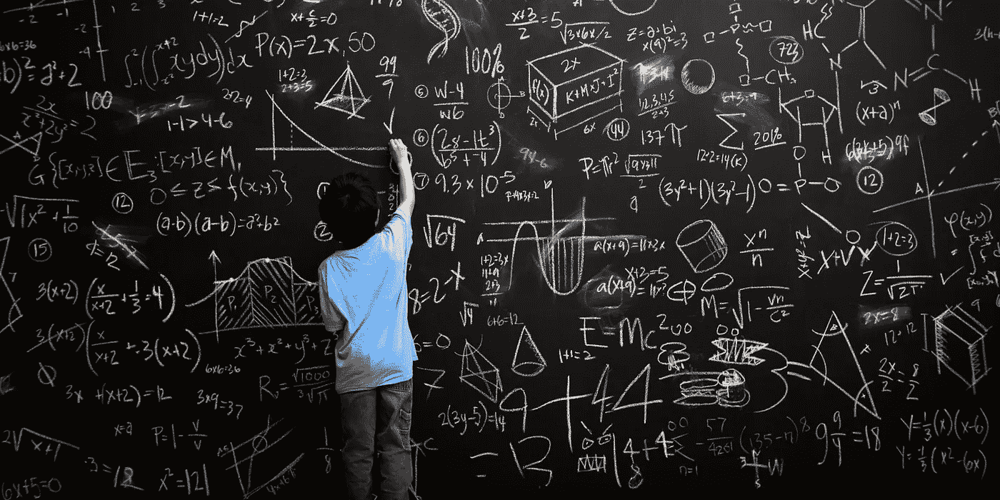

大家好！这是“公式到代码”演练的第 4 部分，也是本系列的最后一部分。

在前面的文章中，我们谈到了**中的线性可分问题**中的[第一部分](/an-equation-to-code-machine-learning-project-walk-through-in-python-part-1-linear-separable-fd0e19ed2d7)、[第二部分](/an-equation-to-code-machine-learning-project-walk-through-in-python-part-2-non-linear-d193c3c23bac)中的**非线性可分问题**、[第三部分](/an-equation-to-code-machine-learning-project-walk-through-part-3-sgd-e4167225504b)中的**随机梯度下降(SGD)** 。就像其他部分一样，第 4 部分是独立的，您可以忽略前面的文章。

在第 4 部分中，我们将讨论如何实现回归问题的正则化，这可以使我们的模型更加健壮。

下面是完整的代码，[regression _ without _ regulation . py](https://gist.github.com/BrambleXu/4bc854fdf2a45f9eb1fbbae3aad5b291)和[regression _ with _ regulation . py](https://gist.github.com/BrambleXu/1adbbceff0da62a6d5193e5aefb00952#file-regression_with_regularization-py)。

内容结构如下。

1.  正规化
2.  伪造一些数据样本
3.  预处理
4.  没有正规化的执行
5.  正规化实施
6.  摘要

# 1 正规化

如果我们的模型过于复杂，它会很好地拟合训练数据，但在新数据中会失败。我们把这种问题称为**过拟合**。

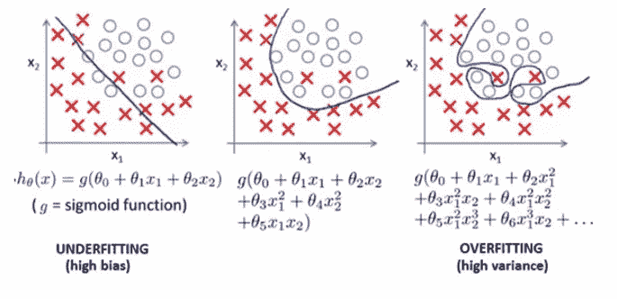

from [ISCG8025](https://slideplayer.com/slide/8012792/)

为了“不是很好地拟合训练数据”(上图中间)，我们通常使用一些技术来避免过度拟合，如交叉验证、剔除、批量标准化等。

这一次，我们将讨论 L2 正则化项，它在大多数机器学习模型中被广泛使用。

# 2 伪造一些数据样本

我们使用 beblow 多项式函数来伪造一些数据样本。

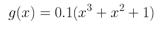

为了让数据更加真实，我们在其中加入了一些噪声。你可以在代码中看到。

```
import numpy as np
import matplotlib.pyplot as plt# random seed to make sure reimplement
np.random.seed(0)# the real model line
def g(x):
    return 0.1 * (x + x**2 + x**3)# add noise to the model for faking data
train_x = np.linspace(-2, 2, 8)
train_y = g(train_x) + np.random.randn(len(train_x)) * 0.05# plot
x = np.linspace(-2, 2, 100)
plt.plot(train_x, train_y, 'o')
plt.plot(x, g(x), linestyle='dashed')
plt.ylim(-1, 2)
plt.show()
```

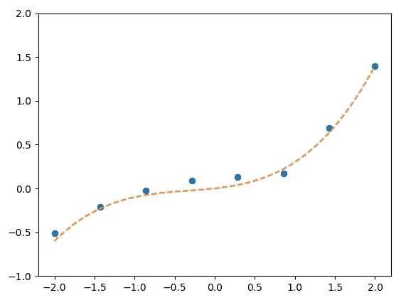

虚线表示我们想要建模的真实线。

# 3 预处理

在第一步中，我们谈到了当模型过于复杂时，需要进行调整。例如，上面的实线是 3 次多项式函数。


a polynomial function of degree 3

但是如果我们选择一个 10 次多项式函数，这个模型可能会更复杂。

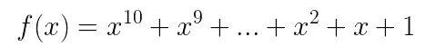

a polynomial function of degree 10

因为我们有 10 度和一个偏项，所以我们也有 11 个参数。

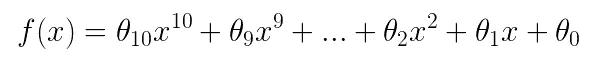

我们实现这个来模拟复杂的情况。

```
import numpy as np
import matplotlib.pyplot as plt# random seed to make sure reimplement
np.random.seed(0)# the real model line
def g(x):
    return 0.1 * (x + x**2 + x**3)# add noise to the model for faking data
train_x = np.linspace(-2, 2, 8)
train_y = g(train_x) + np.random.randn(len(train_x)) * 0.05# standardization
mu = train_x.mean()
std = train_x.std()
def standardizer(x):
    return (x - mu) / std
**std_x = standardizer(train_x)** 
# get matrix
def to_matrix(x):
    return np.vstack([
        np.ones(x.size),
        x,
        x ** 2,
        x ** 3,
        x ** 4,
        x ** 5,
        x ** 6,
        x ** 7,
        x ** 8,
        x ** 9,
        x ** 10,
    ]).T**mat_x = to_matrix(std_x)**# initialize parameter
**theta = np.random.randn(mat_x.shape[1])**# predict function
def f(x):
 **return np.dot(x, theta)**
```

*   标准化:首先我们标准化我们的数据
*   获取矩阵:我们把数据做成矩阵形式进行矩阵运算，模拟 10 次多项式函数
*   初始化参数:根据输入数据的大小初始化参数
*   预测函数:这是我们的预测函数，就像上面的等式一样。

# 4 未正规化的实施

我们使用均方误差(MSE)作为代价函数。

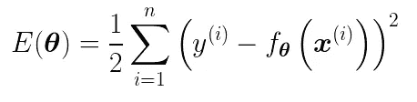

```
# cost function
def E(x, y):
    return 0.5 * np.sum((y - f(x))**2)# initialize error
error = E(mat_x, train_y)
```

我们使用梯度下降来更新参数。

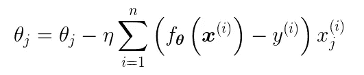

类似 Numpy 数组的版本可能容易理解。这里我只列出三个参数，只是为了看清楚这个方程。

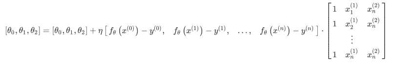

代码

```
# learning rate
ETA = 1e-4# update parameter
for _ in range(epoch):
    theta = theta - ETA * np.dot(f(X) - train_y, mat_x)
```

我们将代码组合在一起

```
# learning rate
ETA = 1e-4# initialize difference between two epochs
diff = 1######## training without regularization ########
while diff > 1e-6:
    # mat_x = (20, 4)
    # f(x) - y = (20,)
 **theta = theta - ETA * (np.dot(f(mat_x) - train_y, mat_x))**    current_error = E(mat_x, train_y)
    diff = error - current_error 
    error = current_error# save parameters
theta1 = theta########## plot line ##########
plt.ylim(-1, 2)
plt.plot(std_x, train_y, 'o')
z = standardizer(np.linspace(-2, 2, 100))# plot the line without regularization
theta = theta1
plt.plot(z, f(to_matrix(z)), linestyle='dashed')
plt.show()
```

我们可以看到我们学到了什么。

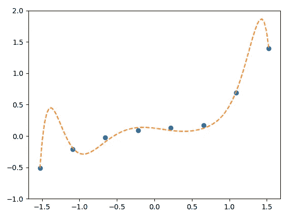

下面是完整的代码，[regression _ without _ regulation . py](https://gist.github.com/BrambleXu/4bc854fdf2a45f9eb1fbbae3aad5b291)

# 5 正规化实施

L2 监管术语看起来是这样的

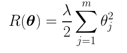

我们将代价函数和正则项结合在一起。

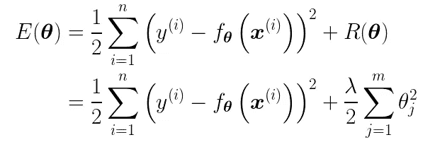

因为我们增加了正则项，所以我们也需要相应地改变更新方程。

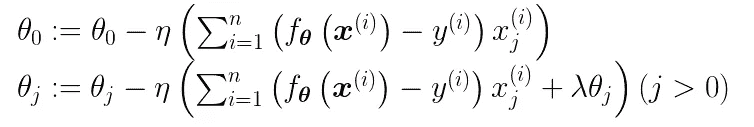

注意，我们不使用 lambda 来更新偏差参数θ0。

代码

```
# regularization parameter
LAMBDA = 1# initialize difference between two epochs
diff = 1# initialize error
error = E(mat_x, train_y)######## training without regularization ########
while diff > 1e-6:
    # notice we don't use regularization for theta 0
 **reg_term = LAMBDA * np.hstack([0, theta[1:]])**    # update parameter
 **theta = theta - ETA * (np.dot(mat_x.T, f(mat_x) - train_y) + reg_term)**    current_error = E(mat_x, train_y)
    diff = error - current_error
    error = current_error# save parameters
theta2 = theta########## plot the line with regularization ##########
plt.ylim(-1, 2)
plt.plot(std_x, train_y, 'o')
z = standardizer(np.linspace(-2, 2, 100))theta = theta2
plt.plot(z, f(to_matrix(z)))
plt.show()
```

模型看起来是这样的。

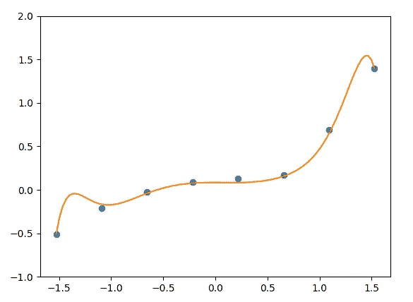

我们可以看到，在添加正则化后，模型线变得更加平滑，更像原始的 3 次线。

下面是完整的代码，[regression _ with _ regulation . py](https://gist.github.com/BrambleXu/1adbbceff0da62a6d5193e5aefb00952#file-regression_with_regularization-py)

# 6 摘要

这是“等式到代码”走查项目的最后一篇文章。希望对你有帮助。留下评论让我知道我的文章是否易懂。感谢阅读。

> ***查看我的其他帖子*** [***中等***](https://medium.com/@bramblexu) ***同*** [***一分类查看***](https://bramblexu.com/posts/eb7bd472/) ***！
> GitHub:***[***bramble Xu***](https://github.com/BrambleXu) ***LinkedIn:***[***徐亮***](https://www.linkedin.com/in/xu-liang-99356891/) ***博客:***[***bramble Xu***](https://bramblexu.com)