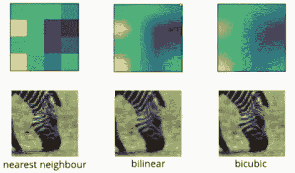
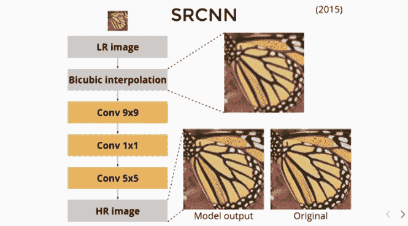
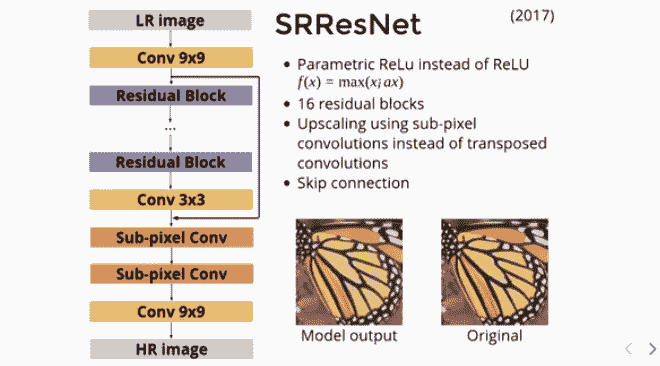
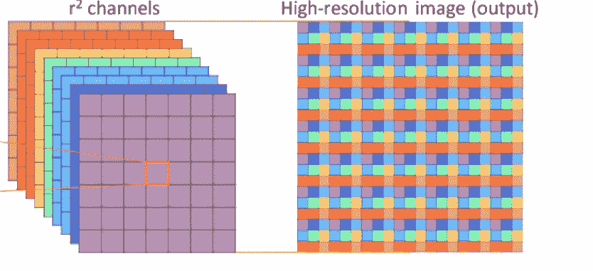
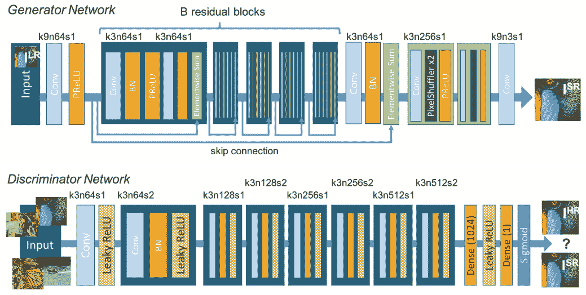
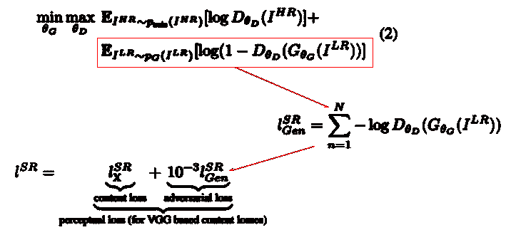

# 基于深度学习的单幅图像超分辨率进化

> 原文：<https://towardsdatascience.com/an-evolution-in-single-image-super-resolution-using-deep-learning-66f0adfb2d6b?source=collection_archive---------9----------------------->

## 从经典插值到具有生成对抗网络的深度学习方法

在计算机视觉领域中，从对应的低分辨率图像重建高分辨率照片级真实感图像一直是一项长期的挑战性任务。当只有一张低分辨率图像作为输入来重建其高分辨率图像时，这项任务变得更加困难。

什么是超分辨率？对来自**的一幅**高分辨率(HR)** 图像和一幅**低分辨率(LR)图像的估计被称为**超分辨率(SR)** 。换句话说，LR 是一个**单幅图像**输入，HR 是地面真实，SR 是预测的高分辨率图像。当应用 ML/DL 解决方案时，LR 图像通常是添加了一些模糊和噪声的下采样 HR 图像。

Photo by [Robin Mathlener](https://unsplash.com/@robinmathlener?utm_source=unsplash&utm_medium=referral&utm_content=creditCopyText) on [Unsplash](https://unsplash.com/?utm_source=unsplash&utm_medium=referral&utm_content=creditCopyText)

# 进化的第 0 代:插值

首先，非常早期的解决方案是图像处理中的插值方法。这里，低分辨率图像使用一些插值方法，如最近邻法、双线性或双三次插值法，以 2 倍或 4 倍的因子调整大小。

> “插值的工作原理是使用已知数据来估计未知点的值。图像插值在两个方向上起作用，并试图根据周围像素的值获得像素强度的最佳近似值。”— [塔尔图大学的数字图像处理电子书](https://sisu.ut.ee/imageprocessing/book/3)。

Figure: Effect of interpolation ([source](https://www.youtube.com/watch?v=lmUxbRY7H2I))

从上面的插图可以清楚地看出，合成的图像是模糊的，不真实的。

# 进化的第一代:SRCNN

随着全卷积神经网络(FCNN)在解决语义分割方面的成功，它在计算机视觉的其他领域迅速普及。FCNN 是一个后面没有任何密集连接(全连接层)的 CNN。每个 CNN 有两个主要功能块，I)特征提取器和 ii)分类器。CNN 后面的密集连接是分类器，其任务是将提取的特征映射到类别概率。我认为 FCNN 是 DL 中从输入图像生成/预测输出图的基本设计实践。输出图可以是语义分割图、风格转移图甚至超分辨率图。换句话说，FCNN 是一个图像到图像的映射引擎。FCNN 在超分辨率中的一个这样的初步应用是 [SRCNN](https://arxiv.org/abs/1501.00092) 。

在 SRCNN 中，首先使用双三次插值对图像进行上采样，然后馈送到简单的 FCNN。需要注意的是，这里不涉及池操作。因此，产生与上采样输入图像相同空间大小的输出。最后，我们计算目标 HR 图像与输出之间的 MSE 损失。

Figure: SRCNN Model ([source](https://www.youtube.com/watch?v=lmUxbRY7H2I))

# 进化的第二代:SRResNet 和用于上采样的子像素卷积

由于使用 SRCNN 在单幅图像的超分辨率方面取得了一些成功，激发了其他人对该架构进行进一步的改进。众所周知， [ResNet](https://arxiv.org/abs/1512.03385) (带跳跃连接的 CNN)比传统 CNN 更好。 [SRResNets](https://arxiv.org/abs/1609.04802) 用残差块代替简单卷积块。结果，精确度显著提高。

Figure: SRResNet Model ([source](https://www.youtube.com/watch?v=lmUxbRY7H2I))

许多深度学习模型还结合了转置卷积进行上采样。双线性和双三次上采样是不可学习的，这意味着，它只能在深度学习架构之前或之后使用，而不能在两者之间使用。可学习的上采样的其他优点是它的速度和准确性。

但是正如人们可能已经观察到的那样，上面用步进卷积梯度实现的上采样操作增加了零值来放大图像，这必须在以后用有意义的值来填充。更糟糕的是，这些零值没有梯度信息可以反向传播。

> [“应付那个问题，石等人。al](https://arxiv.org/abs/1609.05158) 提出了我们认为是最近最有用的 convnet 技巧之一(至少在我作为一个生成模型研究者看来是这样！)他们提出了一个用于升级的子像素卷积神经网络层。这一层基本上使用常规卷积层，然后是一种称为相移的特定类型的图像整形。换句话说，他们在较低分辨率下计算更多的卷积，并将结果图的大小调整为放大的图像，而不是在像素之间放置零并进行额外的计算。这样就不需要无意义的零了。”—[[https://github.com/atriumlts/subpixel](https://github.com/atriumlts/subpixel)

利用相移进行图像整形也叫“**像素混洗**”，将 H × W × C r 张量的元素重新排列，形成 rH × rW × C 张量，如下图所示。

Figure: Sub-pixel convolution operation ([source](https://arxiv.org/abs/1609.05158))

# 进化的第三代:知觉丧失

在像超分辨率这样的应用中使用 MSE 或 MSE 类型的误差方法作为损失函数的主要缺点是它是按像素计算的。也就是说，它仅测量预测图像和目标图像中两个对应像素之间的变化。这鼓励寻找似是而非的解决方案的像素平均值，这些解决方案通常过于平滑，因此具有较差的感知质量。这个论点也适用于不仅仅使用 PSNR 作为质量指数，因为它也是按像素计算的。因此，我建议在比较这类任务中任何两种方法的性能时，不要只检查 PSNR。

[感知损失](https://arxiv.org/abs/1603.08155)通过基于来自预训练 CNN 模型的高级表示比较两幅图像来计算。该函数用于比较图像之间的高级差异，如内容和风格差异。

换句话说，目标和预测输入都通过预先训练的网络，并计算两个结果特征图之间的欧几里德距离(在同一阶段)。感知损失函数的工作原理是将所有像素之间的所有平方误差相加并取平均值。这与每像素损失函数相反，每像素损失函数将像素之间的所有绝对误差相加。

# 进化的第四代:SRGAN

生成对抗网络(GANs)提供了一个强大的框架来生成具有高感知质量的看似真实的自然图像。GAN 过程鼓励重建向搜索空间中包含照片级逼真图像的概率较高的区域移动，从而更接近自然图像流形。

[SRGAN](https://arxiv.org/abs/1609.04802) 是基于 GAN 的网络，其中生成器(G)学习从尽可能接近 HR 的 LR 图像生成 SR 图像。鉴别器(D)学习区分生成的 SR 图像和真实图像。G 利用 ResNet 和子像素卷积进行上采样。它还将感性损失与生成性或对抗性损失结合起来计算其损失。

Figure: Architecture of Generator and Discriminator Network in SRGAN. ([source](https://arxiv.org/abs/1609.04802))

**损失**

Equation of modified perceptual loss in SRGAN. ([source](https://arxiv.org/abs/1609.04802))

# 结论

研究使用深度学习估计单幅图像超分辨率的发展，显然，基于 ResNet 的 GAN 结合了感知损失和生成损失，并应用亚像素卷积进行上采样，可以生成更好的照片级逼真超分辨率图像。

# 显著的信誉

我要感谢 [**Katarzyna Kańska**](https://pydata.org/warsaw2018/speaker/profile/115/) 关于*“单图像超分辨率”* : Youtube 视频— [你能增强一下吗？单幅图像超分辨率——Katarzyna kańska](https://www.youtube.com/watch?v=lmUxbRY7H2I)。