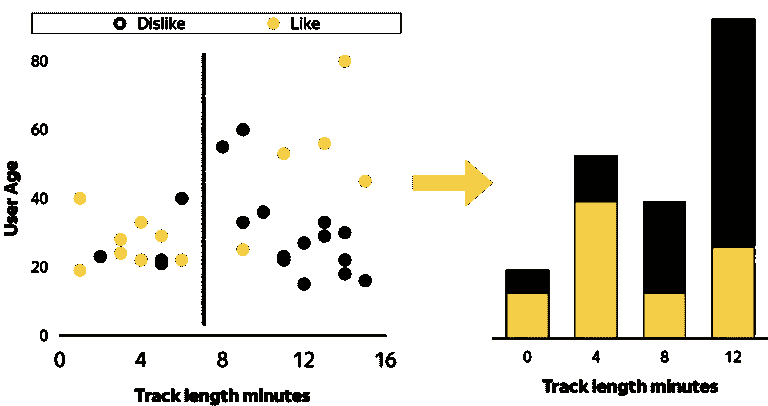
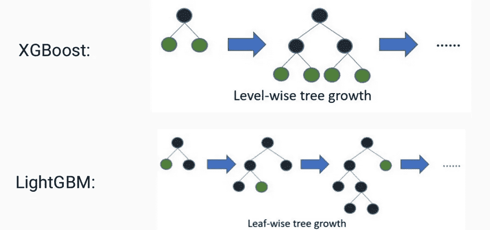
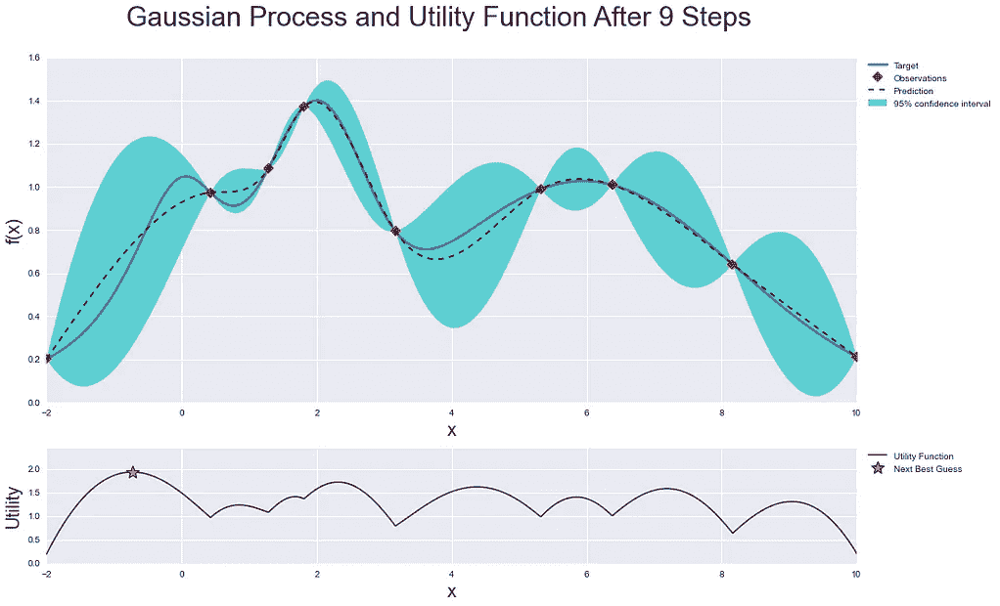
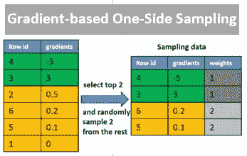
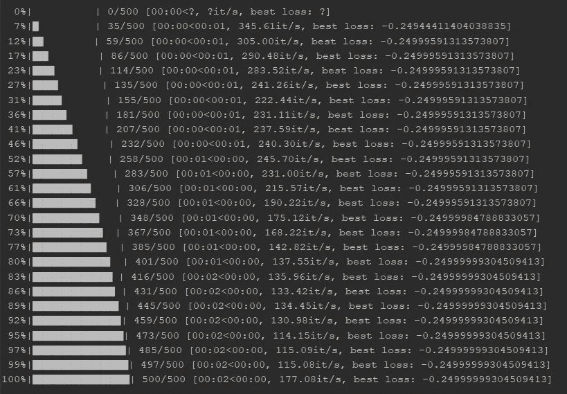
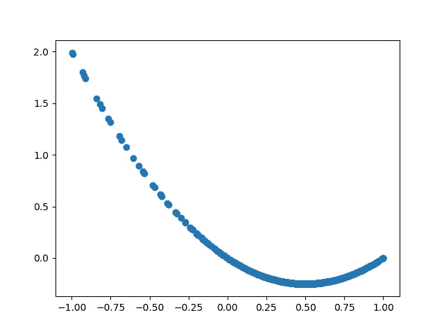

# 使用 Hyperopt 在 XGBoost、LightGBM 和 CatBoost 上优化超参数的示例

> 原文：<https://towardsdatascience.com/an-example-of-hyperparameter-optimization-on-xgboost-lightgbm-and-catboost-using-hyperopt-12bc41a271e?source=collection_archive---------1----------------------->

## 额外奖励:Hyperopt-Sklearn

Source: Pexels

我保证，这次会比上一次更高级:

 [## 配对交易中强化学习的温和实现

### TensorFlow 中结构化编程的一个例子

towardsdatascience.com](/a-gentle-implementation-of-reinforcement-learning-in-pairs-trading-6cdf8533bced) 

# 介绍

## 梯度推进决策树(GBDT)

**梯度推进**是**决策树**上的附加训练技术。 *XGBoost* 的[官方页面给出了非常清晰的概念解释。基本上，不是运行静态的单个决策树或随机森林，而是迭代地添加新的树**直到无法实现进一步的改进。除了正则化之外，集合技术对于防止过拟合是至关重要的。尽管该模型可能非常强大，但仍有许多超参数需要微调。**](https://xgboost.readthedocs.io/en/latest/tutorials/model.html)

## **XGBoost、LightGBM 和 CatBoost**

**这些是众所周知的梯度增强包。与通过遍历所有要素找到最佳分割的传统 GBDT 方法相比，这些包实现了基于直方图的方法，将要素分组到条柱中，并在条柱级别而不是要素级别执行分割。另一方面，他们也倾向于忽略稀疏输入。这些显著提高了它们的计算速度(更多细节见[此处](http://mlexplained.com/2018/01/05/lightgbm-and-xgboost-explained/))。需要注意的几个关键点:**

****XGBoost** :著名的 Kaggle 中奖包。树的生长是基于逐层的树修剪(树在一层的所有节点上生长),使用来自分裂的[信息增益](https://xgboost.readthedocs.io/en/latest/tutorials/model.html#learn-the-tree-structure),为此需要对样本进行预分类，以便在每一步中计算所有可能分裂的最佳分数，因此比较耗时。**

**等级和树叶(树从特定的树叶开始生长)训练都是可用的。它允许用户选择一种叫做**基于梯度的单侧采样(GOSS)** 的方法，这种方法根据最大梯度和一些具有较小梯度的随机样本来分割样本。背后的假设是梯度越小的数据点训练得越好。另一个关键算法是**专有特征捆绑(EFB)** ，它研究特征的稀疏性，并将多个特征组合成一个，而不会丢失任何信息，因为它们在一起决不非零。这些使得 LightGBM 比 XGBoost 更快。**

****CatBoost** :专为分类数据训练设计，也适用于回归任务。GPU 上的速度号称是这些库中[最快的](https://github.com/catboost/catboost/issues/505)。在[中将分类特征转换为数字](https://catboost.ai/docs/concepts/algorithm-main-stages_cat-to-numberic.html#algorithm-main-stages_cat-to-numberic)中有多种方法。其速度的关键与两个 Os 挂钩: [**遗忘树**](https://www.quora.com/Lets-say-that-I-want-to-build-a-decision-tree-ensemble-that-can-make-predictions-very-quickly-Is-there-a-library-that-can-help-me-build-such-an-efficient-ensemble) 和**有序推进**。*不经意树*是指采用对称二进制分裂的逐层树构建(即每层上的每片叶子都被一个特征分裂)，而*有序提升*应用排列和顺序目标编码来转换分类特征。更多详情请参见此处[此处](https://catboost.ai/news/catboost-enables-fast-gradient-boosting-on-decision-trees-using-gpus)和[此处](/https-medium-com-talperetz24-mastering-the-new-generation-of-gradient-boosting-db04062a7ea2)。**

## **贝叶斯优化**

**与作为强力方法的 GridSearch 或纯粹随机的 RandomSearch 相比，*经典* **贝叶斯优化**通过高斯过程逼近目标函数(即随机样本被迭代地抽取(基于序列模型的优化(SMBO))并且样本之间的函数输出被置信区域逼近)，在搜索最优参数时结合了随机性和后验概率分布。将在置信区域的高均值和方差处从参数空间中提取新样本，用于勘探和开发。查看此以获得更多解释。**

## **远视**

**Hyperopt 是一个用于搜索空间优化的 python 库。目前它提供了两种优化算法: **1。随机搜索**和 **2。Parzen 估计器树(TPE** )，这是一种贝叶斯方法，它使用 *P(x|y)* 而不是 *P(y|x)* ，在计算预期改善时，它基于对由阈值而不是一个阈值分隔的两个不同分布的近似(参见[和](/a-conceptual-explanation-of-bayesian-model-based-hyperparameter-optimization-for-machine-learning-b8172278050f))。它曾经适应高斯过程和回归树，但现在这些不再被实现。**

**************

UL: [Feature binning](https://devblogs.nvidia.com/catboost-fast-gradient-boosting-decision-trees/); UR: [Tree growing](https://rohitgr7.github.io/); BL: [Bayesian Optimizing](https://github.com/fmfn/BayesianOptimization) ; BR: [Gradient-based One-Side Sampling](https://www.kaggle.com/c/home-credit-default-risk/discussion/59806)** 

# **履行**

## **装置**

**查看以下安装指南:**

*   **[XGBoost](https://xgboost.readthedocs.io/en/latest/build.html)**
*   **[灯 GBM](https://lightgbm.readthedocs.io/en/latest/Installation-Guide.html)**
*   **[CatBoost](https://catboost.ai/docs/concepts/installation.html)**
*   **[远视](https://hyperopt.github.io/hyperopt/)**

## **远视示例**

**`fmin()`是 hyperopt 中用于优化的主要功能。它接受四个基本参数并输出优化的参数集:**

1.  **目标函数— `fn`**
2.  **搜索空间— `space`**
3.  **搜索算法— `algo`**
4.  **(最大)评估数量— `max_evals`**

**我们也可以将一个 Trials 对象传递给`trials`参数，它跟踪整个过程。为了进行试验，目标函数的输出必须是至少包括关键字`'loss'`和`'status'`的字典，这两个关键字分别包含结果和优化状态。可以通过以下方式提取临时值:**

*   **`trials.trials` -字典列表包含所有相关信息**
*   **`trials.results` -收集函数输出的字典列表**
*   **`trials.losses()` -损失清单(每次‘ok’试验的浮动)**
*   **`trials.statuses()` -状态字符串列表**
*   **`trials.vals` -采样参数字典**

**让我们看看下面的例子:**

**Example of hyperopt implementation**

********

**Example of hyperopt implementation - progress and the corresponding results**

**优化后的 *x* 为 *0.5000833960783931* ，接近理论值 *0.5* 。正如你可能注意到的，样本在最小值附近更加浓缩。如果您将`algo`切换到使用随机采样的`hyperopt.rand.suggest`，那么这些点将在`hp.uniform`下更均匀地分布。**

**还有几件事需要澄清:**

****搜索算法**:或者`hyperopt.tpe.suggest`或者`hyperopt.rand.suggest`**

****搜索空间:** `hp.uniform('x', -1, 1)`用标签‘x’定义一个搜索空间，它将在-1 和 1 之间被均匀采样。目前由 hyperopt 的优化算法识别的随机表达式是:**

*   **`hp.choice(label, options)`:选项的**指标****
*   **`hp.randint(label, upper)`:随机整数*【0，上)***
*   **`hp.uniform(label, low, high)`:低/高值一致**
*   **`hp.quniform(label, low, high, q)` : `round(uniform(.)/q)*q`(注意该值给出的是一个[浮点数，而不是整数](https://github.com/hyperopt/hyperopt/issues/253))**
*   **`hp.loguniform(label, low, high)` : `exp(uniform(low, high)/q)*q`**
*   **`hp.qloguniform(label, low, high, q)` : `round(loguniform(.))`**
*   **`hp.normal(label, mu, sigma)`:正态分布抽样**
*   **`hp.qnormal(label, mu, sigma, q)` : `round(normal(nu, sigma)/q)*q`**
*   **`hp.lognormal(label, mu, sigma)` : `exp(normal(mu, sigma)`**
*   **`hp.qlognormal(label, mu, sigma, q)` : `round(exp(normal(.))/q)*q`**

**详见[本](https://github.com/hyperopt/hyperopt/wiki/FMin)。**

**如果你想从远视空间采样，你可以调用`hyperopt.pyll.stochastic.sample(space)`，其中`space`是上面的`hp`空间之一。**

## **使用 Hyperopt 优化 XGBoost、LightGBM 和 CatBoost**

**下面是本文中的主要示例。所有三个 boosting 库都有一些相似的接口:**

*   ****训练:****
*   ****交叉验证:** `cv()`**
*   ****sci kit-学习 API:**
    -回归器:`XGBRegressor()`，`LGBMRegressor()`，`CatBoostRegressor()`，
    -分类器:`XGBClassifier()`，`LGBMClassifier()`，`CatBoostClassifier()`**

**以下示例使用回归器接口。让我们首先为所有三个库定义参数空间(`reg_params`用于对象实例化；`fit_params`为`fit()`功能):**

**请注意，许多参数共享公共的参数名或别名。有关更多信息，请查看以下链接和相应的 API 页面:**

*   **[XG boost](https://xgboost.readthedocs.io/en/latest/parameter.html)【X】**
*   **[light GBM](https://lightgbm.readthedocs.io/en/latest/Parameters.html)【L】**
*   **[CatBoost](https://catboost.ai/docs/concepts/python-reference_parameters-list.html)【C】**

**一些基本参数:**

*   **`learning rate`【X/L/C】:学习率(别名:`eta`)**
*   **`max_depth`【X/L/C】:树木的最大深度**
*   **`n_estimators`【X/L/C】:升压迭代次数**
*   **`min_child_weight`【X/L】:一个孩子所需的最小体重总和**
*   **`min_child_samples`【信用证】:一叶数据的最小数量**
*   **`subsample`【X/L/C】:训练实例的子样本比率(注意，对于 CatBoost，只有在选择了泊松或伯努利`bootstrap_type`时，才能使用该参数)**
*   **`colsample_bytree`【X/L】:树木建筑中柱子的子样比**
*   **`colsample_bylevel`【X/C】:树型建筑中各层柱子的子样比**
*   **`colsample_bynode`【X】:各节点列的子样率**
*   **`tree_method`【X】:树形构造法**
*   **`boosting`【L】:树形构造法**
*   **`boosting_type` [C]: `Ordered`表示有序升压，或者`Plain`表示经典**
*   **`early_stopping_rounds`【X/L/C】:用于`fit()`的参数——如果验证数据的一个指标在最后`early_stopping_rounds`轮中没有改善，则停止训练**
*   **`eval_metric`【X/L/C】:验证数据的评估指标**

**有关 CatBoost 中分类特征设置的更多设置，请查看参数页面中的 CTR 设置。**

**在设置参数之后，我们可以创建一个类`HPOpt`,它用训练和测试数据实例化，并提供训练函数。这里我只包括回归变量的例子。您可以在课程中添加自己的分类、训练或交叉验证功能。**

**例如，给定预定义的数据帧`x_train`、`x_test`、`y_train`、`y_test`，我们可以通过调用`process()`来运行优化过程:**

# **额外奖励:Hyperopt-Sklearn**

**[Hyperopt-Sklearn](https://hyperopt.github.io/hyperopt-sklearn/) 是一个非常高级的优化包，目前仍在构建中。让我们来看一个官方例子:**

**source: [https://hyperopt.github.io/hyperopt-sklearn/](https://hyperopt.github.io/hyperopt-sklearn/)**

**你可能会好奇什么是`any_classifier`？如果我们检查它的 [GitHub](https://github.com/hyperopt/hyperopt-sklearn/blob/master/hpsklearn/components.py) 库:**

**似乎涵盖了 *SVM* 、 *KNN* 、*随机森林*甚至 *XGBoost* 等多个分类器和回归器。正如官方页面所说:**

> **hyperopt 中可用的任何搜索算法都可以用来驱动估计器。也可以提供自己的算法或混合使用不同的算法。**

**基本上，它几乎为您搜索所有内容，包括模型和超参数。虽然这听起来很方便，但在把一切交给电脑之前，我会三思而行。但是，如果数据集和参数空间的大小不是很大，那么值得一试。**

# **最后**

**这是对主要 boosting 库和 hyperopt 的介绍。在文档中有更多关于并行运行的主题，可以提高 GPU 和 MongoDB for hyperopt 的计算速度，您可能也会有所启发。**