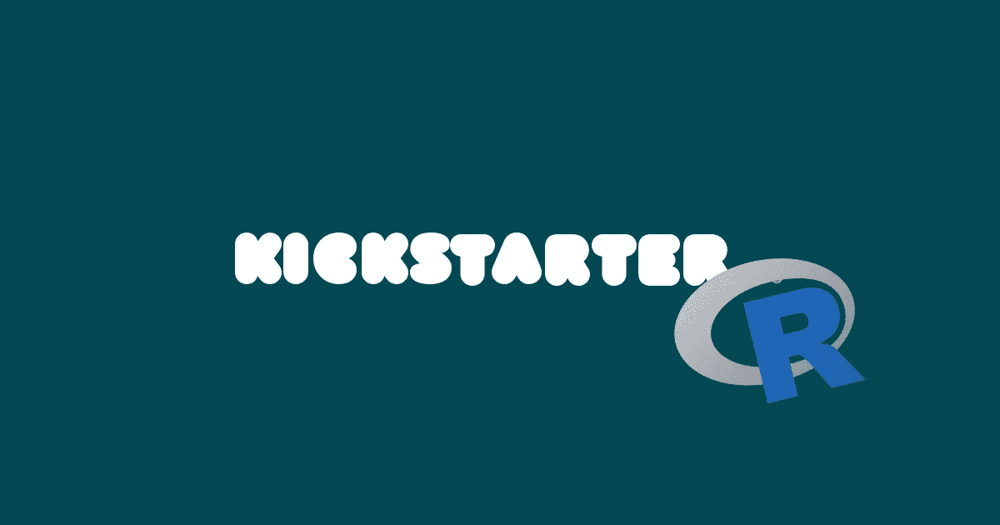
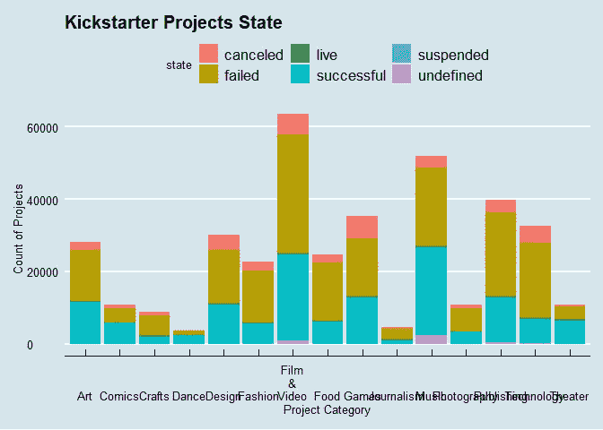
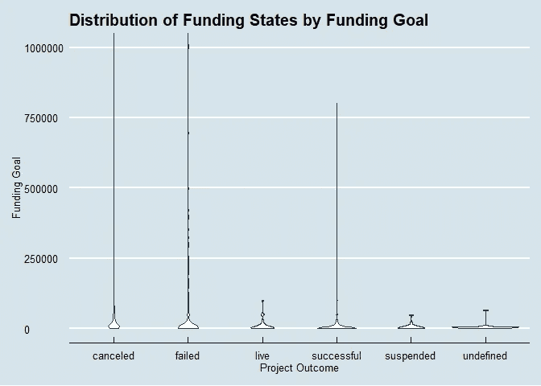
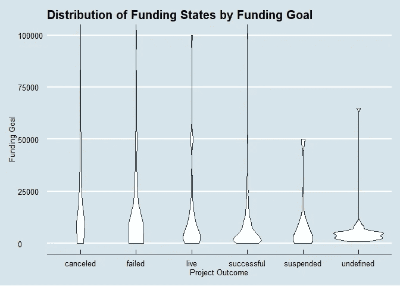
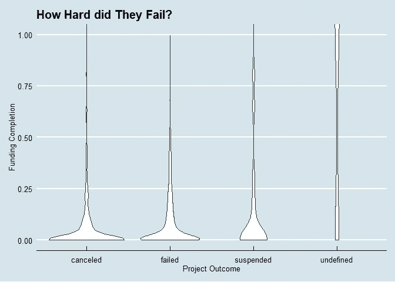

# Kickstarter 最近怎么样？

> 原文：<https://towardsdatascience.com/an-exercise-on-basic-r-hows-kickstarter-doing-these-days-3476a4b9e7ab?source=collection_archive---------27----------------------->

## 使用 tidyverse 和 ggplot2 进行基本数据操作和可视化，使用 mediumR 发布



It’s a practice story!

我没有意识到从 R 直接导入到 Medium 后，桌子/桌子的形状会很差。如果有人曾经面临过这种情况，请给我一个链接供我参考！

我从 Kaggle 获得了 2018 年 1 月 Kickstarter 数据集。对于门外汉来说，也就是说，如果你一直生活在岩石下，Kickstarter 是一个项目众筹平台。所以你发布你想要实现的项目，它可以是艺术项目，音乐，电影，新玩意，艺术，食物食谱，视频游戏，等等。见鬼，曾经有个家伙在 Kickstarter 上建了一个[页面](https://www.kickstarter.com/projects/zackdangerbrown/potato-salad)来帮他做土豆沙拉。当这位老兄说他只需要 10 美元买一些土豆沙拉时，他得到了 55，000 美元。

因此，人们张贴他们想做什么样的东西，项目的细节，设定一个资助目标，并让人们“承诺”他们的项目。Kickstarter 遵循“全有或全无”的资助计划，这意味着如果到了资助截止日期，你的项目还没有达到目标，所有承诺的资金都将返还给贡献者。通常期限是 30 天或 60 天。但是如果你真的达到了你的融资目标，你会得到这笔钱，但是 Kickstarter 会给你 5%的提成。

所以今天我们将试着回答或提出更多的问题，有几点:

*   Kickstarter 还是独立项目可行的资金来源吗？如果有，通常什么样的项目能成功获得资助？
*   如果项目资助失败，失败的可能性有多大？什么样的项目会失败？

我们首先对我们面临的数据集有一个概念。我们有从 2009 年 3 月到 2018 年 3 月的大约 378，000 个项目的数据(顺便提一下，Kickstarter 是 2009 年 4 月推出的，但无论如何)。

瞧，原始数据(名为“ks”):

```
ks## # A tibble: 378,661 x 16
##        ID name  category main_category currency deadline     goal
##     <int> <chr> <chr>    <fct>         <chr>    <date>      <dbl>
##  1 1.00e9 The ~ Poetry   Publishing    GBP      2015-10-09   1000
##  2 1.00e9 Gree~ Narrati~ Film & Video  USD      2017-11-01  30000
##  3 1.00e9 Wher~ Narrati~ Film & Video  USD      2013-02-26  45000
##  4 1.00e9 Tosh~ Music    Music         USD      2012-04-16   5000
##  5 1.00e9 Comm~ Film & ~ Film & Video  USD      2015-08-29  19500
##  6 1.00e9 Mona~ Restaur~ Food          USD      2016-04-01  50000
##  7 1.00e9 Supp~ Food     Food          USD      2014-12-21   1000
##  8 1.00e9 Chas~ Drinks   Food          USD      2016-03-17  25000
##  9 1.00e9 SPIN~ Product~ Design        USD      2014-05-29 125000
## 10 1.00e8 STUD~ Documen~ Film & Video  USD      2014-08-10  65000
## # ... with 378,651 more rows, and 9 more variables: launched <dttm>,
## #   pledged <dbl>, state <fct>, backers <int>, country <chr>, `usd
## #   pledged` <dbl>, usd_pledged_real <dbl>, usd_goal_real <dbl>,
## #   wrap_main_category <chr>
```

因为我们想看看什么样的项目得到了资助，什么样的项目失败了，所以首先存储新的变量来区分失败和成功的项目是有意义的。

```
ks$wrap_main_category<-str_wrap(ks$main_category,width=5)

success.fail.bar <- ggplot(ks, aes(x=wrap_main_category, fill=state))
success.fail.bar + geom_bar() + theme_economist() + labs(x="Project Category",y="Count of Projects", title="Kickstarter Projects State")
```



我们看到，对于大多数项目类别，成功率将低于 50%。下面是更详细的数据。我们创建新的变量，计算每个类别中有多少项目，以及每个类别中有多少项目失败，然后简单地将它们相除，以找到失败率。

```
ks.all<- ks %>%
  group_by(main_category)%>%
  summarise(count=n()) %>%
  arrange(desc(count))

ks.allfail<- ks.fail %>%
  group_by(main_category)%>%
  summarise(count=n()) %>%
  arrange(desc(count))

ks.rate <- ks.all %>%
  mutate(fail=ks.allfail$count/ks.all$count) %>%
  arrange(desc(fail))
ks.rate## # A tibble: 15 x 3
##    main_category count  fail
##    <fct>         <int> <dbl>
##  1 Journalism     4755 0.787
##  2 Games         35231 0.742
##  3 Fashion       22816 0.729
##  4 Food          24602 0.700
##  5 Technology    32569 0.697
##  6 Publishing    39874 0.692
##  7 Theater       10913 0.685
##  8 Art           28153 0.658
##  9 Design        30070 0.649
## 10 Film & Video  63585 0.628
## 11 Comics        10819 0.619
## 12 Music         51918 0.534
## 13 Crafts         8809 0.497
## 14 Photography   10779 0.462
## 15 Dance          3768 0.380**note: the column "count" represents the amount of projects belonging to the category in the data-set, the column "fail" indicates how often projects belonging to that category fails**
```

事实证明，以新闻为主题的项目失败了很多。另一方面，我们得到了失败最少的舞蹈分类项目。两者都有相对较少的提议项目。为什么？或许这与筹资目标有关？人们会被那些有着巨大资金目标的项目吓住吗？或者，资助目标金额较小的项目是否被认为不够雄心勃勃？资金目标是答案吗？我们将抽取 1%的人口作为样本。

```
ks.sample <- sample_frac(ks,0.01)

viol <- ggplot(ks.sample,aes(x=state,y=goal),options(scipen=1000000))

viol + geom_violin(scale="area") + coord_cartesian(ylim=c(0,1000000)) +
  theme_economist() + labs(x="Project Outcome",y="Funding Goal",title="Distribution of Funding States by Funding Goal")
```



事实证明不是。这只表明有一些疯狂的雄心勃勃的项目(这些项目失败了或被取消了)但筹资目标似乎并不真正影响成功。有道理。也许我们需要仔细看看。

```
viol + geom_violin(scale="area") + coord_cartesian(ylim=c(0,100000)) +
  theme_economist() + labs(x="Project Outcome",y="Funding Goal",title="Distribution of Funding States by Funding Goal")
```



看，大部分成功资助的项目都处于资助目标的低端。相反，其他州(失败)分布得很好。这是否意味着更低的资助目标意味着更好的计算项目，或者仅仅是，更容易资助？也许我们应该看看他们离他们的筹资目标还有多远？

```
ks2 <- ks%>%
  mutate(failhard=(ks$pledged/ks$goal)) %>%
  filter(state!="successful", state!="live") %>%
  select(ID:pledged,failhard,everything())
ks2## # A tibble: 241,906 x 17
##        ID name  category main_category currency deadline     goal
##     <int> <chr> <chr>    <fct>         <chr>    <date>      <dbl>
##  1 1.00e9 The ~ Poetry   Publishing    GBP      2015-10-09   1000
##  2 1.00e9 Gree~ Narrati~ Film & Video  USD      2017-11-01  30000
##  3 1.00e9 Wher~ Narrati~ Film & Video  USD      2013-02-26  45000
##  4 1.00e9 Tosh~ Music    Music         USD      2012-04-16   5000
##  5 1.00e9 Comm~ Film & ~ Film & Video  USD      2015-08-29  19500
##  6 1.00e9 Chas~ Drinks   Food          USD      2016-03-17  25000
##  7 1.00e9 SPIN~ Product~ Design        USD      2014-05-29 125000
##  8 1.00e8 STUD~ Documen~ Film & Video  USD      2014-08-10  65000
##  9 1.00e8 Of J~ Nonfict~ Publishing    CAD      2013-10-09   2500
## 10 1.00e9 The ~ Crafts   Crafts        USD      2014-10-02   5000
## # ... with 241,896 more rows, and 10 more variables: launched <dttm>,
## #   pledged <dbl>, failhard <dbl>, state <fct>, backers <int>,
## #   country <chr>, `usd pledged` <dbl>, usd_pledged_real <dbl>,
## #   usd_goal_real <dbl>, wrap_main_category <chr>
```

我增加了一个名为“失败”的栏目，通过划分承诺金额和目标金额来显示一个项目离获得资助还有多远。但是这里没有显示。

我们添加了一个新列来计算项目资金目标的完成百分比。通过这种方式，我们可以衡量他们离获得资助还有多远。

```
ks.sample2 <- sample_frac(ks2,0.01)

viol2 <- ggplot(ks.sample2,aes(x=state,y=failhard),options(scipen=1000000))

viol2 + geom_violin(scale="area") + coord_cartesian(ylim=c(0,1)) +
  theme_economist() + labs(x="Project Outcome",y="Funding Completion",title="How Hard did They Fail?")
```



大多数项目都失败了，甚至没有超过 25%。是否可以得出结论，不是资助目标太大，就是 Kickstarter 设定的资助期限太小？也许仅仅是因为这些项目没那么有趣。

总而言之，我们可以得出结论，坦率地说，60%的失败率是相当低的！我最初认为只有很小一部分项目能够成功获得资助。结果 40%的人达到了筹资目标。项目要么得到了资助，要么与目标相差甚远。显示它仍然是命中或错过，但嘿，40%的融资机会是相当大的，如果你问我。

我们下次再继续。毕竟，这是我第一次和 r 一起竞技。