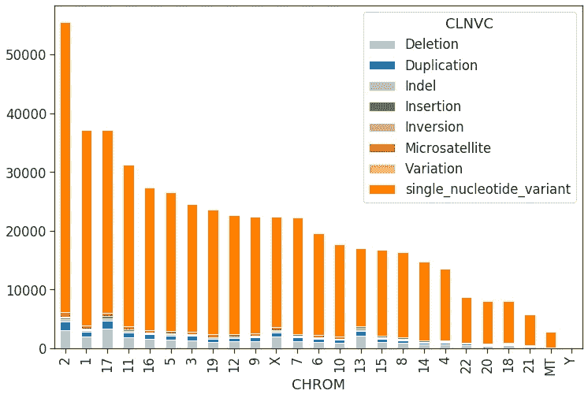

# ClinVar 数据库中人类遗传变异的探索

> 原文：<https://towardsdatascience.com/an-exploration-of-human-genetic-variants-in-the-clinvar-database-fa50bcd87dea?source=collection_archive---------30----------------------->

> 每一个生物的核心不是火，不是温暖的呼吸，不是“生命的火花”。它是信息，文字，指令。如果你想理解生活，不要去想充满活力、悸动的凝胶和渗出物，想想信息技术。理查德·道金斯

正如道金斯在他一贯直言不讳、经常嘲讽的感叹中所描述的那样，我们越来越认同这样一个事实，即 DNA 是最典型的信息分子——一种由 4 个字母组成的小型字母表中的密码，构成了一个人。从纯粹的有用性来看，这是后元古代时代使用最频繁的信息技术。

数十亿年前，生命采用 DNA 作为信息分子。一开始，生命并不像今天这样复杂，无论是在机体外部还是内部。随着复杂的身体模式和器官模式的进化，DNA 的数量也随之增长。增长是惊人的——从细菌的兆碱基到人类的千兆碱基。毕竟，这是增加由 4 个字母组成的线性字符串的复杂性的唯一方法。然而，继续“长度增长”战略来跟上复杂性是不可能的。为了应对这种情况，进化发明了其他现象，如体细胞超突变、重组和交替剪接，以增加多样性，而不会永远增加基因组的大小。

Genome size comparison (x-axis in log scale)

进化的变异就像股票市场的波动。没有前者，后者就不会存在。变异是进化的食物和饲料。随着新物种的进化，它们继承的 DNA(变体)与它们的前辈略有不同。当条件改变时，这些变异中的一些相对于其他种群获得优势，成为优势物种(T2 的胡椒蛾进化)。这是进化的潮起潮落——从一个进化到下一个。不管是好是坏，它必须继续下去。

# 脱氧核糖核酸

> 一个人活着。生物体的完整描述已经写在蛋里了。—悉尼·布雷内

DNA 是生命的蓝图；它携带了制造生物体所需的所有信息。这是你的**基因组**——总体规划——生命的*秘密*。

人类的 DNA 有 30 亿个碱基对长，由 4 个核苷酸碱基组成:腺嘌呤**腺嘌呤**、腺嘌呤**腺嘌呤**腺嘌呤、**鸟嘌呤**鸟嘌呤**胞嘧啶**。它所拥有的信息是它唯一的功能。为了制造蛋白质，DNA(更准确地说是 mRNA，它是 DNA 蛋白质编码区的代理)被破译为三联体或**密码子。**密码子是 3 个碱基的任意组合——也就是 4 个，加起来就是 [**64**](https://en.wikipedia.org/wiki/DNA_codon_table) **密码子。**每个密码子编码一个特定的氨基酸，由于只有 20 个氨基酸，有些氨基酸有不止一个密码子。这就是**变体**发挥作用的地方。DNA 序列的变异意味着氨基酸序列的改变、蛋白质组成的改变和一种无序状态。DNA 变异的这一方面对于评估个体对遗传条件的易感性至关重要。

# 为什么选择 ClinVar？

不久前，我们发现捕捉关于人口变化的洞察力是一个强有力的工具。它催生了生物学研究史上一些最重要的事业。 [1000 个基因组](https://www.internationalgenome.org/data/)， [1001 个基因组](https://1001genomes.org/)，[瓶中基因组](https://jimb.stanford.edu/giab)， [OMIM](https://www.ncbi.nlm.nih.gov/omim) ，[宇宙](https://cancer.sanger.ac.uk/cosmic)， [ClinVar](https://www.ncbi.nlm.nih.gov/clinvar/) 等。是一些例子。 [ClinVar](https://www.ncbi.nlm.nih.gov/clinvar/) 是一个公共知识库，包含关于基因组变异及其表型的信息和证据。如果您对您的基因组进行测序，并将其与 ClinVar 数据集中的基因组位置进行比较，您可以找出您的遗传变异及其表型。截至 2019 年 11 月，数据库中有超过 50 万(准确地说是 502252)个条目。ClinVar 由国家生物技术信息中心(NCBI)管理。

# 是什么导致了变异？

Variation in the corn kernel color caused by transposons

玉米穗中的每一粒都是一次独立减数分裂的产物。这意味着，令人惊讶的是，一只耳朵可以捕捉到玉米植株的整个基因组。几乎就像数据科学家的仪表板。但是，有一个问题；籽粒的颜色似乎不遵循孟德尔遗传。原因可能是什么？通过她在玉米遗传学方面的开创性工作，她获得了 1970 年的国家科学奖章和 1983 年的诺贝尔奖，**芭芭拉·麦克林托克**展示了某些遗传元素可以改变基因组中的位置，从而产生非孟德尔遗传模式。这些元素被称为**转座子**，当它们从染色体的一部分跳到另一部分时，它们会产生复杂的遗传变异，如缺失、复制和倒位。在人类中， ***Alu 元素*** 是最丰富的转座子——约占我们基因组的 10%。

第二个主要原因是电离辐射和高能辐射。它们引起点突变(单核苷酸变异)和染色体断裂。

# 如何识别变体？

我们使用两种主要的方法来描述变异——基因组的和功能的——在这里我将着重于基因组方面。在计算基因组学中，通过将给定序列与参考基因组进行比对来识别变异。正如你可能会想到的，参考基因组是**而不是**完美的基因组——它是一个单倍体镶嵌图——它是由 13 个匿名捐赠者任意选择的一整套基因组序列拼接而成的。顾名思义，它是分析的参考。

我们通过称为变体调用的多步骤过程来找出 DNA 变体。分析的输出是一个变体调用格式文件，通常称为 [VCF](https://www.internationalgenome.org/wiki/Analysis/Variant%20Call%20Format/vcf-variant-call-format-version-40/) 。如果你想自己试试这个，建议你看一下[银河平台](https://usegalaxy.org/)。它是免费使用的，而且他们为初学者提供了很棒的入门教程。下面的分析来自参考基因组 GRCh37 的 ClinVar VCF 文件。

# 人类基因组中最常见的变异是什么？

The proportion of variant classes in our genome

每一个数据都有些令人困惑——计算需要一种'*剥洋葱'*的方法，一次一层。ClinVar 数据集可以大致分为七类变量。正如你所看到的，毫不奇怪，大约 90%的 ClinVar 数据集由单核苷酸变异体(SNVs)组成。snv 倾向于在基因组中累积一段时间，因为大多数 snv 都是不影响中心法则的微小缺失。另一方面，多核苷酸变异是致命的，尽管很罕见，它们是由复杂的基因组重排形成的——这是一个危险的策略。

# 所有的变异都是对我们有害的吗？

很明显，从图表来看，答案是否定的，不是全部。然而，缺乏变化是危险的；一会儿我会告诉你为什么。如果以上是真的，那么这个图表应该立即有意义。变异的影响也很大程度上取决于它在 DNA 中的变化类型和变异的位置。外显子或启动子中间的缺失将是灾难性的。然而，如果它位于内含子或 3’非翻译区，其影响可能是良性的。

# SNVs 是什么原因造成的？

Different types of base conversions among the SNVs

臭氧是救生员，是上层大气中的一层面纱，保护我们的基因组免受紫外线的破坏。然而，一些更长的紫外线波长确实设法逃脱并落在我们身上。这个紫外线波长恰好在 **T** hymine 和 **C** ytosine 的吸收光谱内。辐射能的激发使它们与附近的碱基反应，产生嘧啶二聚体。暴露在阳光下的每一秒钟都会在我们的皮肤细胞中引发上百次这样的反应。但是我们有一个对策，*核苷酸切除修复，*切除损坏的碱基以减轻损害。如果这些得不到纠正，DNA 可能会永久变异。SNV 的另一个来源是碱基的错配，因为它们被紫外线、X 射线和γ射线电离。

这些事件属于两类)**和 [**颠换**](https://en.wikipedia.org/wiki/Transversion) 。如图所示， ***转换*** 是我们基因组中最常见的点突变(C - > T，G- > A，A- > G，T- > C)。**

# **为什么缺失是致命的？**

****

**Shows what proportion of each variant contribute to pathogenicity**

**出生时患有啼哭综合症或猫哭综合症的婴儿经常像猫一样哭——这是 5 号染色体缺失的原因。高能辐射，如 x 射线和γ射线以及转座子会导致基因组损伤。结果往往是致命的，导致缺失。缺失会破坏 DNA 中编码信息的连续性，从而停止信息传递，并对细胞发育造成严重破坏。如图所示，大多数缺失都与致病性有关。**

****

**Number and size of deletions on human chromosomes**

**删除的最大大小似乎在 5KB 左右。可能存在选择偏差，使得任何大于 5Kb 的缺失都是致命的。**

# **为什么染色体变异不同？**

****

**The variant landscape of human chromosomes**

**人类染色体是按大小递减的顺序编号的。也就是说 1 号染色体最大，22 号最小。从逻辑上来说，染色体越大，突变的几率越高，但事实并非如此，从直方图中可以明显看出。**

**谈到逻辑，19 世纪一些最伟大的头脑被生物学的*逻辑*玩弄于股掌之间——在他们努力破译遗传密码的过程中。大爆炸的创始人之一伽莫夫等人认为这是一个明显的组合学案例——20 个氨基酸&三胞胎(你可以在这里 阅读他 1954 年的自然论文 [**)，后来被克里克证明是错误的。逻辑没问题，但是想象力和实验性更好！说够了。**](https://www.nature.com/articles/173318a0)**

****

**Human chromosomes**

****看一看第 17 号染色体；它和 1 号染色体**的变异一样多。*这个很耐人寻味。期待一篇后续文章，我将对每个染色体的结构做一些挖掘。目前，我们可以得出结论，17 号染色体的突变率比其他染色体高得多。人们还可以观察染色体带，很快发现与其他染色体相比，17 的异染色质(暗带)非常少。***

**你可能已经注意到 Y 染色体缺乏变异；这是因为它在全基因组关联研究(GWAS)和全基因组/外显子组测序研究(WGS/WES)中代表性不足。**

# **变异导致的紊乱有哪些？**

****

**首当其冲的是癌症和退化性疾病。缺失倾向于使个体倾向于不同形式的癌症。然而，有趣的是，在退行性疾病中没有缺失。**

# **为什么变异会导致紊乱？**

****

**Pathogenic variants and their molecular consequences**

**DNA 美丽的双螺旋结构解决了信息存储的问题，但直到很久以后才解决了信息传递的问题。最初，一个学派认为它可能类似于莫尔斯电码。然而，没有人能找出莫尔斯电码中分隔单词的停顿的基因等价物。事实上，遗传密码中没有停顿。这是一个无限的信息——一个一维的核苷酸阵列，读作三元组，只有那些知道从哪里开始，什么时候停止的人才知道。这些基本原则结晶成了我们今天所知的 ***中心法则***——从 DNA 到 RNA 到蛋白质的单向信息流。**

**正如你在 y 轴上看到的，这些变体可以在许多方面偏离中心教条，当它们偏离时，就会导致混乱。移码变异改变阅读框架，无义突变引入过早终止密码子，剪接变异影响 RNA 加工，等等。所有这些都会影响细胞功能。**

**你可能已经注意到在 frameshift_variant 类别中缺少 SNVs 这是因为 SNVs 是 ***到位*** 突变。**

# **为什么有些染色体比其他的更具致病性？**

****

**Distribution pathogenic variants on human chromosomes**

**生存是一门艺术，我们的基因组是这门艺术的大师。进化的一个共同主题是在系统中引入冗余。我记得这个基因丝兰，我在加州大学戴维斯分校做博士后研究时广泛研究过它。细胞中有超过八个这种基因的副本，每次我突变一个，另一个就会打开并取代前者的位置。毕竟，没有植物能够在没有生长素的情况下存活，生长素是丝兰基因的产物，总共价值八份，你说呢！**

**染色体有各种类型，大的、小的、异色的、末端着丝粒的等等。每条染色体都有两对并不是偶然的——这是大自然创造备份的方式——就像我们会定期备份我们的电脑一样——你明白了。但是这个系统并不完美，看看 X 和 Y 染色体——在男性中，没有备份！如果你看一下图表，你可以看到 X 染色体上的高致病性变异负担，也许是其独特性的结果。我们很幸运有备份，否则每一个突变都会对我们的生活产生不利影响。**

**上图还表明，2 号和 17 号染色体有突变热点，这使它们极易发生变异。此外，这些热点可能藏有一些关键基因。**

# **哪些基因受变异影响最大？**

****

**一些基因比其他基因更容易重排，因为它们在染色体上的位置和它们的序列，如 CpG 岛。这里，都与乳腺癌有关的 *BRCA1* 和 *BRCA2* 的缺失水平最高。乳腺癌是全球女性中最常见的癌症，这是由于在 *BRCA* 位点的染色体重排增加。如果你是一个男人，不要认为你摆脱了困境。根据疾病预防控制中心的说法，携带 *BRCA* 突变的男性更有可能患高级别前列腺癌、胰腺癌和乳腺癌。**

# **不再平衡！**

****

**Top variant genes and their allele frequencies**

**达尔文的自然选择理论，一个令人困惑的简单想法，可以解释生命的整体，它的设计，复杂性和多样性。然而，它未能解释机会变异是如何产生并代代相传的。尽管达尔文和孟德尔是同时代的人，但没有人看到解释自然选择的明显联系。根据 Hardy-Weinberg 平衡，如果没有自然选择的作用，一个群体中等位基因的频率应该保持不变，这在这个星球的大部分生命中都是如此。疫苗等发现扭转了局面；现在，是人类的选择决定了微观进化。因此，我们将在图表中看到导致严重疾病的变异频率上升。**

**等位基因频率是变异在人群中流行程度的指标。频率越高，表明该等位基因在人群中出现的范围越广。在图表中，你可以看到小提琴图中较高的隆起，表明概率在变化。**

# **变体似乎太麻烦了；我们不能摆脱他们吗？**

> **“生命不会被遏制。生命挣脱了束缚。它扩张到新的领域，冲破障碍，痛苦地，甚至危险地。”伊恩·马尔科姆博士，侏罗纪公园**

**抛开陈词滥调，我有一个故事给你:20 世纪 70 年代的玉米穗腐病。一种叫做*玉米小斑病菌*的玉米疫病菌摧毁了美国的玉米种植带，美国 85%的玉米都种植在这里。据估计，这一连锁反应给美国经济造成了数千万美元的损失。**

**那里会发生什么？玉米是如何变得容易受到广泛的真菌攻击的？美国科学院进行的一项研究发现，玉米带中的大多数玉米植物都来自“德克萨斯雄性不育细胞质”，也就是 T 细胞质。换句话说，所有植物的 T 细胞质在遗传上是一致的。**

**将 T-细胞质导入玉米植株是一种极好的(？)促进高产、杂交玉米种子快速和有利可图的生产的方法。公司立即采用了它，并将其商业化，却没有完全了解其潜在的后果。当*玉米小斑病菌*的一个新品系进化时，它被证明是完美的 T 细胞质杀手，因为玉米群体中没有*变异——想要深入研究，这里的就是论文。你看，克隆和 CRISPR 婴儿并不能解决我们的健康问题。我们不应该努力消灭变异，而是学会与之共存——真正的解决方案是 ***个性化医疗*** *。****

> ***我是 Aneesh。我是 Insight Data Science 的健康数据科学研究员。我开始写这篇文章时，脑子里想的是数据探索。原来我也有一些故事要分享。如果你今天学到了什么，我会很高兴。下次再聊！***