# 神经网络玩电子游戏的探索

> 原文：<https://towardsdatascience.com/an-exploration-of-neural-networks-playing-video-games-3910dcee8e4a?source=collection_archive---------13----------------------->

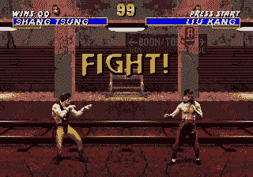

A brief look at a curiosity-driven model playing Mortal Kombat 3 for the Sega Genesis. The curiosity-driven model is the player on the left.

感谢我的团队成员:Benjamin Guo、 [Christian Han](https://www.linkedin.com/in/christian-han/) 、 [Cooper Shearer](https://www.linkedin.com/in/cooper-shearer/) 、【Justin Qu】和 [Kylar Osborne](https://www.linkedin.com/in/kylar-osborne-95759084/) 。

# 介绍

电子游戏不仅仅是好玩。它们为神经网络提供了一个平台，可以学习如何与动态环境交互并解决复杂的问题，就像在现实生活中一样。几十年来，视频游戏一直被用来评估人工智能的表现，最近又出现在新闻中，像 [DeepMind 这样的公司成功开发了能够击败顶级电子竞技专业人士的人工智能系统](https://deepmind.com/blog/alphastar-mastering-real-time-strategy-game-starcraft-ii/)。

我们的团队希望探索各种机器学习算法如何在玩一些我们最喜欢的经典视频游戏时发挥作用。我们的目标不是创建特定游戏的最佳模型，而是观察它们的行为特征以及它们对不同游戏任务的适应性。

# 背景

在我们开始深入我们项目的细节之前，让我们看看这些模型是如何在基础层面上工作的，以及我们是如何与视频游戏交互的。

## 强化学习

强化学习是机器学习的一个领域。它不同于监督学习，因为不需要标记的输入和输出。相反，代理在环境中执行一些动作，环境返回一个观察和一个奖励。基于这种奖励，代理人可以学习继续展示其当前行为或避免它。当代理人试图最大化它的报酬时，这个反馈循环继续。

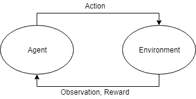

Diagram detailing the agent-environment system in reinforcement learning

为了把它放在一个更具体的环境中，让我们想象一个真人快打的游戏，代理人是我们的战士，环境由对手和舞台组成。如果我们的战士出拳并且能够降低对手的生命值，那么我们可能会因为我们的行动而得到奖励。另一方面，如果我们的战士跑了，而对手能够踢我们并降低我们的健康水平，那么我们可能会因为我们的行动而受到惩罚。

## 与视频游戏交互

为了将机器学习算法与视频游戏相结合，我们利用了由 OpenAI 开发的增强学习工具 [Gym](https://gym.openai.com/) 和 [Gym Retro](https://openai.com/blog/gym-retro/) 。Gym 允许我们创建前面提到的代理环境系统，而 Gym Retro 允许我们通过访问游戏中的变量和保存状态，从 Atari、Nintendo Entertainment System 和 Sega Genesis 等游戏机上模拟和运行复古游戏。

神经网络可以访问预定义的输入，每个输入都使代理执行一个动作。例如，对于世嘉创世纪控制台上的真人快打 3，神经网络只能从原始世嘉创世纪控制器上的六个按钮和方向箭头中进行选择。每个按钮都与一个特定的动作相关联(例如，“A”按钮对应一个低踢动作)。通过使用这些输入与环境交互，神经网络能够从观察和奖励中学习；最终，它能够学会如何正确应对各种情况并赢得比赛。

# 输入预处理

这些算法将视频游戏的每一帧作为图像输入。一个单独的关卡可能由成千上万的帧组成，而每一个单独的帧已经包含了大量的信息。因此，这个项目的一个主要方面是预处理这些图像输入，以平衡训练时间和神经网络的性能。减少计算的预处理方法有效，但是一些能提高性能的更先进的技术(不包括边缘检测)似乎对我们的模型没有帮助。

## 缩放输入和限制颜色

为了减少计算时间，同时保持数据的基本特征，我们缩小了许多图像的尺寸，并去掉了颜色。例如，Sega Genesis 模拟器的原始大小为 320x224 像素。我们把它缩小到一半大小，去掉了颜色。

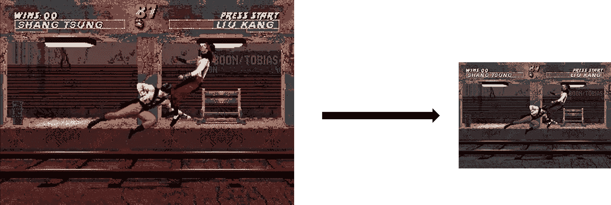

Reducing input image size by half and removing colors

## 限制输入

对于每个游戏，都有我们不希望代理采取的特定动作和按钮。例如，在刺猬索尼克中，使用“向上箭头”将允许索尼克向上看，而在训练时，我们发现有些情况下只会向上看，而不会通过关卡。为了加快培训过程，我们限制了可以获得的输入。

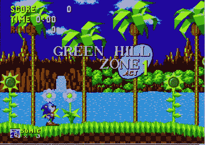

Sonic really likes looking at those clouds…

## 跳帧

我们实际上忽略了一些作为输入给出的帧，因为不是所有的帧都包含重要的信息。例如，看看下面的 4 帧序列。很难区分前两帧。

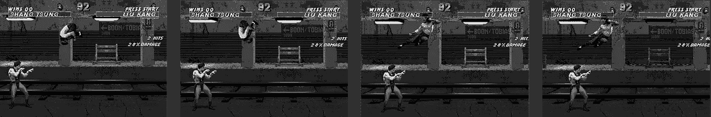

Sequence of frames before applying frame skipping

通过跳过一些帧，我们能够保留足够的数据来辨别重要的特征，如运动，同时减少计算和训练时间。

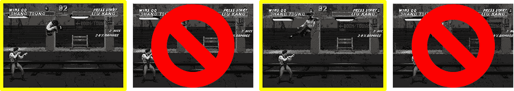

Sequence of frames after applying frame skipping. Frames in yellow are used for input while frames that are crossed out are ignored.

## 框架堆叠

通过观察这张单一的图像，几乎不可能判断跳跃的角色正在向哪个方向移动。

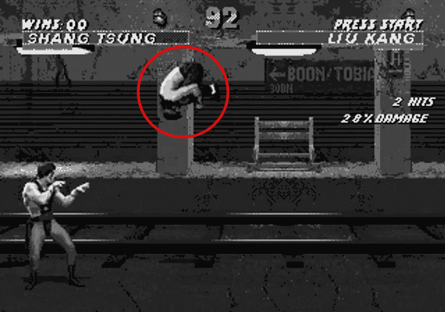

通过帧堆叠，我们可以将多个帧组合成模型的单个输入。我们的模型实际上是基于一系列“堆叠在一起”的帧而不是单个帧来选择动作。这使得模型能够辨别角色移动的方向或速度。与我们的其他预处理方法不同，这项技术实际上增加了计算量，但通过帧堆叠获得的信息超过了成本。

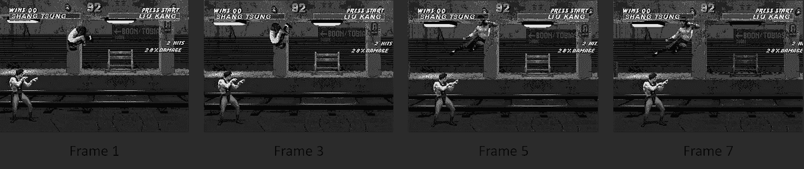

Sequence of frames that have been skipped and stacked before being used as a single input for the neural network

## 背景去除

虽然我们的大部分预处理旨在减少信息以降低计算复杂度，但背景去除背后的想法是减少噪声。我们发现，一些受过训练的人工智能在达到不同背景的新水平时，表现出不同寻常的行为。

我们尝试了来自 OpenCV 库的许多不同的背景去除算法；然而，目前不存在用于去除动态背景的算法。除了去除背景之外，另一种方法是用不同的背景在不同的层次上训练人工智能

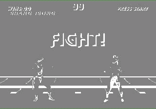

The background removal seems to be effective until the background begins scrolling

## 目标跟踪

在我们没有成功去除背景后，我们考虑简单地跟踪《真人快打 3》中的玩家对象和对手。不幸的是，OpenCV 库中现有的跟踪器要么将每帧的处理时间增加了 20 倍，要么无法保持对所需目标的锁定。此外，他们需要在对象上放置一个初始启动框，这需要手动选择或需要一些对象检测软件。

除了这些缺点，物体跟踪将只适用于真人快打 3，那里总是只有 2 个角色，没有其他相关的物体。在《刺猬索尼克》和《超级马里奥兄弟》中，简单地追踪主角会移除相关的环境信息，如 Goombas 或 powerups。

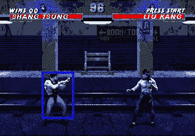

The object tracker first loses track of the original fighter and begins tracking the opponent. Then, it gets stuck on the light fixture in the background.

## 目标检测

为了克服物体跟踪器的缺点，我们决定尝试使用一个名为 [YOLOv3](https://pjreddie.com/darknet/yolo/) 的物体检测库。YOLOv3 有几个版本，每个版本都有不同大小的预训练神经网络。虽然基线版本在识别真人快打的人形时工作得很好，但在单帧上运行需要大约 5 秒钟，这使得在我们当前的硬件上几乎不可能进行训练。(客观地说，我们目前的训练速度超过每秒 60 帧。)我们还尝试了 YOLOv3 的“微型”版本，它包括一个更小的神经网络，这被证明足够快；然而，由于分辨率较低，它无法始终如一地识别字符。

除了准确性较低之外，它完全无法检测出《超级马里奥兄弟》和《刺猬索尼克》中任何有用的东西，因为它没有经过训练，无法识别这两款游戏中的各种敌人和物品。由于缺乏时间，我们无法实现某种对象检测预处理，因为这需要我们的团队不仅要重新训练模型，还要找到并制作所有重要游戏对象的训练集。

## 边缘检测

降低噪声的另一种尝试是通过边缘检测。边缘图将灰度帧转换成二进制帧，进一步降低了输入的复杂性。然而，生成边缘图确实给每一步增加了一点开销。最初，我们的团队担心丢失了太多的细节，神经网络将无法从真人快打的对手中识别出自己，但简单的测试证明情况并非如此。当与模型结合时，这种预处理技术允许我们在《真人快打 3》上获得最佳结果。

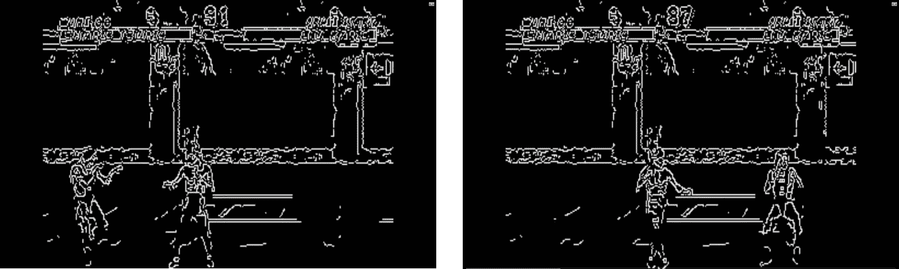

Edge detection proved to be much more effective than we initially believed

# 神经网络

为了观察机器学习算法在玩视频游戏时的表现，我们使用了三个模型:来自 [NEAT-Python](https://github.com/CodeReclaimers/neat-python) 的[增强拓扑的神经进化(NEAT)](http://nn.cs.utexas.edu/downloads/papers/stanley.ec02.pdf) 、来自 [OpenAI 的基线](https://github.com/openai/baselines)的[近似策略优化(PPO)](https://arxiv.org/pdf/1707.06347.pdf) ，以及来自加州大学伯克利分校、爱丁堡大学和 OpenAI 的[研究人员的](https://github.com/openai/large-scale-curiosity)[好奇心驱动的神经网络](https://pathak22.github.io/large-scale-curiosity/resources/largeScaleCuriosity2018.pdf)。

我们在世嘉创世纪控制台的真人快打 3 上训练了所有这些模型。此外，我们能够在 Sega Genesis 的刺猬索尼克上训练 NEAT，我们能够在 Sega Genesis 的刺猬索尼克和任天堂娱乐系统的超级马里奥兄弟上训练好奇心驱动的神经网络。

## NEAT(扩充拓扑的神经进化)

NEAT 是一个使用基因组描述个体网络的前馈网络。该算法使用适应度函数通过世代进化网络。在训练过程中，通过高分基因组之间的繁殖以及一些突变来产生后续世代。添加节点和连接的快速实现允许基因组网络在结构上适应和增长，这提供了优于固定大小网络的优势。

我们使用 NEAT 的 Python 实现在《真人快打 3》和《刺猬索尼克》上进行训练。NEAT 由一个配置文件初始化，该文件定义了常量，如输入/输出数量、突变概率和权重参数。前馈网络的输入是游戏屏幕的图像，输出是按钮按压。一个奖励函数累积起来决定每个基因组的适合度。

我们成功训练了一个整齐的网络，打败了刺猬索尼克的第一关。我们还在《真人快打 3》上对它进行了训练，但由于技术困难，无法恢复视频文件。

Full gameplay for NEAT on Sonic The Hedgehog

Lucas Thompson 在 NEAT *上的视频帮助我们编写代码，也极大地提高了我们有效训练的能力。*

## 基线

OpenAI Baselines 库实现了各种各样的强化学习算法，基于我们在相关项目中看到的成功，我们选择使用 PPO2 模型。

在使用基线时，我们发现尽早提出一个合理的奖励函数是很重要的。我们最终不得不在项目期间多次修改我们的奖励函数，这使得当我们想要测试新方法时，很难比较模型的性能，因为奖励的比例不一致。我们发现，最好的奖励功能是奖励和惩罚几乎相等，奖励应该立即给予，而不是在一集结束时给予。当前奖励功能监控双方战士的健康和比赛胜利，当检测到变化时，立即给予奖励或惩罚。

在让奖励函数工作之后，我们想把重点放在输入的预处理上，这是我们前面讨论过的。大量预处理的目标是减少模型在 GPU 内存中的大小。我们在具有 8 GB 板载 RAM 的视频卡上训练了这个模型，并且出乎意料地容易超出可用内存。我们需要并行训练模型，以使训练时间合理，通常有 16 个环境，因此当涉及到 GPU 内存时，模型大小的任何变化都会放大 16 倍。对图像进行缩放和灰度缩放可以大幅减少输入尺寸，但是当您通过帧堆叠再次增加图像尺寸时，这些增益大多会丢失。帧堆叠的性能提升超过了空间的合理性，所以我们开始跳过帧来降低内存占用。影响模型大小的其他因素是 *nsteps* 变量，它控制模型优化的范围，以及 *nminibatches* 变量，我们认为它采用整个范围并将其分成更小的块，用于梯度下降以更新策略。增加 *nsteps* 会增加模型在内存中的大小，但是增加 *nminibatches* 会减少模型在内存中的大小；我们认为这是因为一旦小批次被处理，帧就不再存储在存储器中。

一旦模型能够适应内存，我们就开始优化超参数。我们发现 0.00005 的学习率效果很好。我们尝试了高达 0.00025 的不同值，这使得这些模型最初快速降低了它们的误差，但是它们在大约 300 万个时间步长之后明显变慢，并且在大约 1000 万个时间步长之后被具有更小学习速率的模型超过。

在我们尝试的优化中，最令人惊讶的是边缘检测带来的性能提升。在我们看来，边缘检测器似乎删除了太多的细节，但用边缘检测器训练的模型击败了我们以前的所有尝试。

我们成功地训练了我们的基线网络，以击败《真人快打 3》中的前四关。

Full gameplay for Baselines on Mortal Kombat 3\. The model is the Kabal character on the left.

*要查看我们 PPO2 模型的代码，请查看*[*git lab*](https://gitlab.com/cshearer/mortal-kombat-3-baselines-and-gym-retro/tree/master)*。这个代码是基于一个由*[*AurelianTactics*](https://medium.com/@aureliantactics)*开发的项目，在那里他使用 PPO 来玩魂斗罗 3。*

## 好奇心

好奇心驱动的神经网络不是通过使用奖励函数来学习，奖励函数必须手动构建，然后进行测试，这可能是一个乏味且耗时的过程，而是通过能够正确预测给定其当前状态下其行为的结果将会发生什么来学习。这些模型具有内在的动机；他们总是试图最小化自己的预测误差。这与试图最大化一些用户定义的奖励的外部激励模型形成对比。例如，考虑一个好奇的代理玩超级马里奥兄弟的情况。代理自然会想要探索整个级别，以便通过移动和跳跃来最小化预测将会发生什么的错误，探索级别与在马里奥中完成它们是一样的。

我们必须在游戏中训练好奇心驱动的神经网络，以确保代理知道正确的输入是什么。我们还必须增加对某些游戏机显示分辨率的支持。对于如何学习特征，代码中有各种选项:像素、随机特征、变分自动编码器、逆动态特征。在[研究论文](https://pathak22.github.io/large-scale-curiosity/resources/largeScaleCuriosity2018.pdf)中一个有趣的结果是，仅仅使用像素作为特征通常会产生最差的性能。事实上，随机特征在比较中被证明是非常有效的，并且是默认的特征学习方法。由于时间和计算的限制，我们选择在我们训练的每个游戏中使用这个默认的方法。在未来，使用其他特征学习方法并比较由此产生的代理的性能将是有趣的。

好奇心驱动的神经网络在《超级马里奥兄弟》中表现最佳，达到了第三级。另一方面，扮演刺猬索尼克的特工总是会在第一关被卡住。我们认为这是由于游戏中非常动态的背景(例如，动画瀑布，波光粼粼的水，旋转的花，滚动的云)。相比之下，《超级马里奥兄弟》中的背景基本上是静态的。不过，这个结果并不太令人意外。研究论文简要讨论了这一特殊的局限性。《真人快打 3》尽管接受训练的时间最少，但也有相对静态的背景，玩这个游戏的代理人往往可以达到第二关。

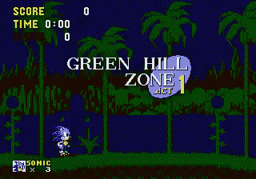

A curious agent playing Sonic the Hedgehog becomes easily distracted by the busy background. Here, the agent most likely thinks the animation of the waterfall is a result of its own actions. It then gets stuck trying to minimize its error in predicting how the waterfall will change as a result of running and jumping around.

我们成功地训练了一个好奇心驱动的网络，达到了《凡人快打 3》的第二关和《超级马里奥兄弟》的第三关，但我们无法击败《刺猬索尼克》中的任何关卡。

Full gameplay for Curiosity on Mortal Kombat 3\. The model is the Shang Tsung character on the left.

Full gameplay for Curiosity on Sonic The Hedgehog

Full gameplay for Curiosity on Super Mario Bros.

*我们对于好奇心驱动的神经网络的代码大部分是从最初的实现中在创造者的* [*GitHub*](https://github.com/openai/large-scale-curiosity) *上找到的。Lucas Thompson 的* [*视频教程*](https://www.youtube.com/playlist?list=PLTWFMbPFsvz122oi3aEWZ9QTJwwF78UPr) *有助于我们理解代码库。*

# 结论

最终，预处理、边缘检测和基线的结合在《真人快打 3》上产生了最好的结果，让我们击败了前四关。NEAT 是最容易使用的；设置好之后，我们真正需要做的就是调整超参数以提高性能。基线要困难得多，因为设计一个有效的奖励函数比我们预期的更具挑战性。最后，由于缺乏文档，好奇号很难使用，但它很容易训练，因为不需要外部奖励。好奇号在效率方面的表现受到了动态背景的负面影响，但它仍然能够通过关卡取得进展。

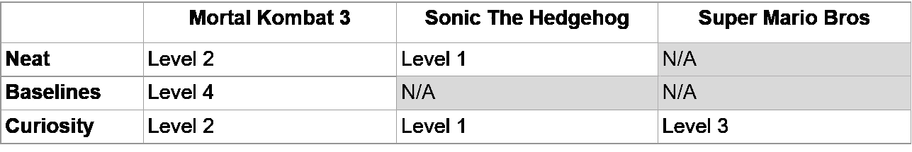

Results for furthest level reached for each of the models on each game

我们在前面的章节中提到了一些我们遇到的挑战，但是在整个项目中，培训时间是我们最大的挑战。这是这个项目的一个瓶颈，即使我们做了预处理工作。

对于这个项目，我们能够使用真人快打 3 作为我们的控制游戏，但我们希望在未来通过包括更多的游戏和更多样化的游戏类型来扩展这一点。我们也想看看这些模型有多通用；换句话说，有没有可能有一个单一的模型可以擅长许多不同的游戏？

虽然不如我们自己玩电子游戏有趣，但我们在整个项目中学习、失败和成功都度过了一段美好的时光。