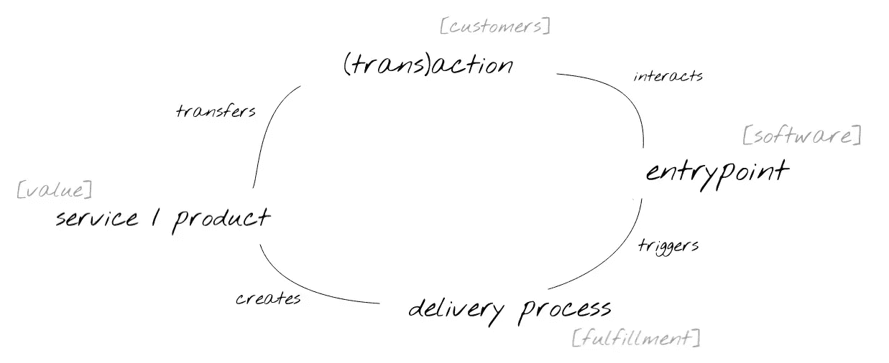

# 英俊的公司主管人工智能图解指南

> 原文：<https://towardsdatascience.com/an-illustrated-guide-to-ai-for-the-handsome-corporate-executive-17f33fd97874?source=collection_archive---------27----------------------->

## 如何将机器学习从概念验证转移到核心组织能力

Shut up Siri, just shut up (Image credit: [North By Northwest](https://film-grab.com/2014/11/25/north-by-northwest/))

如今，许多公司都在机器学习方面取得进展。最近深度学习的进步和可用数据的大规模增加使图像识别和自然语言处理取得了飞跃，这使得 AI*几乎在任何地方都受到了企业的关注。ML 已经超越了人类，使公司能够处理大规模的服务请求，这是 100%人工服务台根本不可能做到的。它在从欺诈检测到医学图像分析，从机器翻译到个性化推荐等领域都有成功的应用。由于相当多的人工智能头条新闻是由 GAFA 公司制造的，所以当你开始探索人工智能在你的业务中的应用时，作为一名高管或服务经理，你很自然地会关注他们。除了遵循这种方法的明显问题——你的公司可能仍然是一个很大程度上的离线努力——还有一些较少讨论的问题我想在这篇文章中解决。

> *AI =应用机器学习

Only 5 percent of artificial intelligence is actually about machines learning (source: [[1]](https://papers.nips.cc/paper/5656-hidden-technical-debt-in-machine-learning-systems))

首先，大型科技报纸标题中宣传的收益混淆了他们成功基础上的巨大事业和多年发展、人员运作、投资和失败项目。当然，这不应该成为你开始探索机器学习应用的障碍，但在建立你的第一个机器学习团队或赞助你的第一个概念证明时，记住这一点可能是有用的——ML 远未成熟，一些项目需要大量的前期投资才能在行业环境中应用。举个例子，如果我要将上面的图表转换到没有适当数据基础设施的 LSE 环境中，这大约相当于 10 个 FTE 工作两年才能接近一个基本的可扩展机器学习平台。所有这些时间和金钱只会为您购买一些基础设施(不包括模型)。一旦你的团队达到这一点，期望他们全职工作于数据管道、变更管理、操作、集成和模型开发。这对伦敦政治经济学院来说是一笔巨大的投资——根据你的抱负、规模和地理位置，在 100 万欧元到 1000 万欧元之间。包括数据基础设施(您的数据湖/护城河/沼泽/排水沟)所需的前期投资，这样一项工作的预计成本可能会很快达到数千万欧元。

We‘re bad enough at forecasting when there is a reference class to base the forecast on (source: [[2](https://www.jstor.org/stable/23607068)]).

奇怪的是，我见过的企业中采用机器学习的最常见方法是盲目飞行(一个明显的例外是 [Ronny Fehling 在空中客车](http://www.icas.org/media/pdf/Workshops/2017/16_fehling/AI%20Cognitive%20Airbus%20ICAS%20public%20-%20Ronny%20Fehling.pdf)对工业化人工智能的愿景；他后来转到了波士顿咨询公司。看起来，围绕人工智能的大肆宣传已经让典型的董事会成员免除了明智的项目管理和长期战略思考的责任。这是一个危险的情况，因为许多这些“人工智能无处不在”的投资直接来自每个人都在投资人工智能的事实，而不是来自可行的商业案例和发布战略。我们都知道，FOMO 就像金融市场一样，充其量也是不可预测的。随着数据被比作石油(剧透——它不是，不同的外部性)，人工智能被比作电力(也不正确，许多日常工作不需要认知能力)，人工智能被比作烹饪(对于从业者)，我想提出一个新的类比，希望让你更好地理解人工智能的采用将在未来五十年内在全球经济中采取的轨迹:飞行。

POC for a business experiment in the bicycle industry, ca 1903 (Image credit: [Wikipedia](https://en.wikipedia.org/wiki/Wright_Flyer#/media/File:Wright_First_Flight_1903Dec17_(full_restore_115).jpg))

尽管目前人们对基于无人机的即时送货兴奋不已(让我无人机送面包圈)，但人们很容易忘记，飞行用了 100 多年才成为真正的商品。即使我们在不久的将来达到这一点，预计商业航空公司在 2019 年产生的 8550 亿美元空中收入的大部分将来自运输人员——这是一种与第一家商业航空公司一样古老的商业模式。同样，当我们看机器学习时，以营业收入和股票价格衡量，对我们 21 世纪世界的主要附加值贡献大体上仍然是付费广告。这回避了一个问题，即我们是否可以期待机器学习的工业应用在未来几年快速发展，超越基于个性化的应用。很多人都在押注物联网(IoT)应用。虽然物联网确实产生了大量数据，但如果没有规模经济和适当的基础设施，该领域中 ML 应用的价值将不会超过其成本。与 POC 不同，工业规模的 ML 系统控制需要质量控制、持续维护和持续改进，如果 ML 提供的改进微不足道，这将是一个沉重的代价。也就是说，我不认为运行智能冰箱的空中交通控制塔的 ML 模拟在经济上是可行的。到目前为止，预测性维护是 ML 广泛采用的消费者领域之外的一个应用。另一方面，消费者领域的 ML 应用已经一次又一次地证明了自己。人机交互从 ML 中受益匪浅。我们正在目睹人工智能通过搜索引擎、智能助手、智能相机和自动驾驶等工具，成为这个星球上绝大多数人类与机器的主要消费者界面。

> 这是一个危险的情况，因为许多这些“人工智能无处不在”的投资直接来自每个人都在投资人工智能的事实，而不是来自可行的商业案例和发布战略。

回到飞行的类比，除了操作飞机的机组人员，飞机还需要地勤人员和足够的基础设施，以确保飞机飞行路线上的人员和货物与经济的其他部分相联系。换句话说，航空公司是由航空业之外更大的价值链和生态系统支撑的。ML 也是如此——它不存在于真空中。负责开发和维护模型的运营团队(数据科学家、数据工程师、机器学习经理、业务分析师等)是企业价值链和由企业应用程序、业务流程、数据基础设施和计算资源组成的更广泛的 IT 生态系统的一部分。虽然对设计和建造机场的人来说显而易见，但这些外部性在机器学习项目中经常被公然忽视。尽管设计良好的机器学习算法肯定不会损害你的成功机会，但如果没有将模型预测正确整合到内部或面向客户的业务流程中——机器学习 UI 和 UX——以及更广泛的价值链和生态系统，你的项目几乎肯定会失败。事实上，在缺乏经验证据的情况下(我知道这一点)，我敢打赌，许多 ML 项目的成功或失败更多地受到公司发起人和利益相关者的影响，而不是 ML 团队本身在项目期间设法产生的任何东西。

A simple cyclical business model (image by author)

这使我想到了第二点。用机器学习创造价值往往是一个组织问题，而不是技术问题。因此，这不是机器学习实践者可以独立于组织的其他部分解决的问题。许多旨在创造商业价值的机器学习项目失败了，因为它们需要业务人员和技术人员之间的合作。这意味着，冒险进入这个勇敢的 21 世纪新数字世界的公司不仅需要采用新的和不熟悉的技术(人工智能)，而且他们还需要从组织分工(和冰山风险管理)转向更灵活的由价值创造而不是业务功能绘制的组织线(见[这篇麦肯锡的文章](https://www.mckinsey.com/business-functions/digital-mckinsey/our-insights/the-platform-play-how-to-operate-like-a-tech-company)对基于平台的组织的介绍)。一旦你成功地完成了这些转变，就可以从你对机器学习的押注(投资)中获得难以置信的回报，比如客户互动的改善、成本效率和总体的惊喜。由于当今公司拥有的数字工具不再需要最直接的人与人之间的互动，任何跨职能团队都可以通过数字界面直接与客户互动，不再需要曾经代表公司的销售、人力资源或服务人员。这个逻辑既适用于主要客户是内部客户的团队(如人力资源或财务)，也适用于拥有外部客户的团队(销售、服务交付等)。).

Image credit: [North by Northwest](https://film-grab.com/2014/11/25/north-by-northwest/)

重申一下，人工智能需要嵌入到业务流程中，才能创造价值。因此，这意味着接触、改变和增强在公司 IT 环境中实现的确定性业务逻辑。坦率地说，这将导致大量的工作，以及在这些工作之上更多意想不到的工作。此外，除了对现有业务流程进行重新设计之外，人工智能驱动的运营产品还需要一个机器学习平台，以促进嵌入公司产品、业务和运营中的大量预测流程[的快速开发、部署和监控。这意味着端到端的数据可追溯性、用于近实时流程的低延迟数据流，以及跨职能团队对贯穿整个组织的所有数据流的数据访问。从这个意义上说，机器学习应用与之前的自动化浪潮有很大不同。自动化认知和概率能力的引入带来了对数据驱动过程的质量控制的需求的增加。不幸的是，这需要业务利益相关者和技术专家之间更多更好的合作。](https://a16z.com/2018/12/03/when-ai-is-the-product-the-rise-of-ai-based-consumer-apps/)

The machine learning lifecycle (image by author)

奇怪的是，公司通常会将 ML 项目成败的部分留给数据科学家。无论这位数据科学家是外部承包商还是内部员工，他或她通常都不具备处理公司政治的能力，并且通常缺乏对现有业务流程进行更改的公司授权。这导致了那些可怕的无法交付任何商业价值的 MLPOCs。受过大学和研究生教育的数据科学家应用他们在学术界学到的工作流来解决业务问题。有人在某个地方找到了一台服务器，在没有监控的情况下安排了模型，而数据科学家则继续进行下一个 MLPOC。大家都很开心(我们做了 AI！)，而且什么都没有真正改变。这是一个非常黑白分明的表示，但它凸显了人工智能产业化的一个主要挑战。如果没有适当的设计和项目执行，机器学习项目就有陷入无附加值的 ML 概念证明(MLPOC)的风险，在这种情况下，高管们在 FOMO 创作 ML 项目，数据科学家应用他们在研究生院学到的知识，没有人愿意负责确保项目产生真正的 ROMLIs(机器学习投资回报)。

> 从这个意义上说，机器学习应用与之前的自动化浪潮有很大不同。自动化认知和概率能力的引入带来了对数据驱动过程的质量控制的需求的增加。

Life’s an adventure (image by author)

简而言之，今天被资助的机器学习努力的随意性是[导致灾难的原因](https://hackernoon.com/why-businesses-fail-at-machine-learning-fbff41c4d5db)。最重要的是，并不是你组织中的每个人都是那种[无望的乐观主义者](https://a16z.com/2019/02/22/humanity-ai-better-together/)，他们认为人工智能有潜力通过自动化日常认知任务来改善世界范围内的工作条件，从而将我们人类解放出来从事更有趣的工作。有很多人害怕自动化会接管他们的工作，害怕失去决策权，或者只是害怕改变，这导致了旷日持久的政治阴影和战壕战争，这些都减缓了机器接管世界的速度(大胆的悲伤表情符号)。人工智能从业者和消费者的长期风险是，在一系列过于慷慨的承诺和令人失望的结果之后，企业将在未来几十年继续照常运营。这是一种耻辱，因为这意味着你的客户将被迫继续生活在 20 世纪 80 年代的科技时代。总而言之，任何机器学习项目要想成功，都需要具备几个前提条件:

对于 ML 团队来说，

*   机器学习模型可以利用的数据基础设施。
*   用于训练机器学习模型的计算基础设施。
*   将模型预测整合到应用中的生产途径。
*   监控和 AB 测试基础设施，以衡量模型预测对业务和分析 KPI 的影响。

在商业方面，

*   识别业务流程，在这些流程中，可以应用足够多的 ROMLI 来保证所做的工作:高容量、低延迟、高成本、常规认知、危险等。业务流程。
*   围绕可以通过机器学习增强或促进的业务流程，协调跨职能利益相关方。
*   开发机器学习模型可以操作的硬约束——认知界限。
*   监控业务 KPI 并向 ML 团队提供(最好是基于统计的)反馈。

从上面的要点可以看出，ML 团队在这方面的工作很简单。困难的部分是调整和改变你的组织，以允许你充分利用机器学习技术进步提供的机会。这是今天大多数 ML 项目继续搁浅的地方。由于 ML 团队或其直接赞助者通常没有跨部门业务流程的授权，如果你想认真对待 ML，你需要亲自监督和指导这些项目，或者任命具有足够广泛授权的人来发现和促进现有业务流程的 ML 支持的变化，或者开发基于 ML 能力的新流程。

免责声明:我是一名自由职业的机器学习工程师，因此机器学习在组织中成功落地并为我的客户提供最大的 ROMLI(机器学习投资回报)符合我的最佳利益。吃块饼干吧。

截图来自阿尔弗雷德·希区柯克 1959 年的《西北偏北》。