# 泊松回归模型图解指南

> 原文：<https://towardsdatascience.com/an-illustrated-guide-to-the-poisson-regression-model-50cccba15958?source=collection_archive---------0----------------------->


## 和使用 Python 的泊松回归教程

在本文中，我们将讨论以下主题:

1.  **基于计数的数据的特征:**计数数据集是世界上最常见的一些数据。我们将看看是什么使基于计数的数据不同。
2.  **预测数量的回归模型:**我们来详细看看**泊松回归模型**。**负二项式(NB)回归模型**是另一种常用的基于计数的数据模型。我将在以后的文章中讨论这个问题。
3.  **关于泊松回归的 Python 教程:**我将带你一步步学习如何使用 **statsmodels** 的 **GLM 类**在 Python 中创建泊松回归模型，以及如何在真实世界数据集上训练它。

## 在我们开始之前，有几个要点…

*   对于关于泊松回归的 **Python 教程**，**向下滚动**到本文的最后几节。
*   Python 代码的 **Github 要点**是这里的[](https://gist.github.com/sachinsdate/d5535d5489178e6271f4c0c7a444da1e)**。**
*   **本文中使用的一个**骑自行车者计数的真实世界数据集**是这里的[](https://gist.github.com/sachinsdate/c17931a3f000492c1c42cf78bf4ce9fe)**。****
*   ****关于**随机变量、泊松过程和模拟泊松过程的 Python 程序**，点击这里:
    [*泊松过程:你需要知道的一切*](/the-poisson-process-everything-you-need-to-know-322aa0ab9e9a)****

****现在让我们开始吧！****

## ****什么是基于计数的数据？****

****基于计数的数据包含以特定速率发生的事件。发生率可能会随着时间的推移或从一次观察到下一次观察而变化。以下是一些基于计数的数据示例:****

****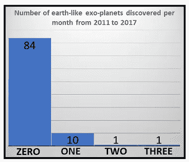****

****Data source: Wikipedia: [potentially habitable exoplanets](https://en.wikipedia.org/wiki/List_of_potentially_habitable_exoplanets) (Image by [Author](https://sachin-date.medium.com/))****

*   ****每小时通过十字路口的车辆数量，****
*   ****每月去诊所看病的人数，****
*   ****每月发现的类地行星数量。****

******计数数据集具有以下特征:******

*   ******整数数据:**数据由非负整数组成:[0… ∞]普通最小二乘回归等回归技术可能不适合对这类数据建模，因为 OLSR 最适合处理实数，如-656.0、-0.00000345、13786.1 等。****
*   ******偏斜分布:**数据可能包含大量的数据点，但只有几个值，从而使频率分布相当偏斜。例如，参见上面的直方图。****
*   ******稀疏性:**数据可能反映了伽马射线爆发等罕见事件的发生，从而使数据变得稀疏。****
*   ******发生率:**为了建立模型，可以假设有某个事件发生率 **λ** 驱动这种数据的产生。事件率可能随时间漂移。****

## ****真实世界的计数数据集****

****下表包含了骑自行车的人在纽约市各种桥梁上行驶的次数。从 2017 年 4 月 1 日到 2017 年 10 月 31 日每天测量计数。****

****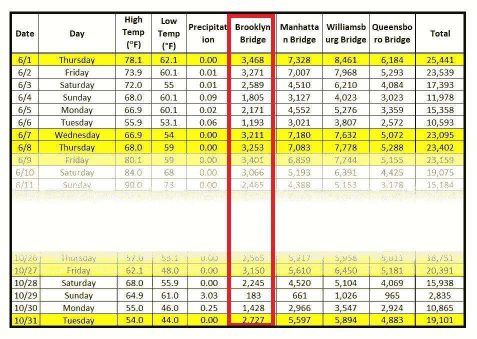****

****Source: [Bicycle Counts for East River Bridges](https://data.cityofnewyork.us/Transportation/Bicycle-Counts-for-East-River-Bridges/gua4-p9wg) (Data source: NYC OpenData) (Image by [Author](https://sachin-date.medium.com/))****

****这是布鲁克林大桥上骑自行车的人数的时间顺序图:****

********

****Background image: [The Brooklyn bridge as seen from Manhattan island](https://en.wikipedia.org/wiki/Brooklyn_Bridge#/media/File:Brooklyn_Bridge_Postdlf.jpg)****

## ****计数的回归模型****

******泊松回归模型**和**负二项式回归模型**是开发计数回归模型的两种流行技术。其他可能性有[有序 Logit](https://en.wikipedia.org/wiki/Ordered_logit) 、[有序 Probit](https://en.wikipedia.org/wiki/Ordered_probit) 和[非线性最小二乘](https://en.wikipedia.org/wiki/Non-linear_least_squares)模型。****

## ******回归策略******

****从泊松回归模型开始，并将其用作更复杂或约束更少的模型的“控制”是一个很好的实践。在他们的《计数数据的回归分析》一书中，卡梅隆和特里维迪说:****

> ****"合理的做法是估计泊松和负二项模型."****

****在本文中，我们将使用泊松回归模型来回归布鲁克林大桥上观察到的骑自行车的人数。****

## ****介绍泊松模型****

****泊松分布具有如下的概率函数。****

****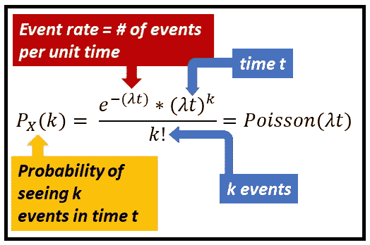****

****Probability of seeing ***k*** events in time **t**, given **λ** events occurring per unit time (Image by [Author](https://sachin-date.medium.com/))****

****泊松分布的期望值(平均值)为 ***λ。*** 因此，在没有其他信息的情况下，人们应该期望在任何单位时间间隔内看到 ***λ*** 事件，例如 1 小时、1 天等。对于任何区间 ***t*** ，人们都会期望看到 ***λt*** 事件 ***。*******

## ****一个泊松回归模式 *l 为* ***常数λ*******

****如果事件速率***【λ】****是恒定的，则可以简单地使用修改的均值模型来预测事件的未来计数。在这种情况下，可以将计数的所有预测值设置为该常量值 ***λ*** 。*****

*****下图说明了常量 ***λ*** 的场景:*****

*****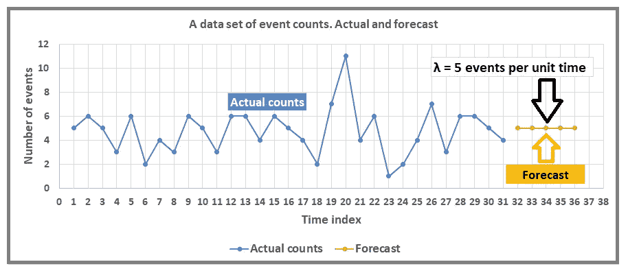*****

*****Actual and predicted counts for a constant rate model (Image by [Author](https://sachin-date.medium.com/))*****

*****以下 Python 代码用于使用泊松过程生成蓝点(过去时间步的实际计数)，其中 ***λ=5*** 。橙色点(预测)都被设置为相同的值 **5。*******

*****A Python program to generate event counts using a Poisson process*****

## *******非常数λ** 的泊松回归模型*****

*****现在我们到了有趣的部分。让我们检查一个更常见的情况，其中 **λ** 可以从一个观察值变化到下一个观察值。在这种情况下，我们假设 **λ** 的值受**解释变量**、**的向量影响，这些变量也被称为预测变量、回归变量**或**回归变量**。我们称这个回归变量矩阵为 **X** 。*****

> *****回归模型的工作是将观察到的计数 **y** 拟合到回归值矩阵 **X** 。*****

*****在纽约市自行车统计数据集中，回归变量是*日期*、*星期几*、*高温*、*低温*和*降水量*。我们还可以引入额外的回归变量，如从*日期*派生的*月*日和*月*日，并且我们可以自由删除现有的回归变量，如*日期*。*****

*****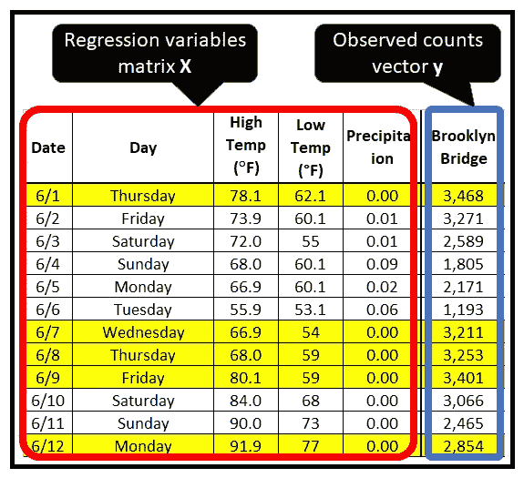*****

*****(Image by [Author](https://sachin-date.medium.com/))*****

********y*** 到 **X** 的拟合通过固定回归系数 **β的向量值来实现。*******

*****在泊松回归模型中，事件计数 ***y*** 被假设为泊松分布，这意味着观察到 ***y*** 的概率是事件速率向量 **λ的函数。*******

> *****泊松回归模型的工作是通过一个链接函数将观察到的计数 **y** 拟合到回归矩阵 **X** ，该链接函数将速率向量 **λ** 表示为 1)回归系数 **β** 和 2)回归矩阵**X**的函数*****

*****下图说明了泊松回归模型的结构。*****

*****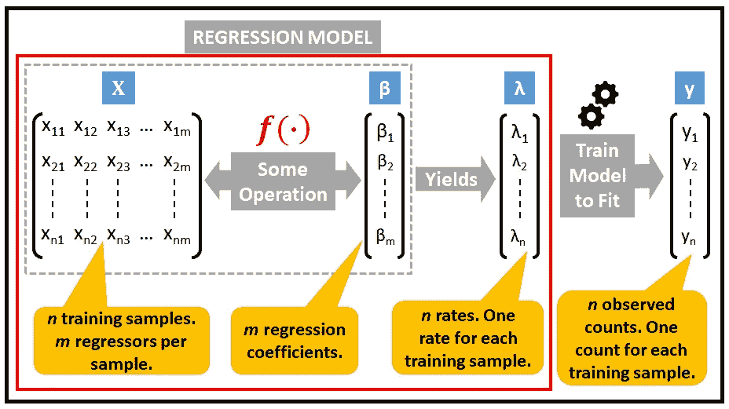*****

*******Scan from left to right**: The structure of the Poisson regression model (Image by [Author](https://sachin-date.medium.com/))*****

*****有什么好的链接功能 ***f*** (。)连接 **λ** 和 **X** ？事实证明，以下指数链接函数非常有效:*****

*****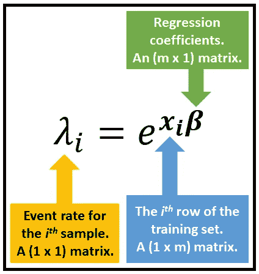*****

*****The exponential link function of the Poisson regression model (Image by [Author](https://sachin-date.medium.com/))*****

*****即使当回归变量 **X** 或回归系数 **β** 为负值时，该链接函数也会保持 **λ** 为非负值。这是基于计数的数据的要求。*****

*****一般来说，我们有:*****

*****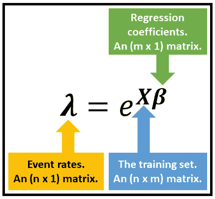*****

*****The exponential link function of the Poisson regression model (Image by [Author](https://sachin-date.medium.com/))*****

## *****泊松回归模型的形式规范*****

*****基于计数的数据的泊松回归模型的完整规格如下所示:*****

*****对于回归变量 ***x_i*** 行对应的 *y_i* 表示的数据集中第*个*个观察值，观察计数 *y_i* 的概率为泊松分布，其分布如下:*****

*****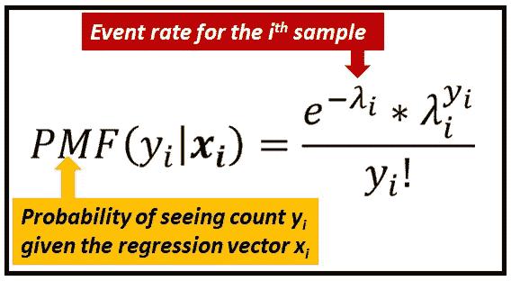*****

*****Probability of observing count y_i given **x_i** *(as per the Poisson PMF formula)* (Image by [Author](https://sachin-date.medium.com/))*****

*****其中第 I 个样本的平均速率 *λ_i* 由前面所示的指数链接函数给出。我们在这里重现它:*****

*****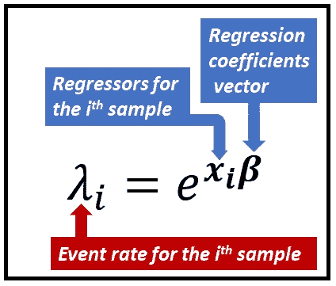*****

*****The exponential link function of the Poisson regression model (Image by [Author](https://sachin-date.medium.com/))*****

*****一旦模型在数据集上完全训练完毕，回归系数*已知，模型就可以进行预测了。为了预测与已经观察到的回归量 ***x_p*** 的输入行相对应的事件计数 *y_p* ，使用以下公式:******

******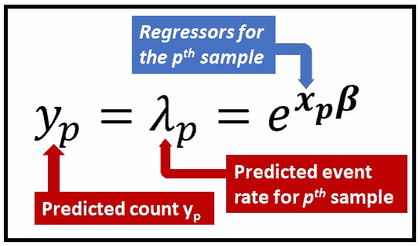******

******The prediction equation for the Poisson regression model (Image by [Author](https://sachin-date.medium.com/))******

******所有这些都依赖于我们成功训练模型的能力，这样回归系数向量***【β】***就是已知的 ***。*********

******让我们看看这种培训是如何进行的。******

## ******定型泊松回归模型******

******训练泊松回归模型包括寻找回归系数 **β** 的值，这将使观察计数的向量 **y** 最有可能。******

******识别系数 **β** 的技术称为 **M** 最大值 **L** 似然比 **E** 估计(MLE)。******

******让我们来熟悉一下 **MLE 的技巧。********

## ******理解最大似然估计******

******我将使用自行车计数数据集来说明 **MLE** 技术。看看这个数据集的前几行:******

******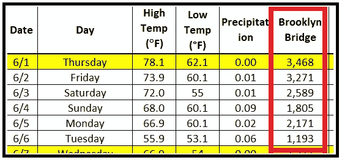******

******Daily counts of bicyclists on the Brooklyn bridge (Image by [Author](https://sachin-date.medium.com/))******

******我们的假设是，红框中显示的骑自行车的人数来自泊松过程。因此我们可以说它们的发生概率是由泊松 PMF 给出的。以下是前 4 次发生的概率:******

******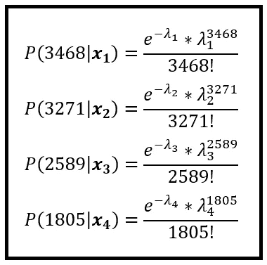******

******Probabilities of observing the bicyclist counts for the first few occurrences given corresponding regression vectors (Image by [Author](https://sachin-date.medium.com/))******

******我们可以类似地计算在训练集中观察到的所有 ***n*** 计数的概率。******

******注意，在上述公式*中，λ_1、λ_2、λ_3、…、λ_n* 是使用如下链接函数计算的:******

******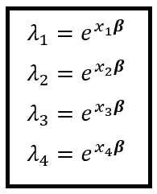******

******The event rates corresponding to the counts for the first few days (Image by [Author](https://sachin-date.medium.com/))******

******其中***x1，x2，x3，x4***为回归矩阵的前 4 行。******

******训练集中整组 *n* 个计数 *y_1，y_2，…，y_n* 出现的概率就是单个计数出现的联合概率。******

******计数 ***y*** 为泊松分布， *y_1，y_2，…，y_n* 为独立随机变量，对应给出 ***x_1，x_2，…，x_n*** 。因此， *y_1，y_2，…，y_n* 出现的联合概率可以表示为单个概率的简单乘积。下面是整个训练集的联合概率:******

******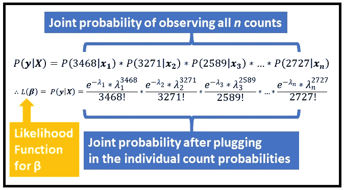******

******The **likelihood function** L(***β)*** *expressed as a joint probability mass function* (Image by [Author](https://sachin-date.medium.com/))******

******让我们回忆一下， *λ_1，λ_2，λ_3，…，λ_n* 通过回归系数 ***β链接到回归向量 ***x_1，x_2，x_3，…，x_n* 。***********

******β*** 的什么值会使给定的一组观察计数 ***y*** 最有可能？上式所示的联合概率达到最大值的是 ***β*** 的值。换句话说，就是联合概率函数 w.r.t. ***β*** 的变化率为 **0 的 ***β*** 的值。**换一种说法，就是对联合概率方程 w.r.t. ***β*** 进行微分并将这个微分方程设为 **0 所得到的方程的解。*****

***联合概率方程的**对数**比原方程更容易微分。对数方程的解产生相同的最优值*。****

****这个对数方程被称为**对数似然函数**。对于泊松回归，对数似然函数由以下等式给出:****

****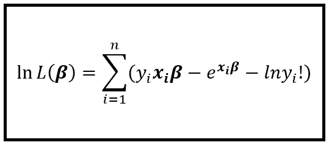****

****log-likelihood function for the Poisson regression model (Image by [Author](https://sachin-date.medium.com/))****

****将 *λ_i* 替换为*exp*(**x _ I******β)***)后，取前面所示的联合概率函数两边的自然对数，即可得到上述等式。****

****如前所述，我们对这个对数似然方程 w.r.t. ***β*** 进行微分，并将其设置为零。这个操作给出了下面的等式:****

****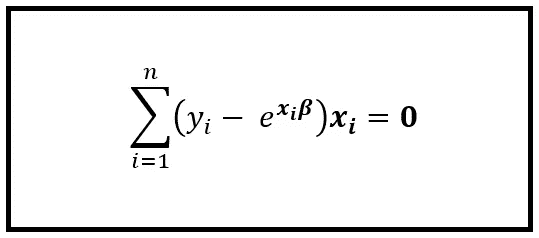****

****The Poisson MLE for ***β*** *is the solution to this equation* (Image by [Author](https://sachin-date.medium.com/))****

****解回归系数*的这个方程将产生 ***β的**最大似然估计** **(MLE)** 。********

****为了求解上述方程，可以使用迭代方法，例如[迭代加权最小二乘法(IRLS)](https://en.wikipedia.org/wiki/Iteratively_reweighted_least_squares) 。实际上，人们不能手工解这个方程。相反，您可以使用统计软件，如 Python **statsmodels** 包，它会在对数据集训练泊松回归模型时为您完成所有计算。****

## ****执行泊松回归的步骤摘要****

****总之，下面是对基于计数的数据集执行泊松回归的步骤:****

1.  ****首先，确保您的数据集包含计数。一种方法是，它只包含非负的整数值，这些值表示某个时间间隔内某个事件发生的次数。在骑自行车的人数数据集中，它是每天骑自行车穿过布鲁克林大桥的人数。****
2.  ****找出(或猜测)会影响观察计数的回归变量。在自行车计数数据集中，回归变量为*星期几、最低温度、最高温度、降水量*等。****
3.  ****创建一个你的回归模型将要训练的训练数据集，和一个应该放在一边的测试数据集。*不*根据测试数据训练模型。****
4.  ****使用合适的统计软件，如 **Python statsmodels 包**，对训练数据集配置和拟合泊松回归模型。****
5.  ****通过在测试数据集上运行模型来测试模型的性能，以便生成预测的计数。将它们与测试数据集中的实际计数进行比较。****
6.  ****使用拟合优度来确定您的模型在定型数据集上的定型程度。****

## ****如何在 Python 中进行泊松回归****

****让我们把所学的东西付诸实践。Python **statmodels** 包对泊松回归有很好的支持。****

****让我们使用布鲁克林大桥自行车计数数据集。您可以从 [**这里的**](https://gist.github.com/sachinsdate/c17931a3f000492c1c42cf78bf4ce9fe) **中提取数据集。******

****我们的目标是为观察到的骑自行车的人数建立一个泊松回归模型 ***y.*** 我们将使用训练好的模型来预测布鲁克林大桥上的骑自行车的人的每日人数，这是模型在训练期间没有看到的。****

****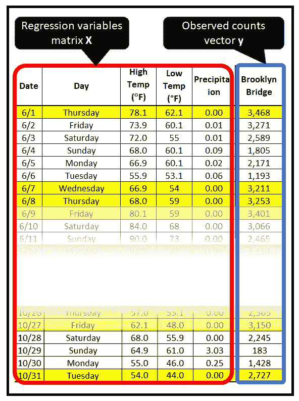****

****Daily count of bicyclists on the Brooklyn bridge (Image by [Author](https://sachin-date.medium.com/))****

****我们将从导入所有需要的包开始。****

```
**import pandas as pd
from patsy import dmatrices
import numpy as np
import statsmodels.api as sm
import matplotlib.pyplot as plt**
```

****为计数数据集创建一个熊猫数据框架。****

```
**df = pd.read_csv('nyc_bb_bicyclist_counts.csv', header=0, infer_datetime_format=True, parse_dates=[0], index_col=[0])**
```

****我们将向矩阵 **X** 添加一些派生的回归变量。****

```
**ds = df.index.to_series()df['MONTH'] = ds.dt.monthdf['DAY_OF_WEEK'] = ds.dt.dayofweekdf['DAY'] = ds.dt.day**
```

****我们将不使用*日期*变量作为回归变量，因为它包含一个绝对日期值，但是我们不需要做任何特殊的事情来删除*日期*，因为它已经作为熊猫数据帧的索引被使用。因此它在 **X** 矩阵中对我们不可用。****

****让我们创建训练和测试数据集。****

```
**mask = np.random.rand(len(df)) < 0.8df_train = df[mask]df_test = df[~mask]print('Training data set length='+str(len(df_train)))print('Testing data set length='+str(len(df_test)))**
```

****用 patsy 符号设置回归表达式。我们告诉 patsy，BB_COUNT 是我们的因变量，它取决于回归变量:DAY、DAY_OF_WEEK、MONTH、HIGH_T、LOW_T 和 PRECIP。****

```
**expr = """BB_COUNT ~ DAY  + DAY_OF_WEEK + MONTH + HIGH_T + LOW_T + PRECIP"""**
```

****为训练和测试数据集设置 **X** 和 **y** 矩阵。patsy 让这变得非常简单。****

```
**y_train, X_train = dmatrices(expr, df_train, return_type='dataframe')y_test, X_test = dmatrices(expr, df_test, return_type='dataframe')**
```

****使用 statsmodels GLM 类，对定型数据集定型泊松回归模型。****

```
**poisson_training_results = sm.GLM(y_train, X_train, family=sm.families.Poisson()).fit()**
```

****打印培训总结。****

```
**print(poisson_training_results.summary())**
```

****这会打印出以下内容:****

****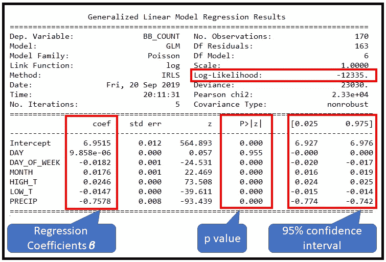****

****Training summary for the Poisson regression model (Image by [Author](https://sachin-date.medium.com/))****

****那么我们的模型表现如何呢？让我们对测试数据集做一些**预测**。****

```
**poisson_predictions = poisson_training_results.get_prediction(X_test)#.summary_frame() returns a pandas DataFrame
predictions_summary_frame = poisson_predictions.summary_frame()print(predictions_summary_frame)**
```

****以下是输出的前几行:****

****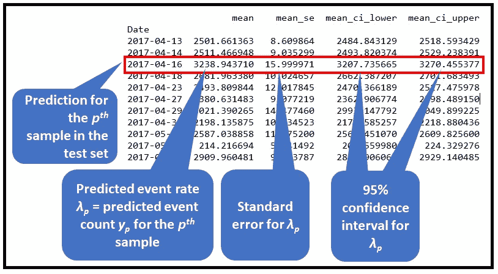****

****First few rows of output from **poisson_predictions.summary_frame()** (Image by [Author](https://sachin-date.medium.com/))****

****让我们绘制测试数据的预测计数与实际计数的对比图。****

```
**predicted_counts=predictions_summary_frame['mean']actual_counts = y_test['BB_COUNT']fig = plt.figure()fig.suptitle('Predicted versus actual bicyclist counts on the Brooklyn bridge')predicted, = plt.plot(X_test.index, predicted_counts, 'go-', label='Predicted counts')actual, = plt.plot(X_test.index, actual_counts, 'ro-', label='Actual counts')plt.legend(handles=[predicted, actual])plt.show()**
```

****以下是输出结果:****

****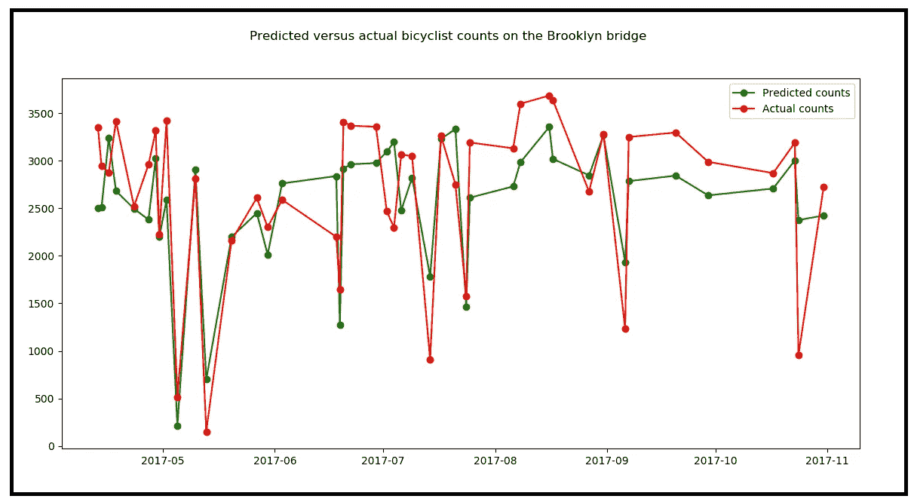****

****Predicted versus actual bicyclist counts on the Brooklyn bridge (Image by [Author](https://sachin-date.medium.com/))****

****该模型似乎或多或少地跟踪实际计数的趋势，尽管**在许多情况下，其预测值与实际值相差甚远**。****

****让我们绘制实际计数与预测计数的对比图。****

```
**plt.clf()fig = plt.figure()fig.suptitle('Scatter plot of Actual versus Predicted counts')plt.scatter(x=predicted_counts, y=actual_counts, marker='.')plt.xlabel('Predicted counts')plt.ylabel('Actual counts')plt.show()**
```

****剧情是这样的:****

****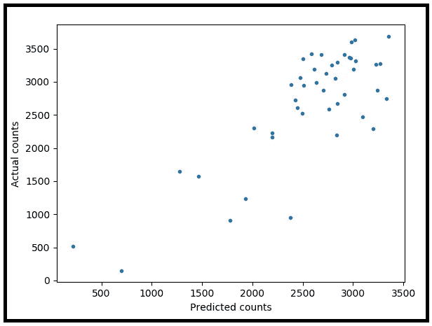****

****Scatter plot of Actual versus Predicted counts (Image by [Author](https://sachin-date.medium.com/))****

******这里是使用 Python 进行泊松回归的完整源代码:******

## ****泊松回归模型的拟合优度****

****记住泊松分布的期望值(即均值)和方差都是 *λ。大多数真实世界的数据都违反了这个相当严格的条件。*****

> ****泊松回归模型失败的一个常见原因是数据不满足泊松分布强加的*均值=方差*标准。****

****[stats models*glm result*s](https://www.statsmodels.org/devel/generated/statsmodels.genmod.generalized_linear_model.GLMResults.html)类上的 *summary()* 方法显示了一些有用的拟合优度统计数据，可帮助您评估泊松回归模型是否能够成功拟合训练数据。让我们看看他们的价值观:****

****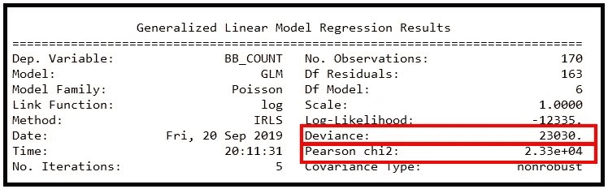****

****Training summary for the Poisson regression model (Image by [Author](https://sachin-date.medium.com/))****

****偏差和皮尔逊卡方的报告值非常大。给定这些值，很好的拟合实际上是不可能的。为了在某个置信水平(比如 95% (p=0.05))下定量确定拟合优度，我们在 *χ2* 表中查找 p=0.05 和残差自由度=163 的值。(测向残差=无观测值*减去*测向模型】。我们将该卡方值与观察到的统计数据进行比较，在这种情况下，是 GLMResults 中报告的偏差或皮尔逊卡方值。我们发现，在 p=0.05 且 DF 残差= 163 时，来自[标准卡方表](https://www.medcalc.org/manual/chi-square-table.php)的卡方值为 193.791，远小于报告的统计值 23030 和 23300。因此，根据该测试，尽管泊松回归模型显示出对测试数据集的‘好的’*视觉*拟合，但它对训练数据的拟合相当差。****

## ****结论和下一步措施****

****对于基于计数的数据，泊松回归模型是一个有用的起点。然后可以将其性能与其他基于计数的流行模型进行比较，例如:****

1.  ****一个 [**零膨胀泊松模型**](/an-illustrated-guide-to-the-zero-inflated-poisson-model-b22833343057) 如果您怀疑您的数据包含过多的零，即比常规泊松模型所能解释的多得多的零。****
2.  ****[**负二项回归模型**](/negative-binomial-regression-f99031bb25b4) 对数据不做*均值=方差*假设。****
3.  ****[**广义泊松回归模型**](/generalized-poisson-regression-for-real-world-datasets-d1ff32607d79) 同样适用于过度分散或分散不足的数据集。****

****快乐造型！****

*****感谢阅读！我写关于数据科学的主题，重点是回归和时间序列分析。*****

*****如果你喜欢这篇文章，请关注我的*[***Sachin Date***](https://timeseriesreasoning.medium.com)*获取关于回归和时间序列分析主题的提示、操作方法和编程建议。*****