# 费希尔线性判别式的说明性介绍

> 原文：<https://towardsdatascience.com/an-illustrative-introduction-to-fishers-linear-discriminant-9484efee15ac?source=collection_archive---------7----------------------->

为了处理两个或更多类别的分类问题，大多数机器学习(ML)算法以相同的方式工作。

通常，他们对输入数据应用某种转换，结果是将原始输入维度减少到一个较小的数字。目标是将数据投射到一个新的空间。然后，一旦投影，该算法试图通过找到一个线性分离来分类这些点。

对于输入维数较小的问题，任务稍微容易一些。以下面的数据集为例。

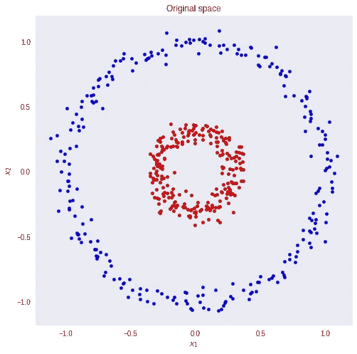

假设我们要对红蓝圈进行正确的分类。

很明显，用简单的线性模型我们不会得到好的结果。没有将输入映射到其正确类别的输入和权重的线性组合。但是，如果我们可以转换数据，这样我们就可以画一条线来区分这两个类，会怎么样呢？

如果我们对两个输入特征向量求平方，就会发生这种情况。现在，一个线性模型将很容易对蓝点和红点进行分类。

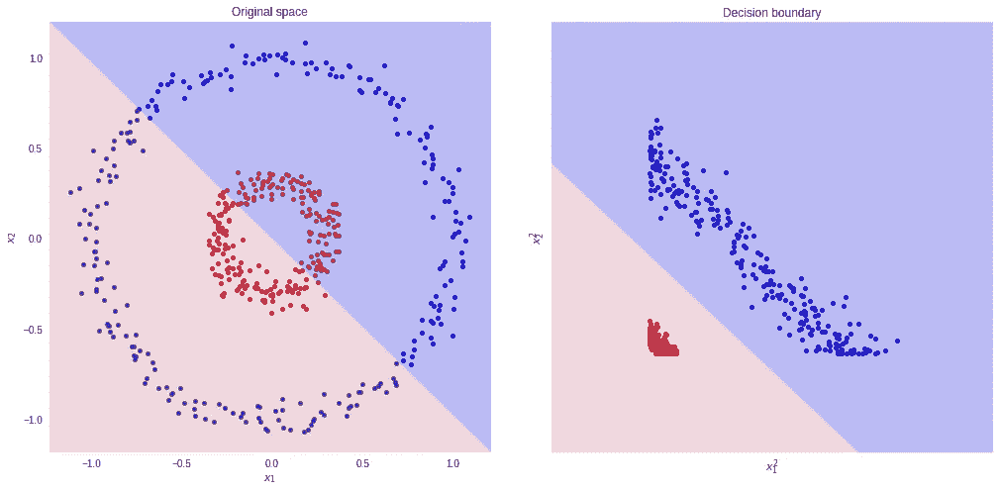

然而，有时我们不知道我们应该使用哪种转换。实际上，找到最佳表示法并不是一个简单的问题。我们可以对数据进行多种转换。同样，它们中的每一个都可能产生不同的分类器(就性能而言)。

这个问题的一个解决方案是学习正确的转换。这被称为**表示学习**，这正是深度学习算法所做的。

神奇的是，我们不需要“猜测”哪种转换会产生数据的最佳表示。算法会解决的。

但是，请记住，无论是表示学习还是手工转换，模式都是相同的。我们需要以某种方式改变数据，以便它可以很容易地分离。

让我们退一步考虑一个更简单的问题。

我们将探索**费希尔的线性判别式** (FLD)如何设法将多维数据分类到多个类别。但是在我们开始之前，请随意打开这个 [Colab 笔记本](https://github.com/sthalles/fishers-linear-discriminant/blob/master/Fishers_Multiclass.ipynb)并跟随。

# 费希尔线性判别式

看待分类问题的一种方式是通过降维的镜头。

首先，考虑两类分类问题的情况( **K=2** )。蓝色和红色点在 **R** 。一般来说，我们可以取任意一个 D 维输入向量，并将其向下投影到 D '维。这里， **D** 表示原始输入尺寸，而**D’**是投影空间尺寸。在整篇文章中，认为**D’**小于 **D** 。

在投影到一维(数轴)的情况下，即**D’= 1**，我们可以选取一个阈值 **t** 在新的空间中进行分类。给定一个输入向量 **x** :

*   如果预测值 **y > = t** 则 **x** 属于 C1 类(类 1)。
*   否则，它被归类为 C2(2 类)。

注意向量 **y** (预测)等于输入 **x** 和权重**w→y**=**w**ᵀ**x**的线性组合

以下面的数据集为例。我们想把原来的数据维数从 **D=2** 减少到 **D'=1** 。换句话说，我们需要一个将二维向量映射到一维向量的变换 t—t(**v**)=ℝ→ℝ。

首先，让我们计算两个类的平均向量 **m1** 和 **m2** 。

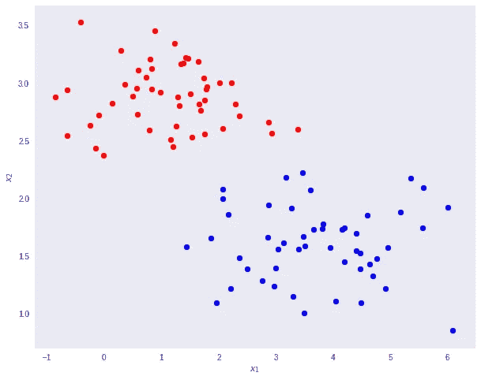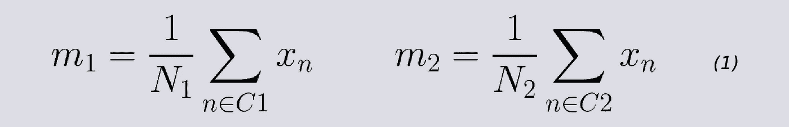

注意， **N1** 和 **N2** 分别表示 C1 和 C2 班级的分数。现在，考虑使用类均值作为分离的度量。换句话说，我们希望将数据投影到加入 2 类平均值的向量 **W** 上。

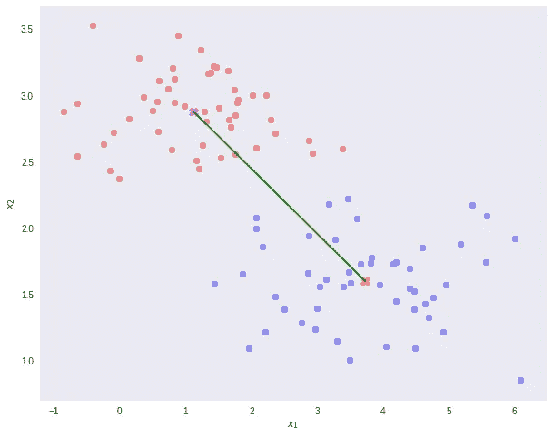

值得注意的是，任何一种向更小维度的投影都可能会丢失一些信息。在这个场景中，请注意，这两个类在它们的原始空间中是明显可分的(通过一条线)。

但是，在重新投影后，数据会出现某种类别重叠，如图上的黄色椭圆和下面的直方图所示。

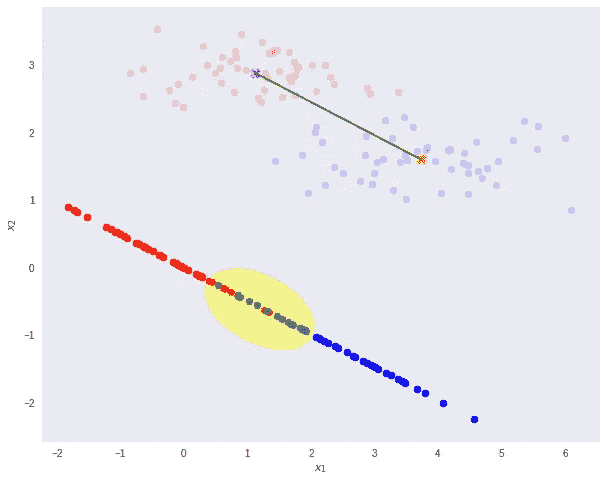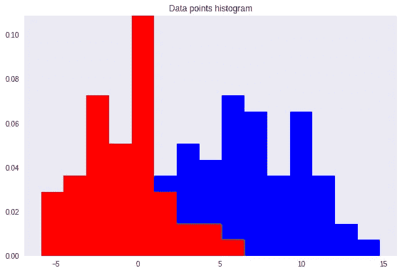

这就是费雪线性判别式发挥作用的地方。

Fisher 提出的想法是最大化一个函数，该函数将在投影的类均值之间给出一个大的分离，同时在每个类内给出一个小的方差，从而最小化类重叠。

换句话说，FLD 选择了最大化类别分离的投影。为此，它最大化类间方差与类内方差之比。

简而言之，为了将数据投影到一个更小的维度并避免类重叠，FLD 维护了两个属性。

*   数据集类之间的巨大差异。
*   每个数据集类中的微小差异。

请注意，较大的类间方差意味着预计的类平均值应尽可能远离。相反，小的类内方差具有保持投影数据点彼此更接近的效果。

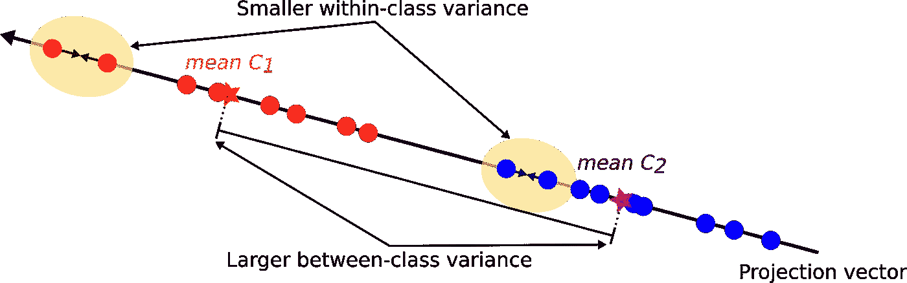

为了找到具有以下属性的投影，FLD 用以下标准学习权重向量 **W** 。

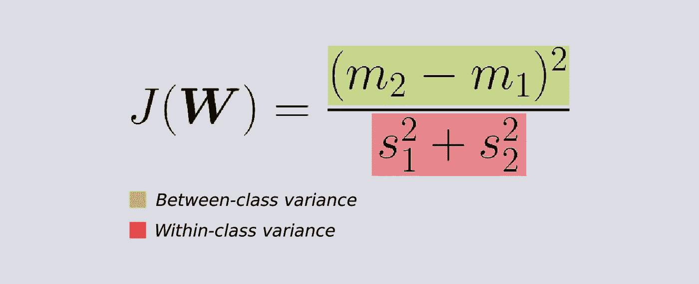

如果我们替换等式(1)和(2)给出的平均向量 **m1** 和 **m2** 以及方差 **s** ，我们得到等式(3)。如果我们对(3)关于 **W** 求导(经过一些简化)，我们得到 **W** 的学习方程(方程 4)。

即 **W** (我们期望的变换)正比于**类内协方差**矩阵的逆乘以类均值的差。

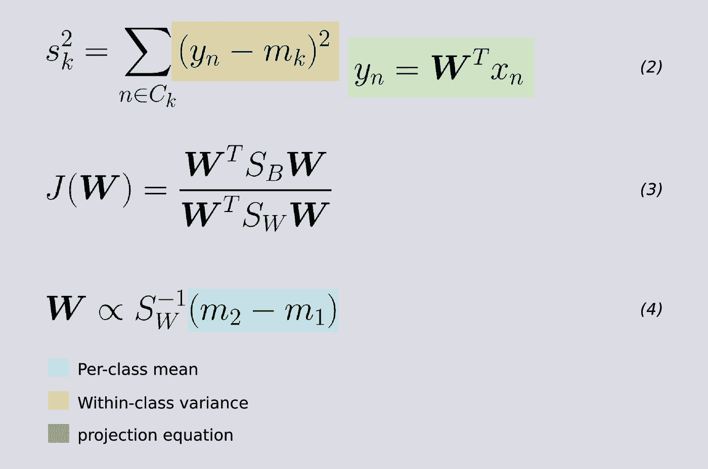

正如预期的那样，结果允许用简单的阈值进行完美的分类分离。

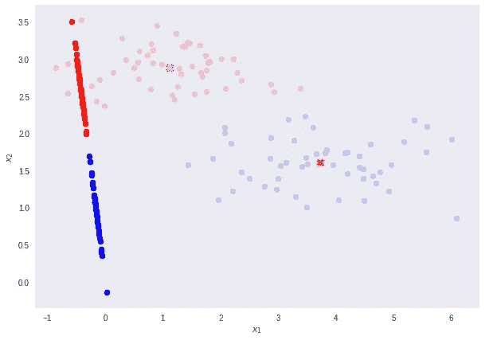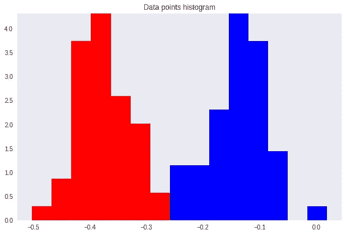

# 多类 Fisher 线性判别式

我们可以将 FLD 推广到超过 K 个类别的情况。这里，我们需要类别内和类别间协方差矩阵**和**的推广形式。****

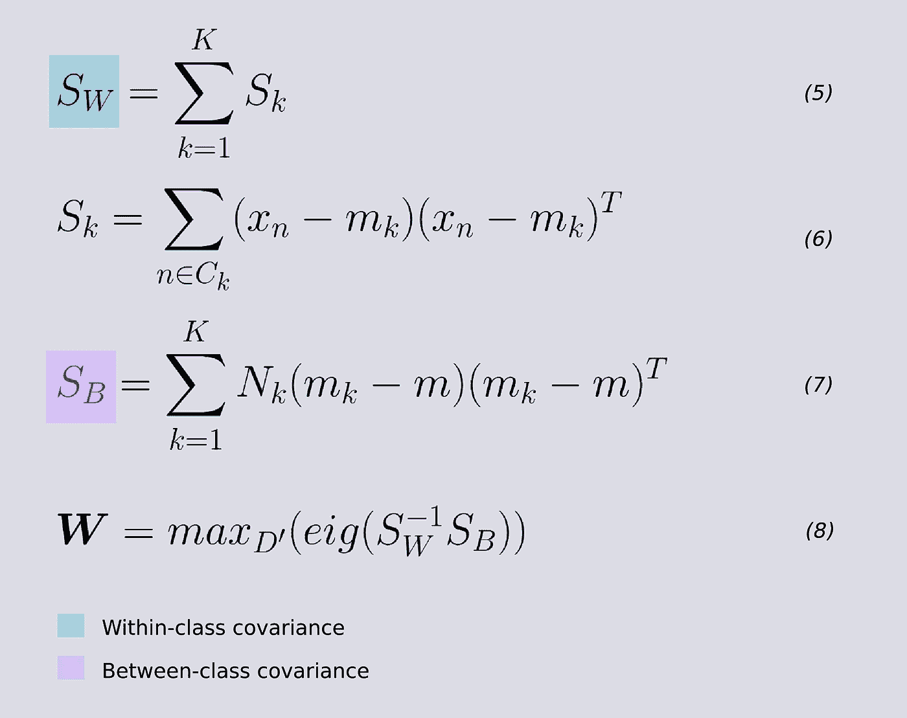

对于类内协方差矩阵 **SW** ，对于每个类，取集中输入值与其转置值之间的矩阵乘法之和。等式 5 和 6。

为了估计类间协方差 **SB** ，对于每个类 **k=1，2，3，…，K** ，取局部类均值 **mk** 和全局类均值**m**的**外积**，然后乘以类 **k** 中记录的数量**—等式 7。**

**FLD 准则的最大化通过矩阵的特征分解来解决，即 **SW** 的逆和 **SB** 之间的乘法。因此，为了找到权重向量 **W** ，我们取对应于其最大特征值的**D’**特征向量(等式 8)。**

**换句话说，如果我们想要将我们的数据维数从 **D=784** 减少到 **D'=2** ，那么变换向量 **W** 由对应于 **D'=2** 最大特征值的 2 个特征向量组成。这给出了 **W = (N，D’)**的最终形状，其中 **N** 是输入记录的数量，而**D’**是减少的特征空间维度。**

# **构建线性判别式**

**到目前为止，我们仅使用 Fisher 线性判别式作为降维方法。为了真正创建判别式，我们可以在 D 维输入向量 **x** 上为每个类别 **K** 建模一个**多元高斯分布**,如下所示:**

**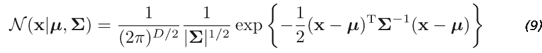**

**这里 ***μ*** (平均值)是一个 D 维向量。**σ**(sigma)是一个 **DxD** 矩阵——协方差矩阵。并且|**∑**|是协方差的行列式。行列式是协方差矩阵**σ**拉伸或收缩空间的程度的度量。**

**在 Python 中，看起来是这样的。**

**高斯分布的参数: ***μ*** 和***σ，****使用投影输入数据**为每个类别 **k=1，2，3，…，K** 计算。**我们可以使用每个类别中训练集数据点的分数来推断先验 *P(Ck)* 类别概率(第 11 行)。***

***一旦我们有了高斯参数和先验，我们就可以单独地为每个类 **k=1，2，3，…，K** 计算类条件密度*P(****)x****| Ck】*。为此，我们首先将 D 维输入向量 **x** 投影到一个新的**D’**空间。请记住**D’<D**。然后，我们对每个投影点评估等式 9。最后，我们可以利用等式 10 得到每类 **k=1，2，3，…，K** 的后验类概率*P(Ck |****x****)*。***

******

***等式 10 在下面的得分函数的第 8 行进行评估。***

***然后，我们可以将输入向量 **x** 分配给具有最大后验概率的类别 **k** 。***

# ***对 MNIST 进行测试***

***使用 MNIST 作为玩具测试数据集。如果我们选择将原始输入尺寸 **D=784** 减少到 **D'=2** ，我们可以获得大约 *56%* 的测试数据精度。然而，如果我们将投影空间尺寸增加到**D’= 3**，我们将达到接近 *74%* 的精确度。这两个投影也使结果特征空间更容易可视化。***

***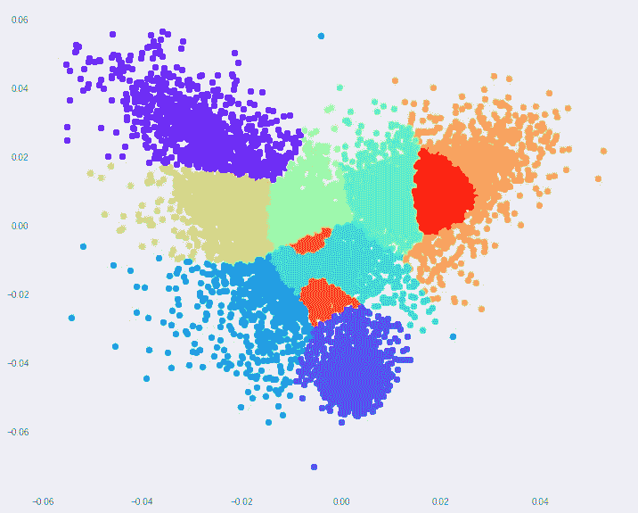******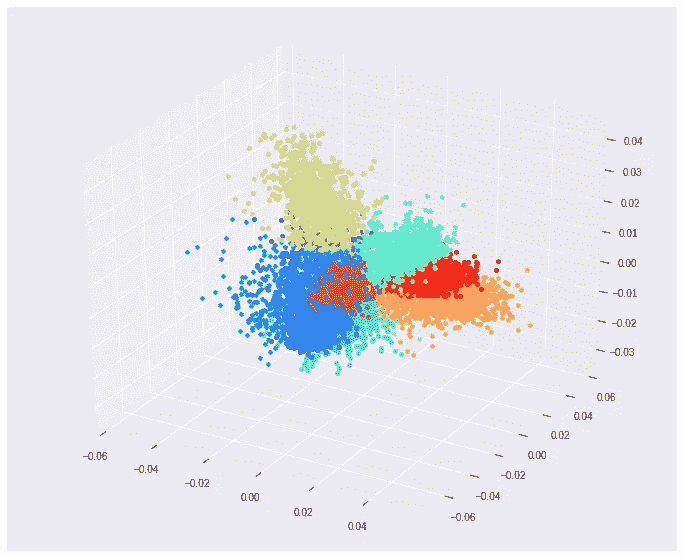***

***这篇文章的一些要点。***

*   ***Fisher 的线性判别式，本质上是一种降维的技术，而不是判别式。***
*   ***对于二元分类，我们可以找到一个最优阈值 **t** 并据此对数据进行分类。***
*   ***对于多类数据，我们可以(1)使用高斯分布对类条件分布建模。(2)求先验类概率*P(Ck)*,( 3)用**贝叶斯**求后验类概率 *p(Ck|x)* 。***
*   ***为了找到投影输入数据的最佳方向，Fisher 需要监督数据。***
*   ***给定一个维度为 **D** 的数据集，我们最多可以将它向下投影到****D’**等于 **D-1** 维度。*****

*****本文基于[模式识别与机器学习](http://users.isr.ist.utl.pt/~wurmd/Livros/school/Bishop%20-%20Pattern%20Recognition%20And%20Machine%20Learning%20-%20Springer%20%202006.pdf)的**第 4.1 章**。克里斯托弗·毕晓普的书。*****

*******感谢阅读。*******