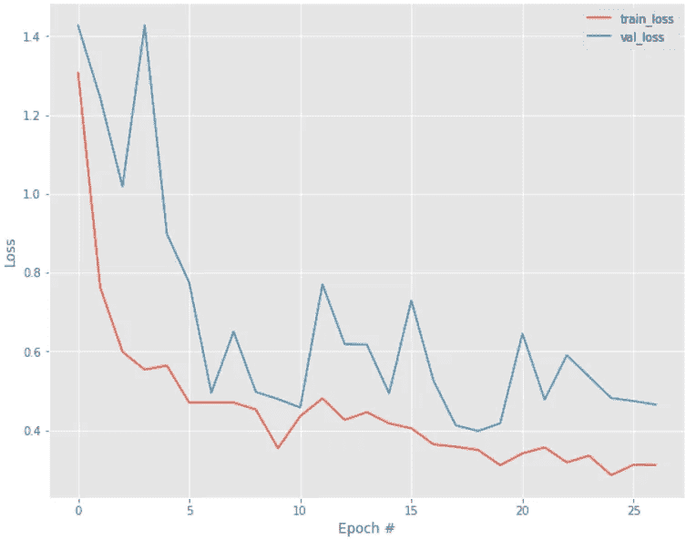
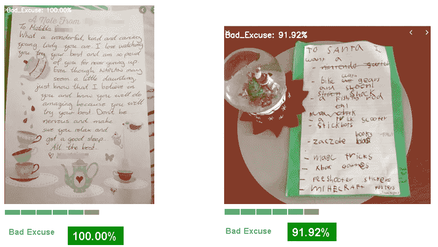

# 用 CNN 分类图像

> 原文：<https://towardsdatascience.com/an-image-classifier-with-deep-learning-7284af97b36a?source=collection_archive---------16----------------------->

## 深度学习和机器学习模型与图像分类器的比较


Photo credit: Aaron Huber

让年幼的孩子整理他们的房间通常是具有挑战性的。我坚持的是脏乱，他们会坚持的是足够干净。毕竟，所有的形容词都是主观的，我希望我的孩子在我们包容的社会中尊重他人的意见。你如何定义不同的观点？实现这种区分的客观方法是使用图像分类来区分干净的房间和脏乱的房间。

这个应用程序还可以扩展到清洁服务机构或 Airbnb，尤其是超过 10%的用户投诉与肮脏和混乱的条件有关。(参见[来源](https://hostsorter.com/airbnb-statistics/))

# **流程**

构建我的应用程序的过程包括 5 个阶段:1)网络搜集 2)数据集准备 3)模型构建 4)模型测试和 5)前端烧瓶应用程序。


**1。抓取网页**

没有我想要的大小的数据集，所以我不得不转向网络抓取(这就是生活！)用 google_images_download 上的关键词从 google 获取图片。

对于“干净”类别，使用了“干净的卧室”、“整洁的房间”、“酒店房间”、“干净整洁”和“整理”等词。

对于“凌乱”类别，所用的词包括“杂乱”、“混乱”和“杂乱无章的房间”。

我创建了第三个有趣的类别，以迎合我的孩子为了逃避家务而离开我的借口便条的快照。(是的，惯性实际上是从很小的时候开始的。)对于这个类别/类，我使用了像“孩子的手写笔记”、“情书”、“手写笔记”等词来抓取谷歌图片。

**2。数据集准备**

获得超过 3，000 张图像后，确保图像的正确性非常重要。在进入每一个类别时，我仔细查看了图片，删除了 I)冲突的图片，ii)前后对比的图片，iii)对培训没有帮助的重复图片，iv)清洁剂图片，v)卡通图片，vi)文字图片，vii)公司徽标。


这个数据集的彻底清理是必不可少的。记住这个原则:垃圾进，垃圾出。

一天下来，给我留下了 600 多张“乱”和“借口”，900 多张“干净”。

**3。模型构建**

从机器学习开始，我使用了 8 种不同的算法。

1.  k-最近邻
2.  高斯朴素贝叶斯
3.  逻辑回归
4.  支持向量分类器
5.  决策图表
6.  多层感知器
7.  随机森林
8.  XGBoost


使用 F1 分数作为所有模型的评估指标，XGBoost 以 0.76 的分数表现最佳。对于那些对技术感兴趣的人来说，我将在本文中用斜体来阐述它们。如果你只对结果感兴趣，你可以跳过它们。F1 是精确度和召回率之间的和谐平衡。I)精度是所有预测阳性(包括真阳性和假阳性)中的真阳性的比率，而 ii)召回是真阳性和假阴性中的真阳性的比率。


*What is the F1 score? Widget Credit: Pavan Mirla*

很想知道这是否可以以一种实质性的方式得到改善，让我们使用卷积神经网络(CNN)来探索深度学习，该网络以处理图像而闻名。


CNN Architecture. Credit: Public Library of Science Data Repository

CNN 架构由许多层组成。每一层将从每一类的训练图片中提取某些特征(例如，对比度、形状、边缘、纹理)。然后，将训练好的模型应用于看不见的图片，然后使用训练好的特征元素对这些图片进行分类。


Comparison of Models with F1 score

事实上，具有 Adam 优化器和早期停止的 CNN 模型是最好的模型，以与训练好的网络相关联的新的 0.84 F1 分数击败了 XGBoost。*Adam 优化器的优越性在于其自适应的学习速率，并因其相对较少的参数调整而受到青睐。以下是我的模型代码和相关 F1 分数的分类报告。*

```
# compile & train model
# initialize # of epochs to train for, and batch size
EPOCHS = 30
BS = 128# initialize the model and optimizer 
model.compile(loss=”categorical_crossentropy”, optimizer=’adam’,metrics=[“accuracy”])# train the network
import keras
H = model.fit_generator(aug.flow(trainX, trainY, batch_size=BS),
 validation_data=(testX, testY), steps_per_epoch=len(trainX) // BS, epochs=EPOCHS,
# inject callbacks with best weights restoration
callbacks=[
 keras.callbacks.EarlyStopping(patience=8, verbose=1, restore_best_weights=True),
 keras.callbacks.ReduceLROnPlateau(factor=.5, patience=3, verbose=1),
 ])
```


Training and Validation accuracy with early stopping



Training and Validation loss with early stopping


Classification Report with F1 score of 0.84

*“恢复最佳重量”确保模型将检索通过历元运行获得的最佳重量。*

**4。模型测试**

用三张看不见的图片(每个班级一张)测试模型，结果如下:


Test result on an unseen excuse note image


Test result on an unseen clean room image


Test result on an unseen messy room image



更进一步说，即使我那些有创造力的孩子有一天在一张装饰过的纸上给我写了一张纸条，或者在他们的纸条上附上了一份“礼物”，这个模型仍然可以自信地把这些归类为借口。

**5。前端应用**


Flask App of the classifier

# 结论

图像分类是图像识别的一个子集，它广泛用于安全行业(面部识别)、虚拟搜索引擎(商店中的对象查找器)、医疗保健(患者的情绪检测)以及游戏和增强现实。在某种程度上，智能手机相机使所有这些进步成为可能，因为它可以轻松地创建大量图片。这个项目演示了图像分类在我们家中的应用:)